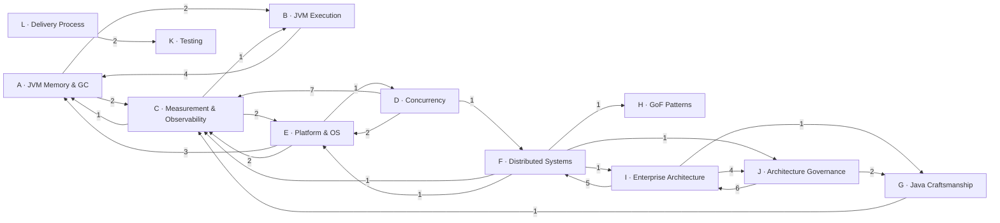
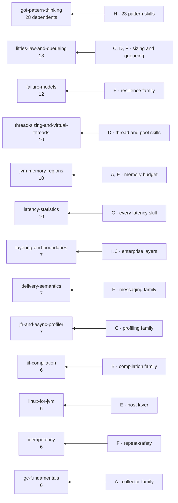

# SKILLS.md — the skill dictionary

The canonical index of this repository: 258 skills, what each one is for, and which one a given
request belongs to.

Describes the catalogue after the complete 258-skill Principal/Staff review
([final audit](docs/audit/AUDIT.md)). Package versions are synchronized from manifests with
`npm run skills:sync-versions`; the review history is in [CHANGELOG](docs/audit/CHANGELOG.md).

---

## 1. Overview

### What this covers

A senior-Java engineering corpus, weighted towards the JVM but not limited to it. Roughly a
quarter of the catalogue is JVM runtime and performance; the rest spans distributed systems,
language craftsmanship, design and enterprise patterns, architecture governance, testing and
delivery process.

Every skill is written for an **agent to execute**, not for a human to browse: a short `SKILL.md`
carrying a workflow and a rule set, with detail pushed into `references/` that is read only when
the task needs it. Bodies run 56–266 lines, median 98.

### Who it is for

Engineers working on production JVM systems, and the coding agents that assist them. The material
assumes professional familiarity: it does not teach Java, and it does not restate documentation. It
concentrates on the decisions that are commonly got wrong — which measurement settles a question,
which flag does nothing, which guarantee a pattern does not actually give you.

### Scope boundary

**In scope:** the JVM as a runtime, the Java language as a design medium, the failure modes of
distributed and concurrent systems, and the engineering practice around them.

**Recently brought into scope**, closing the four gaps this catalogue's audit identified:
`sql-query-performance` owns the execution plan and the index; `orm-fetch-and-batching-performance`
owns the statements the ORM issues; JDK migration is `jdk-upgrade-impact`; and evidence capture
before a restart is `incident-evidence-capture`.

**Out of scope, and now decided rather than merely unowned:**

- **Application-framework performance** — Spring's request path, auto-configuration weight,
  Actuator overhead, Quarkus equivalents. The line the catalogue actually holds is not
  "no frameworks": it is **library-specific where the library is effectively universal, and
  application-framework-neutral otherwise**. JPA/Hibernate, Kafka, JFR and JMH are named
  throughout because a JVM engineer meets one of them whatever framework is above; Spring is
  named only where it changes a JVM-level answer, as in
  `reactive-and-virtual-thread-selection`. A framework performance skill would cross that line
  and commit the catalogue to tracking one vendor's release train. If that is wanted later it is
  a deliberate change of identity, not a gap fill.
- **Teaching Java**, front-end concerns, non-JVM runtimes, and vendor product configuration.

### Two facts about the format worth knowing before editing anything

1. **Only the `skill.yaml` description ships.** Adapters project `manifest.description` into the
   installed entrypoint and the registry index carries the same value. A description edited only in
   `SKILL.md` frontmatter reaches no agent. This is enforced by the
   `skill.description.mismatch` validation rule; all 258 currently agree.
2. **Descriptions are capped at 1024 characters** — Claude Code's picker shows roughly that much,
   and strict validation rejects the warning above it. All 258 packages pass strict validation.
   When trimming future descriptions, preserve concrete trigger conditions: they are what makes a
   skill fire at all.

### How the dictionary is maintained

Every field below is derived from the packages themselves — `skill.yaml`, the `SKILL.md` frontmatter
and `Purpose` section, and the files on disk — so it can be regenerated rather than hand-maintained.

**`Inputs` and `Outputs` are deliberately not fields.** The index brief asked for them, and adding
an optional `inputs`/`outputs` pair to `skill.yaml` was considered and rejected. Three reasons:

- The description already carries the input, in the form that matters for routing. "Use when a GC
  log needs to be interpreted" names the artefact _and_ the situation; `inputs: [gc-log]` names
  less and would be maintained separately from the sentence that does the work.
- A field is only worth its cost if something reads it. Neither agent does, `search` does not, and
  the resolver does not — it would be documentation duplicated into YAML, which is the shape that
  drifts. The catalogue has just finished repairing exactly that failure for `description`.
- Populating it truthfully for 258 skills means inferring a contract most of them never stated.
  The alternative is a field that is right for the twenty artefact-driven skills and noise for the
  rest.

Where a skill genuinely takes a named artefact and returns a named output, it says so in its
description and its body — `jvm-performance-review` is the clearest example, and it needed no
schema change to do it.

---

## 2. Category taxonomy

Thirteen categories, mutually exclusive — every skill appears in exactly one.

| #   | Category                                     | What belongs in it                                                                                                                                                                                                   |
| --- | -------------------------------------------- | -------------------------------------------------------------------------------------------------------------------------------------------------------------------------------------------------------------------- |
| A   | **JVM Memory and Garbage Collection**        | Anything about where objects live and who reclaims them: collectors and their internals, heap and non-heap regions, allocation, retention, leaks, dumps, safepoints and pause attribution.                           |
| B   | **JVM Execution and Compilation**            | How code becomes machine instructions and what the runtime does with it: interpreter and JIT tiers, inlining, escape analysis, deoptimisation, bytecode, class loading, AOT and native image, native interop.        |
| C   | **Measurement, Profiling and Observability** | Producing a number you can trust and knowing what it means: profilers, JFR, logging and metrics, tracing, SLOs, benchmarking, load testing, latency statistics, queueing and capacity models.                        |
| D   | **Concurrency and Parallelism**              | More than one thing happening at once inside one JVM: the memory model, locks and lock-free structures, executors, virtual threads, structured concurrency, reactive pipelines, and diagnosing all of it.            |
| E   | **Platform, OS and Hardware**                | The layer beneath the JVM and around the pod: kernel and cgroup behaviour, CPU topology, the network stack, byte movement, container lifecycle and the sidecar family.                                               |
| F   | **Distributed Systems and Messaging**        | Anything that crosses a process boundary: failure and delivery semantics, resilience patterns, consistency and consensus, sharding and caching topology, messaging and streaming.                                    |
| G   | **Java Language Craftsmanship**              | Writing Java that other people can change: types and contracts, API design, readability, smells and refactoring, and the design principles used as review tools.                                                     |
| H   | **Design Patterns (Gang of Four)**           | The twenty-three classical patterns in modern Java, plus the meta-skills for choosing between them, telling lookalikes apart and detecting misuse.                                                                   |
| I   | **Enterprise Application Architecture**      | The PoEAA layer: where business logic lives, layering, the service and web tiers, and the object-relational patterns.                                                                                                |
| J   | **Architecture Governance and Evolution**    | Deciding, recording and enforcing architectural intent, and moving a system from one architecture to another without a rewrite.                                                                                      |
| K   | **Testing**                                  | Deciding what to test, at what level, with which doubles — and getting untestable code into a harness.                                                                                                               |
| L   | **Engineering Process and Delivery**         | The work around the code: order of work, review, debugging method, requirements, estimation, communication, the feature lifecycle from request to completion review, and the rules an AI agent works under.          |
| M   | **Data Access Performance**                  | Making the database cheap from the application side: the execution plan and the index for one statement, the statements an ORM issues, and the pool between them. The PoEAA data patterns are I; this is their cost. |

The boundary that most often needs stating: **C is about measuring, A/B/D/E are about the thing
being measured.** A GC log is read in C's `gc-log-analysis`; why the collection cost what it did is
A's `gc-fundamentals`.

---

## 3. Dictionary

### A. JVM Memory and Garbage Collection

#### `allocation-profiling` — v2.1.0

| Field          | Content                                                                                                                                                                                                                                                                                                                                                                                                                                                            |
| -------------- | ------------------------------------------------------------------------------------------------------------------------------------------------------------------------------------------------------------------------------------------------------------------------------------------------------------------------------------------------------------------------------------------------------------------------------------------------------------------ |
| Purpose        | Attribute allocated bytes to source lines, so that GC overhead is answered by removing allocation rather than by another round of collector flags. Reducing what the application allocates typically moves GC overhead more than any collector parameter does, and TLAB tuning almost never is the right lever — the footprint those flags govern is `TLABWasteTargetPercent`, 1% of heap by default, against an application allocating avoidable objects at GB/s. |
| Triggers on    | Use when GC overhead is above 10-15% of CPU, when collector tuning has stopped moving the number, when a p99 spike is being blamed on TLAB refill, when a JFR recording of jdk.ObjectAllocationInNewTLAB came back empty, when someone proposes pooling small objects or -XX:+TraceTLAB, or when a stream pipeline in a hot path is assumed free because "the JIT eliminates it".                                                                                  |
| Does NOT cover | Does not cover choosing and running a profile in general (jfr-and-async-profiler), why an allocation survives or is scalar-replaced (jit-inlining-and-escape-analysis), or reading the resulting collection behaviour (gc-log-analysis).                                                                                                                                                                                                                           |
| JDK scope      | JDK 11–25 (baseline 25)                                                                                                                                                                                                                                                                                                                                                                                                                                            |
| Depends on     | `jfr-and-async-profiler`, `jit-inlining-and-escape-analysis`                                                                                                                                                                                                                                                                                                                                                                                                       |
| Used by        | —                                                                                                                                                                                                                                                                                                                                                                                                                                                                  |
| Bundled files  | `references/allocation-tools.md`, `references/reducing-allocation.md`                                                                                                                                                                                                                                                                                                                                                                                              |
| Maturity       | stable                                                                                                                                                                                                                                                                                                                                                                                                                                                             |

#### `epsilon-and-shenandoah-internals` — v2.1.0

| Field          | Content                                                                                                                                                                                                                                                                                                                                                                                                                    |
| -------------- | -------------------------------------------------------------------------------------------------------------------------------------------------------------------------------------------------------------------------------------------------------------------------------------------------------------------------------------------------------------------------------------------------------------------------- |
| Purpose        | Use Epsilon to turn an argument about allocation into a measurement, and reason about Shenandoah from its actual mechanism — an unconditional barrier on every reference access, a concurrent cycle with a finite time budget, and a generational mode that is product but not default. Both are misused in the same way: Epsilon as a "GC-free performance mode", Shenandoah as a collector whose only knob is heap size. |
| Triggers on    | Use when a hot path is claimed to be allocation-free, when a benchmark's numbers are polluted by collection, when "Degenerated GC" appears in a Shenandoah log, when a Shenandoah comparison does not state its ShenandoahGCMode, when someone calls the LRB a read barrier or searches a flame graph for the wrong symbol, or when an Epsilon example omits -XX:+UnlockExperimentalVMOptions.                             |
| Does NOT cover | Does not cover choosing between or operating the concurrent collectors (zgc-and-shenandoah), finding which code allocates (allocation-profiling), or establishing whether GC is the bottleneck at all (jvm-gc-tuning).                                                                                                                                                                                                     |
| JDK scope      | JDK 11–28 (baseline 25)                                                                                                                                                                                                                                                                                                                                                                                                    |
| Depends on     | `zgc-and-shenandoah`                                                                                                                                                                                                                                                                                                                                                                                                       |
| Used by        | —                                                                                                                                                                                                                                                                                                                                                                                                                          |
| Bundled files  | `references/epsilon-as-an-instrument.md`, `references/shenandoah-internals.md`                                                                                                                                                                                                                                                                                                                                             |
| Maturity       | stable                                                                                                                                                                                                                                                                                                                                                                                                                     |

#### `g1-concurrent-marking` — v1.3.0

| Field          | Content                                                                                                                                                                                                                                                                                                                                                                                                                                                      |
| -------------- | ------------------------------------------------------------------------------------------------------------------------------------------------------------------------------------------------------------------------------------------------------------------------------------------------------------------------------------------------------------------------------------------------------------------------------------------------------------ |
| Purpose        | Decide why a G1 marking cycle is failing to do its job — starting too late for the real promotion rate, restarting because the SATB queue overflowed, or never finishing before the old generation fills — and which of those the evidence in the log actually supports. Marking is the only thing that tells the mixed collector which regions are worth evacuating; when it is late or aborted, the collector loses its input and falls back to a full GC. |
| Triggers on    | Use when the log shows "Concurrent Mark Restart for Mark Stack Overflow", when "Pause Full" follows incomplete marking cycles, when "Concurrent Mark From Roots" grows longer cycle over cycle, when marking starts well away from 45% occupancy, when someone proposes -XX:G1HeapOccupancyPercent or -XX:+G1SummarizeConcMark, or when humongous allocations are frequent.                                                                                  |
| Does NOT cover | Does not cover regions, remembered sets and the evacuation pause itself (g1-internals), choosing flag values against an SLO (g1-tuning-for-slo), or configuring and parsing the GC log (gc-log-analysis).                                                                                                                                                                                                                                                    |
| JDK scope      | JDK 9–27 (baseline 25)                                                                                                                                                                                                                                                                                                                                                                                                                                       |
| Depends on     | `g1-internals`                                                                                                                                                                                                                                                                                                                                                                                                                                               |
| Used by        | —                                                                                                                                                                                                                                                                                                                                                                                                                                                            |
| Bundled files  | `references/marking-cycle-log-and-flags.md`, `references/marking-pathologies.md`                                                                                                                                                                                                                                                                                                                                                                             |
| Maturity       | stable                                                                                                                                                                                                                                                                                                                                                                                                                                                       |

#### `g1-internals` — v1.3.0

| Field          | Content                                                                                                                                                                                                                                                                                                                                                                                                                                |
| -------------- | -------------------------------------------------------------------------------------------------------------------------------------------------------------------------------------------------------------------------------------------------------------------------------------------------------------------------------------------------------------------------------------------------------------------------------------- |
| Purpose        | Explain a G1 pause from the mechanism that produced it, so that the tuning action follows from evidence rather than from a flag someone remembers. The same 40 ms pause means different things depending on which phase dominates: `Object Copy` says there is a lot of live data to move; `Merge Heap Roots` says the remembered sets are expensive to scan. These have opposite fixes, and the summary line cannot distinguish them. |
| Triggers on    | Use when a pause is longer than the live-set size explains, when `Merge Heap Roots` or `Merge RS` dominates `-Xlog:gc+phases`, when `To-space exhausted` appears, when the old generation grows without the application retaining anything, when `Humongous regions` climbs in the log, when someone sets `-Xmn` under G1, or when mixed GC is being described as a full GC.                                                           |
| Does NOT cover | Does not cover the introductory collector mental model and generational hypothesis (gc-fundamentals), choosing values for the flags against a latency SLO (g1-tuning-for-slo), or the concurrent marking cycle in depth (g1-concurrent-marking).                                                                                                                                                                                       |
| JDK scope      | JDK 9–18 (baseline 25)                                                                                                                                                                                                                                                                                                                                                                                                                 |
| Depends on     | `gc-fundamentals`                                                                                                                                                                                                                                                                                                                                                                                                                      |
| Used by        | `g1-concurrent-marking`, `g1-tuning-for-slo`                                                                                                                                                                                                                                                                                                                                                                                           |
| Bundled files  | `references/phase-diagnostics.md`, `references/remembered-sets.md`                                                                                                                                                                                                                                                                                                                                                                     |
| Maturity       | stable                                                                                                                                                                                                                                                                                                                                                                                                                                 |

#### `g1-tuning-for-slo` — v2.1.0

| Field          | Content                                                                                                                                                                                                                                                                                                                                                                   |
| -------------- | ------------------------------------------------------------------------------------------------------------------------------------------------------------------------------------------------------------------------------------------------------------------------------------------------------------------------------------------------------------------------- |
| Purpose        | Turn a stated latency SLO into specific G1 flag values, with a traceable measurement behind each one, and then prove the change helped. Every flag in this space moves the system inside a fixed triangle of pause, throughput and footprint — none of them removes the trade-off, so a change without a recorded trade-off is a change nobody can defend.                |
| Triggers on    | Use when GC flags were copied from another service, when `-Xms` differs from `-Xmx` in production, when mixed GC violates the SLO while young GC is healthy, when GC overhead exceeds 5 to 10 percent, when a full GC follows a marking cycle that finished too late, when an IHOP was set to the theoretical ceiling, or when a parser reports a promotion rate of zero. |
| Does NOT cover | Does not cover deciding whether GC is the bottleneck at all or which collector to use (jvm-gc-tuning), why the mechanism responds the way it does (g1-internals), or configuring and parsing the GC log itself (gc-log-analysis).                                                                                                                                         |
| JDK scope      | JDK 9–28 (baseline 25)                                                                                                                                                                                                                                                                                                                                                    |
| Depends on     | `g1-internals`, `gc-log-analysis`, `jvm-gc-tuning`                                                                                                                                                                                                                                                                                                                        |
| Used by        | —                                                                                                                                                                                                                                                                                                                                                                         |
| Bundled files  | `references/derivation.md`, `references/flags-and-baselines.md`                                                                                                                                                                                                                                                                                                           |
| Maturity       | stable                                                                                                                                                                                                                                                                                                                                                                    |

#### `gc-fundamentals` — v1.4.0

| Field          | Content                                                                                                                                                                                                                                                                                       |
| -------------- | --------------------------------------------------------------------------------------------------------------------------------------------------------------------------------------------------------------------------------------------------------------------------------------------- |
| Purpose        | Supply the mechanism behind GC symptoms, so a diagnosis explains rather than describes. The failure this prevents is tuning a collector to fix something the collector is not doing — most reported "GC problems" are the collector behaving correctly given how much live data it is handed. |
| Triggers on    | Use when explaining why a collection is expensive, when the reported pause does not match the latency the client feels, when a cache or pool breaks the generational assumption, when humongous allocations appear, or when comparing collectors written before JDK 23.                       |
| Does NOT cover | Does not cover choosing a collector or sizing the heap (jvm-gc-tuning), parsing the log (gc-log-analysis), or the non-heap regions (jvm-memory-regions). Per-collector internals are g1-internals and zgc-and-shenandoah, and the safepoint mechanism is safepoints.                          |
| JDK scope      | JDK 9–28 (baseline 25)                                                                                                                                                                                                                                                                        |
| Depends on     | `jvm-memory-regions`                                                                                                                                                                                                                                                                          |
| Used by        | `g1-internals`, `gc-log-analysis`, `heap-dump-analysis`, `jvm-gc-tuning`, `safepoints`, `zgc-and-shenandoah`                                                                                                                                                                                  |
| Bundled files  | `references/collector-mechanisms.md`, `references/safepoints.md`                                                                                                                                                                                                                              |
| Maturity       | stable                                                                                                                                                                                                                                                                                        |

#### `gc-log-analysis` — v1.4.0

| Field          | Content                                                                                                                                                                                                                                                                                                                                                               |
| -------------- | --------------------------------------------------------------------------------------------------------------------------------------------------------------------------------------------------------------------------------------------------------------------------------------------------------------------------------------------------------------------- |
| Purpose        | Get a conclusive answer out of the cheapest observability the JVM offers. A GC log costs a fraction of a percent, needs no agent, and persists — and enabling it during the incident does not recover what already happened, which makes it baseline configuration rather than a diagnostic step.                                                                     |
| Triggers on    | Use when a GC log needs to be interpreted, when GC logging is not enabled and the right GC tag-sets have to be chosen, when full collections or Metadata GC Threshold appear, when the heap floor rises after each complete collection, or when an analysis script reports zero pauses.                                                                               |
| Does NOT cover | Does not cover collector mechanics (gc-fundamentals), collector choice and heap sizing (jvm-gc-tuning), or allocation profiling (jfr-and-async-profiler). The -Xlog syntax itself — proving a selection emits anything, rotation, async logging and migrating pre-JDK-9 flags — is unified-logging. Attributing an observed pause across layers is pause-attribution. |
| JDK scope      | JDK 16–25 (baseline 25)                                                                                                                                                                                                                                                                                                                                               |
| Depends on     | `gc-fundamentals`, `latency-statistics`                                                                                                                                                                                                                                                                                                                               |
| Used by        | `g1-tuning-for-slo`, `jvm-gc-tuning`, `pause-attribution`                                                                                                                                                                                                                                                                                                             |
| Bundled files  | `references/cause-field.md`, `references/log-analysis-recipes.md`                                                                                                                                                                                                                                                                                                     |
| Maturity       | stable                                                                                                                                                                                                                                                                                                                                                                |

#### `heap-dump-analysis` — v1.3.0

| Field          | Content                                                                                                                                                                                                                                                                                                                                                                     |
| -------------- | --------------------------------------------------------------------------------------------------------------------------------------------------------------------------------------------------------------------------------------------------------------------------------------------------------------------------------------------------------------------------- |
| Purpose        | Turn a `.hprof` file into an attribution of responsibility: which object is keeping which bytes alive, and whether that retention is a defect or the working set the system legitimately needs. Instance counts do not answer that. Retained size does.                                                                                                                     |
| Triggers on    | Use when heap grows monotonically with uptime, after an `OutOfMemoryError` or a `-XX:+HeapDumpOnOutOfMemoryError` file appears, when a histogram is being read by shallow size, when `jcmd` or `jmap` hangs against a stuck JVM, when a `WeakHashMap` or `ThreadLocal` cache never empties, when `StackChunk` or `Continuation` tops a dominator tree, or when writing OQL. |
| Does NOT cover | Does not cover the region budget and which OOM message means what (jvm-memory-regions), why a live set costs what it costs (gc-fundamentals), classloader leaks specifically (jvm-class-loading), or core-dump and Serviceability Agent workflows (jhsdb-and-core-dumps).                                                                                                   |
| JDK scope      | JDK 25–27 (baseline 25)                                                                                                                                                                                                                                                                                                                                                     |
| Depends on     | `jvm-memory-regions`, `gc-fundamentals`                                                                                                                                                                                                                                                                                                                                     |
| Used by        | `incident-evidence-capture`, `jhsdb-and-core-dumps`                                                                                                                                                                                                                                                                                                                         |
| Bundled files  | `references/capture-recipes.md`, `references/mat-workflow-and-oql.md`                                                                                                                                                                                                                                                                                                       |
| Maturity       | stable                                                                                                                                                                                                                                                                                                                                                                      |

#### `java-reference-types-and-leaks` — v1.3.0

| Field          | Content                                                                                                                                                                                                                                                                                                                                                                                         |
| -------------- | ----------------------------------------------------------------------------------------------------------------------------------------------------------------------------------------------------------------------------------------------------------------------------------------------------------------------------------------------------------------------------------------------- |
| Purpose        | Decide what keeps an object alive, and find the reference that should not. Two failure modes: memory that grows with traffic because something the code no longer uses is still reachable — which no GC tuning can fix — and reference types used as a design tool, where a `SoftReference` cache or a `Cleaner` is trusted to bound memory or release a resource and does neither predictably. |
| Triggers on    | Use when heap grows with traffic and never returns after a full GC, when a redeploy raises Metaspace, when someone proposes a WeakReference or SoftReference cache, when a Cleaner or finalize() appears, when a ThreadLocal has no remove(), or when "restarting fixes it" is the operating procedure.                                                                                         |
| Does NOT cover | Does not cover deterministic release of open resources (java-resource-management), reading a heap dump (heap-dump-analysis), finding allocation sites (allocation-profiling), or off-heap and native memory (off-heap-memory).                                                                                                                                                                  |
| JDK scope      | JDK 25                                                                                                                                                                                                                                                                                                                                                                                          |
| Depends on     | —                                                                                                                                                                                                                                                                                                                                                                                               |
| Used by        | —                                                                                                                                                                                                                                                                                                                                                                                               |
| Bundled files  | `references/leak-patterns.md`, `references/reachability-and-cleaners.md`                                                                                                                                                                                                                                                                                                                        |
| Maturity       | stable                                                                                                                                                                                                                                                                                                                                                                                          |

#### `jhsdb-and-core-dumps` — v1.3.0

| Field          | Content                                                                                                                                                                                                                                                                                                                                                                                                   |
| -------------- | --------------------------------------------------------------------------------------------------------------------------------------------------------------------------------------------------------------------------------------------------------------------------------------------------------------------------------------------------------------------------------------------------------- |
| Purpose        | Extract state from a JVM that can no longer cooperate. `jstack`, `jmap` and `jcmd` ask the target JVM to produce the report itself over the Attach API, which needs it alive, responsive and able to reach a safepoint. `jhsdb` asks nothing: the Serviceability Agent reads the target's memory from outside, live or from a core file, which is why it still works on a wedged process and on a corpse. |
| Triggers on    | Use when a process died and left an hs_err_pid file, when jstack or jcmd hangs against a wedged JVM, when a container disappeared with exit code 137 and no log, when a crash points at a J/V/C frame, when jhsdb reports DebuggerException or nonsensical pointers, or when someone proposes generating a core dump with `jcmd VM.native_memory summary`.                                                |
| Does NOT cover | Does not cover heap dumps and retention analysis (heap-dump-analysis), why the process died at the host level (linux-for-jvm), or which memory region the failure was in (jvm-memory-regions).                                                                                                                                                                                                            |
| JDK scope      | JDK 9                                                                                                                                                                                                                                                                                                                                                                                                     |
| Depends on     | `heap-dump-analysis`                                                                                                                                                                                                                                                                                                                                                                                      |
| Used by        | —                                                                                                                                                                                                                                                                                                                                                                                                         |
| Bundled files  | `references/crash-triage.md`, `references/jhsdb-commands.md`                                                                                                                                                                                                                                                                                                                                              |
| Maturity       | stable                                                                                                                                                                                                                                                                                                                                                                                                    |

#### `jvm-gc-tuning` — v2.5.0

| Field          | Content                                                                                                                                                                                                                                                                                                                                                                      |
| -------------- | ---------------------------------------------------------------------------------------------------------------------------------------------------------------------------------------------------------------------------------------------------------------------------------------------------------------------------------------------------------------------------- |
| Purpose        | Make two decisions and only two: **is GC the bottleneck**, and if so, **which collector and what heap size**. Most reported "GC problems" are allocation problems wearing a costume — the collector is behaving correctly given how much garbage it is handed — so the first decision is the one that saves the most time.                                                   |
| Triggers on    | Use when GC pauses appear on the critical path of a latency profile, when full collections show up, when the heap grows toward its limit, when sizing a JVM for a container, or when a collector change is being proposed. Start from java-performance instead when the symptom is latency or CPU and GC has not been confirmed as the cause.                                |
| Does NOT cover | Does not cover how collectors work internally (gc-fundamentals), configuring and reading the GC log (gc-log-analysis), the non-heap memory budget (jvm-memory-regions), or allocation profiling and leak hunting (jit-inlining-and-escape-analysis). Deriving G1 flag values from an SLO is g1-tuning-for-slo and operating the concurrent collectors is zgc-and-shenandoah. |
| JDK scope      | JDK 9–28 (baseline 25)                                                                                                                                                                                                                                                                                                                                                       |
| Depends on     | `gc-fundamentals`, `gc-log-analysis`, `jvm-memory-regions`                                                                                                                                                                                                                                                                                                                   |
| Used by        | `g1-tuning-for-slo`, `java-performance`, `zgc-and-shenandoah`                                                                                                                                                                                                                                                                                                                |
| Bundled files  | `references/collector-and-heap.md`                                                                                                                                                                                                                                                                                                                                           |
| Maturity       | stable                                                                                                                                                                                                                                                                                                                                                                       |

#### `jvm-memory-regions` — v1.6.0

| Field          | Content                                                                                                                                                                                                                                                                                                                                                        |
| -------------- | -------------------------------------------------------------------------------------------------------------------------------------------------------------------------------------------------------------------------------------------------------------------------------------------------------------------------------------------------------------- |
| Purpose        | Budget a JVM process against a hard memory limit. The failure this prevents is the most expensive configuration error in Kubernetes: `-Xmx` set to the container limit, non-heap regions pushing RSS past the cgroup, and the **kernel** killing the process — no `OutOfMemoryError`, no shutdown hook, no heap dump, because the JVM never knew it was dying. |
| Triggers on    | Use when a pod is OOMKilled with no Java exception, when an OutOfMemoryError names something other than "Java heap space", when -Xmx is set equal to the container limit, when RSS exceeds the heap by more than expected, when a heap above 32 GB is proposed, or when sizing a JVM for Kubernetes.                                                           |
| Does NOT cover | Does not cover collector choice and heap tuning (jvm-gc-tuning), classloader leaks (jvm-class-loading), or kernel-side memory behaviour such as page faults, swap and the OOM killer (linux-for-jvm). Metaspace internals are metaspace-internals, memory outside the heap is off-heap-memory, and heap contents are heap-dump-analysis.                       |
| JDK scope      | JDK 15–27 (baseline 25)                                                                                                                                                                                                                                                                                                                                        |
| Depends on     | —                                                                                                                                                                                                                                                                                                                                                              |
| Used by        | `code-cache-segments`, `container-awareness`, `gc-fundamentals`, `heap-dump-analysis`, `jit-compilation`, `jvm-class-loading`, `jvm-gc-tuning`, `linux-for-jvm`, `metaspace-internals`, `off-heap-memory`                                                                                                                                                      |
| Bundled files  | `references/container-budget.md`, `references/oom-triage.md`                                                                                                                                                                                                                                                                                                   |
| Maturity       | stable                                                                                                                                                                                                                                                                                                                                                         |

#### `metaspace-internals` — v1.3.0

| Field          | Content                                                                                                                                                                                                                                                                                                                                                                                        |
| -------------- | ---------------------------------------------------------------------------------------------------------------------------------------------------------------------------------------------------------------------------------------------------------------------------------------------------------------------------------------------------------------------------------------------- |
| Purpose        | Decide which ceiling a metaspace problem is actually hitting, and whether the fix is a number or a code change. Metaspace has two independent limits with two independent flags, and native memory that a heap dashboard never shows — so the default outcome is a team raising `MaxMetaspaceSize` against an error that names `Compressed class space`, where that flag has no effect at all. |
| Triggers on    | Use when `OutOfMemoryError: Metaspace` or `Compressed class space` is thrown, when a container is OOMKilled with a healthy heap, when metaspace committed grows monotonically, when `MaxMetaspaceSize` is unset or copied from another service, when `waste` in the class space is climbing, or when proxies, hidden classes or a scripting engine generate classes at runtime.                |
| Does NOT cover | Does not cover the introductory six-region memory map and container budget (jvm-memory-regions), classloader identity, unloading and the retainer hunt for a leak (jvm-class-loading), or anything about compiled code and the code cache (code-cache-segments).                                                                                                                               |
| JDK scope      | JDK 16–27 (baseline 25)                                                                                                                                                                                                                                                                                                                                                                        |
| Depends on     | `jvm-memory-regions`, `jvm-class-loading`                                                                                                                                                                                                                                                                                                                                                      |
| Used by        | —                                                                                                                                                                                                                                                                                                                                                                                              |
| Bundled files  | `references/reading-metaspace.md`, `references/sizing-and-flags.md`                                                                                                                                                                                                                                                                                                                            |
| Maturity       | stable                                                                                                                                                                                                                                                                                                                                                                                         |

#### `object-layout-and-footprint` — v1.4.0

| Field          | Content                                                                                                                                                                                                                                                                                                                                                                                                                                                                                                                                                                                                              |
| -------------- | -------------------------------------------------------------------------------------------------------------------------------------------------------------------------------------------------------------------------------------------------------------------------------------------------------------------------------------------------------------------------------------------------------------------------------------------------------------------------------------------------------------------------------------------------------------------------------------------------------------------- |
| Purpose        | Answer "what will N of these cost" before N of them exist, and read a layout measurement without being misled by it.                                                                                                                                                                                                                                                                                                                                                                                                                                                                                                 |
| Triggers on    | Use when a shape is chosen for millions of instances — record, class, primitive array, parallel arrays or boxed collection; when an array is proposed to save the header; when HashMap<Integer,Integer> or List<Long> is on a bulk path; when -XX:+UseCompactObjectHeaders is evaluated for footprint; or when smaller objects are expected to buy shorter GC pauses — they do not, and the mechanism is here. Answers in bytes per element; the record-versus-array answer reverses under the JDK 27 default (JEP 534, not yet GA). Sizing a replacement belongs here; measuring what exists is heap-dump-analysis. |
| Does NOT cover | Not flag lifecycle (jvm-performance-review), @Contended padding (false-sharing-and-contended), cache hierarchy (cpu-cache-and-numa), allocation rate (allocation-profiling), container budget (jvm-memory-regions), compressed class space (metaspace-internals), off-heap memory (off-heap-memory), or sharing duplicates (gof-flyweight).                                                                                                                                                                                                                                                                          |
| JDK scope      | JDK 21–28 (baseline 25)                                                                                                                                                                                                                                                                                                                                                                                                                                                                                                                                                                                              |
| Depends on     | —                                                                                                                                                                                                                                                                                                                                                                                                                                                                                                                                                                                                                    |
| Used by        | —                                                                                                                                                                                                                                                                                                                                                                                                                                                                                                                                                                                                                    |
| Bundled files  | `references/array-and-object-arithmetic.md`, `references/compact-object-headers.md`, `references/jol-operating-procedure.md`, `references/shape-decision.md`                                                                                                                                                                                                                                                                                                                                                                                                                                                         |
| Maturity       | stable                                                                                                                                                                                                                                                                                                                                                                                                                                                                                                                                                                                                               |

#### `off-heap-memory` — v1.3.0

| Field          | Content                                                                                                                                                                                                                                                                                                                                                                                                                                                    |
| -------------- | ---------------------------------------------------------------------------------------------------------------------------------------------------------------------------------------------------------------------------------------------------------------------------------------------------------------------------------------------------------------------------------------------------------------------------------------------------------- |
| Purpose        | Decide whether data belongs outside the Java heap, and find native growth that no heap dump will ever show. Off-heap is not faster by definition — it is a **different memory budget with a different cost**. On the heap the dominant cost is GC work for as long as the object lives; off-heap it moves to the allocation and release itself, and to the absence of any automatic safety net.                                                            |
| Triggers on    | Use when RSS grows while the Java heap stays flat, on `OutOfMemoryError: Direct buffer memory` or an OOMKilled container with no Java exception, when `-XX:MaxDirectMemorySize` is unset or copied from another service, when `ByteBuffer.allocateDirect` sits on a per-request path, when `Unsafe.allocateMemory` appears without a matching `freeMemory`, on a `WrongThreadException` from a segment, or on a JEP 498 `sun.misc.Unsafe` runtime warning. |
| Does NOT cover | Does not cover the six-region container budget and which OOM means what (jvm-memory-regions), calling into native code as opposed to holding native memory (jni-and-ffm), or on-heap retention (heap-dump-analysis).                                                                                                                                                                                                                                       |
| JDK scope      | JDK 22–27 (baseline 25)                                                                                                                                                                                                                                                                                                                                                                                                                                    |
| Depends on     | `jvm-memory-regions`                                                                                                                                                                                                                                                                                                                                                                                                                                       |
| Used by        | `io-uring-and-zero-copy`, `jni-and-ffm`                                                                                                                                                                                                                                                                                                                                                                                                                    |
| Bundled files  | `references/ffm-memory-api.md`, `references/native-memory-diagnosis.md`                                                                                                                                                                                                                                                                                                                                                                                    |
| Maturity       | stable                                                                                                                                                                                                                                                                                                                                                                                                                                                     |

#### `pause-attribution` — v1.4.0

| Field          | Content                                                                                                                                                                                                                                                                                                                                                         |
| -------------- | --------------------------------------------------------------------------------------------------------------------------------------------------------------------------------------------------------------------------------------------------------------------------------------------------------------------------------------------------------------- |
| Purpose        | Decide which layer owns an observed pause before anything is tuned. The application feels a single number; the GC log publishes only one term of it. Between the two sit the time threads took to reach the safepoint, the cleanup after the operation, and whatever the host did to the process — and each of those is a different fix with a different owner. |
| Triggers on    | Use when application p99 far exceeds what the GC log accounts for, when "Reaching safepoint" is large while "At safepoint" is small, when two profilers disagree about hot paths, when a safepoint-log analyser reports zero events, when someone sums "Reaching + At" by hand, or when a fix copied from an old war story does not reproduce.                  |
| Does NOT cover | Does not cover the safepoint mechanism itself (safepoints), configuring and parsing the GC log (gc-log-analysis), or host-side causes such as CPU throttling, swap and page faults (linux-for-jvm).                                                                                                                                                             |
| JDK scope      | JDK 10–25 (baseline 25)                                                                                                                                                                                                                                                                                                                                         |
| Depends on     | `safepoints`, `gc-log-analysis`                                                                                                                                                                                                                                                                                                                                 |
| Used by        | —                                                                                                                                                                                                                                                                                                                                                               |
| Bundled files  | `references/attributing-time-to-safepoint.md`, `references/correlating-the-evidence.md`                                                                                                                                                                                                                                                                         |
| Maturity       | stable                                                                                                                                                                                                                                                                                                                                                          |

#### `safepoints` — v1.3.0

| Field          | Content                                                                                                                                                                                                                                                                                                                                                                                                                                    |
| -------------- | ------------------------------------------------------------------------------------------------------------------------------------------------------------------------------------------------------------------------------------------------------------------------------------------------------------------------------------------------------------------------------------------------------------------------------------------ |
| Purpose        | Explain the stop-the-world time that the GC log does not account for. Total STW is `sync time + operation time + cleanup`, and the GC log publishes only the middle term — so a service can show clean GC logs, maximum pauses of 8 ms, and a real p99.9 of 45 ms, with the missing 37 ms spent waiting for one thread to reach a safe point.                                                                                              |
| Triggers on    | Use when measured p99 or p99.9 is far worse than the GC log explains, when GC logs look clean but latency does not match, when a stop-the-world pause has no GC event behind it, when JNI or FFM code processes a batch without returning to Java, when a profiler's hot path never responds to optimisation, or when someone proposes `-XX:+UseCountedLoopSafepoints`, `UseThreadLocalHandshakes` or blames `RevokeBias` on a modern JDK. |
| Does NOT cover | Does not cover the introductory TTSP treatment or collector mechanics (gc-fundamentals), attributing an observed production pause across GC phase, safepoint and OS (pause-attribution), or host-side causes such as CPU throttling and page faults (linux-for-jvm).                                                                                                                                                                       |
| JDK scope      | JDK 9–25 (baseline 25)                                                                                                                                                                                                                                                                                                                                                                                                                     |
| Depends on     | `gc-fundamentals`                                                                                                                                                                                                                                                                                                                                                                                                                          |
| Used by        | `pause-attribution`                                                                                                                                                                                                                                                                                                                                                                                                                        |
| Bundled files  | `references/instrumentation.md`, `references/ttsp-triage.md`                                                                                                                                                                                                                                                                                                                                                                               |
| Maturity       | stable                                                                                                                                                                                                                                                                                                                                                                                                                                     |

#### `zgc-and-shenandoah` — v1.3.0

| Field          | Content                                                                                                                                                                                                                                                                                                                                                                                        |
| -------------- | ---------------------------------------------------------------------------------------------------------------------------------------------------------------------------------------------------------------------------------------------------------------------------------------------------------------------------------------------------------------------------------------------- |
| Purpose        | Run a concurrent collector with its real cost budgeted. Sub-millisecond pause is not zero cost — it is cost moved out of the pause and into two places that no pause histogram shows: CPU burned by concurrent GC threads while the application runs, and a barrier on every reference access that is present even when no cycle is in flight.                                                 |
| Triggers on    | Use when a service migrated to a concurrent collector and throughput dropped, when a GC log shows "Allocation Stall", when a pod of 1-2 CPUs runs ZGC or Shenandoah, when a config still carries -XX:+ZGenerational or G1 flags after the migration, when a ZGC-versus-Shenandoah comparison does not declare ShenandoahGCMode, or when RSS from ps/top is being used to size a ZGC container. |
| Does NOT cover | Does not cover deciding whether GC is the bottleneck or which collector to pick (jvm-gc-tuning), the introductory collector model (gc-fundamentals), or collector source-level internals (zgc-generational-internals, epsilon-and-shenandoah-internals).                                                                                                                                       |
| JDK scope      | JDK 23–25 (baseline 25)                                                                                                                                                                                                                                                                                                                                                                        |
| Depends on     | `gc-fundamentals`, `jvm-gc-tuning`                                                                                                                                                                                                                                                                                                                                                             |
| Used by        | `epsilon-and-shenandoah-internals`, `zgc-generational-internals`                                                                                                                                                                                                                                                                                                                               |
| Bundled files  | `references/flags-and-modes.md`, `references/reading-concurrent-gc-logs.md`                                                                                                                                                                                                                                                                                                                    |
| Maturity       | stable                                                                                                                                                                                                                                                                                                                                                                                         |

#### `zgc-generational-internals` — v1.3.0

| Field          | Content                                                                                                                                                                                                                                                                                                                                                                                                                                       |
| -------------- | --------------------------------------------------------------------------------------------------------------------------------------------------------------------------------------------------------------------------------------------------------------------------------------------------------------------------------------------------------------------------------------------------------------------------------------------- |
| Purpose        | Decide what a generational ZGC symptom is actually caused by — barrier cost, heap headroom, promotion rate, or a measurement that never looked at the right phase — using the mechanism rather than a remembered flag list. On JDK 25 there is no non-generational mode to compare against, so the generational behaviour _is_ ZGC behaviour, and the tuning surface is small enough that every wrong move is a wrong model of the collector. |
| Triggers on    | Use when a deploy script still carries -XX:+ZGenerational, when jdk.ZAllocationStall events appear or allocation stalls cluster in traffic peaks, when a pause script greps only "Pause Mark" and reports a suspiciously good p99, when heap sizing was carried over unchanged from G1, when ZGC thread CPU is being read out of a thread dump, or when barrier overhead needs to be attributed to reads versus writes.                       |
| Does NOT cover | Does not cover choosing between or operating the concurrent collectors (zgc-and-shenandoah), the introductory collector model (gc-fundamentals), or attributing an observed production pause across layers (pause-attribution).                                                                                                                                                                                                               |
| JDK scope      | JDK 21–26 (baseline 25)                                                                                                                                                                                                                                                                                                                                                                                                                       |
| Depends on     | `zgc-and-shenandoah`                                                                                                                                                                                                                                                                                                                                                                                                                          |
| Used by        | —                                                                                                                                                                                                                                                                                                                                                                                                                                             |
| Bundled files  | `references/barriers-and-remembered-set.md`, `references/cycles-logs-and-events.md`                                                                                                                                                                                                                                                                                                                                                           |
| Maturity       | stable                                                                                                                                                                                                                                                                                                                                                                                                                                        |

### B. JVM Execution and Compilation

#### `c2-sea-of-nodes` — v1.4.0

| Field          | Content                                                                                                                                                                                                                                                                                                                                                                                      |
| -------------- | -------------------------------------------------------------------------------------------------------------------------------------------------------------------------------------------------------------------------------------------------------------------------------------------------------------------------------------------------------------------------------------------- |
| Purpose        | Decide _why_ a compilation came out the way it did, from the mechanism rather than from folklore. The failure this prevents is the confident non-fix: a runbook that sets `-XX:CompileThreshold` under tiered compilation and changes nothing at all, or a refactoring done because "the JIT will optimise it" when the JIT never performs algorithmic changes.                              |
| Triggers on    | Use when a method is believed to be "not optimised", when an allocation that looks eliminable still shows up in allocation profiling, when a hot call site reports `too large` or stays non-inlined, when `made not entrant` repeats on the same method, when someone prescribes `-XX:CompileThreshold` under tiered compilation, or when explaining why the JIT did not fix an O(n^2) loop. |
| Does NOT cover | Does not cover the tiered pipeline, warm-up and code cache sizing (jit-compilation), reading the compiler's own decision logs end to end (compilation-and-inlining-logs), the emitted machine code (reading-jit-assembly), or the bytecode the compiler consumes (jvm-bytecode).                                                                                                             |
| JDK scope      | JDK 10–25 (baseline 25)                                                                                                                                                                                                                                                                                                                                                                      |
| Depends on     | `compilation-and-inlining-logs`, `jvm-bytecode`                                                                                                                                                                                                                                                                                                                                              |
| Used by        | `escape-analysis-internals`, `graalvm-jit`, `reading-jit-assembly`                                                                                                                                                                                                                                                                                                                           |
| Bundled files  | `references/c2-phases-and-ir.md`, `references/jit-diagnosis-recipes.md`                                                                                                                                                                                                                                                                                                                      |
| Maturity       | stable                                                                                                                                                                                                                                                                                                                                                                                       |

#### `code-cache-segments` — v2.1.0

| Field          | Content                                                                                                                                                                                                                                                                                                                                                                                                      |
| -------------- | ------------------------------------------------------------------------------------------------------------------------------------------------------------------------------------------------------------------------------------------------------------------------------------------------------------------------------------------------------------------------------------------------------------ |
| Purpose        | Treat the code cache as three independent allocators with three separate ceilings, because that is what it is since JEP 197. One `CodeHeap` can sit at 99.8% while the consolidated number reads 72%, and every tool that stops at the consolidated line reports a healthy system. The symptom is CPU climbing with no load change, as new methods stop being promoted and stay in the interpreter.          |
| Triggers on    | Use when CPU rises with no load change while an aggregate "Code Cache usage" dashboard looks healthy, when doubling ReservedCodeCacheSize fixed one incident and not the next, when setting ProfiledCodeHeapSize or NonProfiledCodeHeapSize makes the JVM refuse to start, when a long-running service degrades with the cache reportedly not full, or when only one unnamed CodeHeap appears in the output. |
| Does NOT cover | Does not cover the introductory code-cache exhaustion signature (jit-compilation), the code cache's share of the container memory budget (jvm-memory-regions), or Metaspace internals (metaspace-internals).                                                                                                                                                                                                 |
| JDK scope      | version-independent                                                                                                                                                                                                                                                                                                                                                                                          |
| Depends on     | `jit-compilation`, `jvm-memory-regions`                                                                                                                                                                                                                                                                                                                                                                      |
| Used by        | —                                                                                                                                                                                                                                                                                                                                                                                                            |
| Bundled files  | `references/diagnosing-exhaustion.md`, `references/segments-and-sizing.md`                                                                                                                                                                                                                                                                                                                                   |
| Maturity       | stable                                                                                                                                                                                                                                                                                                                                                                                                       |

#### `compilation-and-inlining-logs` — v2.0.0

| Field          | Content                                                                                                                                                                                                                                                                                                                                                                                 |
| -------------- | --------------------------------------------------------------------------------------------------------------------------------------------------------------------------------------------------------------------------------------------------------------------------------------------------------------------------------------------------------------------------------------- |
| Purpose        | Read the compiler's own output instead of guessing at it. Three diagnoses look alike from the outside and lead to three different flags: the method never became native code at all; a specific call inside a tree that compiled fine was not inlined; or code that was already generated got invalidated afterwards. Confusing them is how a session ends with the wrong flag changed. |
| Triggers on    | Use when a hot method is suspected of not reaching tier 4, when a call site shows "too large" or another inlining refusal, when a method never appears in the compilation log at all, when someone prescribes -XX:CompileThreshold or -Xlog:jit, when a script greps the compilation log and returns nothing, or when raising FreqInlineSize globally is proposed to fix one method.    |
| Does NOT cover | Does not cover the tiered pipeline, warm-up and the code cache as concepts (jit-compilation), the design rules about inlining and escape (jit-inlining-and-escape-analysis), recompilation and uncommon traps (deoptimization), or C2's internal representation (c2-sea-of-nodes).                                                                                                      |
| JDK scope      | version-independent                                                                                                                                                                                                                                                                                                                                                                     |
| Depends on     | `jit-compilation`, `jit-inlining-and-escape-analysis`                                                                                                                                                                                                                                                                                                                                   |
| Used by        | `c2-sea-of-nodes`                                                                                                                                                                                                                                                                                                                                                                       |
| Bundled files  | `references/inlining-diagnosis.md`, `references/printcompilation-format.md`                                                                                                                                                                                                                                                                                                             |
| Maturity       | stable                                                                                                                                                                                                                                                                                                                                                                                  |

#### `deoptimization` — v2.1.0

| Field          | Content                                                                                                                                                                                                                                                                                                                                                             |
| -------------- | ------------------------------------------------------------------------------------------------------------------------------------------------------------------------------------------------------------------------------------------------------------------------------------------------------------------------------------------------------------------- |
| Purpose        | Decide whether a deoptimisation is the JIT working correctly or a method that will never reach stable optimised code. Speculation is what makes C2 fast: it bets on a profiled assumption, embeds a check, and unwinds without ever producing a wrong result when the bet fails. A single unwind followed by recompilation and stabilisation is the design working. |
| Triggers on    | Use when a method repeatedly shows "made not entrant" in the compilation log, when latency spikes correlate with class loading or a deploy, when a feature flag or APM agent is suspected of invalidating compiled code, when someone proposes raising PerMethodRecompilationCutoff, or when -Xlog:jit+deoptimization produced an empty file.                       |
| Does NOT cover | Does not cover the tiered pipeline and warm-up (jit-compilation), reading the compilation log itself (compilation-and-inlining-logs), or C2's internal representation (c2-sea-of-nodes).                                                                                                                                                                            |
| JDK scope      | JDK 14–17 (baseline 25)                                                                                                                                                                                                                                                                                                                                             |
| Depends on     | `jit-compilation`                                                                                                                                                                                                                                                                                                                                                   |
| Used by        | —                                                                                                                                                                                                                                                                                                                                                                   |
| Bundled files  | `references/deopt-tooling.md`, `references/reasons-and-actions.md`                                                                                                                                                                                                                                                                                                  |
| Maturity       | stable                                                                                                                                                                                                                                                                                                                                                              |

#### `escape-analysis-internals` — v2.0.0

| Field          | Content                                                                                                                                                                                                                                                                                                                                                                                                              |
| -------------- | -------------------------------------------------------------------------------------------------------------------------------------------------------------------------------------------------------------------------------------------------------------------------------------------------------------------------------------------------------------------------------------------------------------------- |
| Purpose        | Explain why a specific object was not eliminated, using the mechanism rather than folklore. The failure this skill prevents is chasing the wrong target: tuning a flag towards ArgEscape in the hope of removing an allocation, when ArgEscape categorically never produces scalar replacement — the only optimisation it guarantees is lock elision.                                                                |
| Triggers on    | Use when an object that should be eliminated still allocates, when PrintInlining shows "too big" or "not inlineable" on the path, when someone raises MaxBCEAEstimateSize expecting less allocation, when -XX:CompileCommand=PrintEscapeAnalysis produces no output, when zero jdk.ObjectAllocationInNewTLAB events are read as proof, or when a hot method both eliminates many objects and deoptimises repeatedly. |
| Does NOT cover | Does not cover the introductory design rules and the gc.alloc.rate.norm measurement (jit-inlining-and-escape-analysis), the surrounding compiler phases (c2-sea-of-nodes), or partial escape analysis as an alternative (graalvm-jit).                                                                                                                                                                               |
| JDK scope      | JDK 16–28 (baseline 25)                                                                                                                                                                                                                                                                                                                                                                                              |
| Depends on     | `jit-inlining-and-escape-analysis`, `c2-sea-of-nodes`                                                                                                                                                                                                                                                                                                                                                                |
| Used by        | —                                                                                                                                                                                                                                                                                                                                                                                                                    |
| Bundled files  | `references/connection-graph.md`, `references/diagnosing-elimination.md`                                                                                                                                                                                                                                                                                                                                             |
| Maturity       | stable                                                                                                                                                                                                                                                                                                                                                                                                               |

#### `graalvm-jit` — v2.1.0

| Field          | Content                                                                                                                                                                                                                                                                                                                                                                                      |
| -------------- | -------------------------------------------------------------------------------------------------------------------------------------------------------------------------------------------------------------------------------------------------------------------------------------------------------------------------------------------------------------------------------------------- |
| Purpose        | Decide whether replacing C2 with Graal is worth it for a specific workload, and reach that decision from a measurement rather than from a reputation. Graal substitutes **only** the tier-4 compiler — interpreter, C1, GC and threading remain HotSpot's — so the entire question narrows to whether Graal's optimisations pay off for this code.                                           |
| Triggers on    | Use when someone proposes switching to GraalVM for throughput, when a Graal-versus-C2 benchmark shows Graal "slower" with no warm-up control, when `-XX:+UseJVMCICompiler` is set via `--module-path` on a stock OpenJDK, when a percentage gain is quoted with no source or workload, when GraalVM JIT is being confused with native image, or when picking a distribution and its licence. |
| Does NOT cover | Does not cover how C2 itself works (c2-sea-of-nodes), ahead-of-time compilation as a separate product decision (graalvm-native-image), or running the comparison benchmark correctly (jmh-advanced).                                                                                                                                                                                         |
| JDK scope      | JDK 9–17 (baseline 25)                                                                                                                                                                                                                                                                                                                                                                       |
| Depends on     | `c2-sea-of-nodes`                                                                                                                                                                                                                                                                                                                                                                            |
| Used by        | `graalvm-native-image`                                                                                                                                                                                                                                                                                                                                                                       |
| Bundled files  | `references/enabling-and-comparing.md`, `references/workload-fit-and-migration.md`                                                                                                                                                                                                                                                                                                           |
| Maturity       | stable                                                                                                                                                                                                                                                                                                                                                                                       |

#### `graalvm-native-image` — v2.0.0

| Field          | Content                                                                                                                                                                                                                                                                                                                                                                                                                             |
| -------------- | ----------------------------------------------------------------------------------------------------------------------------------------------------------------------------------------------------------------------------------------------------------------------------------------------------------------------------------------------------------------------------------------------------------------------------------- |
| Purpose        | Decide whether ahead-of-time compilation is the right trade for a given workload, and then build and measure it honestly. The value proposition is immediate startup with predictable performance from the first request — not peak performance without warm-up. A warmed JVM's C2-compiled code still has the higher throughput ceiling; that is structural, not a detail to tune away.                                            |
| Triggers on    | Use when deciding whether a service should be a native binary, when a build succeeds but ClassNotFoundException or NoSuchMethodException appears at run time, when a static initializer captured a build-environment value, when --pgo or --gc=G1 fails on the installed distribution, when a copied -H: option does nothing, when a "5-10x less memory" claim needs checking, or when JFR events are missing from a native binary. |
| Does NOT cover | Does not cover Graal as a JIT inside the JVM (graalvm-jit), the JVM-preserving startup strategies (startup-cds-crac-leyden), or warm-up on the JVM (jit-compilation).                                                                                                                                                                                                                                                               |
| JDK scope      | JDK 17                                                                                                                                                                                                                                                                                                                                                                                                                              |
| Depends on     | `graalvm-jit`                                                                                                                                                                                                                                                                                                                                                                                                                       |
| Used by        | —                                                                                                                                                                                                                                                                                                                                                                                                                                   |
| Bundled files  | `references/build-and-measurement.md`, `references/closed-world-and-metadata.md`                                                                                                                                                                                                                                                                                                                                                    |
| Maturity       | stable                                                                                                                                                                                                                                                                                                                                                                                                                              |

#### `java-reflection-and-method-handles` — v1.4.0

| Field          | Content                                                                                                                                                                                                                                                                                                                                                                                                                                                                                                                           |
| -------------- | --------------------------------------------------------------------------------------------------------------------------------------------------------------------------------------------------------------------------------------------------------------------------------------------------------------------------------------------------------------------------------------------------------------------------------------------------------------------------------------------------------------------------------- |
| Purpose        | Keep dynamic access to a boundary that is deliberate, narrow and configured, because everything the compiler cannot see, no other tool can see either — the IDE's rename, the linker's dead-code elimination, the native-image analyser and the reviewer all lose the edge. Two failure modes: application code using reflection where an interface would do, so a rename compiles and fails at runtime; and reflection over a name that came from outside the process, which is a code-execution primitive rather than a lookup. |
| Triggers on    | Use when reflection appears in application code, when setAccessible needs --add-opens, when a framework works on the JVM and fails under native image, when a class name arrives from configuration or a payload, or when Method.invoke sits on a hot path. FFM and JNI mechanics are jni-and-ffm, the annotations reflection reads are java-annotations, and deserialisation attack surface is java-serialization-hardening.                                                                                                     |
| Does NOT cover | —                                                                                                                                                                                                                                                                                                                                                                                                                                                                                                                                 |
| JDK scope      | version-independent                                                                                                                                                                                                                                                                                                                                                                                                                                                                                                               |
| Depends on     | —                                                                                                                                                                                                                                                                                                                                                                                                                                                                                                                                 |
| Used by        | —                                                                                                                                                                                                                                                                                                                                                                                                                                                                                                                                 |
| Bundled files  | `references/method-handles-and-encapsulation.md`, `references/when-reflection-is-justified.md`                                                                                                                                                                                                                                                                                                                                                                                                                                    |
| Maturity       | stable                                                                                                                                                                                                                                                                                                                                                                                                                                                                                                                            |

#### `jdk-upgrade-impact` — v1.2.0

| Field          | Content                                                                                                                                                                                                                                                                                                                                                                                                                                     |
| -------------- | ------------------------------------------------------------------------------------------------------------------------------------------------------------------------------------------------------------------------------------------------------------------------------------------------------------------------------------------------------------------------------------------------------------------------------------------- |
| Purpose        | Turn "we are moving to a newer JDK" into a list of things that will break, found deliberately rather than in production, and a measured statement of what the move actually bought.                                                                                                                                                                                                                                                         |
| Triggers on    | Use when an LTS-to-LTS move is planned, when a build passes and the service will not start on the new JDK, when --add-opens is being added to make something work, when -Djava.security.manager=allow is on the command line, when sun.misc.Unsafe or an instrumentation agent is in the dependency tree, when a mocking or proxy library fails on a new class file version, or when an upgrade is credited with a speedup nobody measured. |
| Does NOT cover | Not the flag lifecycle in detail (jvm-performance-review), collector changes (jvm-gc-tuning), or automating the source edits (refactoring-automation).                                                                                                                                                                                                                                                                                      |
| JDK scope      | JDK 16–24 (baseline 25)                                                                                                                                                                                                                                                                                                                                                                                                                     |
| Depends on     | `jvm-performance-review`                                                                                                                                                                                                                                                                                                                                                                                                                    |
| Used by        | —                                                                                                                                                                                                                                                                                                                                                                                                                                           |
| Bundled files  | `references/breakage-classes.md`, `references/verification-and-rollout.md`                                                                                                                                                                                                                                                                                                                                                                  |
| Maturity       | stable                                                                                                                                                                                                                                                                                                                                                                                                                                      |

#### `jit-compilation` — v1.3.0

| Field          | Content                                                                                                                                                                                                                                                                                                                                                   |
| -------------- | --------------------------------------------------------------------------------------------------------------------------------------------------------------------------------------------------------------------------------------------------------------------------------------------------------------------------------------------------------- |
| Purpose        | Explain why a Java application's performance is a function of elapsed execution, and turn warm-up from folklore into a measurable quantity. The failures this prevents are the benchmark that measured the interpreter, the "degradation" that is really an exhausted code cache, and the startup probe sized by guesswork.                               |
| Triggers on    | Use when p99 is bad for the first minutes after a deploy, when performance degrades permanently until a restart, when "CodeCache is full" appears, when a startup probe or traffic gate needs a warm-up criterion, when -XX:-TieredCompilation or -Xcomp is proposed, or when scaling out a low-traffic service makes latency worse.                      |
| Does NOT cover | Does not cover inlining and escape analysis (jit-inlining-and-escape-analysis), microbenchmark construction (jmh-microbenchmarks), or the code cache's share of the memory budget (jvm-memory-regions). Reading the compiler output is compilation-and-inlining-logs, recompilation is deoptimization, and per-segment exhaustion is code-cache-segments. |
| JDK scope      | JDK 10–25 (baseline 25)                                                                                                                                                                                                                                                                                                                                   |
| Depends on     | `jvm-memory-regions`                                                                                                                                                                                                                                                                                                                                      |
| Used by        | `code-cache-segments`, `compilation-and-inlining-logs`, `deoptimization`, `jit-inlining-and-escape-analysis`, `jmh-microbenchmarks`, `startup-cds-crac-leyden`                                                                                                                                                                                            |
| Bundled files  | `references/code-cache.md`, `references/warmup-and-cold-start.md`                                                                                                                                                                                                                                                                                         |
| Maturity       | stable                                                                                                                                                                                                                                                                                                                                                    |

#### `jit-inlining-and-escape-analysis` — v2.1.0

| Field          | Content                                                                                                                                                                                                                                                                                                                                                                        |
| -------------- | ------------------------------------------------------------------------------------------------------------------------------------------------------------------------------------------------------------------------------------------------------------------------------------------------------------------------------------------------------------------------------ |
| Purpose        | Decide allocation questions by measurement instead of by belief. Two symmetric errors live here — "allocation is expensive, avoid objects" and "the JIT handles it, allocate freely" — and both are unverified. The defensible position is to measure, and the measurement costs one command.                                                                                  |
| Triggers on    | Use when allocation rate is high on a hot path, when someone proposes an object pool for small objects, when an interface gains a third implementation on a critical path, when "the JIT will handle it" or "allocation is expensive" is asserted without a measurement, when a rare branch makes an object escape, or when reflection or a lambda capture sits on a hot path. |
| Does NOT cover | Does not cover the tiered pipeline and warm-up (jit-compilation), benchmark construction (jmh-microbenchmarks), or GC cost itself (gc-fundamentals). The analysis algorithm itself is escape-analysis-internals and byte attribution is allocation-profiling.                                                                                                                  |
| JDK scope      | JDK 17                                                                                                                                                                                                                                                                                                                                                                         |
| Depends on     | `jit-compilation`                                                                                                                                                                                                                                                                                                                                                              |
| Used by        | `allocation-profiling`, `compilation-and-inlining-logs`, `escape-analysis-internals`                                                                                                                                                                                                                                                                                           |
| Bundled files  | `references/verifying-escape-analysis.md`                                                                                                                                                                                                                                                                                                                                      |
| Maturity       | stable                                                                                                                                                                                                                                                                                                                                                                         |

#### `jni-and-ffm` — v1.3.0

| Field          | Content                                                                                                                                                                                                                                                                                                                                                                                                                                                                                                                   |
| -------------- | ------------------------------------------------------------------------------------------------------------------------------------------------------------------------------------------------------------------------------------------------------------------------------------------------------------------------------------------------------------------------------------------------------------------------------------------------------------------------------------------------------------------------- |
| Purpose        | Reason about the cost and the risk of a call that leaves the JVM. The boundary has three independent cost components — the thread-state transition, marshaling, and verification — and almost every wrong decision here comes from collapsing them into one number, or from treating an option that addresses one of them as if it addressed another.                                                                                                                                                                     |
| Triggers on    | Use when a native call sits inside a tight loop, when someone proposes migrating JNI to Panama to fix pinning, when `Linker.Option.critical()` is applied without a measured duration, when `jdk.VirtualThreadPinned` events point at a `native` method or `MethodHandle.invokeExact`, when `WARNING: A restricted method ... has been called` appears after a JDK upgrade, when a runbook still references `-Djdk.tracePinnedThreads` or `--enable-preview` for FFM, or when `jextract` is assumed to ship with the JDK. |
| Does NOT cover | Does not cover holding native memory without calling into it (off-heap-memory), pinning as a scheduling phenomenon (virtual-threads-internals), or the native memory budget (jvm-memory-regions).                                                                                                                                                                                                                                                                                                                         |
| JDK scope      | JDK 22–25 (baseline 25)                                                                                                                                                                                                                                                                                                                                                                                                                                                                                                   |
| Depends on     | `off-heap-memory`                                                                                                                                                                                                                                                                                                                                                                                                                                                                                                         |
| Used by        | —                                                                                                                                                                                                                                                                                                                                                                                                                                                                                                                         |
| Bundled files  | `references/critical-and-decision-matrix.md`, `references/pinning-and-native-access.md`                                                                                                                                                                                                                                                                                                                                                                                                                                   |
| Maturity       | stable                                                                                                                                                                                                                                                                                                                                                                                                                                                                                                                    |

#### `jvm-bytecode` — v2.1.0

| Field          | Content                                                                                                                                                                                                                                                                                                                                                                                                                                                                                                      |
| -------------- | ------------------------------------------------------------------------------------------------------------------------------------------------------------------------------------------------------------------------------------------------------------------------------------------------------------------------------------------------------------------------------------------------------------------------------------------------------------------------------------------------------------ |
| Purpose        | Read what was actually compiled, rather than what the source appears to say. The failures this skill prevents are the two that only bytecode can settle: an intermittent `VerifyError` from instrumentation that rewrote a method without recomputing its stack map, and a performance argument built on the _shape_ of source code when the shape that runs is different — string concatenation that is now `invokedynamic`, a `switch` that is a `SwitchBootstraps` type switch, boxing that nobody wrote. |
| Triggers on    | Use when a VerifyError appears after instrumentation by an agent, proxy or mock library, when UnsupportedClassVersionError names two class file versions, when auditing what a lambda, record, sealed hierarchy or pattern switch actually compiled to, when checking for hidden boxing in a hot method, or when someone quotes a cycles-per-bytecode-instruction table.                                                                                                                                     |
| Does NOT cover | Does not cover the tiered compilation pipeline or warm-up (jit-compilation), what the JIT actually did with the code (compilation-and-inlining-logs), or loading, linking and initialisation (jvm-class-loading).                                                                                                                                                                                                                                                                                            |
| JDK scope      | JDK 8–25 (baseline 25)                                                                                                                                                                                                                                                                                                                                                                                                                                                                                       |
| Depends on     | —                                                                                                                                                                                                                                                                                                                                                                                                                                                                                                            |
| Used by        | `c2-sea-of-nodes`                                                                                                                                                                                                                                                                                                                                                                                                                                                                                            |
| Bundled files  | `references/dispatch-and-abstraction-cost.md`, `references/javap-and-class-file-anatomy.md`                                                                                                                                                                                                                                                                                                                                                                                                                  |
| Maturity       | stable                                                                                                                                                                                                                                                                                                                                                                                                                                                                                                       |

#### `jvm-class-loading` — v1.4.0

| Field          | Content                                                                                                                                                                                                                                                                                                                                           |
| -------------- | ------------------------------------------------------------------------------------------------------------------------------------------------------------------------------------------------------------------------------------------------------------------------------------------------------------------------------------------------- |
| Purpose        | Reason about class identity and classloader lifetime. Two failures live here and both look like something else: a `ClassCastException` where the two type names are identical, and a Metaspace that grows forever while every heap dashboard looks healthy.                                                                                       |
| Triggers on    | Use when a ClassCastException reports identical type names on both sides, when Metaspace grows monotonically across redeploys or plugin reloads, when ClassNotFoundException and NoClassDefFoundError need to be told apart, when IllegalAccessError mentions "does not export", when a static initialiser does I/O, or when reducing cold start. |
| Does NOT cover | Does not cover the Metaspace budget itself (jvm-memory-regions), JIT warm-up (jit-compilation), or heap leak analysis (jvm-gc-tuning). Metaspace internals are metaspace-internals and startup caching in depth is startup-cds-crac-leyden.                                                                                                       |
| JDK scope      | JDK 17–25 (baseline 25)                                                                                                                                                                                                                                                                                                                           |
| Depends on     | `jvm-memory-regions`                                                                                                                                                                                                                                                                                                                              |
| Used by        | `metaspace-internals`, `startup-cds-crac-leyden`                                                                                                                                                                                                                                                                                                  |
| Bundled files  | `references/classloader-leaks.md`, `references/startup-and-aot-cache.md`                                                                                                                                                                                                                                                                          |
| Maturity       | stable                                                                                                                                                                                                                                                                                                                                            |

#### `reading-jit-assembly` — v1.2.0

| Field          | Content                                                                                                                                                                                                                                                                                                                                                                                                                                       |
| -------------- | --------------------------------------------------------------------------------------------------------------------------------------------------------------------------------------------------------------------------------------------------------------------------------------------------------------------------------------------------------------------------------------------------------------------------------------------- |
| Purpose        | Turn a belief about an optimisation into evidence. The failure this skill prevents is the confident wrong reading: an excerpt captured in AT&T syntax but interpreted with Intel operand order, so source and destination are inverted in every two-operand instruction — which produces no crash and no exception, only a wrong conclusion that then drives a code change.                                                                   |
| Triggers on    | Use when a claim about an optimisation needs proof at the instruction level, when PrintAssembly prints hex bytes instead of mnemonics, when a command fails because UnlockDiagnosticVMOptions is missing, when a load has no cmp/test before it and someone concludes the null check was eliminated, when an assembly excerpt from a blog is in the other operand order, or when unexplained runtime calls appear between the expected logic. |
| Does NOT cover | Does not cover the compiler phases that produced the code (c2-sea-of-nodes), what the compiler decided to inline or compile (compilation-and-inlining-logs), vectorisation as a subject (simd-and-vector-api), or benchmark construction (jmh-advanced).                                                                                                                                                                                      |
| JDK scope      | JDK 21                                                                                                                                                                                                                                                                                                                                                                                                                                        |
| Depends on     | `c2-sea-of-nodes`                                                                                                                                                                                                                                                                                                                                                                                                                             |
| Used by        | `simd-and-vector-api`                                                                                                                                                                                                                                                                                                                                                                                                                         |
| Bundled files  | `references/hsdis-setup-and-flags.md`, `references/reading-the-output.md`                                                                                                                                                                                                                                                                                                                                                                     |
| Maturity       | stable                                                                                                                                                                                                                                                                                                                                                                                                                                        |

#### `simd-and-vector-api` — v1.2.0

| Field          | Content                                                                                                                                                                                                                                                                                                                                                                                                                     |
| -------------- | --------------------------------------------------------------------------------------------------------------------------------------------------------------------------------------------------------------------------------------------------------------------------------------------------------------------------------------------------------------------------------------------------------------------------- |
| Purpose        | Decide whether a loop should be rewritten with explicit vector code at all, and prove the answer instead of assuming it. The failure this skill prevents is the rewrite that buys nothing: a loop C2's SuperWord pass already vectorised, an array too short for the setup cost, or a species the host CPU cannot honour — which falls back to scalar execution silently, with no exception and no log.                     |
| Triggers on    | Use when someone proposes rewriting a hot loop with jdk.incubator.vector, when a SIMD rewrite produced no measurable gain, when "the Vector API is stable since JDK 21" appears in a PR or design document, when compilation fails with "package jdk.incubator.vector is not visible", when a fixed species is pinned across a heterogeneous fleet, or when a component speedup is being extrapolated to system throughput. |
| Does NOT cover | Does not cover reading the emitted instructions in general (reading-jit-assembly), the loop optimisations upstream of code generation (c2-sea-of-nodes), or benchmark construction and harness pitfalls (jmh-advanced).                                                                                                                                                                                                     |
| JDK scope      | JDK 22–27 (baseline 25)                                                                                                                                                                                                                                                                                                                                                                                                     |
| Depends on     | `reading-jit-assembly`                                                                                                                                                                                                                                                                                                                                                                                                      |
| Used by        | —                                                                                                                                                                                                                                                                                                                                                                                                                           |
| Bundled files  | `references/vector-api-recipes.md`, `references/when-to-vectorise.md`                                                                                                                                                                                                                                                                                                                                                       |
| Maturity       | stable                                                                                                                                                                                                                                                                                                                                                                                                                      |

#### `startup-cds-crac-leyden` — v2.1.0

| Field          | Content                                                                                                                                                                                                                                                                                                                                                                                                                                                                                                             |
| -------------- | ------------------------------------------------------------------------------------------------------------------------------------------------------------------------------------------------------------------------------------------------------------------------------------------------------------------------------------------------------------------------------------------------------------------------------------------------------------------------------------------------------------------- |
| Purpose        | Choose the startup mechanism whose **granularity** matches the cost you are actually paying. CDS preserves class metadata, so it removes verification and linking and nothing else. CRaC preserves the whole process, so it removes JIT warm-up too — at the price of a special JDK build, Linux, CRIU privileges and explicit management of every external resource. The Leyden AOT cache preserves linked classes plus execution profiles, so it shortens warm-up without eliminating it, on any standard JDK 25. |
| Triggers on    | Use when cold start hurts a serverless or autoscaled deployment, when a CI pipeline pays for hundreds of JVM launches, when a CRaC flag fails with Unrecognized VM option, when an AppCDS archive is silently ignored after a JAR changes, when -XX:AOTCacheOutput is in the production start command, when spring-boot:build-image is expected to yield a CRaC image, or when a startup speedup percentage is quoted without a source.                                                                             |
| Does NOT cover | Does not cover the warm-up curve and traffic gating (jit-compilation), loading, linking and initialisation (jvm-class-loading), or leaving the JVM behind (graalvm-native-image).                                                                                                                                                                                                                                                                                                                                   |
| JDK scope      | JDK 10–26 (baseline 25)                                                                                                                                                                                                                                                                                                                                                                                                                                                                                             |
| Depends on     | `jit-compilation`, `jvm-class-loading`                                                                                                                                                                                                                                                                                                                                                                                                                                                                              |
| Used by        | —                                                                                                                                                                                                                                                                                                                                                                                                                                                                                                                   |
| Bundled files  | `references/flags-and-workflows.md`, `references/technique-selection.md`                                                                                                                                                                                                                                                                                                                                                                                                                                            |
| Maturity       | stable                                                                                                                                                                                                                                                                                                                                                                                                                                                                                                              |

### C. Measurement, Profiling and Observability

#### `architecture-and-performance` — v1.2.1

| Field          | Content                                                                                                                                                                                                                                                                                                                                                                                                 |
| -------------- | ------------------------------------------------------------------------------------------------------------------------------------------------------------------------------------------------------------------------------------------------------------------------------------------------------------------------------------------------------------------------------------------------------- |
| Purpose        | Attribute latency to architecture. Most enterprise performance problems are not slow code: they are a request doing more work than it needs to, across more boundaries than it needs to cross, in more round trips than anyone counted. Optimising a pattern in isolation answers the wrong question; the useful unit is the whole path from request to response and back.                              |
| Triggers on    | Use when a page is slow and each layer looks fine in isolation, when a pattern is chosen or rejected on performance grounds without a measurement, when adding a layer or a service is proposed as a fix, when query counts scale with result size, when a remote interface is chatty, when a transaction holds a connection across a network call, or when a load test passes and production does not. |
| Does NOT cover | Does not cover the investigation process (performance-methodology), profiling tools (jfr-and-async-profiler), JVM behaviour (java-performance), queue arithmetic (littles-law-and-queueing), collector and heap tuning (jvm-gc-tuning), or designing and running the load test itself (load-testing).                                                                                                   |
| JDK scope      | version-independent                                                                                                                                                                                                                                                                                                                                                                                     |
| Depends on     | `performance-methodology`, `littles-law-and-queueing`, `connection-pool-sizing`                                                                                                                                                                                                                                                                                                                         |
| Used by        | —                                                                                                                                                                                                                                                                                                                                                                                                       |
| Bundled files  | `references/persistence-cost-model.md`, `references/request-path-budget.md`                                                                                                                                                                                                                                                                                                                             |
| Maturity       | stable                                                                                                                                                                                                                                                                                                                                                                                                  |

#### `async-profiler-advanced` — v1.3.0

| Field          | Content                                                                                                                                                                                                                                                                                                                                                                                                                     |
| -------------- | --------------------------------------------------------------------------------------------------------------------------------------------------------------------------------------------------------------------------------------------------------------------------------------------------------------------------------------------------------------------------------------------------------------------------- |
| Purpose        | Choose the sampling engine that can answer the question in the environment you actually have, and know what the answer omits. The engines differ in where the signal comes from, how fairly it reaches threads, whether kernel frames survive, and which syscalls the container allows — not in whether they suffer safepoint bias. All of them avoid it, by construction.                                                  |
| Triggers on    | Use when a flame graph is empty or dominated by idle, when `-t` is believed to control which threads are sampled, when `perf_event_open` is blocked in a container, when `--cap-add=SYS_PTRACE` did not fix profiling, when `[unknown_Java]` frames appear, when a differential flame graph comes out entirely one colour, when a runbook still says `profiler.sh`, or when combining CPU, alloc and lock in one recording. |
| Does NOT cover | Does not cover choosing which profile to take or the capability ladder for granting access (jfr-and-async-profiler), reading the resulting graph and its differentials (flame-graph-analysis), or configuring the JFR engine itself (jfr-advanced).                                                                                                                                                                         |
| JDK scope      | version-independent                                                                                                                                                                                                                                                                                                                                                                                                         |
| Depends on     | `jfr-and-async-profiler`, `flame-graph-analysis`                                                                                                                                                                                                                                                                                                                                                                            |
| Used by        | `continuous-profiling`                                                                                                                                                                                                                                                                                                                                                                                                      |
| Bundled files  | `references/engines-and-events.md`, `references/output-and-conversion.md`                                                                                                                                                                                                                                                                                                                                                   |
| Maturity       | stable                                                                                                                                                                                                                                                                                                                                                                                                                      |

#### `capacity-planning` — v1.2.0

| Field          | Content                                                                                                                                                                                                                                                                                                                                                                                          |
| -------------- | ------------------------------------------------------------------------------------------------------------------------------------------------------------------------------------------------------------------------------------------------------------------------------------------------------------------------------------------------------------------------------------------------ |
| Purpose        | Turn measured scaling data into a defensible instance count, a saturation date and a cost figure. The failure this skill prevents is the plan that looks quantitative but is not: a planner that accepts an SLO parameter and never uses it, a fixed 70% utilisation cap with no relation to any latency target, or a recommendation beyond the point where adding instances reduces throughput. |
| Triggers on    | Use when deciding how many instances or pods a target load needs, when an autoscaler is configured on a fixed CPU threshold, when adding replicas stopped improving throughput, when someone asks for a saturation date or an infrastructure budget, when p99 spikes during scale-up events, or when a downstream connection limit may be the real ceiling.                                      |
| Does NOT cover | Does not cover the scalability model and its contention and coherency coefficients (universal-scalability-law), queueing model selection and fitting (queueing-models), or designing and running the saturation experiment itself (load-testing-advanced).                                                                                                                                       |
| JDK scope      | version-independent                                                                                                                                                                                                                                                                                                                                                                              |
| Depends on     | `universal-scalability-law`, `queueing-models`                                                                                                                                                                                                                                                                                                                                                   |
| Used by        | —                                                                                                                                                                                                                                                                                                                                                                                                |
| Bundled files  | `references/inputs-forecast-and-cost.md`, `references/sizing-arithmetic.md`                                                                                                                                                                                                                                                                                                                      |
| Maturity       | stable                                                                                                                                                                                                                                                                                                                                                                                           |

#### `continuous-profiling` — v1.3.0

| Field          | Content                                                                                                                                                                                                                                                                                                                                                                                                                                                                                                       |
| -------------- | ------------------------------------------------------------------------------------------------------------------------------------------------------------------------------------------------------------------------------------------------------------------------------------------------------------------------------------------------------------------------------------------------------------------------------------------------------------------------------------------------------------- |
| Purpose        | Move the profiling decision from collection time to question time. A one-off profile can only answer questions you thought to ask while the process was still misbehaving; continuous profiling makes the incident that ended twenty minutes ago, and the deploy from last Tuesday, still answerable. Business labels are what separate it from "one-off profiling, left switched on": an aggregate flame graph shows what the JVM was doing, a labelled one shows what one tenant on one endpoint was doing. |
| Triggers on    | Use when an incident is already over and nobody profiled it, when a regression must be attributed to a deploy, when "which tenant is burning the CPU" cannot be answered from an aggregate, when allocation profiling is enabled unconditionally in production, when two flame graphs from incomparable load windows are being diffed, or when someone says continuous profiling needs a third-party agent.                                                                                                   |
| Does NOT cover | Does not cover choosing and running a single profile (jfr-and-async-profiler), JFR event configuration (jfr-advanced), profiler engines and conversions (async-profiler-advanced), or reading the resulting graph (flame-graph-analysis).                                                                                                                                                                                                                                                                     |
| JDK scope      | JDK 14–25 (baseline 25)                                                                                                                                                                                                                                                                                                                                                                                                                                                                                       |
| Depends on     | `jfr-advanced`, `async-profiler-advanced`                                                                                                                                                                                                                                                                                                                                                                                                                                                                     |
| Used by        | —                                                                                                                                                                                                                                                                                                                                                                                                                                                                                                             |
| Bundled files  | `references/architecture-choice.md`, `references/setup-and-queries.md`                                                                                                                                                                                                                                                                                                                                                                                                                                        |
| Maturity       | stable                                                                                                                                                                                                                                                                                                                                                                                                                                                                                                        |

#### `coordinated-omission` — v1.3.0

| Field          | Content                                                                                                                                                                                                                                                                                                                                                                                           |
| -------------- | ------------------------------------------------------------------------------------------------------------------------------------------------------------------------------------------------------------------------------------------------------------------------------------------------------------------------------------------------------------------------------------------------- |
| Purpose        | Establish whether a set of latency numbers is missing the samples that would have carried its tail, and what to do about it. The failure this skill prevents is the SLO signed against a load test whose p99 was structurally incapable of seeing the queue: the generator stopped issuing requests exactly while the system was slow, so the worst moments produced one sample instead of fifty. |
| Triggers on    | Use when a load test's p99 is far better than production's for the same endpoint, when a histogram holds fewer samples than rate x duration, when MAX is 20x-100x the p99, when someone proposes applying recordValueWithExpectedInterval to open-loop data, when a latency dashboard improves as a system saturates, or when a benchmark's numbers are about to become an SLO.                   |
| Does NOT cover | Does not cover the introductory treatment or the general statistics of latency (latency-statistics), or designing the load test as a whole (load-testing).                                                                                                                                                                                                                                        |
| JDK scope      | version-independent                                                                                                                                                                                                                                                                                                                                                                               |
| Depends on     | `latency-statistics`                                                                                                                                                                                                                                                                                                                                                                              |
| Used by        | `load-testing-advanced`                                                                                                                                                                                                                                                                                                                                                                           |
| Bundled files  | `references/detection-and-generator-configuration.md`, `references/post-hoc-correction.md`                                                                                                                                                                                                                                                                                                        |
| Maturity       | stable                                                                                                                                                                                                                                                                                                                                                                                            |

#### `distributed-tracing-design` — v1.3.0

| Field          | Content                                                                                                                                                                                                                                                                                                                                                                                            |
| -------------- | -------------------------------------------------------------------------------------------------------------------------------------------------------------------------------------------------------------------------------------------------------------------------------------------------------------------------------------------------------------------------------------------------- |
| Purpose        | Decide what a system's traces are shaped like, so that a trace answers a question during an incident rather than merely existing. Two design decisions dominate: which units of work earn a span, and how work that is _caused by_ a request but not _awaited by_ it is attached to the trace.                                                                                                     |
| Triggers on    | Use when a trace carries hundreds of spans per request, when a span name contains an order id or a raw path, when a queue consumer is made a child of a producer span from an hour ago, when one poll returns records from many traces and the batch is parented to whichever arrived first, when a background job stretches its caller's trace, or when a failed request shows a green root span. |
| Does NOT cover | Does not cover sampling, context propagation mechanics, Baggage or agent overhead (opentelemetry-performance), the log event itself (structured-logging), label counting (metrics-and-cardinality), percentile correctness (latency-statistics), the messaging architecture (event-driven-architecture, kafka-consumers-in-java), or alerting (slo-and-alerting).                                  |
| JDK scope      | version-independent                                                                                                                                                                                                                                                                                                                                                                                |
| Depends on     | `structured-logging`                                                                                                                                                                                                                                                                                                                                                                               |
| Used by        | —                                                                                                                                                                                                                                                                                                                                                                                                  |
| Bundled files  | `references/span-modelling.md`, `references/traces-in-incidents.md`                                                                                                                                                                                                                                                                                                                                |
| Maturity       | stable                                                                                                                                                                                                                                                                                                                                                                                             |

#### `ebpf-for-jvm` — v2.1.0

| Field          | Content                                                                                                                                                                                                                                                                                                                                                                                                                 |
| -------------- | ----------------------------------------------------------------------------------------------------------------------------------------------------------------------------------------------------------------------------------------------------------------------------------------------------------------------------------------------------------------------------------------------------------------------- |
| Purpose        | Decide whether the missing latency is outside the JVM, and get kernel-side evidence without producing a number that is silently wrong. JFR instruments what the JVM knows about; async-profiler samples the stack. Neither sees run queue latency, kernel-side I/O decomposition or page faults — so when both report a healthy runtime and p99 is still bad, the remaining question is one only the kernel can answer. |
| Triggers on    | Use when JFR and a CPU profile show a healthy runtime but p99 is bad, when threads are RUNNABLE yet not scheduled, when a bpftrace script returns an empty histogram under known contention, when a script filters `sched:*` tracepoints by `args->pid`, when a USDT probe listed by `tplist` never fires, or when someone is about to run `profiler.sh`.                                                               |
| Does NOT cover | Does not cover host metrics and incident commands that need no eBPF (linux-for-jvm), running a single JVM-side profile (jfr-and-async-profiler), or always-on collection (continuous-profiling).                                                                                                                                                                                                                        |
| JDK scope      | version-independent                                                                                                                                                                                                                                                                                                                                                                                                     |
| Depends on     | `linux-for-jvm`                                                                                                                                                                                                                                                                                                                                                                                                         |
| Used by        | —                                                                                                                                                                                                                                                                                                                                                                                                                       |
| Bundled files  | `references/bpftrace-recipes.md`, `references/signal-interpretation.md`                                                                                                                                                                                                                                                                                                                                                 |
| Maturity       | stable                                                                                                                                                                                                                                                                                                                                                                                                                  |

#### `flame-graph-analysis` — v1.4.0

| Field          | Content                                                                                                                                                                                                                                                                                                                                                                            |
| -------------- | ---------------------------------------------------------------------------------------------------------------------------------------------------------------------------------------------------------------------------------------------------------------------------------------------------------------------------------------------------------------------------------- |
| Purpose        | Convert a flame graph into a ranked decision rather than an impression. The graph is a histogram of call paths — not a timeline — and almost every misreading traces back to forgetting that one sentence.                                                                                                                                                                         |
| Triggers on    | Use when a flame graph is open and the next step is unclear, when the widest frame is main, when someone reads horizontal position as chronology, when a narrow frame is being optimised before a wide one, when a differential graph comes out in one colour, when a frame disappeared after a change, or when a development-machine profile is being extrapolated to production. |
| Does NOT cover | Does not cover collecting the profile (jfr-and-async-profiler), microbenchmarking the fix (jmh-microbenchmarks), or the statistics of latency (latency-statistics). Engine selection and output conversion is async-profiler-advanced.                                                                                                                                             |
| JDK scope      | version-independent                                                                                                                                                                                                                                                                                                                                                                |
| Depends on     | `jfr-and-async-profiler`                                                                                                                                                                                                                                                                                                                                                           |
| Used by        | `async-profiler-advanced`                                                                                                                                                                                                                                                                                                                                                          |
| Bundled files  | `references/reading-and-comparing.md`                                                                                                                                                                                                                                                                                                                                              |
| Maturity       | stable                                                                                                                                                                                                                                                                                                                                                                             |

#### `incident-evidence-capture` — v1.3.0

| Field          | Content                                                                                                                                                                                                                                                                                                                                                                                                                                                                                                                                                   |
| -------------- | --------------------------------------------------------------------------------------------------------------------------------------------------------------------------------------------------------------------------------------------------------------------------------------------------------------------------------------------------------------------------------------------------------------------------------------------------------------------------------------------------------------------------------------------------------- |
| Purpose        | Decide, in the first minute of a degrading JVM, what to collect and in what order — so that the restart that follows does not also destroy the only chance of knowing why.                                                                                                                                                                                                                                                                                                                                                                                |
| Triggers on    | Use when a service is degrading right now and the instinct is to restart, when an incident is over and nobody captured anything, when a runbook says "restart the pod" with no collection step, when a dump was taken and made the outage worse, when jcmd or jmap hangs against a wedged JVM, or when evidence was written inside a container that was then replaced. Owns the order and the budget; each tool's own use belongs elsewhere — heap-dump-analysis, concurrency-diagnostics, jfr-and-async-profiler, jhsdb-and-core-dumps, gc-log-analysis. |
| Does NOT cover | Not diagnosis (java-performance) or postmortem writing (engineering-communication).                                                                                                                                                                                                                                                                                                                                                                                                                                                                       |
| JDK scope      | version-independent                                                                                                                                                                                                                                                                                                                                                                                                                                                                                                                                       |
| Depends on     | `heap-dump-analysis`, `concurrency-diagnostics`, `jfr-and-async-profiler`                                                                                                                                                                                                                                                                                                                                                                                                                                                                                 |
| Used by        | —                                                                                                                                                                                                                                                                                                                                                                                                                                                                                                                                                         |
| Bundled files  | `references/capture-order.md`, `references/what-a-restart-destroys.md`                                                                                                                                                                                                                                                                                                                                                                                                                                                                                    |
| Maturity       | stable                                                                                                                                                                                                                                                                                                                                                                                                                                                                                                                                                    |

#### `java-performance` — v2.5.0

| Field          | Content                                                                                                                                                                                                                                                                                                                                                                                                                                                                                             |
| -------------- | --------------------------------------------------------------------------------------------------------------------------------------------------------------------------------------------------------------------------------------------------------------------------------------------------------------------------------------------------------------------------------------------------------------------------------------------------------------------------------------------------- |
| Purpose        | Be the first skill a vague performance report reaches, and the last one to stay loaded. Its job is classification: take a symptom, ask the two or three questions that separate the candidate causes, and route to the skill that owns the resulting investigation.                                                                                                                                                                                                                                 |
| Triggers on    | Use when a performance problem arrives without a known cause — "it got slow", a p99 regression after a deploy, high CPU, memory growth, a slow start — and the next step is unclear. Routes to performance-methodology for the process, jfr-and-async-profiler for evidence, jvm-gc-tuning for collectors, sql-query-performance and orm-fetch-and-batching-performance for the database, incident-evidence-capture when a restart is imminent, and the rest of the family for each specific cause. |
| Does NOT cover | Does not itself cover the investigation process, profiling commands, GC, JIT, concurrency, the database, load testing, pools or caches — each of those is its own skill.                                                                                                                                                                                                                                                                                                                            |
| JDK scope      | version-independent                                                                                                                                                                                                                                                                                                                                                                                                                                                                                 |
| Depends on     | `performance-methodology`, `jfr-and-async-profiler`, `jvm-gc-tuning`                                                                                                                                                                                                                                                                                                                                                                                                                                |
| Used by        | —                                                                                                                                                                                                                                                                                                                                                                                                                                                                                                   |
| Bundled files  | `references/depth-ladder.md`, `references/latency-regression.md`, `references/triage-map.md`                                                                                                                                                                                                                                                                                                                                                                                                        |
| Maturity       | stable                                                                                                                                                                                                                                                                                                                                                                                                                                                                                              |

#### `jfr-advanced` — v1.3.0

| Field          | Content                                                                                                                                                                                                                                                                                                                                                                                                                                                                                           |
| -------------- | ------------------------------------------------------------------------------------------------------------------------------------------------------------------------------------------------------------------------------------------------------------------------------------------------------------------------------------------------------------------------------------------------------------------------------------------------------------------------------------------------- |
| Purpose        | Decide what a recording is allowed to prove. A JFR file only contains what its settings enabled, at the threshold they enabled it with — so the configuration is chosen before the incident, and an investigation that needs an event the `.jfc` suppressed cannot be rescued after the fact.                                                                                                                                                                                                     |
| Triggers on    | Use when an event name was guessed rather than checked (`jdk.GCPauseL3`, a `pause` field on `jdk.GarbageCollection`), when `enable()` silently produced no data, when `settings=continuous` or `duration=0` stopped the JVM from starting, when contention under 10 ms is invisible in a recording, when a custom event is allocated in a hot path without `isEnabled()`, when `stackTrace` was turned on for a high-frequency event, or when a `jfr print --json` parser returns an empty table. |
| Does NOT cover | Does not cover choosing which profile to take or the production baseline configuration (jfr-and-async-profiler), the async-profiler engine (async-profiler-advanced), or always-on fleet profiling infrastructure (continuous-profiling).                                                                                                                                                                                                                                                         |
| JDK scope      | JDK 25                                                                                                                                                                                                                                                                                                                                                                                                                                                                                            |
| Depends on     | `jfr-and-async-profiler`                                                                                                                                                                                                                                                                                                                                                                                                                                                                          |
| Used by        | `continuous-profiling`                                                                                                                                                                                                                                                                                                                                                                                                                                                                            |
| Bundled files  | `references/custom-events-and-streaming.md`, `references/event-catalogue.md`                                                                                                                                                                                                                                                                                                                                                                                                                      |
| Maturity       | stable                                                                                                                                                                                                                                                                                                                                                                                                                                                                                            |

#### `jfr-and-async-profiler` — v1.4.0

| Field          | Content                                                                                                                                                                                                                                                                                                                 |
| -------------- | ----------------------------------------------------------------------------------------------------------------------------------------------------------------------------------------------------------------------------------------------------------------------------------------------------------------------- |
| Purpose        | Get a profile that answers the question that was actually asked. The failures this prevents are the CPU profile taken for an I/O problem — which reports "no bottleneck", the worst possible outcome — and the empty blocking event that gets read as "no contention" when it is really a threshold.                    |
| Triggers on    | Use when deciding which profile to take, when a CPU profile "shows nothing" for a latency problem, when JFR is not enabled in production, when a blocking event returns zero results, when async-profiler fails under seccomp, when a profile was taken before warm-up, or when jstack is being run in a loop.          |
| Does NOT cover | Does not cover reading the resulting flame graph (flame-graph-analysis), microbenchmarking (jmh-microbenchmarks), or the investigation process around it (performance-methodology). Event configuration is jfr-advanced, engine selection is async-profiler-advanced, and always-on collection is continuous-profiling. |
| JDK scope      | JDK 25                                                                                                                                                                                                                                                                                                                  |
| Depends on     | `performance-methodology`, `latency-statistics`                                                                                                                                                                                                                                                                         |
| Used by        | `allocation-profiling`, `async-profiler-advanced`, `concurrency-diagnostics`, `flame-graph-analysis`, `incident-evidence-capture`, `java-performance`, `jfr-advanced`                                                                                                                                                   |
| Bundled files  | `references/choosing-a-profile.md`, `references/commands.md`                                                                                                                                                                                                                                                            |
| Maturity       | stable                                                                                                                                                                                                                                                                                                                  |

#### `jmh-advanced` — v1.2.0

| Field          | Content                                                                                                                                                                                                                                                                                                                                                                                 |
| -------------- | --------------------------------------------------------------------------------------------------------------------------------------------------------------------------------------------------------------------------------------------------------------------------------------------------------------------------------------------------------------------------------------- |
| Purpose        | Make a benchmark measure the scenario that was actually asked about, and make its number survive being published. A JMH result that is technically flawless can still answer the wrong question: `@State` scope, not measurement precision, decides which question gets answered.                                                                                                       |
| Triggers on    | Use when `Error` exceeds roughly 10% of `Score`, when `@Fork(1)` is still in place before publishing a number, when someone writes `@Fork(jvmVersion = ...)`, when a concurrent structure is benchmarked under `Scope.Thread`, when `@Setup(Level.Invocation)` sits on a high-frequency benchmark, when `-prof xperfasm` is attempted on Linux, or when `perfasm` produces no assembly. |
| Does NOT cover | Does not cover the introductory rules — forks, `Blackhole`, benchmark boundaries and reading `Score` and `Error` (jmh-microbenchmarks) — turning results into a build gate (performance-regression-ci), or interpreting the emitted assembly in depth (reading-jit-assembly).                                                                                                           |
| JDK scope      | version-independent                                                                                                                                                                                                                                                                                                                                                                     |
| Depends on     | `jmh-microbenchmarks`                                                                                                                                                                                                                                                                                                                                                                   |
| Used by        | `performance-regression-ci`                                                                                                                                                                                                                                                                                                                                                             |
| Bundled files  | `references/configuration-recipes.md`, `references/profilers-and-hsdis.md`                                                                                                                                                                                                                                                                                                              |
| Maturity       | stable                                                                                                                                                                                                                                                                                                                                                                                  |

#### `jmh-microbenchmarks` — v1.4.0

| Field          | Content                                                                                                                                                                                                                                                                                                               |
| -------------- | --------------------------------------------------------------------------------------------------------------------------------------------------------------------------------------------------------------------------------------------------------------------------------------------------------------------- |
| Purpose        | Produce a benchmark number that can be believed and converted into a prediction. A broken benchmark does not fail — it lies confidently: dead-code elimination, constant folding, insufficient warm-up and clock resolution all yield plausible wrong numbers with no error message.                                  |
| Triggers on    | Use when a benchmark is being written or reviewed, when @Fork(0) or a hand-rolled timing loop appears, when a benchmark discards its result, when two variants are compared with different boundaries, when overlapping error intervals are read as "no difference", or when a CI performance gate needs a threshold. |
| Does NOT cover | Does not cover finding what to benchmark (jfr-and-async-profiler, flame-graph-analysis), the compilation model itself (jit-compilation), or full-system load tests (load-testing). The profilers and variance diagnosis are jmh-advanced, and gating is performance-regression-ci.                                    |
| JDK scope      | JDK 17                                                                                                                                                                                                                                                                                                                |
| Depends on     | `latency-statistics`, `jit-compilation` (optional: `performance-methodology`)                                                                                                                                                                                                                                         |
| Used by        | `jmh-advanced`, `serialization-performance`                                                                                                                                                                                                                                                                           |
| Bundled files  | `references/validating-a-benchmark.md`                                                                                                                                                                                                                                                                                |
| Maturity       | stable                                                                                                                                                                                                                                                                                                                |

#### `jvm-performance-review` — v1.3.0

| Field          | Content                                                                                                                                                                                                                                                                                                                                                                                                                                                                                                                              |
| -------------- | ------------------------------------------------------------------------------------------------------------------------------------------------------------------------------------------------------------------------------------------------------------------------------------------------------------------------------------------------------------------------------------------------------------------------------------------------------------------------------------------------------------------------------------ |
| Purpose        | Take a configuration artefact somebody hands over and return prioritised findings about it — not an investigation, not a tuning session.                                                                                                                                                                                                                                                                                                                                                                                             |
| Triggers on    | Use when asked to review JVM flags, when inheriting forty accumulated flags, when a JDK upgrade needs old flags checked, when approving a collector or heap change, or when someone asks for "flags to fix p99" — where the answer is usually a missing measurement. Returns prioritised findings, each with the measurement that confirms or kills it. A bare request for flags belongs here even with no artefact: the deliverable is the refusal and the measurement to take. A symptom for diagnosis starts at java-performance. |
| Does NOT cover | Not the process (performance-methodology), profiler choice (jfr-and-async-profiler), GC log depth (gc-log-analysis), collector and heap sizing (jvm-gc-tuning), container detection (container-awareness), -Xlog construction (unified-logging), source review (code-review), or CI gating (performance-regression-ci).                                                                                                                                                                                                              |
| JDK scope      | JDK 8–27 (baseline 25)                                                                                                                                                                                                                                                                                                                                                                                                                                                                                                               |
| Depends on     | —                                                                                                                                                                                                                                                                                                                                                                                                                                                                                                                                    |
| Used by        | `jdk-upgrade-impact`                                                                                                                                                                                                                                                                                                                                                                                                                                                                                                                 |
| Bundled files  | `references/container-arithmetic.md`, `references/flag-cost-and-defaults.md`, `references/flag-lifecycle.md`, `references/missing-measurements.md`                                                                                                                                                                                                                                                                                                                                                                                   |
| Maturity       | stable                                                                                                                                                                                                                                                                                                                                                                                                                                                                                                                               |

#### `latency-statistics` — v1.4.0

| Field          | Content                                                                                                                                                                                                                                                                                                                                    |
| -------------- | ------------------------------------------------------------------------------------------------------------------------------------------------------------------------------------------------------------------------------------------------------------------------------------------------------------------------------------------ |
| Purpose        | Make latency numbers mean something. The failure this skill prevents is the confident wrong number: an SLO met on paper for two years while a fraction of users time out, because the metric was a mean; or a "fleet p99" computed by averaging per-instance p99s, where the error is unbounded in **both** directions with the same data. |
| Triggers on    | Use when an SLO or dashboard reports mean latency, when p99 values are averaged across instances or time windows, when a percentile is quoted without its sample count, when Prometheus buckets are the default set, or when deciding whether two measurements actually differ.                                                            |
| Does NOT cover | Does not cover generating the load (load-testing), sizing systems from throughput (littles-law-and-queueing), or the investigation process itself (performance-methodology). The deep treatment of coordinated omission is coordinated-omission, and tail decomposition is tail-latency-analysis.                                          |
| JDK scope      | version-independent                                                                                                                                                                                                                                                                                                                        |
| Depends on     | —                                                                                                                                                                                                                                                                                                                                          |
| Used by        | `coordinated-omission`, `gc-log-analysis`, `jfr-and-async-profiler`, `jmh-microbenchmarks`, `littles-law-and-queueing`, `load-testing`, `opentelemetry-performance`, `performance-methodology`, `performance-regression-ci`, `tail-latency-analysis`                                                                                       |
| Bundled files  | `references/coordinated-omission.md`, `references/histograms-and-aggregation.md`                                                                                                                                                                                                                                                           |
| Maturity       | stable                                                                                                                                                                                                                                                                                                                                     |

#### `littles-law-and-queueing` — v1.5.0

| Field          | Content                                                                                                                                                                                                                                                                                                                                                                                  |
| -------------- | ---------------------------------------------------------------------------------------------------------------------------------------------------------------------------------------------------------------------------------------------------------------------------------------------------------------------------------------------------------------------------------------- |
| Purpose        | Turn throughput, latency and concurrency into one equation that can be checked. `N = λ × R` — average concurrency equals arrival rate times residence time. It holds in steady state and assumes nothing about distributions, which makes it first a **sanity check** and only second a sizing formula: if measured `N`, `λ` and `R` do not reconcile, one of the measurements is wrong. |
| Triggers on    | Use when choosing a pool size, when latency is high while CPU is low, when latency grows over the duration of a run, when someone proposes adding threads to a CPU-bound path, or when a ThreadPoolExecutor is not growing past its core size.                                                                                                                                           |
| Does NOT cover | Does not cover the statistics of the latency numbers themselves (latency-statistics), database pool specifics (connection-pool-sizing), or virtual-thread mechanics (thread-sizing-and-virtual-threads). Model selection and fitting is queueing-models, the scalability model is universal-scalability-law, and forecasting is capacity-planning.                                       |
| JDK scope      | version-independent                                                                                                                                                                                                                                                                                                                                                                      |
| Depends on     | `latency-statistics`                                                                                                                                                                                                                                                                                                                                                                     |
| Used by        | `architecture-and-performance`, `caching-strategies`, `concurrency-limiting-and-bulkheads`, `connection-pool-sizing`, `executors-and-task-lifecycle`, `forkjoinpool-and-work-stealing`, `java-concurrency`, `load-testing`, `performance-methodology`, `queueing-models`, `reactive-backpressure`, `thread-sizing-and-virtual-threads`, `universal-scalability-law`                      |
| Bundled files  | `references/sizing-worksheet.md`, `references/utilisation-curve.md`                                                                                                                                                                                                                                                                                                                      |
| Maturity       | stable                                                                                                                                                                                                                                                                                                                                                                                   |

#### `load-testing` — v1.4.0

| Field          | Content                                                                                                                                                                                                                                                                                                                      |
| -------------- | ---------------------------------------------------------------------------------------------------------------------------------------------------------------------------------------------------------------------------------------------------------------------------------------------------------------------------- |
| Purpose        | Produce a load-test result that characterises the service. The dominant failure is a test whose numbers describe the generator: a closed loop has a structural latency ceiling of `N/μ` and a throughput ceiling of `μ`, so neither number answers "what happens when the real arrival pattern shows up".                    |
| Triggers on    | Use when a load test is being designed or reviewed, when a k6/Gatling/JMeter script uses a fixed number of virtual users, when throughput plateaus while latency doubles as VUs are added, when the generator runs on the application host, when a single run is treated as a measurement, or when a soak test needs a plan. |
| Does NOT cover | Does not cover the statistics of the resulting numbers (latency-statistics), microbenchmarking (jmh-microbenchmarks), or capacity arithmetic (littles-law-and-queueing). Profiles beyond a steady rate are load-testing-advanced and the omission mechanism is coordinated-omission.                                         |
| JDK scope      | JDK 15                                                                                                                                                                                                                                                                                                                       |
| Depends on     | `littles-law-and-queueing`, `latency-statistics`                                                                                                                                                                                                                                                                             |
| Used by        | `load-testing-advanced`, `performance-regression-ci`                                                                                                                                                                                                                                                                         |
| Bundled files  | `references/test-plan.md`                                                                                                                                                                                                                                                                                                    |
| Maturity       | stable                                                                                                                                                                                                                                                                                                                       |

#### `load-testing-advanced` — v1.3.0

| Field          | Content                                                                                                                                                                                                                                                                                                                                                                                                                                       |
| -------------- | --------------------------------------------------------------------------------------------------------------------------------------------------------------------------------------------------------------------------------------------------------------------------------------------------------------------------------------------------------------------------------------------------------------------------------------------- |
| Purpose        | Design a load test whose result answers a stated question, and know which question each profile answers. A steady rate at one level cannot characterise saturation; a stress run cannot produce a capacity number; a five-minute run cannot find a leak.                                                                                                                                                                                      |
| Triggers on    | Use when a capacity number is quoted from a single run, when a breakpoint and a stress result are being published interchangeably, when a threshold is set against a synthetic distribution without checking its CDF, when a parser reads percentiles out of k6 --out json, when summaryTrendStats is left at the default, when maxVUs was sized from mean latency, when a soak lasts five minutes, or when a script calls jcmd Thread.count. |
| Does NOT cover | Does not cover open versus closed loop, warm-up, dataset or basic run validity (load-testing), the omission mechanism itself (coordinated-omission), or deciding whether two resulting numbers differ (latency-statistics).                                                                                                                                                                                                                   |
| JDK scope      | version-independent                                                                                                                                                                                                                                                                                                                                                                                                                           |
| Depends on     | `load-testing`, `coordinated-omission`                                                                                                                                                                                                                                                                                                                                                                                                        |
| Used by        | —                                                                                                                                                                                                                                                                                                                                                                                                                                             |
| Bundled files  | `references/generator-configuration.md`, `references/test-profiles.md`                                                                                                                                                                                                                                                                                                                                                                        |
| Maturity       | stable                                                                                                                                                                                                                                                                                                                                                                                                                                        |

#### `metrics-and-cardinality` — v1.3.0

| Field          | Content                                                                                                                                                                                                                                                                                                                                                                                                                                           |
| -------------- | ------------------------------------------------------------------------------------------------------------------------------------------------------------------------------------------------------------------------------------------------------------------------------------------------------------------------------------------------------------------------------------------------------------------------------------------------- |
| Purpose        | Decide what a service counts, and bound what it costs. A metric answers "how many" and "how fast" over a bounded set of dimensions, cheaply and at 100% coverage — which is exactly why it cannot answer "what happened to this one order" (`structured-logging`) or "what called what" (`distributed-tracing-design`).                                                                                                                           |
| Triggers on    | Use when a label carries a user id, a request id, a raw URL path or an exception message, when the metrics backend's series count grows without a matching traffic increase, when a scrape fails after a deploy that added a tag, when a dashboard averages per-instance quantiles, when a gauge reports NaN or misses everything between scrapes, when a counter is read as a value rather than a rate, or when saturation has no metric at all. |
| Does NOT cover | Does not cover percentiles and histogram aggregation (latency-statistics), decomposing the tail (tail-latency-analysis), exporter cost (opentelemetry-performance), turning metrics into pages (slo-and-alerting), or the individual event (structured-logging).                                                                                                                                                                                  |
| JDK scope      | version-independent                                                                                                                                                                                                                                                                                                                                                                                                                               |
| Depends on     | —                                                                                                                                                                                                                                                                                                                                                                                                                                                 |
| Used by        | `slo-and-alerting`                                                                                                                                                                                                                                                                                                                                                                                                                                |
| Bundled files  | `references/cardinality-budget.md`, `references/instrument-selection.md`                                                                                                                                                                                                                                                                                                                                                                          |
| Maturity       | stable                                                                                                                                                                                                                                                                                                                                                                                                                                            |

#### `opentelemetry-performance` — v1.2.0

| Field          | Content                                                                                                                                                                                                                                                                                                                                                                                                                                                            |
| -------------- | ------------------------------------------------------------------------------------------------------------------------------------------------------------------------------------------------------------------------------------------------------------------------------------------------------------------------------------------------------------------------------------------------------------------------------------------------------------------ |
| Purpose        | Get traces that answer performance questions, at a cost you have measured. Two things decide whether tracing earns its overhead: whether the trace is intact across every thread boundary the request crosses, and whether the sampling strategy keeps the traces that matter. Both fail silently — a broken context produces a valid-looking trace that is simply fragmented, and head-based sampling discards a trace before anyone knows it became interesting. |
| Triggers on    | Use when a trace shows an orphan root span, when a child span appears disconnected after `Thread.ofVirtual().start(...)` or `CompletableFuture.runAsync`, when a backend shows `unknown_service:java`, when spans leak because `end()` is not in a finally, when a slow trace was sampled away, when tail-based sampling drops traces across Collector replicas, or when someone quotes a published agent-overhead number.                                         |
| Does NOT cover | Does not cover the statistics of the numbers a trace produces (latency-statistics), profiles as opposed to traces (continuous-profiling), or interpreting the tail the traces reveal (tail-latency-analysis).                                                                                                                                                                                                                                                      |
| JDK scope      | version-independent                                                                                                                                                                                                                                                                                                                                                                                                                                                |
| Depends on     | `latency-statistics`                                                                                                                                                                                                                                                                                                                                                                                                                                               |
| Used by        | —                                                                                                                                                                                                                                                                                                                                                                                                                                                                  |
| Bundled files  | `references/instrumentation-patterns.md`, `references/sampling-and-config.md`                                                                                                                                                                                                                                                                                                                                                                                      |
| Maturity       | stable                                                                                                                                                                                                                                                                                                                                                                                                                                                             |

#### `performance-methodology` — v1.4.0

| Field          | Content                                                                                                                                                                                                                                                                                                         |
| -------------- | --------------------------------------------------------------------------------------------------------------------------------------------------------------------------------------------------------------------------------------------------------------------------------------------------------------- |
| Purpose        | Run a performance investigation as an experiment rather than a search for something to change. The failure modes this prevents are the optimisation with no measurement behind it, the fix credited by temporal coincidence, and the conclusion reached by confirmation bias after the first plausible finding. |
| Triggers on    | Use when starting a performance investigation, when a fix is credited to a deploy that also restarted the process, when an optimisation is proposed without a measurement, when a benchmark result changes with the duration of the run, or when "it's fine in staging" is the explanation.                     |
| Does NOT cover | Does not cover which tool to run (jfr-and-async-profiler), the statistics of the numbers (latency-statistics), or microbenchmark construction (jmh-microbenchmarks).                                                                                                                                            |
| JDK scope      | JDK 9–25 (baseline 25)                                                                                                                                                                                                                                                                                          |
| Depends on     | `latency-statistics`, `littles-law-and-queueing`                                                                                                                                                                                                                                                                |
| Used by        | `architecture-and-performance`, `java-performance`, `jfr-and-async-profiler`, `jmh-microbenchmarks`                                                                                                                                                                                                             |
| Bundled files  | `references/folklore.md`, `references/investigation-checklist.md`, `references/reporting-a-finding.md`                                                                                                                                                                                                          |
| Maturity       | stable                                                                                                                                                                                                                                                                                                          |

#### `performance-regression-ci` — v1.1.0

| Field          | Content                                                                                                                                                                                                                                                                                                                                                                                                                                                                       |
| -------------- | ----------------------------------------------------------------------------------------------------------------------------------------------------------------------------------------------------------------------------------------------------------------------------------------------------------------------------------------------------------------------------------------------------------------------------------------------------------------------------- |
| Purpose        | Build a gate that blocks a real regression and does not block anything else. A performance benchmark is a noisy test, not a deterministic one, so the comparison logic — not the benchmark — is where a gate succeeds or fails.                                                                                                                                                                                                                                               |
| Triggers on    | Use when a benchmark job runs on a shared runner, when a threshold was picked by convention rather than measured, when a comparison script compares means and ignores scoreError, when scoreError is assumed to be a 95% interval, when a delta's sign convention was not checked against the BenchmarkMode, when a step captures a piped command's status with raw $?, when a benchmark has a single @Param value, or when a stale baseline keeps producing false positives. |
| Does NOT cover | Does not cover running or writing the benchmark itself (jmh-advanced), the full-system run (load-testing), or the general question of whether two measurements differ (latency-statistics).                                                                                                                                                                                                                                                                                   |
| JDK scope      | JDK 25                                                                                                                                                                                                                                                                                                                                                                                                                                                                        |
| Depends on     | `jmh-advanced`, `load-testing`, `latency-statistics`                                                                                                                                                                                                                                                                                                                                                                                                                          |
| Used by        | —                                                                                                                                                                                                                                                                                                                                                                                                                                                                             |
| Bundled files  | `references/calibrating-the-gate.md`, `references/ci-pipeline.md`                                                                                                                                                                                                                                                                                                                                                                                                             |
| Maturity       | stable                                                                                                                                                                                                                                                                                                                                                                                                                                                                        |

#### `queueing-models` — v1.3.0

| Field          | Content                                                                                                                                                                                                                                                                                                                                                                                                                                                                    |
| -------------- | -------------------------------------------------------------------------------------------------------------------------------------------------------------------------------------------------------------------------------------------------------------------------------------------------------------------------------------------------------------------------------------------------------------------------------------------------------------------------- |
| Purpose        | Pick the model whose assumptions the system actually satisfies, and know in which direction it lies when they do not. The failure this skill prevents is the confident M/M/c prediction applied to a service whose real behaviour breaks its premises — bimodal query times, retry-correlated arrivals, a pool whose nominal size is not its number of servers — producing a wait-time estimate that is optimistic by a factor of two to five exactly where the SLO lives. |
| Triggers on    | Use when a predicted wait time disagrees with the measured one, when latency is far worse than utilisation suggests, when service times are bimodal or GC-spiked, when arrivals are retries or cron bursts rather than independent users, when Erlang C must be computed for a large number of servers, or when deciding whether a measured p99 is even reachable by an M/* model.                                                                                         |
| Does NOT cover | Does not cover the N = lambda x R law, the utilisation cliff as a rule of thumb, or thread and connection pool sizing (littles-law-and-queueing), the alpha/beta scalability model (universal-scalability-law), or the statistics of the measured numbers themselves (latency-statistics).                                                                                                                                                                                 |
| JDK scope      | JDK 25                                                                                                                                                                                                                                                                                                                                                                                                                                                                     |
| Depends on     | `littles-law-and-queueing`                                                                                                                                                                                                                                                                                                                                                                                                                                                 |
| Used by        | `capacity-planning`, `tail-latency-analysis`                                                                                                                                                                                                                                                                                                                                                                                                                               |
| Bundled files  | `references/measuring-the-parameters.md`, `references/model-selection-and-formulas.md`                                                                                                                                                                                                                                                                                                                                                                                     |
| Maturity       | stable                                                                                                                                                                                                                                                                                                                                                                                                                                                                     |

#### `slo-and-alerting` — v1.4.0

| Field          | Content                                                                                                                                                                                                                                                                                                                                                                                                  |
| -------------- | -------------------------------------------------------------------------------------------------------------------------------------------------------------------------------------------------------------------------------------------------------------------------------------------------------------------------------------------------------------------------------------------------------- |
| Purpose        | Decide what the team promises, how it is measured, and what wakes a human. An SLO is not a dashboard number: it is a **change-velocity decision**. A target of 99.9% over 30 days buys roughly 43 minutes of budget to spend on releases, migrations and experiments; a target of 100% buys none, which is a demand to stop shipping stated in percentages.                                              |
| Triggers on    | Use when an SLO is quoted with no window or definition of a good event, when the target equals or is looser than the SLA, when 100% is proposed as a target, when high CPU or heap pages someone, when a page fires for one instance in a replicated fleet, when an alert is routinely acknowledged and ignored, when shed 429s are counted as errors, or when anomaly detection is proposed for paging. |
| Does NOT cover | Does not cover the metrics themselves (metrics-and-cardinality), percentile correctness (latency-statistics), tail decomposition (tail-latency-analysis), the log event (structured-logging), the shedding mechanism (rate-limiting-and-load-shedding), or the fault model detected (failure-models).                                                                                                    |
| JDK scope      | version-independent                                                                                                                                                                                                                                                                                                                                                                                      |
| Depends on     | `metrics-and-cardinality`                                                                                                                                                                                                                                                                                                                                                                                |
| Used by        | —                                                                                                                                                                                                                                                                                                                                                                                                        |
| Bundled files  | `references/alerting-design.md`, `references/sli-and-error-budgets.md`                                                                                                                                                                                                                                                                                                                                   |
| Maturity       | stable                                                                                                                                                                                                                                                                                                                                                                                                   |

#### `structured-logging` — v1.4.0

| Field          | Content                                                                                                                                                                                                                                                                                                                                                                                                                                                     |
| -------------- | ----------------------------------------------------------------------------------------------------------------------------------------------------------------------------------------------------------------------------------------------------------------------------------------------------------------------------------------------------------------------------------------------------------------------------------------------------------- |
| Purpose        | Decide what a service emits so that a question nobody anticipated can still be answered. A log line is a **record with fields**, not a sentence. `log.info("Order {} failed for customer {}", id, cust)` produces a string that a future investigation must parse with a regex that breaks the day someone rewords the message; an event carrying `order_id` and `customer_id` as fields is queryable, joinable and aggregatable without touching the code. |
| Triggers on    | Use when finding something in the logs needs a regex, when MDC is empty on a handed-off thread or stale on a pooled one, when a handled-and-retried failure is logged at ERROR, when e.getMessage() is concatenated into a message and the stack trace is gone, when one failure is logged at every layer it passes through, or when a request body or a token reaches an appender.                                                                         |
| Does NOT cover | Not aggregate counting and label cardinality (metrics-and-cardinality), causality across services (distributed-tracing-design), trace propagation cost (opentelemetry-performance), the exception hierarchy (java-exception-design), context mechanics (scoped-values), thread cost (thread-sizing-and-virtual-threads), or alerting policy (slo-and-alerting).                                                                                             |
| JDK scope      | version-independent                                                                                                                                                                                                                                                                                                                                                                                                                                         |
| Depends on     | —                                                                                                                                                                                                                                                                                                                                                                                                                                                           |
| Used by        | `distributed-tracing-design`, `java-application-security-basics`                                                                                                                                                                                                                                                                                                                                                                                            |
| Bundled files  | `references/fields-and-levels.md`, `references/java-logging-mechanics.md`                                                                                                                                                                                                                                                                                                                                                                                   |
| Maturity       | stable                                                                                                                                                                                                                                                                                                                                                                                                                                                      |

#### `tail-latency-analysis` — v1.3.0

| Field          | Content                                                                                                                                                                                                                                                                                                                                                                                   |
| -------------- | ----------------------------------------------------------------------------------------------------------------------------------------------------------------------------------------------------------------------------------------------------------------------------------------------------------------------------------------------------------------------------------------- |
| Purpose        | Decide what is producing the tail and what will actually shrink it. The failure this skill prevents is attacking the tail with the wrong lever: adding replicas when the cause is a stop-the-world pause shared by every in-flight request, or enabling hedging when the cause is a saturated shared resource that duplication makes worse.                                               |
| Triggers on    | Use when p99 is fine but p99.9 is not, when each service meets its own SLO yet the user-facing request misses it, when a p99 spike needs to be attributed to GC, safepoint, cold start or throttling, when someone proposes hedging or an aggressive timeout-plus- retry, when a p50 optimisation made the tail worse, or when latency degrades for the first minutes after every deploy. |
| Does NOT cover | Does not cover percentiles, histogram aggregation or sample adequacy (latency-statistics), the queueing contribution to the tail (queueing-models), or turning the analysis into a capacity decision (capacity-planning).                                                                                                                                                                 |
| JDK scope      | version-independent                                                                                                                                                                                                                                                                                                                                                                       |
| Depends on     | `latency-statistics`, `queueing-models`                                                                                                                                                                                                                                                                                                                                                   |
| Used by        | —                                                                                                                                                                                                                                                                                                                                                                                         |
| Bundled files  | `references/attributing-the-tail.md`, `references/hedging-and-tail-tolerance.md`                                                                                                                                                                                                                                                                                                          |
| Maturity       | stable                                                                                                                                                                                                                                                                                                                                                                                    |

#### `unified-logging` — v1.2.0

| Field          | Content                                                                                                                                                                                                                                                                                                                                                                                                                                                                      |
| -------------- | ---------------------------------------------------------------------------------------------------------------------------------------------------------------------------------------------------------------------------------------------------------------------------------------------------------------------------------------------------------------------------------------------------------------------------------------------------------------------------- |
| Purpose        | `-Xlog` fails in three different ways, and the two that matter are silent. A wrong tag stops the JVM from starting, which is loud and cheap. A valid selection that matches no tag-set warns **on stdout, never into the file you named**, exits 0, and leaves a 0-byte file. A valid tag-set logged at a level where nothing fires warns not at all, and leaves the same 0-byte file. Both silent cases are discovered during the incident the log was supposed to explain. |
| Triggers on    | Use when -Xlog produces an empty or zero-byte file, when a tag-set has to be chosen for a subsystem, when a log is missing or truncated after a restart, when a pre-JDK-9 flag such as -XX:+PrintGCDetails or -XX:+TraceClassLoading sits in a startup script, when a JVM refuses to start on an -Xlog option, when logging must be toggled without a restart, or when asked what -Xlog costs.                                                                               |
| Does NOT cover | Produces a log that exists and holds what was meant; does not interpret it — a GC log is gc-log-analysis, safepoints and time-to-safepoint are safepoints and pause-attribution, compilation output is compilation-and-inlining-logs and deoptimization, code cache is code-cache-segments, class loading is jvm-class-loading, CDS and AOT are startup-cds-crac-leyden, and application logging is structured-logging.                                                      |
| JDK scope      | JDK 9–26 (baseline 25)                                                                                                                                                                                                                                                                                                                                                                                                                                                       |
| Depends on     | —                                                                                                                                                                                                                                                                                                                                                                                                                                                                            |
| Used by        | —                                                                                                                                                                                                                                                                                                                                                                                                                                                                            |
| Bundled files  | `references/async-and-cost.md`, `references/legacy-flags.md`, `references/outputs-and-rotation.md`, `references/runtime-reconfiguration.md`, `references/selection-syntax.md`                                                                                                                                                                                                                                                                                                |
| Maturity       | stable                                                                                                                                                                                                                                                                                                                                                                                                                                                                       |

#### `universal-scalability-law` — v1.2.0

| Field          | Content                                                                                                                                                                                                                                                                                                                                                                                 |
| -------------- | --------------------------------------------------------------------------------------------------------------------------------------------------------------------------------------------------------------------------------------------------------------------------------------------------------------------------------------------------------------------------------------- |
| Purpose        | Decide, with two measured numbers, whether more hardware will help this system, do almost nothing, or actively make it slower. The failure this skill prevents is the scale-out that degrades production: throughput was already past its peak, every added pod cost more in coordination than it contributed in work, and the response to the resulting slowdown was to add more pods. |
| Triggers on    | Use when adding pods or threads stopped increasing throughput or made it worse, when a scale-out is being proposed without evidence it will help, when a benchmark shows throughput peaking and then declining, when someone extrapolates scalability from N = 1, 2, 4 only, or when deciding between attacking a lock and eliminating shared state.                                    |
| Does NOT cover | Does not cover the N = lambda x R law, utilisation rules of thumb or pool sizing (littles-law-and-queueing), choosing and fitting a queueing model (queueing-models), or turning a model into an infrastructure decision (capacity-planning).                                                                                                                                           |
| JDK scope      | version-independent                                                                                                                                                                                                                                                                                                                                                                     |
| Depends on     | `littles-law-and-queueing`                                                                                                                                                                                                                                                                                                                                                              |
| Used by        | `capacity-planning`                                                                                                                                                                                                                                                                                                                                                                     |
| Bundled files  | `references/coefficient-diagnosis.md`, `references/data-collection-and-fitting.md`                                                                                                                                                                                                                                                                                                      |
| Maturity       | stable                                                                                                                                                                                                                                                                                                                                                                                  |

### D. Concurrency and Parallelism

#### `blocking-and-nonblocking-io` — v1.3.0

| Field          | Content                                                                                                                                                                                                                                                                                                                                                   |
| -------------- | --------------------------------------------------------------------------------------------------------------------------------------------------------------------------------------------------------------------------------------------------------------------------------------------------------------------------------------------------------- |
| Purpose        | Keep four distinct properties distinct, because every confused architecture argument about virtual threads and reactive programming comes from collapsing them:                                                                                                                                                                                           |
| Triggers on    | Use when someone says virtual threads make I/O non-blocking, when a file-heavy workload on virtual threads grows the carrier pool, when a blocking call sits inside a Netty or Reactor pipeline, when jdk.virtualThreadScheduler.maxPoolSize is raised to fix a symptom, or when an argument turns on whether the model or the syscall is the bottleneck. |
| Does NOT cover | Not choosing between the two models (reactive-and-virtual-thread-selection), continuation mechanics and pinning diagnosis (virtual-threads-internals), demand signalling (reactive-backpressure), or copy avoidance (io-uring-and-zero-copy).                                                                                                             |
| JDK scope      | JDK 21–26 (baseline 25)                                                                                                                                                                                                                                                                                                                                   |
| Depends on     | `thread-sizing-and-virtual-threads`, `virtual-threads-internals`                                                                                                                                                                                                                                                                                          |
| Used by        | `reactive-and-virtual-thread-selection`                                                                                                                                                                                                                                                                                                                   |
| Bundled files  | `references/event-loops-and-pollers.md`, `references/what-unmounts.md`                                                                                                                                                                                                                                                                                    |
| Maturity       | stable                                                                                                                                                                                                                                                                                                                                                    |

#### `cancellation-and-interruption` — v1.1.0

| Field          | Content                                                                                                                                                                                                                                                                                                                                                                                                                     |
| -------------- | --------------------------------------------------------------------------------------------------------------------------------------------------------------------------------------------------------------------------------------------------------------------------------------------------------------------------------------------------------------------------------------------------------------------------- |
| Purpose        | Make "stop doing that" actually stop it. Java has no way to abort a thread from outside; every cancellation is a request that the target must be written to observe. Code that does not observe it is not slow to cancel — it is uncancellable, and the difference shows up as a hung shutdown, a connection pool that never recovers after a timeout storm, or a scope that fails in 10 ms and closes in 30 s.             |
| Triggers on    | Use when a catch block logs InterruptedException and continues, when Thread.interrupted() is called and its result discarded, when a timed-out request leaves work running, when cancel is expected to free a connection, when shutdownNow leaves threads alive, when a task blocks on a plain Socket or a native call, when Thread.stop is proposed, or when a StructuredTaskScope takes far longer to close than to fail. |
| Does NOT cover | Does not cover choosing the bound itself (timeouts-and-deadlines), what to do after it fires (retries-and-backoff), executor shutdown mechanics (executors-and-task-lifecycle), or scope join policies (structured-concurrency).                                                                                                                                                                                            |
| JDK scope      | version-independent                                                                                                                                                                                                                                                                                                                                                                                                         |
| Depends on     | `timeouts-and-deadlines`                                                                                                                                                                                                                                                                                                                                                                                                    |
| Used by        | `completablefuture-composition`, `concurrency-testing`, `structured-concurrency`                                                                                                                                                                                                                                                                                                                                            |
| Bundled files  | `references/interrupt-protocol.md`, `references/uninterruptible-operations.md`                                                                                                                                                                                                                                                                                                                                              |
| Maturity       | stable                                                                                                                                                                                                                                                                                                                                                                                                                      |

#### `completablefuture-composition` — v1.2.0

| Field          | Content                                                                                                                                                                                                                                                                                                                                                                                                                                            |
| -------------- | -------------------------------------------------------------------------------------------------------------------------------------------------------------------------------------------------------------------------------------------------------------------------------------------------------------------------------------------------------------------------------------------------------------------------------------------------- |
| Purpose        | Use `CompletableFuture` where it is genuinely the right shape — a graph of dependent asynchronous stages whose values arrive by callback — and make the two things it hides explicit: **which thread runs each stage**, and **where each failure terminates**.                                                                                                                                                                                     |
| Triggers on    | Use when a chain runs on a client library's I/O thread, when a stage blocks on the common pool, when an exception disappears from a chain nobody joined, when catch or exceptionally matches a type and never fires, when allOf is expected to fail fast or to return results, when anyOf is expected to mean first success, when MDC or trace context is empty inside a stage, or when a fan-out over CompletableFuture has no concurrency limit. |
| Does NOT cover | Not stopping the underlying work (cancellation-and-interruption), scoped fan-out (structured-concurrency), the pool underneath (forkjoinpool-and-work-stealing), or choosing an async style (java-concurrency).                                                                                                                                                                                                                                    |
| JDK scope      | version-independent                                                                                                                                                                                                                                                                                                                                                                                                                                |
| Depends on     | `forkjoinpool-and-work-stealing`, `cancellation-and-interruption`                                                                                                                                                                                                                                                                                                                                                                                  |
| Used by        | —                                                                                                                                                                                                                                                                                                                                                                                                                                                  |
| Bundled files  | `references/composition-recipes.md`, `references/pitfalls-and-executors.md`                                                                                                                                                                                                                                                                                                                                                                        |
| Maturity       | stable                                                                                                                                                                                                                                                                                                                                                                                                                                             |

#### `concurrency-diagnostics` — v1.3.0

| Field          | Content                                                                                                                                                                                                                                                                                                                                                                                                                   |
| -------------- | ------------------------------------------------------------------------------------------------------------------------------------------------------------------------------------------------------------------------------------------------------------------------------------------------------------------------------------------------------------------------------------------------------------------------- |
| Purpose        | Replace "it looks like a deadlock" with evidence that distinguishes deadlock from starvation, from saturation, from a downstream that is simply slow. All four present the same way — requests not completing, CPU low — and each has a different fix, so guessing costs a deploy cycle per guess.                                                                                                                        |
| Triggers on    | Use when nothing is progressing and the cause is unknown, when a dump comes back suspiciously short, when a deadlock is suspected but no detector reports one, when threads are BLOCKED or the CPU is idle while latency climbs, when work submitted to an executor disappears, when a runbook still says jstack or -Djdk.tracePinnedThreads, or when a symptom has to be classified before it can be routed to an owner. |
| Does NOT cover | Not choosing and running a profiler (jfr-and-async-profiler), reading a flame graph (flame-graph-analysis), monitor internals (lock-inflation), pinning internals (virtual-threads-internals), or happens-before (java-memory-model).                                                                                                                                                                                     |
| JDK scope      | JDK 24                                                                                                                                                                                                                                                                                                                                                                                                                    |
| Depends on     | `jfr-and-async-profiler`, `thread-sizing-and-virtual-threads`                                                                                                                                                                                                                                                                                                                                                             |
| Used by        | `incident-evidence-capture`                                                                                                                                                                                                                                                                                                                                                                                               |
| Bundled files  | `references/failure-mode-triage.md`, `references/thread-dump-reading.md`                                                                                                                                                                                                                                                                                                                                                  |
| Maturity       | stable                                                                                                                                                                                                                                                                                                                                                                                                                    |

#### `concurrency-limiting-and-bulkheads` — v1.3.0

| Field          | Content                                                                                                                                                                                                                                                                                                                                                                                                                          |
| -------------- | -------------------------------------------------------------------------------------------------------------------------------------------------------------------------------------------------------------------------------------------------------------------------------------------------------------------------------------------------------------------------------------------------------------------------------- |
| Purpose        | Make the amount of work in flight a number the system chooses, rather than a number that emerges from whatever the callers happen to send. Every stable system has such a number somewhere; the question is only whether it was designed, inherited from a thread pool, or discovered during an incident.                                                                                                                        |
| Triggers on    | Use when a virtual-thread executor replaced a pool and nothing bounds the fan-out any more, when a semaphore is described as a rate limiter, when one global limit protects several dependencies, when acquire has no timeout, when a permit is released outside a finally block, when a limit was divided by the replica count and autoscaling changed it, or when a downstream reports more concurrency than the limit allows. |
| Does NOT cover | Not the queueing arithmetic (littles-law-and-queueing), database pool sizing (connection-pool-sizing), retry amplification (retries-and-backoff), how long to wait (timeouts-and-deadlines), or demand inside a reactive pipeline (reactive-backpressure).                                                                                                                                                                       |
| JDK scope      | version-independent                                                                                                                                                                                                                                                                                                                                                                                                              |
| Depends on     | `littles-law-and-queueing`, `thread-sizing-and-virtual-threads`                                                                                                                                                                                                                                                                                                                                                                  |
| Used by        | `virtual-thread-migration`                                                                                                                                                                                                                                                                                                                                                                                                       |
| Bundled files  | `references/distributed-limits.md`, `references/limit-selection.md`                                                                                                                                                                                                                                                                                                                                                              |
| Maturity       | stable                                                                                                                                                                                                                                                                                                                                                                                                                           |

#### `concurrency-testing` — v1.1.0

| Field          | Content                                                                                                                                                                                                                                                                                                                                                                                                                   |
| -------------- | ------------------------------------------------------------------------------------------------------------------------------------------------------------------------------------------------------------------------------------------------------------------------------------------------------------------------------------------------------------------------------------------------------------------------- |
| Purpose        | Get concurrency defects to fail a build. Most never do, because the tests that would catch them are the ones nobody writes: cancellation, interruption, timeout, rejection, and the behaviour of a limit at its boundary. What does get written — a test that starts two threads and asserts the happy path — is the one that proves the least.                                                                           |
| Triggers on    | Use when a test uses Thread.sleep to wait for another thread, when a concurrency test is flaky and a retry is proposed, when cancellation or timeout paths have no test at all, when tests assert on thread names or pool sizes and broke after a virtual-thread change, when a race was found in production and nobody can reproduce it, or when a concurrency limit or fallback has never been exercised under failure. |
| Does NOT cover | Does not cover proving memory-model claims (java-memory-model, varhandles-and-memory-ordering), benchmark methodology (jmh-microbenchmarks), load generation and rates (load-testing), or diagnosing a live system (concurrency-diagnostics).                                                                                                                                                                             |
| JDK scope      | version-independent                                                                                                                                                                                                                                                                                                                                                                                                       |
| Depends on     | `cancellation-and-interruption`, `java-memory-model`                                                                                                                                                                                                                                                                                                                                                                      |
| Used by        | —                                                                                                                                                                                                                                                                                                                                                                                                                         |
| Bundled files  | `references/deterministic-tests.md`, `references/stress-and-soak.md`                                                                                                                                                                                                                                                                                                                                                      |
| Maturity       | stable                                                                                                                                                                                                                                                                                                                                                                                                                    |

#### `concurrent-collections-and-synchronizers` — v1.2.0

| Field          | Content                                                                                                                                                                                                                                                                                                                                                                                                                                                                                                                                                                                  |
| -------------- | ---------------------------------------------------------------------------------------------------------------------------------------------------------------------------------------------------------------------------------------------------------------------------------------------------------------------------------------------------------------------------------------------------------------------------------------------------------------------------------------------------------------------------------------------------------------------------------------- |
| Purpose        | Once "use a concurrent collection", "use a queue" or "use a limit" is the decision, this is the next one: **which member of the family, with which parameter, and what breaks when it is wrong.** These failures are rarely exceptions — a consumer that idles with work queued, a limit of 8 that admits 12, a latch nobody counts down, a heap dump full of queue nodes. The _rule_ that a thread-safe collection does not make a sequence atomic belongs to java-thread-safety-contracts; the mechanism it implies is here. Baseline **JDK 25 LTS**; version-sensitive claims say so. |
| Triggers on    | Use when computeIfAbsent loads from a database, when IllegalStateException "Recursive update" is thrown, when new LinkedBlockingQueue<>() appears in a producer, when a thread parks in CountDownLatch$Sync or every worker sits in CyclicBarrier.dowait, when await() sits under an if, or when a read lock is upgraded to a write lock.                                                                                                                                                                                                                                                |
| Does NOT cover | Not the thread-safety contract (java-thread-safety-contracts), executor lifecycle (executors-and-task-lifecycle), limit sizing (concurrency-limiting-and-bulkheads), CAS loops (lock-free-patterns), monitor contention (lock-inflation), or happens-before (java-memory-model).                                                                                                                                                                                                                                                                                                         |
| JDK scope      | JDK 8–25 (baseline 25)                                                                                                                                                                                                                                                                                                                                                                                                                                                                                                                                                                   |
| Depends on     | —                                                                                                                                                                                                                                                                                                                                                                                                                                                                                                                                                                                        |
| Used by        | —                                                                                                                                                                                                                                                                                                                                                                                                                                                                                                                                                                                        |
| Bundled files  | `references/collections.md`, `references/locks.md`, `references/queues.md`, `references/synchronizers-and-conditions.md`                                                                                                                                                                                                                                                                                                                                                                                                                                                                 |
| Maturity       | stable                                                                                                                                                                                                                                                                                                                                                                                                                                                                                                                                                                                   |

#### `executors-and-task-lifecycle` — v1.3.0

| Field          | Content                                                                                                                                                                                                                                                                                                                                                                                  |
| -------------- | ---------------------------------------------------------------------------------------------------------------------------------------------------------------------------------------------------------------------------------------------------------------------------------------------------------------------------------------------------------------------------------------- |
| Purpose        | Make a task's whole lifecycle — accepted, queued, executed, failed, observed, drained — something the code states rather than something the JDK defaults decide. Two failures dominate, and both are silent: the task whose exception was captured into a `Future` that nobody ever reads, and the executor that either never stops or stops without draining.                           |
| Triggers on    | Use when a submitted task appears never to have run, when a periodic job stopped silently after an incident, when Executors.newFixedThreadPool or newCachedThreadPool is chosen by habit, when a pool is shared between a fast and a slow workload, when shutdownNow is expected to stop work, or when a virtual-thread executor replaced a pool and the concurrency limit went with it. |
| Does NOT cover | Not deriving the pool size (littles-law-and-queueing), platform versus virtual threads (thread-sizing-and-virtual-threads), the work-stealing pool (forkjoinpool-and-work-stealing), composing stages (completablefuture-composition), or stopping a running task (cancellation-and-interruption).                                                                                       |
| JDK scope      | version-independent                                                                                                                                                                                                                                                                                                                                                                      |
| Depends on     | `littles-law-and-queueing`, `thread-sizing-and-virtual-threads`                                                                                                                                                                                                                                                                                                                          |
| Used by        | —                                                                                                                                                                                                                                                                                                                                                                                        |
| Bundled files  | `references/scheduled-and-periodic.md`, `references/shutdown-and-rejection.md`                                                                                                                                                                                                                                                                                                           |
| Maturity       | stable                                                                                                                                                                                                                                                                                                                                                                                   |

#### `false-sharing-and-contended` — v1.1.0

| Field          | Content                                                                                                                                                                                                                                                                                                                                                                                                                                                                    |
| -------------- | -------------------------------------------------------------------------------------------------------------------------------------------------------------------------------------------------------------------------------------------------------------------------------------------------------------------------------------------------------------------------------------------------------------------------------------------------------------------------- |
| Purpose        | Establish that a scaling problem is physical cache-line contention and not logical data contention, then fix it without paying for padding that buys nothing. The failure this prevents is the padding applied on suspicion: `@Contended` costs 128 bytes per annotated field and a stride of 8 costs 7× the memory per useful slot, and on a field written by one thread — or mostly read — that is pure cost.                                                            |
| Triggers on    | Use when throughput falls or scales sub-linearly as threads are added with high CPU and no I/O wait, when a long array is indexed directly by thread id, when cache-misses or LLC-load-misses are disproportionate to the bytes actually touched, when @Contended produces no measurable change, when a class carries unused p1..p7 padding fields, when a hot AtomicLong is contended, or when -XX:+UseCompactObjectHeaders is weighed for its effect on field adjacency. |
| Does NOT cover | Not the introductory cache treatment or NUMA (cpu-cache-and-numa), contention on a lock (lock-inflation), thread pinning (numa-and-cpu-affinity), or sizing objects in bytes and what compact headers do and do not save (object-layout-and-footprint).                                                                                                                                                                                                                    |
| JDK scope      | JDK 8–27 (baseline 25)                                                                                                                                                                                                                                                                                                                                                                                                                                                     |
| Depends on     | `cpu-cache-and-numa`                                                                                                                                                                                                                                                                                                                                                                                                                                                       |
| Used by        | —                                                                                                                                                                                                                                                                                                                                                                                                                                                                          |
| Bundled files  | `references/contended-mechanics.md`, `references/proving-and-fixing.md`                                                                                                                                                                                                                                                                                                                                                                                                    |
| Maturity       | stable                                                                                                                                                                                                                                                                                                                                                                                                                                                                     |

#### `forkjoinpool-and-work-stealing` — v1.1.0

| Field          | Content                                                                                                                                                                                                                                                                                                                                                            |
| -------------- | ------------------------------------------------------------------------------------------------------------------------------------------------------------------------------------------------------------------------------------------------------------------------------------------------------------------------------------------------------------------ |
| Purpose        | Decide whether a `ForkJoinPool` is delivering the parallelism it was configured for, and what to change when it is not. The failure this prevents is silent: a task blocks on I/O without telling the pool, effective parallelism collapses below the configured value, and nothing in the logs says so — the symptom is throughput that stops responding to load. |
| Triggers on    | Use when a parallelStream or CompletableFuture stalls, when blocking I/O runs inside a ForkJoinPool task, when effective parallelism silently drops under load, when 256 is quoted as a pool ceiling, when fork has no matching join, when a division threshold was copied from another project, or when sibling tasks write shared mutable state.                 |
| Does NOT cover | Does not cover platform versus virtual threads and general pool sizing (thread-sizing-and-virtual-threads), the sizing arithmetic itself (littles-law-and-queueing), or reactive stream backpressure (reactive-backpressure).                                                                                                                                      |
| JDK scope      | version-independent                                                                                                                                                                                                                                                                                                                                                |
| Depends on     | `littles-law-and-queueing`, `thread-sizing-and-virtual-threads`                                                                                                                                                                                                                                                                                                    |
| Used by        | `completablefuture-composition`                                                                                                                                                                                                                                                                                                                                    |
| Bundled files  | `references/diagnosing-and-sizing.md`, `references/pool-internals.md`                                                                                                                                                                                                                                                                                              |
| Maturity       | stable                                                                                                                                                                                                                                                                                                                                                             |

#### `java-concurrency` — v1.2.0

| Field          | Content                                                                                                                                                                                                                                                                                                         |
| -------------- | --------------------------------------------------------------------------------------------------------------------------------------------------------------------------------------------------------------------------------------------------------------------------------------------------------------- |
| Purpose        | Be the first skill a concurrency question reaches and the first to hand off. Its job is classification: take a requirement or a symptom, ask the two or three questions that separate the candidates, and name the skill that owns the rest.                                                                    |
| Triggers on    | Use when designing concurrent code and the construct is not yet decided, when someone proposes replacing every executor with virtual threads, when "add more threads" is offered as a fix, when a concurrency symptom arrives without a cause, or when two skills in this family seem to give different advice. |
| Does NOT cover | Does not itself cover any construct in depth, the sizing arithmetic (littles-law-and-queueing), correctness and happens-before (java-memory-model), or general JVM performance triage (java-performance).                                                                                                       |
| JDK scope      | JDK 24                                                                                                                                                                                                                                                                                                          |
| Depends on     | `littles-law-and-queueing`                                                                                                                                                                                                                                                                                      |
| Used by        | —                                                                                                                                                                                                                                                                                                               |
| Bundled files  | `references/choosing-a-construct.md`, `references/concurrency-vs-parallelism.md`                                                                                                                                                                                                                                |
| Maturity       | stable                                                                                                                                                                                                                                                                                                          |

#### `java-memory-model` — v1.3.0

| Field          | Content                                                                                                                                                                                                                                                                                                                                                                                         |
| -------------- | ----------------------------------------------------------------------------------------------------------------------------------------------------------------------------------------------------------------------------------------------------------------------------------------------------------------------------------------------------------------------------------------------- |
| Purpose        | Decide whether concurrent code is correct, rather than whether it currently appears to work. The JMM is a contract about **reordering** — the caches are already coherent; what has to be bought is order, from the JIT, from the processor and from the store buffer.                                                                                                                          |
| Triggers on    | Use when reviewing code where one thread writes a field another reads, when a flag between threads is not volatile, when an invariant spans two fields, when a constructor lets this escape, when two methods synchronise on different monitors, when Thread.sleep is used as synchronisation, when a bug appears only after migrating to aarch64, or when a mitigation only made a race rarer. |
| Does NOT cover | Does not cover thread sizing and virtual threads (thread-sizing-and-virtual-threads), cache-line effects and false sharing (cpu-cache-and-numa), or lock contention profiling (jfr-and-async-profiler). Explicit access modes are varhandles-and-memory-ordering and monitor cost under contention is lock-inflation.                                                                           |
| JDK scope      | version-independent                                                                                                                                                                                                                                                                                                                                                                             |
| Depends on     | —                                                                                                                                                                                                                                                                                                                                                                                               |
| Used by        | `concurrency-testing`, `cpu-cache-and-numa`, `lock-inflation`, `thread-sizing-and-virtual-threads`, `varhandles-and-memory-ordering`                                                                                                                                                                                                                                                            |
| Bundled files  | `references/happens-before.md`, `references/review-checklist.md`                                                                                                                                                                                                                                                                                                                                |
| Maturity       | stable                                                                                                                                                                                                                                                                                                                                                                                          |

#### `java-thread-safety-contracts` — v1.2.0

| Field          | Content                                                                                                                                                                                                                                                                                                                                                                                                                                                                                |
| -------------- | -------------------------------------------------------------------------------------------------------------------------------------------------------------------------------------------------------------------------------------------------------------------------------------------------------------------------------------------------------------------------------------------------------------------------------------------------------------------------------------- |
| Purpose        | Make each class say what it promises to concurrent callers, and make the promise cheap to keep. Two failure modes: the class with no stated contract, where every caller guesses — some synchronise redundantly, one does not, and the bug appears under load in a component nobody suspects; and the class that synchronises defensively everywhere, holding a lock across a callback or an I/O call, which converts a correctness question into a deadlock or a throughput collapse. |
| Triggers on    | Use when a shared class states no contract, when a lock is held across a callback or I/O, when code synchronises on a public or boxed object, when two locks are taken in different orders, when a field is lazily initialised, or when "add synchronized" is the proposed fix. Happens-before is java-memory-model, monitor cost is lock-inflation, lock-free algorithms are lock-free-patterns, and diagnosing a live incident is concurrency-diagnostics.                           |
| Does NOT cover | —                                                                                                                                                                                                                                                                                                                                                                                                                                                                                      |
| JDK scope      | JDK 24                                                                                                                                                                                                                                                                                                                                                                                                                                                                                 |
| Depends on     | —                                                                                                                                                                                                                                                                                                                                                                                                                                                                                      |
| Used by        | —                                                                                                                                                                                                                                                                                                                                                                                                                                                                                      |
| Bundled files  | `references/documenting-thread-safety.md`, `references/lazy-initialisation.md`, `references/lock-scope-and-alien-calls.md`                                                                                                                                                                                                                                                                                                                                                             |
| Maturity       | stable                                                                                                                                                                                                                                                                                                                                                                                                                                                                                 |

#### `lock-free-patterns` — v1.2.0

| Field          | Content                                                                                                                                                                                                                                                                                                                                                                                                                 |
| -------------- | ----------------------------------------------------------------------------------------------------------------------------------------------------------------------------------------------------------------------------------------------------------------------------------------------------------------------------------------------------------------------------------------------------------------------- |
| Purpose        | Decide whether an algorithm should be lock-free at all, and if so, get the retry loop, the progress guarantee and the contention profile right. The failure this skill prevents is the lock-free rewrite that is slower than the lock it replaced — because CAS under contention pays the same cache-coherency cost that made the lock expensive, and the rewrite added a spin loop on top.                             |
| Triggers on    | Use when a CAS loop spins without backoff, when AtomicLong stops scaling with thread count, when CPU is high but throughput is flat and jstack shows no BLOCKED threads, when a node pool is added to a lock-free structure, when someone plans to hand-roll a structure that java.util.concurrent already ships, or when a lock-free rewrite is justified by "biased locking" or measured with a System.nanoTime loop. |
| Does NOT cover | Does not cover the access modes and barriers the algorithms are built from (varhandles-and-memory-ordering), happens-before and safe publication (java-memory-model), or what a contended monitor actually costs (lock-inflation).                                                                                                                                                                                      |
| JDK scope      | JDK 9–25 (baseline 25)                                                                                                                                                                                                                                                                                                                                                                                                  |
| Depends on     | `varhandles-and-memory-ordering`                                                                                                                                                                                                                                                                                                                                                                                        |
| Used by        | —                                                                                                                                                                                                                                                                                                                                                                                                                       |
| Bundled files  | `references/lock-free-structures.md`, `references/measuring-cas-contention.md`                                                                                                                                                                                                                                                                                                                                          |
| Maturity       | stable                                                                                                                                                                                                                                                                                                                                                                                                                  |

#### `lock-inflation` — v1.2.0

| Field          | Content                                                                                                                                                                                                                                                                                                                                         |
| -------------- | ----------------------------------------------------------------------------------------------------------------------------------------------------------------------------------------------------------------------------------------------------------------------------------------------------------------------------------------------- |
| Purpose        | Decide whether a `synchronized` section is actually costing latency, and if so what to change. The failure this prevents is the wrong conclusion drawn from a single thread dump: one thread caught in `BLOCKED` at the instant of sampling is not contention, and "throughput went up after the fix" is not proof the lock was the bottleneck. |
| Triggers on    | Use when threads sit in BLOCKED on a synchronized block, when jdk.JavaMonitorEnter dominates a recording, when throughput stops scaling as threads are added, when -XX:LockingMode or -XX:+UseBiasedLocking appears on a JVM command line, or when someone proposes swapping synchronized for ReentrantLock to avoid virtual-thread pinning.    |
| Does NOT cover | Does not cover happens-before and safe publication (java-memory-model), collecting the profile itself (jfr-and-async-profiler), cache-line contention with no lock involved (false-sharing-and-contended), or lock-free algorithm design (lock-free-patterns).                                                                                  |
| JDK scope      | JDK 15–27 (baseline 25)                                                                                                                                                                                                                                                                                                                         |
| Depends on     | `java-memory-model`                                                                                                                                                                                                                                                                                                                             |
| Used by        | —                                                                                                                                                                                                                                                                                                                                               |
| Bundled files  | `references/measuring-contention.md`, `references/monitor-lifecycle.md`                                                                                                                                                                                                                                                                         |
| Maturity       | stable                                                                                                                                                                                                                                                                                                                                          |

#### `reactive-and-virtual-thread-selection` — v1.3.0

| Field          | Content                                                                                                                                                                                                                                                                                                                                                                                             |
| -------------- | --------------------------------------------------------------------------------------------------------------------------------------------------------------------------------------------------------------------------------------------------------------------------------------------------------------------------------------------------------------------------------------------------- |
| Purpose        | Turn "which model?" into a decision with named criteria, evidence and a stated cost, instead of a preference. Both models are correct engineering for different problems, and the answer for one endpoint is frequently not the answer for the one next to it.                                                                                                                                      |
| Triggers on    | Use when a team proposes migrating away from WebFlux or towards it, when virtual threads are described as making reactive obsolete, when a blocking call is about to be added to a reactive pipeline, when spring.threads.virtual.enabled is being turned on, when Quarkus RunOnVirtualThread is applied per endpoint, or when both models exist in one service and nobody can say which runs what. |
| Does NOT cover | Not what blocks a carrier (blocking-and-nonblocking-io), demand and overflow (reactive-backpressure), the migration programme (virtual-thread-migration), or thread costs and sizing (thread-sizing-and-virtual-threads).                                                                                                                                                                           |
| JDK scope      | version-independent                                                                                                                                                                                                                                                                                                                                                                                 |
| Depends on     | `thread-sizing-and-virtual-threads`, `reactive-backpressure`, `blocking-and-nonblocking-io`                                                                                                                                                                                                                                                                                                         |
| Used by        | —                                                                                                                                                                                                                                                                                                                                                                                                   |
| Bundled files  | `references/decision-matrix.md`, `references/framework-execution-models.md`                                                                                                                                                                                                                                                                                                                         |
| Maturity       | stable                                                                                                                                                                                                                                                                                                                                                                                              |

#### `reactive-backpressure` — v1.1.0

| Field          | Content                                                                                                                                                                                                                                                                                                                                                                                                                                         |
| -------------- | ----------------------------------------------------------------------------------------------------------------------------------------------------------------------------------------------------------------------------------------------------------------------------------------------------------------------------------------------------------------------------------------------------------------------------------------------- |
| Purpose        | Decide how much pending work a pipeline is allowed to accumulate, and make that decision explicit somewhere a reader can find it. The failure this skill prevents is the silent regression to an unbounded queue: a concurrency limit that disappears during a refactor, or an `onBackpressureBuffer` whose real behaviour is not the one its name suggests.                                                                                    |
| Triggers on    | Use when memory grows in proportion to time under load, when a sequence terminates with an unexpected overflow error, when onBackpressureBuffer is used with no size or no BufferOverflowStrategy, when a refactor replaced a Reactor pipeline with unbounded task submission and the concurrency limit vanished, when block() or a JDBC call sits inside a pipeline, or when a dashboard queries a Reactor metric name that returns no series. |
| Does NOT cover | Does not cover the queueing arithmetic behind a bounded buffer (littles-law-and-queueing), the thread-per-request alternative (thread-sizing-and-virtual-threads), or the scheduler underneath parallel operators (forkjoinpool-and-work-stealing).                                                                                                                                                                                             |
| JDK scope      | JDK 21–24 (baseline 25)                                                                                                                                                                                                                                                                                                                                                                                                                         |
| Depends on     | `littles-law-and-queueing`, `thread-sizing-and-virtual-threads`                                                                                                                                                                                                                                                                                                                                                                                 |
| Used by        | `reactive-and-virtual-thread-selection`                                                                                                                                                                                                                                                                                                                                                                                                         |
| Bundled files  | `references/flow-control-choices.md`, `references/instrumenting-backpressure.md`                                                                                                                                                                                                                                                                                                                                                                |
| Maturity       | stable                                                                                                                                                                                                                                                                                                                                                                                                                                          |

#### `scoped-values` — v1.3.0

| Field          | Content                                                                                                                                                                                                                                                                                                                                                                                                     |
| -------------- | ----------------------------------------------------------------------------------------------------------------------------------------------------------------------------------------------------------------------------------------------------------------------------------------------------------------------------------------------------------------------------------------------------------- |
| Purpose        | Carry per-request context — tenant, principal, correlation id, deadline — to indirect callees without a parameter on every method, and without the three defects of `ThreadLocal`: unconstrained mutation, unbounded lifetime, and expensive inheritance.                                                                                                                                                   |
| Triggers on    | Use when a ThreadLocal carries per-request context under virtual threads, when context is empty inside a forked subtask or a pool thread, when a ThreadLocal is never removed and leaks across pooled tasks, when code calls ScopedValue.get outside any binding and gets NoSuchElementException, when callWhere or runWhere appears in an example, or when MDC or SecurityContextHolder must keep working. |
| Does NOT cover | Not the fan-out that inherits (structured-concurrency), ThreadLocal-as-cache sizing (thread-sizing-and-virtual-threads), deadlines (timeouts-and-deadlines), or context across CompletableFuture stages (completablefuture-composition).                                                                                                                                                                    |
| JDK scope      | JDK 21–25 (baseline 25)                                                                                                                                                                                                                                                                                                                                                                                     |
| Depends on     | `structured-concurrency`                                                                                                                                                                                                                                                                                                                                                                                    |
| Used by        | —                                                                                                                                                                                                                                                                                                                                                                                                           |
| Bundled files  | `references/context-propagation-bridges.md`, `references/threadlocal-migration.md`                                                                                                                                                                                                                                                                                                                          |
| Maturity       | stable                                                                                                                                                                                                                                                                                                                                                                                                      |

#### `structured-concurrency` — v1.3.0

| Field          | Content                                                                                                                                                                                                                                                                                                                                                                               |
| -------------- | ------------------------------------------------------------------------------------------------------------------------------------------------------------------------------------------------------------------------------------------------------------------------------------------------------------------------------------------------------------------------------------- |
| Purpose        | Give a concurrent fan-out the same lifetime discipline a method call already has: subtasks start inside a block, and none of them survives it. That single guarantee is what removes thread leaks, orphaned work after a failure, and cancellation that never arrives — the three failures that `ExecutorService` plus `Future` cannot prevent no matter how carefully they are used. |
| Triggers on    | Use when writing or reviewing a parallel fan-out inside one request, when a sibling task keeps running after another failed, when code copied from a blog uses ShutdownOnFailure or a StructuredTaskScope constructor, when preview class files fail to run on a different JDK, when a scope fails in milliseconds and closes in seconds, or when Subtask.get is called before join.  |
| Does NOT cover | Not why cancellation fails to arrive (cancellation-and-interruption), context inherited by subtasks (scoped-values), the threads underneath (thread-sizing-and-virtual-threads), or callback graphs (completablefuture-composition).                                                                                                                                                  |
| JDK scope      | JDK 21–27 (baseline 25)                                                                                                                                                                                                                                                                                                                                                               |
| Depends on     | `thread-sizing-and-virtual-threads`, `cancellation-and-interruption`                                                                                                                                                                                                                                                                                                                  |
| Used by        | `scoped-values`                                                                                                                                                                                                                                                                                                                                                                       |
| Bundled files  | `references/api-by-jdk-version.md`, `references/patterns-and-pitfalls.md`                                                                                                                                                                                                                                                                                                             |
| Maturity       | stable                                                                                                                                                                                                                                                                                                                                                                                |

#### `thread-sizing-and-virtual-threads` — v1.3.0

| Field          | Content                                                                                                                                                                                                                                                                                                                                                                                         |
| -------------- | ----------------------------------------------------------------------------------------------------------------------------------------------------------------------------------------------------------------------------------------------------------------------------------------------------------------------------------------------------------------------------------------------- |
| Purpose        | Size concurrency correctly and adopt virtual threads without moving the bottleneck somewhere less visible. Virtual threads do not create parallelism — they remove the cost of _waiting_. Everything downstream of that sentence follows.                                                                                                                                                       |
| Triggers on    | Use when choosing or reviewing a pool size, when a thread pool uses an unbounded queue, when ThreadLocal caches an expensive resource, when virtual threads are proposed for CPU-bound work, when a thread dump comes back suspiciously short, when someone repeats the pre-JDK-24 advice to replace synchronized with ReentrantLock, or when latency got worse after adopting virtual threads. |
| Does NOT cover | Does not cover happens-before and correctness (java-memory-model), the queueing arithmetic (littles-law-and-queueing), or database pool specifics (connection-pool-sizing). Virtual thread internals are virtual-threads-internals and the work-stealing scheduler is forkjoinpool-and-work-stealing.                                                                                           |
| JDK scope      | JDK 15–24 (baseline 25)                                                                                                                                                                                                                                                                                                                                                                         |
| Depends on     | `littles-law-and-queueing`, `java-memory-model`                                                                                                                                                                                                                                                                                                                                                 |
| Used by        | `blocking-and-nonblocking-io`, `concurrency-diagnostics`, `concurrency-limiting-and-bulkheads`, `executors-and-task-lifecycle`, `forkjoinpool-and-work-stealing`, `reactive-and-virtual-thread-selection`, `reactive-backpressure`, `structured-concurrency`, `virtual-thread-migration`, `virtual-threads-internals`                                                                           |
| Bundled files  | `references/incident-triage.md`, `references/sizing-and-adoption.md`                                                                                                                                                                                                                                                                                                                            |
| Maturity       | stable                                                                                                                                                                                                                                                                                                                                                                                          |

#### `varhandles-and-memory-ordering` — v1.2.0

| Field          | Content                                                                                                                                                                                                                                                                                                                                                                                                                |
| -------------- | ---------------------------------------------------------------------------------------------------------------------------------------------------------------------------------------------------------------------------------------------------------------------------------------------------------------------------------------------------------------------------------------------------------------------- |
| Purpose        | Pick the weakest access mode that still makes the algorithm correct, and prove the choice rather than assume it. The failure this skill prevents is the ordering downgrade that compiles, passes every test on x86, and corrupts data on aarch64 — because x86's Total Store Order masks exactly the reordering that `acquire`/`release` no longer forbids.                                                            |
| Triggers on    | Use when replacing volatile with setRelease and getAcquire, when a field is both declared volatile and accessed through a VarHandle, when the same field is written plain on one path and release on another, when a concurrency bug appears only on Graviton or Apple Silicon and never on x86, when compareAndExchange is assigned to a boolean, or when someone proposes -XX:+StressGCM to expose an ordering race. |
| Does NOT cover | Does not cover happens-before, safe publication and the correctness contract (java-memory-model), the algorithms built on these primitives (lock-free-patterns), or cache coherency and cache-line effects (cpu-cache-and-numa).                                                                                                                                                                                       |
| JDK scope      | version-independent                                                                                                                                                                                                                                                                                                                                                                                                    |
| Depends on     | `java-memory-model`                                                                                                                                                                                                                                                                                                                                                                                                    |
| Used by        | `lock-free-patterns`                                                                                                                                                                                                                                                                                                                                                                                                   |
| Bundled files  | `references/access-mode-selection.md`, `references/proving-ordering.md`                                                                                                                                                                                                                                                                                                                                                |
| Maturity       | stable                                                                                                                                                                                                                                                                                                                                                                                                                 |

#### `virtual-thread-migration` — v1.3.0

| Field          | Content                                                                                                                                                                                                                                                                                                                                                                                                                            |
| -------------- | ---------------------------------------------------------------------------------------------------------------------------------------------------------------------------------------------------------------------------------------------------------------------------------------------------------------------------------------------------------------------------------------------------------------------------------- |
| Purpose        | Move a working service onto virtual threads without discovering, in production, that the thread pool being removed was the only thing bounding a downstream dependency.                                                                                                                                                                                                                                                            |
| Triggers on    | Use when a team plans to enable virtual threads service-wide, when a single flag is about to be flipped in production, when a migration made latency worse, when the database or a downstream started failing after adoption, when newSingleThreadExecutor is about to be replaced and it was providing ordering, when log correlation or metrics broke after the change, or when a migration is proposed for a CPU-bound service. |
| Does NOT cover | Not the sizing arithmetic (thread-sizing-and-virtual-threads), continuation and pinning internals (virtual-threads-internals), or choosing between reactive and thread-per-request, and the framework flags for it (reactive-and-virtual-thread-selection).                                                                                                                                                                        |
| JDK scope      | JDK 21                                                                                                                                                                                                                                                                                                                                                                                                                             |
| Depends on     | `thread-sizing-and-virtual-threads`, `concurrency-limiting-and-bulkheads`, `connection-pool-sizing`                                                                                                                                                                                                                                                                                                                                |
| Used by        | —                                                                                                                                                                                                                                                                                                                                                                                                                                  |
| Bundled files  | `references/migration-playbook.md`, `references/what-breaks.md`                                                                                                                                                                                                                                                                                                                                                                    |
| Maturity       | stable                                                                                                                                                                                                                                                                                                                                                                                                                             |

#### `virtual-threads-internals` — v1.1.0

| Field          | Content                                                                                                                                                                                                                                                                                                                                                                            |
| -------------- | ---------------------------------------------------------------------------------------------------------------------------------------------------------------------------------------------------------------------------------------------------------------------------------------------------------------------------------------------------------------------------------- |
| Purpose        | Tell pinning, starvation and compensation apart. All three look the same from outside — low throughput, carriers busy — and each needs a different fix, so confusing them means correcting the wrong cause. This skill exists for the case where the introductory treatment has already been applied and the numbers still do not add up.                                          |
| Triggers on    | Use when pinning is suspected, when -Djdk.tracePinnedThreads appears in a runbook, when ForkJoinPool worker threads grow past the configured parallelism, when a JNI or FFM call sits on the hot path, when someone proposes replacing synchronized with ReentrantLock to stop pinning, when virtual threads run CPU-bound work, or when GC marking time rose after adopting them. |
| Does NOT cover | Does not cover the introductory adoption and sizing treatment (thread-sizing-and-virtual-threads), happens-before and correctness (java-memory-model), or work-stealing pool mechanics in general (forkjoinpool-and-work-stealing).                                                                                                                                                |
| JDK scope      | JDK 23–25 (baseline 25)                                                                                                                                                                                                                                                                                                                                                            |
| Depends on     | `thread-sizing-and-virtual-threads`                                                                                                                                                                                                                                                                                                                                                |
| Used by        | `blocking-and-nonblocking-io`                                                                                                                                                                                                                                                                                                                                                      |
| Bundled files  | `references/continuation-mechanics.md`, `references/pinning-diagnostics.md`                                                                                                                                                                                                                                                                                                        |
| Maturity       | stable                                                                                                                                                                                                                                                                                                                                                                             |

### E. Platform, OS and Hardware

#### `adapter-sidecar-pattern` — v2.2.0

| Field          | Content                                                                                                                                                                                                                                                                                                                                                                                                                                                           |
| -------------- | ----------------------------------------------------------------------------------------------------------------------------------------------------------------------------------------------------------------------------------------------------------------------------------------------------------------------------------------------------------------------------------------------------------------------------------------------------------------- |
| Purpose        | An adapter sidecar is a translation layer. The application keeps emitting whatever it emits, and a peer container converts that into the shape the platform consumes — one scrape format, one log schema, one health contract — across a fleet nobody is going to rewrite. The pod mechanics that make a peer container possible are `sidecar-pattern`; this skill is only about the translation.                                                                 |
| Triggers on    | Use when a legacy or vendor process exposes metrics in a format the platform cannot scrape, when every service logs in a different shape, when a legacy process has no usable health endpoint, when choosing between a per-pod log sidecar and a DaemonSet node agent, when an adapter is being asked to synthesise a trace or correlation ID the application never emitted, or when an application upgrade silently changed a log format that an adapter parses. |
| Does NOT cover | Does not cover pod-level container mechanics (sidecar-pattern), how to design the telemetry itself (metrics-and-cardinality, structured-logging, distributed-tracing-design), probe semantics and configuration (kubernetes-service-lifecycle), or collector cost and sampling (opentelemetry-performance).                                                                                                                                                       |
| JDK scope      | version-independent                                                                                                                                                                                                                                                                                                                                                                                                                                               |
| Depends on     | `sidecar-pattern`                                                                                                                                                                                                                                                                                                                                                                                                                                                 |
| Used by        | —                                                                                                                                                                                                                                                                                                                                                                                                                                                                 |
| Bundled files  | `references/adapter-or-node-agent.md`, `references/coupling-and-failure.md`                                                                                                                                                                                                                                                                                                                                                                                       |
| Maturity       | stable — renamed from adapter-pattern at v2.0.0 to end the name collision with gof-adapter (AUDIT m-01); the old name no longer resolves                                                                                                                                                                                                                                                                                                                          |

#### `ambassador-pattern` — v1.3.0

| Field          | Content                                                                                                                                                                                                                                                                                                                                                                                                                                                                                                                                     |
| -------------- | ------------------------------------------------------------------------------------------------------------------------------------------------------------------------------------------------------------------------------------------------------------------------------------------------------------------------------------------------------------------------------------------------------------------------------------------------------------------------------------------------------------------------------------------- |
| Purpose        | An ambassador is a sidecar whose job is the **outbound** call. The app opens a connection to `127.0.0.1` and stops there: discovery, shard selection, retry, TLS, pooling and traffic splitting happen in the peer process. What you buy is that outbound policy becomes a deployable artefact of its own — a canary weight or a shard map changes without recompiling, re-releasing or even restarting anything that contains business logic. The pod mechanics that make this possible are `sidecar-pattern`; do not re-derive them here. |
| Triggers on    | Use when every service reimplements discovery, sharding or retry configuration in its own language, when changing a route means upgrading a client library across a fleet, when a canary needs a percentage or header split without an app release, when shadow traffic is being introduced, when the proxy's retries and the app's retries multiply, or when a mesh is already deployed and a hand-rolled proxy would put policy in two places.                                                                                            |
| Does NOT cover | Does not cover pod-level container mechanics (sidecar-pattern), load-balancing algorithms (load-balancing-and-routing), the resilience policies themselves (retries-and-backoff, timeouts-and-deadlines, circuit-breakers), or the shard function (consistent-hashing, sharding-and-partitioning).                                                                                                                                                                                                                                          |
| JDK scope      | version-independent                                                                                                                                                                                                                                                                                                                                                                                                                                                                                                                         |
| Depends on     | `sidecar-pattern`                                                                                                                                                                                                                                                                                                                                                                                                                                                                                                                           |
| Used by        | —                                                                                                                                                                                                                                                                                                                                                                                                                                                                                                                                           |
| Bundled files  | `references/failure-and-policy-composition.md`, `references/routing-and-experiments.md`                                                                                                                                                                                                                                                                                                                                                                                                                                                     |
| Maturity       | stable                                                                                                                                                                                                                                                                                                                                                                                                                                                                                                                                      |

#### `container-awareness` — v1.2.0

| Field          | Content                                                                                                                                                                                                                                                                                                                                                                                                        |
| -------------- | -------------------------------------------------------------------------------------------------------------------------------------------------------------------------------------------------------------------------------------------------------------------------------------------------------------------------------------------------------------------------------------------------------------- |
| Purpose        | Decide whether the JVM's automatic sizing inside this container is the sizing you actually want. `UseContainerSupport` — on by default since JDK 10 — only fixes the _source_ of the numbers: the JVM reads `memory.max` and `cpu.max` from the cgroup instead of `/proc/meminfo` and `/proc/cpuinfo`. It does not make the resulting heap, GC thread count or JIT thread count right for the workload.        |
| Triggers on    | Use when a pod is OOMKilled while heap usage is well below Xmx, when a Deployment has no resources.limits or sets limits.memory equal to Xmx, when MaxRAMPercentage is pushed to 90, when someone reads ActiveProcessorCount out of PrintFlagsFinal or jcmd VM.flags and gets -1, when a cgroup command reads /sys/fs/cgroup/cpu/cpu.stat and finds nothing, or when latency spikes have no matching GC pause. |
| Does NOT cover | Does not cover host-side kernel behaviour such as the node OOM killer, page faults, swap, PSI or signals (linux-for-jvm), the memory-region budget itself (jvm-memory-regions), or CPU topology and pinning (numa-and-cpu-affinity).                                                                                                                                                                           |
| JDK scope      | JDK 9–26 (baseline 25)                                                                                                                                                                                                                                                                                                                                                                                         |
| Depends on     | `linux-for-jvm`, `jvm-memory-regions`                                                                                                                                                                                                                                                                                                                                                                          |
| Used by        | —                                                                                                                                                                                                                                                                                                                                                                                                              |
| Bundled files  | `references/reading-the-container.md`, `references/sizing-heap-and-cpu.md`                                                                                                                                                                                                                                                                                                                                     |
| Maturity       | stable                                                                                                                                                                                                                                                                                                                                                                                                         |

#### `cpu-cache-and-numa` — v1.3.0

| Field          | Content                                                                                                                                                                                                                                                                                                                                         |
| -------------- | ----------------------------------------------------------------------------------------------------------------------------------------------------------------------------------------------------------------------------------------------------------------------------------------------------------------------------------------------- |
| Purpose        | Explain the performance failures that no blocking-oriented tool can see. False sharing degrades throughput by orders of magnitude and produces **no event** in JFR, no context switches, no lock contention — a system ruined by cache coherency looks perfectly healthy in every tool that measures waiting.                                   |
| Triggers on    | Use when throughput gets **worse** as threads are added, when scaling efficiency is below 0.5, when fields are being added to a class shared between threads, when volatile counters sit next to each other, when @Contended or padding is proposed, when -XX:+UseNUMA is being set, or when someone says a volatile write "flushes the cache". |
| Does NOT cover | Does not cover happens-before correctness (java-memory-model), pool and queue sizing (littles-law-and-queueing), or kernel and cgroup behaviour (linux-for-jvm). Proving and fixing false sharing is false-sharing-and-contended, and topology and pinning is numa-and-cpu-affinity.                                                            |
| JDK scope      | JDK 14–27 (baseline 25)                                                                                                                                                                                                                                                                                                                         |
| Depends on     | `java-memory-model`, `linux-for-jvm`                                                                                                                                                                                                                                                                                                            |
| Used by        | `false-sharing-and-contended`, `numa-and-cpu-affinity`                                                                                                                                                                                                                                                                                          |
| Bundled files  | `references/false-sharing.md`, `references/numa.md`                                                                                                                                                                                                                                                                                             |
| Maturity       | stable                                                                                                                                                                                                                                                                                                                                          |

#### `io-uring-and-zero-copy` — v1.2.0

| Field          | Content                                                                                                                                                                                                                                                                                                                                                                                                                                               |
| -------------- | ----------------------------------------------------------------------------------------------------------------------------------------------------------------------------------------------------------------------------------------------------------------------------------------------------------------------------------------------------------------------------------------------------------------------------------------------------- |
| Purpose        | Decide which of two independent costs you are actually paying — **CPU copies** or **syscall count** — and apply the mechanism that removes that one. `sendfile`/`transferTo` and `mmap` remove copies. io_uring removes syscalls. They are routinely confused, and the confusion is expensive in one direction: a native dependency, a kernel floor and a JNI surface adopted to fix a problem `transferTo` already solved with no dependency at all. |
| Triggers on    | Use when CPU saturates while a service streams files or proxies bytes, when a loop reads into a ByteBuffer only to write it straight back out, when someone claims java.nio uses io_uring underneath, when a Netty io_uring bootstrap fails at runtime with NoSuchMethodError or ClassNotFoundException, when SO_BACKLOG is set on IoUringChannelOption, or when JFR reports no socket events from a service plainly doing network I/O.               |
| Does NOT cover | Does not cover owning and managing native memory (off-heap-memory), the host layer generally (linux-for-jvm), or network-stack tuning (tcp-tuning).                                                                                                                                                                                                                                                                                                   |
| JDK scope      | JDK 22                                                                                                                                                                                                                                                                                                                                                                                                                                                |
| Depends on     | `linux-for-jvm`, `off-heap-memory`                                                                                                                                                                                                                                                                                                                                                                                                                    |
| Used by        | —                                                                                                                                                                                                                                                                                                                                                                                                                                                     |
| Bundled files  | `references/choosing-the-mechanism.md`, `references/diagnosing-the-io-path.md`                                                                                                                                                                                                                                                                                                                                                                        |
| Maturity       | stable                                                                                                                                                                                                                                                                                                                                                                                                                                                |

#### `kubernetes-service-lifecycle` — v1.3.0

| Field          | Content                                                                                                                                                                                                                                                                                                                                                                    |
| -------------- | -------------------------------------------------------------------------------------------------------------------------------------------------------------------------------------------------------------------------------------------------------------------------------------------------------------------------------------------------------------------------- |
| Purpose        | Make a Java service correct at the two moments the orchestrator controls: when it is declared ready, and when it is told to stop. Almost every "mystery 502 during deploy" and every "database blip took down the whole service" is a lifecycle misconfiguration, not an application bug — the code was fine and was killed, or was sent traffic before it could serve it. |
| Triggers on    | Use when 502s appear only during a rolling update, when a liveness probe checks a database and a blip restarts every healthy pod, when initialDelaySeconds was guessed instead of a startupProbe, when a pod exits 137 or loops in CrashLoopBackOff, when a node drain hangs, or when in-flight Kafka or scheduled work is lost on redeploy.                               |
| Does NOT cover | Does not cover what the JVM detects in a cgroup (container-awareness), host kernel behaviour (linux-for-jvm), faster startup (startup-cds-crac-leyden), replica disposability (stateless-service-design), routing (load-balancing-and-routing), or API compatibility (rpc-and-api-contracts).                                                                              |
| JDK scope      | version-independent                                                                                                                                                                                                                                                                                                                                                        |
| Depends on     | —                                                                                                                                                                                                                                                                                                                                                                          |
| Used by        | `sidecar-pattern`, `stateless-service-design`                                                                                                                                                                                                                                                                                                                              |
| Bundled files  | `references/draining-non-http-work.md`, `references/probe-and-shutdown-configuration.md`                                                                                                                                                                                                                                                                                   |
| Maturity       | stable                                                                                                                                                                                                                                                                                                                                                                     |

#### `linux-for-jvm` — v1.3.0

| Field          | Content                                                                                                                                                                                                                                                                                                                                                  |
| -------------- | -------------------------------------------------------------------------------------------------------------------------------------------------------------------------------------------------------------------------------------------------------------------------------------------------------------------------------------------------------- |
| Purpose        | Separate what the JVM manages from what the kernel manages. The JVM administers virtual addresses; the kernel administers physical RAM — and the misalignment between the two produces most of the incidents that arrive labelled "a GC problem".                                                                                                        |
| Triggers on    | Use when a process dies with exit code 137 or no log at all, when a GC pause in the log does not match the pause the client felt, when "too many open files" or "unable to create native thread" appears, when THP or swappiness is being changed by reflex, when kill -9 is the first response, or when container CPU limits may be throttling the JVM. |
| Does NOT cover | Does not cover the JVM-side memory budget (jvm-memory-regions), collector behaviour (gc-fundamentals), or CPU cache and NUMA topology (cpu-cache-and-numa). What the JVM detects inside a cgroup is container-awareness, kernel-side tracing is ebpf-for-jvm, and the network stack is tcp-tuning.                                                       |
| JDK scope      | JDK 14                                                                                                                                                                                                                                                                                                                                                   |
| Depends on     | `jvm-memory-regions`                                                                                                                                                                                                                                                                                                                                     |
| Used by        | `container-awareness`, `cpu-cache-and-numa`, `ebpf-for-jvm`, `io-uring-and-zero-copy`, `numa-and-cpu-affinity`, `tcp-tuning`                                                                                                                                                                                                                             |
| Bundled files  | `references/host-configuration.md`, `references/incident-commands.md`                                                                                                                                                                                                                                                                                    |
| Maturity       | stable                                                                                                                                                                                                                                                                                                                                                   |

#### `numa-and-cpu-affinity` — v1.2.0

| Field          | Content                                                                                                                                                                                                                                                                                                                                                                                                                   |
| -------------- | ------------------------------------------------------------------------------------------------------------------------------------------------------------------------------------------------------------------------------------------------------------------------------------------------------------------------------------------------------------------------------------------------------------------------- |
| Purpose        | Decide where a JVM's threads run and where its pages live, and prove the decision worked. CPU affinity and memory affinity are independent axes: binding one without the other isolates nothing, and the JVM's own `-XX:+UseNUMA` covers only fresh allocation — not promoted objects, not migrating threads, not GC workers.                                                                                             |
| Triggers on    | Use when a large heap runs on a multi-socket or NPS2/NPS4 host with no binding at all, when a command uses numactl --cpubind, when UseNUMA is set alongside ZGC or Shenandoah and produced nothing, when perf is asked for a numa_miss event, when numastat -p is being read for hit and miss counters, when taskset confines the whole JVM to a couple of CPUs, or when a latency regression followed a hardware change. |
| Does NOT cover | Does not cover the introductory treatment of cache lines, false sharing and local versus remote latency (cpu-cache-and-numa), what the JVM detects from cgroup limits (container-awareness), or CFS throttling and the rest of the host layer (linux-for-jvm).                                                                                                                                                            |
| JDK scope      | JDK 14–25 (baseline 25)                                                                                                                                                                                                                                                                                                                                                                                                   |
| Depends on     | `cpu-cache-and-numa`, `linux-for-jvm`                                                                                                                                                                                                                                                                                                                                                                                     |
| Used by        | —                                                                                                                                                                                                                                                                                                                                                                                                                         |
| Bundled files  | `references/numactl-and-numastat.md`, `references/placement-decisions.md`                                                                                                                                                                                                                                                                                                                                                 |
| Maturity       | stable                                                                                                                                                                                                                                                                                                                                                                                                                    |

#### `serialization-performance` — v1.1.0

| Field          | Content                                                                                                                                                                                                                                                                                                                                                                                                                                                                                                      |
| -------------- | ------------------------------------------------------------------------------------------------------------------------------------------------------------------------------------------------------------------------------------------------------------------------------------------------------------------------------------------------------------------------------------------------------------------------------------------------------------------------------------------------------------ |
| Purpose        | Pick a serialisation format on all four axes at once — throughput, allocation per operation, wire size and schema evolution — rather than on the one axis a blog post measured. Format choice is not an isolated performance decision: it is a joint decision about latency, bytes on the wire, how consumers will evolve, and how many languages have to read the payload.                                                                                                                                  |
| Triggers on    | Use when a consumer's flame graph is dominated by ObjectMapper.readValue, when ObjectInputStream appears on a path that reads data from outside the process, when Kryo register() calls sit beside the default setRegistrationRequired(false), when a mixed deploy broke a distributed cache with KryoException, when a serialiser comparison is timed with System.nanoTime in a loop, when a benchmark reports average time and no allocation figure, or when picking a format for a new topic or contract. |
| Does NOT cover | Does not cover writing the benchmark correctly (jmh-microbenchmarks), finding the allocation in production (allocation-profiling), or buffers outside the heap (off-heap-memory).                                                                                                                                                                                                                                                                                                                            |
| JDK scope      | JDK 16–17 (baseline 25)                                                                                                                                                                                                                                                                                                                                                                                                                                                                                      |
| Depends on     | `jmh-microbenchmarks`                                                                                                                                                                                                                                                                                                                                                                                                                                                                                        |
| Used by        | —                                                                                                                                                                                                                                                                                                                                                                                                                                                                                                            |
| Bundled files  | `references/benchmarking-serialisers.md`, `references/format-selection.md`                                                                                                                                                                                                                                                                                                                                                                                                                                   |
| Maturity       | stable                                                                                                                                                                                                                                                                                                                                                                                                                                                                                                       |

#### `sidecar-pattern` — v1.3.0

| Field          | Content                                                                                                                                                                                                                                                                                                                                                                                                    |
| -------------- | ---------------------------------------------------------------------------------------------------------------------------------------------------------------------------------------------------------------------------------------------------------------------------------------------------------------------------------------------------------------------------------------------------------- |
| Purpose        | A sidecar buys exactly one thing: a capability delivered to a process whose source, build or language you do not control, packaged as a container instead of a dependency. The pod is the mechanism — one scheduling unit, one network namespace so `localhost` reaches the peer, and volumes both containers can mount — and that is the whole reason a sidecar can wrap a binary no library could reach. |
| Triggers on    | Use when a proxy, TLS terminator, config reloader or log shipper is added beside an application, when requests fail in the first seconds after a pod starts because the app came up before its proxy, when a Job's pod stays Running because the sidecar never exits, or when a sidecar is up but broken and the app cannot tell.                                                                          |
| Does NOT cover | Does not cover probes and graceful shutdown (kubernetes-service-lifecycle), mediating outbound traffic (ambassador-pattern), normalising what the app emits (adapter-sidecar-pattern), or JVM cgroup detection (container-awareness).                                                                                                                                                                      |
| JDK scope      | version-independent                                                                                                                                                                                                                                                                                                                                                                                        |
| Depends on     | `kubernetes-service-lifecycle`                                                                                                                                                                                                                                                                                                                                                                             |
| Used by        | `adapter-sidecar-pattern`, `ambassador-pattern`                                                                                                                                                                                                                                                                                                                                                            |
| Bundled files  | `references/lifecycle-and-composition.md`, `references/sidecar-or-node-agent.md`                                                                                                                                                                                                                                                                                                                           |
| Maturity       | stable                                                                                                                                                                                                                                                                                                                                                                                                     |

#### `tcp-tuning` — v1.2.0

| Field          | Content                                                                                                                                                                                                                                                                                                                                                                                                                                                     |
| -------------- | ----------------------------------------------------------------------------------------------------------------------------------------------------------------------------------------------------------------------------------------------------------------------------------------------------------------------------------------------------------------------------------------------------------------------------------------------------------- |
| Purpose        | Decide which layer a network symptom actually lives in — the socket options the application sets, the kernel parameters of the host, or the path between the two endpoints — and change only that one. Most TCP tuning goes wrong because a sysctl is raised on one side of a pair whose effective value is the minimum of both, and the team concludes the parameter "does not work".                                                                      |
| Triggers on    | Use when a small request/response protocol shows a stable ~40 ms latency floor, when a client throws BindException or EADDRNOTAVAIL under burst, when SYNs are dropped at peak, when one core saturates while the others idle on a multi-core server, when throughput plateaus far below a high bandwidth-delay link, when somaxconn was raised and nothing changed, when TIME_WAIT sockets accumulate, or when someone proposes switching to BBR or DCTCP. |
| Does NOT cover | Does not cover host memory, CPU and signals (linux-for-jvm), the data-movement path itself (io-uring-and-zero-copy), or application-level connection reuse (connection-pool-sizing).                                                                                                                                                                                                                                                                        |
| JDK scope      | version-independent                                                                                                                                                                                                                                                                                                                                                                                                                                         |
| Depends on     | `linux-for-jvm`                                                                                                                                                                                                                                                                                                                                                                                                                                             |
| Used by        | —                                                                                                                                                                                                                                                                                                                                                                                                                                                           |
| Bundled files  | `references/diagnosis-recipes.md`, `references/sysctl-and-socket-options.md`                                                                                                                                                                                                                                                                                                                                                                                |
| Maturity       | stable                                                                                                                                                                                                                                                                                                                                                                                                                                                      |

### F. Distributed Systems and Messaging

#### `cache-sharding-and-replication` — v1.3.0

| Field          | Content                                                                                                                                                                                                                                                                                                    |
| -------------- | ---------------------------------------------------------------------------------------------------------------------------------------------------------------------------------------------------------------------------------------------------------------------------------------------------------- |
| Purpose        | Decide how a cache is laid out across nodes, and what happens when one of those nodes goes away. This is a topology skill only: whether to cache, how long to keep an entry, and how to invalidate it are `caching-strategies`, and everything here assumes those decisions are already made.              |
| Triggers on    | Use when choosing between client sharding, a proxy and cluster mode, when a cache node loss or rolling restart took the database with it, when replicas of a cache disagree, or when deciding between sharding the cache and replicating all of it.                                                        |
| Does NOT cover | Does not cover whether to cache, TTL, stampede or invalidation (caching-strategies), the key-to-node mapping (consistent-hashing), a single hot cache key (hot-partitions-and-rebalancing), entry serialisation cost (serialization-performance), or what a replicated read observes (consistency-models). |
| JDK scope      | version-independent                                                                                                                                                                                                                                                                                        |
| Depends on     | `consistent-hashing`, `caching-strategies`                                                                                                                                                                                                                                                                 |
| Used by        | —                                                                                                                                                                                                                                                                                                          |
| Bundled files  | `references/node-loss-and-origin-protection.md`, `references/topologies.md`                                                                                                                                                                                                                                |
| Maturity       | stable                                                                                                                                                                                                                                                                                                     |

#### `caching-strategies` — v1.2.0

| Field          | Content                                                                                                                                                                                                                                                                                                                                                           |
| -------------- | ----------------------------------------------------------------------------------------------------------------------------------------------------------------------------------------------------------------------------------------------------------------------------------------------------------------------------------------------------------------- |
| Purpose        | Cache is the only technique that attacks `λ` in `L = λ × W`: a query that does not happen consumes no connection, no planner and no I/O. It is also the only performance technique whose broken form has **better** metrics than its correct form — which is why the rules here are mostly about what to measure alongside hit rate.                              |
| Triggers on    | Use when a cache is being added or reviewed, when @Cacheable is called from within the same bean, when a cache has no size limit or no TTL, when entries are preloaded in bulk with one TTL, when hit rate is the only metric on the dashboard, when Old Gen keeps growing, when FLUSHALL appears in a deploy pipeline, or when instances disagree about a value. |
| Does NOT cover | Does not cover the pool the cache protects (connection-pool-sizing), the queueing arithmetic (littles-law-and-queueing), or GC tuning for the resulting heap (jvm-gc-tuning).                                                                                                                                                                                     |
| JDK scope      | JDK 23–24 (baseline 25)                                                                                                                                                                                                                                                                                                                                           |
| Depends on     | `littles-law-and-queueing` (optional: `connection-pool-sizing`)                                                                                                                                                                                                                                                                                                   |
| Used by        | `cache-sharding-and-replication`, `session-state-strategies`                                                                                                                                                                                                                                                                                                      |
| Bundled files  | `references/configuring-a-cache.md`, `references/incident-triage.md`                                                                                                                                                                                                                                                                                              |
| Maturity       | stable                                                                                                                                                                                                                                                                                                                                                            |

#### `cascading-failures` — v1.3.0

| Field          | Content                                                                                                                                                                                                                                                                                                                                                                                                                        |
| -------------- | ------------------------------------------------------------------------------------------------------------------------------------------------------------------------------------------------------------------------------------------------------------------------------------------------------------------------------------------------------------------------------------------------------------------------------ |
| Purpose        | A cascade is a loop, not a list of failures. A dependency slows; its callers' threads and connections sit blocked waiting; the callers saturate; _their_ callers slow; retries add load to the already-slow dependency; it slows further. Every incident that begins in one component and ends with an unrelated one down went round that loop. The work is to name the amplification point closing it here, and cut that one. |
| Triggers on    | Use when one dependency's latency rise took down services that never call it, when the dependency recovered and the system did not, when adding replicas mid-incident made it worse, or when queue depth grows while goodput falls to zero.                                                                                                                                                                                    |
| Does NOT cover | Does not cover the breaker (circuit-breakers), shedding policy (rate-limiting-and-load-shedding), bulkheads (concurrency-limiting-and-bulkheads), retry policy (retries-and-backoff), queue arithmetic (littles-law-and-queueing), replica routing (load-balancing-and-routing), the fault model (failure-models), or the patterns individually (distributed-failure-catalogue).                                               |
| JDK scope      | version-independent                                                                                                                                                                                                                                                                                                                                                                                                            |
| Depends on     | `failure-models`, `retries-and-backoff`                                                                                                                                                                                                                                                                                                                                                                                        |
| Used by        | —                                                                                                                                                                                                                                                                                                                                                                                                                              |
| Bundled files  | `references/cascade-response.md`, `references/cutting-the-loop.md`                                                                                                                                                                                                                                                                                                                                                             |
| Maturity       | stable                                                                                                                                                                                                                                                                                                                                                                                                                         |

#### `circuit-breakers` — v1.3.0

| Field          | Content                                                                                                                                                                                                                                                                                                                                                      |
| -------------- | ------------------------------------------------------------------------------------------------------------------------------------------------------------------------------------------------------------------------------------------------------------------------------------------------------------------------------------------------------------ |
| Purpose        | A circuit breaker is a state machine in the caller that stops calling a dependency which is already failing, so calls fail immediately instead of waiting for a timeout. Its whole value is that the caller's threads and connections are not held by calls that were going to fail — the amplification point `cascading-failures` names as pool exhaustion. |
| Triggers on    | Use when a breaker trips on consecutive failures, when it never trips or trips on one client's bad requests, when half-open sends full traffic at a recovering dependency, when a breaker sits on a call with no timeout under it, or when a dependency is slow rather than failing.                                                                         |
| Does NOT cover | Does not cover bulkheads (concurrency-limiting-and-bulkheads), retry policy (retries-and-backoff), the bound itself (timeouts-and-deadlines), the system-wide loop (cascading-failures), shedding (rate-limiting-and-load-shedding), or serving a cached fallback (caching-strategies).                                                                      |
| JDK scope      | version-independent                                                                                                                                                                                                                                                                                                                                          |
| Depends on     | `retries-and-backoff`, `timeouts-and-deadlines`                                                                                                                                                                                                                                                                                                              |
| Used by        | —                                                                                                                                                                                                                                                                                                                                                            |
| Bundled files  | `references/breaker-configuration.md`, `references/fallbacks-and-testing.md`                                                                                                                                                                                                                                                                                 |
| Maturity       | stable                                                                                                                                                                                                                                                                                                                                                       |

#### `consensus-and-quorums` — v1.2.0

| Field          | Content                                                                                                                                                                                                                                                                                                                                                                                                                                                                                                                                                                                                                                                                                                                                                                                                                                                                                                                                                                             |
| -------------- | ----------------------------------------------------------------------------------------------------------------------------------------------------------------------------------------------------------------------------------------------------------------------------------------------------------------------------------------------------------------------------------------------------------------------------------------------------------------------------------------------------------------------------------------------------------------------------------------------------------------------------------------------------------------------------------------------------------------------------------------------------------------------------------------------------------------------------------------------------------------------------------------------------------------------------------------------------------------------------------- |
| Purpose        | Consensus is a set of processes agreeing on **one value** despite crashes, lost messages and unbounded delay. It is the primitive the rest of this family stands on, and the six words are not synonyms. A **mutex** is mutual exclusion inside one process, backed by shared memory and a memory model (`java-memory-model`). A **lease** is a time-bounded grant that expires without the holder's cooperation. A **distributed lock** is a lease over a critical section, and it excludes nobody unless the protected resource checks a fencing token (`distributed-locks-and-leases`). **Leader election** is a lease on a _role_, renewed over time (`leader-election`). **Ownership** is a static assignment of keys to processes that needs no agreement at request time (`sharding-and-partitioning`). **Consensus** is how a replicated store makes any one of those grants single-valued and durable — it is what the others are built from, and it is not itself a lock. |
| Triggers on    | Use when a cluster size is being chosen, when nodes are spread across AZs or regions, when application data or a queue is being put in etcd or ZooKeeper, when a coordination store sits on the request path, when a watch is treated as a delivery guarantee, or when a fourth node is proposed for redundancy.                                                                                                                                                                                                                                                                                                                                                                                                                                                                                                                                                                                                                                                                    |
| Does NOT cover | Does not cover CAP and the model ladder (consistency-models), mutual exclusion built on top (distributed-locks-and-leases), electing a singleton worker (leader-election), or the fault model itself (failure-models).                                                                                                                                                                                                                                                                                                                                                                                                                                                                                                                                                                                                                                                                                                                                                              |
| JDK scope      | version-independent                                                                                                                                                                                                                                                                                                                                                                                                                                                                                                                                                                                                                                                                                                                                                                                                                                                                                                                                                                 |
| Depends on     | `failure-models`, `consistency-models`                                                                                                                                                                                                                                                                                                                                                                                                                                                                                                                                                                                                                                                                                                                                                                                                                                                                                                                                              |
| Used by        | `distributed-locks-and-leases`                                                                                                                                                                                                                                                                                                                                                                                                                                                                                                                                                                                                                                                                                                                                                                                                                                                                                                                                                      |
| Bundled files  | `references/coordination-stores.md`, `references/quorum-arithmetic.md`                                                                                                                                                                                                                                                                                                                                                                                                                                                                                                                                                                                                                                                                                                                                                                                                                                                                                                              |
| Maturity       | stable                                                                                                                                                                                                                                                                                                                                                                                                                                                                                                                                                                                                                                                                                                                                                                                                                                                                                                                                                                              |

#### `consistency-models` — v1.3.0

| Field          | Content                                                                                                                                                                                                                                                                                         |
| -------------- | ----------------------------------------------------------------------------------------------------------------------------------------------------------------------------------------------------------------------------------------------------------------------------------------------- |
| Purpose        | Pick the weakest consistency model that satisfies a stated, observable requirement, and know what it costs. Consistency is bought with latency and availability; buying more than the requirement needs is a permanent tax, and buying less is a bug that appears only under load or partition. |
| Triggers on    | Use when a user cannot see their own write, when a read after a write returns the previous value, when a design names a model instead of an observable requirement, when reads are being routed to replicas, or when someone cites "pick two".                                                  |
| Does NOT cover | Does not cover multi-service atomicity (distributed-transactions-and-sagas), quorum arithmetic (consensus-and-quorums), caches (caching-strategies), replicated cache topology (cache-sharding-and-replication), or the JMM's happens-before (java-memory-model).                               |
| JDK scope      | version-independent                                                                                                                                                                                                                                                                             |
| Depends on     | `failure-models`                                                                                                                                                                                                                                                                                |
| Used by        | `consensus-and-quorums`, `distributed-systems`, `enterprise-transactions`, `event-sourcing`, `sharding-and-partitioning`                                                                                                                                                                        |
| Bundled files  | `references/read-your-writes-in-java.md`, `references/requirement-to-model.md`                                                                                                                                                                                                                  |
| Maturity       | stable                                                                                                                                                                                                                                                                                          |

#### `consistent-hashing` — v1.2.0

| Field          | Content                                                                                                                                                                                                                                                                                         |
| -------------- | ----------------------------------------------------------------------------------------------------------------------------------------------------------------------------------------------------------------------------------------------------------------------------------------------- |
| Purpose        | Own one function: given a key and a set of nodes, which node holds it — and how much of that mapping survives when a node joins or leaves. Nothing else in the partitioning family computes placement; this skill is where any hashing arithmetic belongs.                                      |
| Triggers on    | Use when reviewing key-to-node placement, when a % nodeCount appears in routing code, when adding a node causes a miss storm or a large migration, when nodes hold visibly unequal shares, or when Object.hashCode is used to place data.                                                       |
| Does NOT cover | Does not cover whether to shard or on what key (sharding-and-partitioning), traffic skew on a correctly hashed keyspace (hot-partitions-and-rebalancing), cache placement (cache-sharding-and-replication), or balancing requests across interchangeable replicas (load-balancing-and-routing). |
| JDK scope      | version-independent                                                                                                                                                                                                                                                                             |
| Depends on     | —                                                                                                                                                                                                                                                                                               |
| Used by        | `cache-sharding-and-replication`, `hot-partitions-and-rebalancing`                                                                                                                                                                                                                              |
| Bundled files  | `references/mapping-functions.md`, `references/ring-in-java.md`                                                                                                                                                                                                                                 |
| Maturity       | stable                                                                                                                                                                                                                                                                                          |

#### `delivery-semantics` — v1.2.0

| Field          | Content                                                                                                                                                                                                                                                                               |
| -------------- | ------------------------------------------------------------------------------------------------------------------------------------------------------------------------------------------------------------------------------------------------------------------------------------- |
| Purpose        | Decide which delivery guarantee a path needs, and place the acknowledgement so the code actually provides it. The guarantee is not a broker setting; it is the position of the ack relative to the side effect, plus whatever the application does about duplicates.                  |
| Triggers on    | Use when a design says "exactly-once", when a consumer acknowledges before doing the work, when duplicates land downstream although no retry exists in the code, when isolation.level or transactional.id is being configured, or when a handler makes an HTTP call and then commits. |
| Does NOT cover | Does not cover making the handler safe to repeat (idempotency), retry policy (retries-and-backoff), ordering (message-ordering-and-partitioning), the permanently failing message (poison-messages-and-dlq), or the fault model (failure-models).                                     |
| JDK scope      | version-independent                                                                                                                                                                                                                                                                   |
| Depends on     | `failure-models`                                                                                                                                                                                                                                                                      |
| Used by        | `distributed-systems`, `distributed-transactions-and-sagas`, `event-driven-architecture`, `idempotency`, `kafka-consumers-in-java`, `message-ordering-and-partitioning`, `task-queues-and-competing-consumers`                                                                        |
| Bundled files  | `references/ack-placement.md`, `references/exactly-once-boundary.md`                                                                                                                                                                                                                  |
| Maturity       | stable                                                                                                                                                                                                                                                                                |

#### `distributed-aggregation-and-barriers` — v1.3.0

| Field          | Content                                                                                                                                                                                                                                                                                                                            |
| -------------- | ---------------------------------------------------------------------------------------------------------------------------------------------------------------------------------------------------------------------------------------------------------------------------------------------------------------------------------- |
| Purpose        | Get one correct, reproducible answer out of many workers, and pay as little synchronisation for it as the answer requires. Two decisions carry the whole topic: what the combining function is allowed to be, and where — if anywhere — every worker must wait for every other.                                                    |
| Triggers on    | Use when a nightly total does not reconcile with itself between runs, when a job's wall-clock time is set by two tasks out of 10,000, when adding workers stopped making a job faster, when per-worker percentiles are averaged, when an exact distinct count runs out of memory, or when a join makes one worker do all the work. |
| Does NOT cover | Does not cover fan-out inside one request (scatter-gather), windowed processing (streaming-pipeline-topologies), percentile statistics (latency-statistics), ordering (message-ordering-and-partitioning), or key skew (hot-partitions-and-rebalancing).                                                                           |
| JDK scope      | version-independent                                                                                                                                                                                                                                                                                                                |
| Depends on     | `failure-models`                                                                                                                                                                                                                                                                                                                   |
| Used by        | —                                                                                                                                                                                                                                                                                                                                  |
| Bundled files  | `references/aggregation-correctness.md`, `references/barriers-joins-and-partial-failure.md`                                                                                                                                                                                                                                        |
| Maturity       | stable                                                                                                                                                                                                                                                                                                                             |

#### `distributed-failure-catalogue` — v1.3.0

| Field          | Content                                                                                                                                                                                                                                                                                                                                                                                                                        |
| -------------- | ------------------------------------------------------------------------------------------------------------------------------------------------------------------------------------------------------------------------------------------------------------------------------------------------------------------------------------------------------------------------------------------------------------------------------ |
| Purpose        | Turn a symptom into a name, and a name into the skill that owns the fix. Distributed failures recur in a small number of shapes; an engineer who can name the shape reaches the right mechanism in minutes instead of rediscovering it during an incident.                                                                                                                                                                     |
| Triggers on    | Use when an incident has a shape you recognise but cannot name, when a postmortem needs the pattern's name, when a design review needs failures to argue against, when a consumer stopped silently and no alert fired, or when a cleanup job deleted more than intended. Does not contain the fixes: every entry routes to its owner — cascading-failures, retries-and-backoff, circuit-breakers, failure-models and the rest. |
| Does NOT cover | —                                                                                                                                                                                                                                                                                                                                                                                                                              |
| JDK scope      | version-independent                                                                                                                                                                                                                                                                                                                                                                                                            |
| Depends on     | `failure-models`                                                                                                                                                                                                                                                                                                                                                                                                               |
| Used by        | —                                                                                                                                                                                                                                                                                                                                                                                                                              |
| Bundled files  | `references/overload-and-amplification.md`, `references/silent-and-operational.md`                                                                                                                                                                                                                                                                                                                                             |
| Maturity       | stable                                                                                                                                                                                                                                                                                                                                                                                                                         |

#### `distributed-locks-and-leases` — v1.3.0

| Field          | Content                                                                                                                                                                                                                                                                                                                                                                                                                                                                                                                                                                                                                                                                                                                                                                                                                                                                                                       |
| -------------- | ------------------------------------------------------------------------------------------------------------------------------------------------------------------------------------------------------------------------------------------------------------------------------------------------------------------------------------------------------------------------------------------------------------------------------------------------------------------------------------------------------------------------------------------------------------------------------------------------------------------------------------------------------------------------------------------------------------------------------------------------------------------------------------------------------------------------------------------------------------------------------------------------------------- |
| Purpose        | A `ReentrantLock` is a **mutex**: exclusion inside one process, enforced by the JVM and made visible by the memory model — a different subject at a different scale, owned by `java-memory-model`. A **distributed lock** has no shared memory, no reliable failure detector, and an owner that can stop existing without telling anyone; every implementation is therefore a **lease**, a grant with an expiry so a dead holder cannot block the system forever. **Leader election** is the same lease held over a _role_ rather than a critical section (`leader-election`); **ownership** by partition removes the question, giving each key one process by assignment (`sharding-and-partitioning`); **consensus** is how a correct lock service decides who holds the grant (`consensus-and-quorums`). Only the last is agreement — the rest are grants, and a grant does not stop anybody from writing. |
| Triggers on    | Use when SET NX appears with a TTL, when a lock is released with a bare DEL, when watchdog renewal is treated as safety, when two workers processed one record with no exception, or when a lock is proposed to make a non-idempotent write safe.                                                                                                                                                                                                                                                                                                                                                                                                                                                                                                                                                                                                                                                             |
| Does NOT cover | Not how a lock service is built (consensus-and-quorums), one long-lived owner of a role (leader-election), surviving duplicates instead (idempotency), in-process locking (java-memory-model), one-database boundaries (enterprise-transactions), or locks across user think time (offline-concurrency-control).                                                                                                                                                                                                                                                                                                                                                                                                                                                                                                                                                                                              |
| JDK scope      | version-independent                                                                                                                                                                                                                                                                                                                                                                                                                                                                                                                                                                                                                                                                                                                                                                                                                                                                                           |
| Depends on     | `consensus-and-quorums`, `failure-models`                                                                                                                                                                                                                                                                                                                                                                                                                                                                                                                                                                                                                                                                                                                                                                                                                                                                     |
| Used by        | `leader-election`                                                                                                                                                                                                                                                                                                                                                                                                                                                                                                                                                                                                                                                                                                                                                                                                                                                                                             |
| Bundled files  | `references/fencing-tokens.md`, `references/lock-decision.md`                                                                                                                                                                                                                                                                                                                                                                                                                                                                                                                                                                                                                                                                                                                                                                                                                                                 |
| Maturity       | stable                                                                                                                                                                                                                                                                                                                                                                                                                                                                                                                                                                                                                                                                                                                                                                                                                                                                                                        |

#### `distributed-systems` — v1.3.0

| Field          | Content                                                                                                                                                                                                                                                                                                                                                                                                                                                                                                                                                                                             |
| -------------- | --------------------------------------------------------------------------------------------------------------------------------------------------------------------------------------------------------------------------------------------------------------------------------------------------------------------------------------------------------------------------------------------------------------------------------------------------------------------------------------------------------------------------------------------------------------------------------------------------- |
| Purpose        | Be the first skill a cross-process question reaches, and the last one to stay loaded. Its job is classification: take a design question or a symptom, ask the two or three questions that separate the candidates, and hand off to the skill that owns the decision.                                                                                                                                                                                                                                                                                                                                |
| Triggers on    | Use when work crosses a process boundary and the next step is unclear — a new service or integration is being designed, a review must decide whether an operation is safe to retry or duplicate, a request fans out or a queue backs up, replicas disagree, an incident is spreading across services, or someone proposes sharding, a distributed lock, a leader or an event-driven rewrite. Routes to failure-models for the fault model, delivery-semantics and idempotency for duplicates, consistency-models for what a reader observes, and the rest of the family for each specific decision. |
| Does NOT cover | Does not itself cover any of those topics; JVM performance is java-performance and in-process concurrency is the Java concurrency family.                                                                                                                                                                                                                                                                                                                                                                                                                                                           |
| JDK scope      | version-independent                                                                                                                                                                                                                                                                                                                                                                                                                                                                                                                                                                                 |
| Depends on     | `failure-models`, `delivery-semantics`, `idempotency`, `consistency-models`                                                                                                                                                                                                                                                                                                                                                                                                                                                                                                                         |
| Used by        | —                                                                                                                                                                                                                                                                                                                                                                                                                                                                                                                                                                                                   |
| Bundled files  | `references/design-review.md`, `references/triage-map.md`                                                                                                                                                                                                                                                                                                                                                                                                                                                                                                                                           |
| Maturity       | stable                                                                                                                                                                                                                                                                                                                                                                                                                                                                                                                                                                                              |

#### `distributed-systems-testing` — v1.1.0

| Field          | Content                                                                                                                                                                                                                                                                                                                                                                 |
| -------------- | ----------------------------------------------------------------------------------------------------------------------------------------------------------------------------------------------------------------------------------------------------------------------------------------------------------------------------------------------------------------------- |
| Purpose        | Make the system's failure behaviour something that has been observed rather than configured. Timeouts, retry budgets, circuit breakers, fallbacks, idempotency keys and readiness probes are all claims; until each has been exercised against the failure it exists for, the system's resilience is a set of YAML values that have never executed.                     |
| Triggers on    | Use when resilience configuration exists but has never been exercised, when a timeout or retry budget is being chosen, when an incident was caused by a dependency being slow rather than down, when a consumer is assumed idempotent, when a rollout is protected by a probe nobody has failed on purpose, or when chaos engineering is proposed without a hypothesis. |
| Does NOT cover | Does not cover the in-process test pyramid and architecture rules (architecture-testing), thread-level race testing (concurrency-testing), throughput and saturation measurement (load-testing), or the remedies themselves (retries-and-backoff, circuit-breakers, timeouts-and-deadlines).                                                                            |
| JDK scope      | version-independent                                                                                                                                                                                                                                                                                                                                                     |
| Depends on     | `architecture-testing`, `failure-models`                                                                                                                                                                                                                                                                                                                                |
| Used by        | —                                                                                                                                                                                                                                                                                                                                                                       |
| Bundled files  | `references/chaos-experiments.md`, `references/failure-scenarios.md`, `references/fault-injection.md`, `references/techniques.md`                                                                                                                                                                                                                                       |
| Maturity       | stable                                                                                                                                                                                                                                                                                                                                                                  |

#### `distributed-transactions-and-sagas` — v1.3.0

| Field          | Content                                                                                                                                                                                                                                                                                                                                              |
| -------------- | ---------------------------------------------------------------------------------------------------------------------------------------------------------------------------------------------------------------------------------------------------------------------------------------------------------------------------------------------------- |
| Purpose        | Decide how a business operation spanning several owners ends in a consistent state when no transaction covers it, then implement that mechanism so it survives a crash mid-flight. The choice is between removing the distribution, one transaction manager over resources it controls, and a saga — and only one of the three is usually available. |
| Triggers on    | Use when a method saves a row then publishes or calls another service, when @Transactional is expected to span two services, when a rollback is proposed for work another service committed, when a saga's state lives in memory, or when nobody can say which step a process reached.                                                               |
| Does NOT cover | Not the outbox (delivery-semantics), repeat-safe steps (idempotency), what readers observe (consistency-models), choreography versus orchestration (event-driven-architecture), retry policy (retries-and-backoff), one owner of a role (leader-election, distributed-locks-and-leases), or one-database boundaries (enterprise-transactions).       |
| JDK scope      | version-independent                                                                                                                                                                                                                                                                                                                                  |
| Depends on     | `idempotency`, `delivery-semantics`                                                                                                                                                                                                                                                                                                                  |
| Used by        | —                                                                                                                                                                                                                                                                                                                                                    |
| Bundled files  | `references/pattern-selection.md`, `references/saga-and-compensation-in-java.md`                                                                                                                                                                                                                                                                     |
| Maturity       | stable                                                                                                                                                                                                                                                                                                                                               |

#### `distribution-boundaries` — v1.2.0

| Field          | Content                                                                                                                                                                                                                                                                                                                                                                                                                                           |
| -------------- | ------------------------------------------------------------------------------------------------------------------------------------------------------------------------------------------------------------------------------------------------------------------------------------------------------------------------------------------------------------------------------------------------------------------------------------------------- |
| Purpose        | Make distribution a decision with a stated driver and a stated price, rather than a default architecture. A process boundary is not a stronger version of a module boundary; it is a different kind of thing, with different failure semantics, and the properties it removes — atomicity, synchronous certainty, refactorability, a single stack trace — are exactly the properties that make in-process code cheap to change.                   |
| Triggers on    | Use when a module is proposed for extraction into a service, when microservices are being adopted without a named driver, when a service call sits inside a transaction, when one request fans out to a dozen downstream calls, when two services share a database, when a "service" cannot be deployed without another being deployed too, when a synchronous chain has three or more hops, or when a distributed transaction is being designed. |
| Does NOT cover | Does not cover the remote API's shape and payload types (remote-facade-and-dto), contract compatibility and versioning (rpc-and-api-contracts), transaction mechanics on one database (enterprise-transactions), or in-process layering (layering-and-boundaries).                                                                                                                                                                                |
| JDK scope      | version-independent                                                                                                                                                                                                                                                                                                                                                                                                                               |
| Depends on     | `layering-and-boundaries`, `rpc-and-api-contracts`, `failure-models`                                                                                                                                                                                                                                                                                                                                                                              |
| Used by        | `remote-facade-and-dto`                                                                                                                                                                                                                                                                                                                                                                                                                           |
| Bundled files  | `references/distribution-strategies.md`, `references/local-vs-remote.md`                                                                                                                                                                                                                                                                                                                                                                          |
| Maturity       | stable                                                                                                                                                                                                                                                                                                                                                                                                                                            |

#### `event-driven-architecture` — v1.3.0

| Field          | Content                                                                                                                                                                                                                                                                                                                                                                                                                                                                                                                                                                             |
| -------------- | ----------------------------------------------------------------------------------------------------------------------------------------------------------------------------------------------------------------------------------------------------------------------------------------------------------------------------------------------------------------------------------------------------------------------------------------------------------------------------------------------------------------------------------------------------------------------------------- |
| Purpose        | Decide whether two components should exchange a **fact** or a **call**. An event is a statement about the past that its publisher emits without caring who reads it (`OrderPlaced`); a command is an instruction to a named recipient with an expected outcome (`ShipOrder`); a request/response call is a command whose outcome the caller waits for. This is a coupling decision, not a technology one, and the honest answer is often request/response — a broker between two parties that each need the other's outcome buys a new failure domain, added latency and no answer. |
| Triggers on    | Use when a broker is proposed between two services that need each other's answer, when an event is named ShipOrder, when the flow exists in no single file, when services exchanging only events must deploy together, when an event carries an id and every consumer calls back, or when a publish sits inside a transaction that can roll back.                                                                                                                                                                                                                                   |
| Does NOT cover | Not delivery guarantees (delivery-semantics), repeat-safe handlers (idempotency), ordering (message-ordering-and-partitioning), the outbox (distributed-transactions-and-sagas), work queues (task-queues-and-competing-consumers), stage topology (streaming-pipeline-topologies), or schema rules (rpc-and-api-contracts).                                                                                                                                                                                                                                                        |
| JDK scope      | version-independent                                                                                                                                                                                                                                                                                                                                                                                                                                                                                                                                                                 |
| Depends on     | `delivery-semantics`, `rpc-and-api-contracts`                                                                                                                                                                                                                                                                                                                                                                                                                                                                                                                                       |
| Used by        | `event-sourcing`                                                                                                                                                                                                                                                                                                                                                                                                                                                                                                                                                                    |
| Bundled files  | `references/choosing-the-style.md`, `references/event-design.md`                                                                                                                                                                                                                                                                                                                                                                                                                                                                                                                    |
| Maturity       | stable                                                                                                                                                                                                                                                                                                                                                                                                                                                                                                                                                                              |

#### `event-sourcing` — v1.2.0

| Field          | Content                                                                                                                                                                                                                                                                                                                                                  |
| -------------- | -------------------------------------------------------------------------------------------------------------------------------------------------------------------------------------------------------------------------------------------------------------------------------------------------------------------------------------------------------- |
| Purpose        | Decide, and then correctly operate, a system whose durable truth is an append-only sequence of facts rather than a mutable row. State is a fold over that sequence; the row you used to update becomes a derived view you can throw away and rebuild.                                                                                                    |
| Triggers on    | Use when event sourcing is proposed or already in place, when auditability is the stated driver, when a projection has drifted from its stream, when an event needs a field it never had, or when a user reports data that "disappeared" after saving.                                                                                                   |
| Does NOT cover | Does not cover event-driven integration between services (event-driven-architecture), broker delivery guarantees (delivery-semantics), cross-service workflow compensation (distributed-transactions-and-sagas), optimistic locking over a mutable row (offline-concurrency-control), or what a client may observe across replicas (consistency-models). |
| JDK scope      | version-independent                                                                                                                                                                                                                                                                                                                                      |
| Depends on     | `event-driven-architecture`, `consistency-models`                                                                                                                                                                                                                                                                                                        |
| Used by        | —                                                                                                                                                                                                                                                                                                                                                        |
| Bundled files  | `references/deciding-and-designing.md`, `references/projections-and-evolution.md`                                                                                                                                                                                                                                                                        |
| Maturity       | stable                                                                                                                                                                                                                                                                                                                                                   |

#### `failure-models` — v1.3.0

| Field          | Content                                                                                                                                                                                                                                                                                                                                                                   |
| -------------- | ------------------------------------------------------------------------------------------------------------------------------------------------------------------------------------------------------------------------------------------------------------------------------------------------------------------------------------------------------------------------- |
| Purpose        | Fix the fault model in writing before designing anything else. Every downstream decision — whether a retry is safe, whether a read may be stale, how many replicas are enough — is an answer to "which faults do we tolerate?", and a design that never asked the question has answered it by accident.                                                                   |
| Triggers on    | Use when a design says "if the service is down" without defining down, when a retry is added to a call whose outcome is unknown, when a node is slow rather than dead, when replicas share a host, an AZ or a database, or when an availability target is quoted for a service built on ten others.                                                                       |
| Does NOT cover | Does not cover what the model implies about messages (delivery-semantics) or reads (consistency-models), how a failure spreads (cascading-failures), the named shapes (distributed-failure-catalogue), what an orchestrator does with a failed pod (kubernetes-service-lifecycle), or failures as types (java-exception-design).                                          |
| JDK scope      | version-independent                                                                                                                                                                                                                                                                                                                                                       |
| Depends on     | —                                                                                                                                                                                                                                                                                                                                                                         |
| Used by        | `cascading-failures`, `consensus-and-quorums`, `consistency-models`, `delivery-semantics`, `distributed-aggregation-and-barriers`, `distributed-failure-catalogue`, `distributed-locks-and-leases`, `distributed-systems`, `distributed-systems-testing`, `distribution-boundaries`, `feature-risk-analysis`, `rate-limiting-and-load-shedding`, `timeouts-and-deadlines` |
| Bundled files  | `references/failure-domains-and-arithmetic.md`, `references/the-unknown-outcome.md`                                                                                                                                                                                                                                                                                       |
| Maturity       | stable                                                                                                                                                                                                                                                                                                                                                                    |

#### `gof-patterns-and-distribution` — v1.3.0

| Field          | Content                                                                                                                                                                                                                                                                                                                                                                           |
| -------------- | --------------------------------------------------------------------------------------------------------------------------------------------------------------------------------------------------------------------------------------------------------------------------------------------------------------------------------------------------------------------------------- |
| Purpose        | Stop a local design's guarantees from being assumed across a network. Every GoF pattern was written for objects in one address space, where a call cannot half-happen, a reference is a reference, and "one instance" means one. None of that holds across a process, and the patterns whose names survive the crossing are the ones most likely to hide that it stopped holding. |
| Triggers on    | Use when a local design is being distributed, when a pattern name is applied to a network component, when a "singleton" or a cache is expected to hold across replicas, or when a getter turns out to make a call.                                                                                                                                                                |
| Does NOT cover | Does not cover the individual patterns (the gof-\* skills), saga and outbox mechanics (distributed-transactions-and-sagas, event-driven-architecture), service boundary decisions (distribution-boundaries), or failure taxonomy (failure-models).                                                                                                                                |
| JDK scope      | version-independent                                                                                                                                                                                                                                                                                                                                                               |
| Depends on     | `gof-pattern-thinking`                                                                                                                                                                                                                                                                                                                                                            |
| Used by        | —                                                                                                                                                                                                                                                                                                                                                                                 |
| Bundled files  | `references/boundary-classification.md`, `references/design-vs-architecture.md`                                                                                                                                                                                                                                                                                                   |
| Maturity       | stable                                                                                                                                                                                                                                                                                                                                                                            |

#### `hot-partitions-and-rebalancing` — v1.3.0

| Field          | Content                                                                                                                                                                                                                                                                                                                                                                                                                                                             |
| -------------- | ------------------------------------------------------------------------------------------------------------------------------------------------------------------------------------------------------------------------------------------------------------------------------------------------------------------------------------------------------------------------------------------------------------------------------------------------------------------- |
| Purpose        | Repair a distribution that is correct on paper and broken in production. **A hash function distributes keys uniformly; it never distributes traffic.** Every shard can hold within a few per cent of the mean number of keys while one of them is at 100% CPU, because one key on it is receiving a large share of the requests. Rehashing does not help, raising the virtual-node count does not help, and adding shards moves the hot key to a different machine. |
| Triggers on    | Use when one shard runs far above the others while the fleet average looks fine, when a shard is hot before and after a rehash, when one tenant dominates a shard, or when a rebalance is planned or is itself the incident.                                                                                                                                                                                                                                        |
| Does NOT cover | Not the mapping function (consistent-hashing), the key choice (sharding-and-partitioning), caching (caching-strategies), capping the caller (rate-limiting-and-load-shedding), the tail (tail-latency-analysis), or the numbers (latency-statistics).                                                                                                                                                                                                               |
| JDK scope      | version-independent                                                                                                                                                                                                                                                                                                                                                                                                                                                 |
| Depends on     | `consistent-hashing`                                                                                                                                                                                                                                                                                                                                                                                                                                                |
| Used by        | —                                                                                                                                                                                                                                                                                                                                                                                                                                                                   |
| Bundled files  | `references/detecting-skew.md`, `references/repairs-and-rebalancing.md`                                                                                                                                                                                                                                                                                                                                                                                             |
| Maturity       | stable                                                                                                                                                                                                                                                                                                                                                                                                                                                              |

#### `idempotency` — v1.2.0

| Field          | Content                                                                                                                                                                                                                                                                                                 |
| -------------- | ------------------------------------------------------------------------------------------------------------------------------------------------------------------------------------------------------------------------------------------------------------------------------------------------------- |
| Purpose        | Make an operation produce the same observable outcome whether it is applied once or five times, and know which of the two available mechanisms — natural or synthetic — the operation admits. Duplicates are a given; why they arrive is `delivery-semantics`. This skill is only about surviving them. |
| Triggers on    | Use when a retry produces a second row, charge or email, when a handler starts with an exists() check before a write, when an Idempotency-Key header is being added or ignored, when two identical requests arrive concurrently, or when a dedup table has no TTL.                                      |
| Does NOT cover | Does not cover why duplicates arrive (delivery-semantics), compensating actions (distributed-transactions-and-sagas), what the dedup store's own consistency must be (consistency-models), or caching (caching-strategies).                                                                             |
| JDK scope      | version-independent                                                                                                                                                                                                                                                                                     |
| Depends on     | `delivery-semantics`                                                                                                                                                                                                                                                                                    |
| Used by        | `distributed-systems`, `distributed-transactions-and-sagas`, `enterprise-transactions`, `offline-concurrency-control`, `retries-and-backoff`, `task-queues-and-competing-consumers`                                                                                                                     |
| Bundled files  | `references/idempotency-key-filter.md`, `references/key-selection.md`                                                                                                                                                                                                                                   |
| Maturity       | stable                                                                                                                                                                                                                                                                                                  |

#### `kafka-consumers-in-java` — v1.3.0

| Field          | Content                                                                                                                                                                                                                                                                                                                                                                                                                 |
| -------------- | ----------------------------------------------------------------------------------------------------------------------------------------------------------------------------------------------------------------------------------------------------------------------------------------------------------------------------------------------------------------------------------------------------------------------- |
| Purpose        | **Kafka is a log, not a queue.** Consuming does not remove a record; it stays until retention expires, and a group's position is an offset it stores. Several groups read the same partition independently, and a group can be moved backwards. Most confusion in a Kafka consumer — "the message disappeared", "why did it reprocess" — dissolves once the offset is understood as the only state consumption changes. |
| Triggers on    | Use when a group rebalances repeatedly under load, when records are reprocessed after a deploy, when enable.auto.commit is left on, when a consumer starts from the wrong place after an outage, or when lag alerts fire on record counts.                                                                                                                                                                              |
| Does NOT cover | Not ordering scope (message-ordering-and-partitioning), guarantees (delivery-semantics), repeat-safe handlers (idempotency), the record that never succeeds (poison-messages-and-dlq), deserialisation cost (serialization-performance), in-flight bounds (concurrency-limiting-and-bulkheads), or drain (kubernetes-service-lifecycle).                                                                                |
| JDK scope      | version-independent                                                                                                                                                                                                                                                                                                                                                                                                     |
| Depends on     | `message-ordering-and-partitioning`, `delivery-semantics`                                                                                                                                                                                                                                                                                                                                                               |
| Used by        | —                                                                                                                                                                                                                                                                                                                                                                                                                       |
| Bundled files  | `references/offsets-and-lag.md`, `references/poll-loop-and-rebalance.md`                                                                                                                                                                                                                                                                                                                                                |
| Maturity       | stable                                                                                                                                                                                                                                                                                                                                                                                                                  |

#### `leader-election` — v1.3.0

| Field          | Content                                                                                                                                                                                                                                                                                                                                                                                                                                                                                                                                                                                                                                                                                                                                                                                                                                             |
| -------------- | --------------------------------------------------------------------------------------------------------------------------------------------------------------------------------------------------------------------------------------------------------------------------------------------------------------------------------------------------------------------------------------------------------------------------------------------------------------------------------------------------------------------------------------------------------------------------------------------------------------------------------------------------------------------------------------------------------------------------------------------------------------------------------------------------------------------------------------------------- |
| Purpose        | Leader election is **ownership over time**: one instance holds a role for a duration and renews it. A **distributed lock** is ownership over a _critical section_ — acquired, used, released — and the two share a mechanism (both are leases underneath, `distributed-locks-and-leases`) while differing in every design question: a lock asks how long the section takes, an election asks how long the fleet can go without an owner. A **mutex** is in-process exclusion and unrelated (`java-memory-model`). A **lease** is the primitive both are built from. **Ownership by partition** is the alternative that removes the singleton altogether by assigning keys to instances (`sharding-and-partitioning`). **Consensus** is how the election is actually decided (`consensus-and-quorums`); election is a consumer of it, not a synonym. |
| Triggers on    | Use when a @Scheduled job runs once per replica after scaling out, when two instances both believe they lead, when a leader keeps working after its lease expired, when failover takes a minute nobody budgeted, or when ShedLock is described as leader election.                                                                                                                                                                                                                                                                                                                                                                                                                                                                                                                                                                                  |
| Does NOT cover | Not lease and fencing mechanics (distributed-locks-and-leases), how the election is decided (consensus-and-quorums), why a scheduled job duplicates (stateless-service-design), splitting work by key (sharding-and-partitioning), or pod termination (kubernetes-service-lifecycle).                                                                                                                                                                                                                                                                                                                                                                                                                                                                                                                                                               |
| JDK scope      | version-independent                                                                                                                                                                                                                                                                                                                                                                                                                                                                                                                                                                                                                                                                                                                                                                                                                                 |
| Depends on     | `distributed-locks-and-leases`                                                                                                                                                                                                                                                                                                                                                                                                                                                                                                                                                                                                                                                                                                                                                                                                                      |
| Used by        | —                                                                                                                                                                                                                                                                                                                                                                                                                                                                                                                                                                                                                                                                                                                                                                                                                                                   |
| Bundled files  | `references/election-mechanisms.md`, `references/lease-and-split-brain.md`                                                                                                                                                                                                                                                                                                                                                                                                                                                                                                                                                                                                                                                                                                                                                                          |
| Maturity       | stable                                                                                                                                                                                                                                                                                                                                                                                                                                                                                                                                                                                                                                                                                                                                                                                                                                              |

#### `load-balancing-and-routing` — v1.2.0

| Field          | Content                                                                                                                                                                                                                                                                                                                                                                                                                            |
| -------------- | ---------------------------------------------------------------------------------------------------------------------------------------------------------------------------------------------------------------------------------------------------------------------------------------------------------------------------------------------------------------------------------------------------------------------------------- |
| Purpose        | Choose how a request reaches a replica, and know what that choice can and cannot express. The decision is not "L4 or L7" as layers; it is capability: **an L7 balancer sees requests**, so it can balance per request, retry, route on a header, split traffic by weight and rewrite. An L4 balancer sees only connections, so every one of those is unavailable to it — it forwards bytes and its unit of work is the connection. |
| Triggers on    | Use when per-pod request rate is skewed while connection counts look even, when one replica is hot after a scale-up, when gRPC or HTTP/2 crosses a ClusterIP Service, when a dependency blip ejects the whole upstream, or when choosing between an ingress proxy, a mesh and client-side balancing.                                                                                                                               |
| Does NOT cover | Does not cover why a replica is interchangeable (stateless-service-design), the in-pod proxy form (ambassador-pattern), what to do when every replica is busy (rate-limiting-and-load-shedding), readiness and drain mechanics (kubernetes-service-lifecycle), or routing a key to its owner (sharding-and-partitioning).                                                                                                          |
| JDK scope      | version-independent                                                                                                                                                                                                                                                                                                                                                                                                                |
| Depends on     | `stateless-service-design`                                                                                                                                                                                                                                                                                                                                                                                                         |
| Used by        | —                                                                                                                                                                                                                                                                                                                                                                                                                                  |
| Bundled files  | `references/connection-lifetime-and-l4.md`, `references/routing-modes.md`                                                                                                                                                                                                                                                                                                                                                          |
| Maturity       | stable                                                                                                                                                                                                                                                                                                                                                                                                                             |

#### `message-ordering-and-partitioning` — v1.3.0

| Field          | Content                                                                                                                                                                                                                                                                                                                                                                                                                                                                                             |
| -------------- | --------------------------------------------------------------------------------------------------------------------------------------------------------------------------------------------------------------------------------------------------------------------------------------------------------------------------------------------------------------------------------------------------------------------------------------------------------------------------------------------------- |
| Purpose        | **Ordering is a per-partition property, never a global one.** A partition is one ordered log read by one consumer within a group, and that is the entire mechanism: order exists inside a partition and nowhere else. A system that requires global ordering has therefore chosen a single partition — one consumer, throughput bounded by one handler, and no horizontal scale available later. That is the trade, and it has to be written down in those words rather than as "we need ordering". |
| Triggers on    | Use when a design says messages are processed in order with no scope, when global ordering is proposed, when partitions are added to a live topic, when records are produced with no key, when the handler dispatches to an executor in the poll loop, when a retry republishes to the topic's tail, or when an older update overwrites a newer one.                                                                                                                                                |
| Does NOT cover | Not duplicates (delivery-semantics), repeat-safe handlers (idempotency), consumer offsets (kafka-consumers-in-java), key choice (sharding-and-partitioning), skew (hot-partitions-and-rebalancing), the failing record (poison-messages-and-dlq), or what a reader observes (consistency-models).                                                                                                                                                                                                   |
| JDK scope      | version-independent                                                                                                                                                                                                                                                                                                                                                                                                                                                                                 |
| Depends on     | `delivery-semantics`                                                                                                                                                                                                                                                                                                                                                                                                                                                                                |
| Used by        | `kafka-consumers-in-java`, `streaming-pipeline-topologies`                                                                                                                                                                                                                                                                                                                                                                                                                                          |
| Bundled files  | `references/designing-without-ordering.md`, `references/where-ordering-breaks.md`                                                                                                                                                                                                                                                                                                                                                                                                                   |
| Maturity       | stable                                                                                                                                                                                                                                                                                                                                                                                                                                                                                              |

#### `poison-messages-and-dlq` — v1.2.0

| Field          | Content                                                                                                                                                                                                                                                                                                                                                                                                                                                                                                                                                                |
| -------------- | ---------------------------------------------------------------------------------------------------------------------------------------------------------------------------------------------------------------------------------------------------------------------------------------------------------------------------------------------------------------------------------------------------------------------------------------------------------------------------------------------------------------------------------------------------------------------- |
| Purpose        | Decide what a consumer does with work it cannot complete, and make that decision from the **failure type** rather than from an attempt counter. The classification decides everything downstream: a message that fails because of its own content will fail identically on every worker forever, and retrying it burns capacity and — in a partitioned log — stops the partition. A message that fails because a dependency is down is good work, and dead-lettering it during an outage discards valid data at exactly the moment the system is least able to notice. |
| Triggers on    | Use when a consumer retries the same record forever, when a DLQ has grown and nobody owns it, when a DLQ record holds only the payload, when a deploy makes every message fail, when a partition stops advancing behind one record, or when dead-lettering is proposed for a dependency outage.                                                                                                                                                                                                                                                                        |
| Does NOT cover | Does not cover retry policy (retries-and-backoff), safe replay (idempotency), ordering scope (message-ordering-and-partitioning), the worker pool (task-queues-and-competing-consumers), guarantees (delivery-semantics), or alert thresholds (slo-and-alerting).                                                                                                                                                                                                                                                                                                      |
| JDK scope      | version-independent                                                                                                                                                                                                                                                                                                                                                                                                                                                                                                                                                    |
| Depends on     | `task-queues-and-competing-consumers`                                                                                                                                                                                                                                                                                                                                                                                                                                                                                                                                  |
| Used by        | —                                                                                                                                                                                                                                                                                                                                                                                                                                                                                                                                                                      |
| Bundled files  | `references/classification-and-routing.md`, `references/dlq-operations.md`                                                                                                                                                                                                                                                                                                                                                                                                                                                                                             |
| Maturity       | stable                                                                                                                                                                                                                                                                                                                                                                                                                                                                                                                                                                 |

#### `rate-limiting-and-load-shedding` — v1.3.0

| Field          | Content                                                                                                                                                                                                                                                                                                                                                                                                                                                                                                                                                                                                                                             |
| -------------- | --------------------------------------------------------------------------------------------------------------------------------------------------------------------------------------------------------------------------------------------------------------------------------------------------------------------------------------------------------------------------------------------------------------------------------------------------------------------------------------------------------------------------------------------------------------------------------------------------------------------------------------------------- |
| Purpose        | These are two mechanisms with two different inputs, and conflating them is why services with careful rate limits still fall over. **Rate limiting is a policy about fairness and quota**: this client gets N requests per second, and the limiter enforces it identically whether the service is idle or dying. **Load shedding is self-protection**: the service refuses work it cannot complete, based on its own saturation, regardless of whose request it is and whether that client is within its quota. A limiter cannot save you from legitimate traffic; a shedder cannot enforce a contract. A service that needs one usually needs both. |
| Triggers on    | Use when a limit is enforced per replica and multiplies by replica count, when a fixed window lets through double the rate intended, when a limiter returns 500 or omits Retry-After, when a service collapses under traffic that broke no limit, or when shed rate alerts as an error.                                                                                                                                                                                                                                                                                                                                                             |
| Does NOT cover | Not queue arithmetic (littles-law-and-queueing), system-wide spread (cascading-failures), the client-side complement (circuit-breakers), the retry side of a 429 (retries-and-backoff), replica spread (load-balancing-and-routing), error budgets (slo-and-alerting), or load generation (load-testing).                                                                                                                                                                                                                                                                                                                                           |
| JDK scope      | version-independent                                                                                                                                                                                                                                                                                                                                                                                                                                                                                                                                                                                                                                 |
| Depends on     | `failure-models`                                                                                                                                                                                                                                                                                                                                                                                                                                                                                                                                                                                                                                    |
| Used by        | —                                                                                                                                                                                                                                                                                                                                                                                                                                                                                                                                                                                                                                                   |
| Bundled files  | `references/java-implementations.md`, `references/limits-and-shedding-decisions.md`                                                                                                                                                                                                                                                                                                                                                                                                                                                                                                                                                                 |
| Maturity       | stable                                                                                                                                                                                                                                                                                                                                                                                                                                                                                                                                                                                                                                              |

#### `retries-and-backoff` — v1.1.0

| Field          | Content                                                                                                                                                                                                                                                                                                                                         |
| -------------- | ----------------------------------------------------------------------------------------------------------------------------------------------------------------------------------------------------------------------------------------------------------------------------------------------------------------------------------------------- |
| Purpose        | A retry is a policy with a cost, and the cost is paid by the dependency that is already failing. It turns one failure into N requests. It reduces failures caused by _independent_ transient faults and it makes _correlated_ faults worse — so it changes the shape of the failure distribution rather than making the call reliable.          |
| Triggers on    | Use when a catch block retries on Exception or on a message substring, when backoff has no jitter, when several layers each retry the same call, when a POST is retried after a timeout, when a dependency's inbound rate rises as its success rate falls, when a retry sleeps inside a transaction, or when duplicates appear after an outage. |
| Does NOT cover | Does not cover making the operation safe to repeat (idempotency), the bound itself (timeouts-and-deadlines), tripping (circuit-breakers), retry storms (cascading-failures), load shedding (rate-limiting-and-load-shedding), or the exception type (java-exception-design).                                                                    |
| JDK scope      | version-independent                                                                                                                                                                                                                                                                                                                             |
| Depends on     | `timeouts-and-deadlines`, `idempotency`                                                                                                                                                                                                                                                                                                         |
| Used by        | `cascading-failures`, `circuit-breakers`                                                                                                                                                                                                                                                                                                        |
| Bundled files  | `references/retry-failure-modes.md`, `references/retry-in-java.md`                                                                                                                                                                                                                                                                              |
| Maturity       | stable                                                                                                                                                                                                                                                                                                                                          |

#### `rpc-and-api-contracts` — v1.1.0

| Field          | Content                                                                                                                                                                                                                                                                                                                                                                               |
| -------------- | ------------------------------------------------------------------------------------------------------------------------------------------------------------------------------------------------------------------------------------------------------------------------------------------------------------------------------------------------------------------------------------- |
| Purpose        | A contract binds for as long as the oldest caller and the oldest stored message live, not for as long as a deploy takes. The failure this prevents is the change that is correct in the repository and an outage in the fleet: a renamed field, a narrowed type or a reused field number shipped as one deploy into a rolling upgrade where both versions are running at once.        |
| Triggers on    | Use when a client branches on an error message string, when every endpoint returns a different error shape, when a field is renamed or a proto field number reused, when a rolling deploy breaks consumers, when a synchronous endpoint fronts a long-running operation, when a new version is proposed for an additive change, or when a consumer fails on an unknown JSON property. |
| Does NOT cover | Does not cover delivery guarantees (delivery-semantics), the deadline itself (timeouts-and-deadlines), wire-format cost (serialization-performance), the exception hierarchy (java-exception-design), or event contracts (event-driven-architecture).                                                                                                                                 |
| JDK scope      | version-independent                                                                                                                                                                                                                                                                                                                                                                   |
| Depends on     | `timeouts-and-deadlines`                                                                                                                                                                                                                                                                                                                                                              |
| Used by        | `distribution-boundaries`, `event-driven-architecture`, `remote-facade-and-dto`                                                                                                                                                                                                                                                                                                       |
| Bundled files  | `references/contract-evolution.md`, `references/error-contract.md`                                                                                                                                                                                                                                                                                                                    |
| Maturity       | stable                                                                                                                                                                                                                                                                                                                                                                                |

#### `scatter-gather` — v1.3.0

| Field          | Content                                                                                                                                                                                                                                                                                                                                                                                                         |
| -------------- | --------------------------------------------------------------------------------------------------------------------------------------------------------------------------------------------------------------------------------------------------------------------------------------------------------------------------------------------------------------------------------------------------------------- |
| Purpose        | **A scatter/gather request is as slow as its slowest leaf.** The root's latency is the _maximum_ of N samples drawn from the leaf distribution, not the mean — so the root inherits every leaf's tail. At N = 100 with independent leaves, roughly 63% of root requests contain at least one leaf beyond its own p99. The arithmetic is `tail-latency-analysis`; the consequence is this skill's whole subject. |
| Triggers on    | Use when a keyless query fans out to every shard, when leaf dashboards are green but user-facing p99 is not, when more leaves made the request slower, when a fan-out gives no way to tell no-data from no-answer, when a hedge is proposed, or when an in-flight gauge stays high after the caller gave up.                                                                                                    |
| Does NOT cover | Not StructuredTaskScope (structured-concurrency), bounding in-flight work (concurrency-limiting-and-bulkheads), tail arithmetic (tail-latency-analysis), percentiles (latency-statistics), retry policy (retries-and-backoff), offline fan-out (distributed-aggregation-and-barriers), deadlines (timeouts-and-deadlines), or shard keys (sharding-and-partitioning).                                           |
| JDK scope      | version-independent                                                                                                                                                                                                                                                                                                                                                                                             |
| Depends on     | `timeouts-and-deadlines`, `sharding-and-partitioning`                                                                                                                                                                                                                                                                                                                                                           |
| Used by        | —                                                                                                                                                                                                                                                                                                                                                                                                               |
| Bundled files  | `references/java-fan-out.md`, `references/tail-amplification-and-hedging.md`                                                                                                                                                                                                                                                                                                                                    |
| Maturity       | stable                                                                                                                                                                                                                                                                                                                                                                                                          |

#### `schema-evolution-and-compatibility` — v1.2.0

| Field          | Content                                                                                                                                                                                                                                                                                                                                                                                                                                                                                                                                                                              |
| -------------- | ------------------------------------------------------------------------------------------------------------------------------------------------------------------------------------------------------------------------------------------------------------------------------------------------------------------------------------------------------------------------------------------------------------------------------------------------------------------------------------------------------------------------------------------------------------------------------------ |
| Purpose        | Compatibility is a property of a **(writer schema, reader schema) pair and a direction** — can a reader holding R read bytes written with W? Both must be named: explicitly in Avro, implicitly in Protobuf and JSON, where the reader schema is the class the consumer compiled against.                                                                                                                                                                                                                                                                                            |
| Triggers on    | Use when AvroTypeException reports a missing required field, when "Can't get the number of an unknown enum value" is thrown, when UnrecognizedPropertyException comes from a hand-built new ObjectMapper(), when auto.register.schemas or specific.avro.reader is left at its default, when a proto field is deleted without reserved or its number reused, when BACKWARD is set on a compacted topic, when a consumer group reset to earliest dies on old records, when an .avsc gains a field with no default, or when a JSON schema ships with additionalProperties left at true. |
| Does NOT cover | Not wire size (serialization-performance), HTTP API versioning (rpc-and-api-contracts), offsets (kafka-consumers-in-java), or upcasters (event-sourcing).                                                                                                                                                                                                                                                                                                                                                                                                                            |
| JDK scope      | version-independent                                                                                                                                                                                                                                                                                                                                                                                                                                                                                                                                                                  |
| Depends on     | —                                                                                                                                                                                                                                                                                                                                                                                                                                                                                                                                                                                    |
| Used by        | —                                                                                                                                                                                                                                                                                                                                                                                                                                                                                                                                                                                    |
| Bundled files  | `references/avro.md`, `references/protobuf.md`, `references/registry-and-json.md`, `references/runbook-and-ci.md`                                                                                                                                                                                                                                                                                                                                                                                                                                                                    |
| Maturity       | stable                                                                                                                                                                                                                                                                                                                                                                                                                                                                                                                                                                               |

#### `session-state-strategies` — v1.1.0

| Field          | Content                                                                                                                                                                                                                                                                                                                                                                                                                                          |
| -------------- | ------------------------------------------------------------------------------------------------------------------------------------------------------------------------------------------------------------------------------------------------------------------------------------------------------------------------------------------------------------------------------------------------------------------------------------------------ |
| Purpose        | Decide where the state of a multi-request conversation lives, from what the state actually is, and accept the consequences deliberately. This is a placement decision with three honest answers, not a morality question with one correct one; "stateless is better" is a slogan that hides the fact that the state still exists and has merely moved somewhere with different properties.                                                       |
| Triggers on    | Use when a multi-step wizard loses its data on the second replica, when HttpSession holds an object graph, when sticky sessions are added to keep an application working, when a rolling deploy logs everyone out, when a JWT carries mutable state or cannot be revoked, when session data is pushed into Redis without deciding what happens if Redis is down, or when "make it stateless" is proposed without saying where the state will go. |
| Does NOT cover | Does not cover making an instance disposable in general (stateless-service-design), cache design (caching-strategies), or locks held across a conversation (offline-concurrency-control).                                                                                                                                                                                                                                                        |
| JDK scope      | version-independent                                                                                                                                                                                                                                                                                                                                                                                                                              |
| Depends on     | `stateless-service-design`, `caching-strategies`                                                                                                                                                                                                                                                                                                                                                                                                 |
| Used by        | —                                                                                                                                                                                                                                                                                                                                                                                                                                                |
| Bundled files  | `references/session-failure-modes.md`, `references/state-placement.md`                                                                                                                                                                                                                                                                                                                                                                           |
| Maturity       | stable                                                                                                                                                                                                                                                                                                                                                                                                                                           |

#### `sharding-and-partitioning` — v1.3.0

| Field          | Content                                                                                                                                                                                                                                                                                                                                                         |
| -------------- | --------------------------------------------------------------------------------------------------------------------------------------------------------------------------------------------------------------------------------------------------------------------------------------------------------------------------------------------------------------- |
| Purpose        | Decide whether to shard, and — only then — on what key. Sharding is the one scaling decision that is effectively irreversible: the key is baked into every query, every index, every routing table and every backfill job, and changing it later is a second migration of the whole dataset. Everything else on the scaling menu can be undone in an afternoon. |
| Triggers on    | Use when sharding is proposed for future scale with no measured growth curve, when a table is called too big before retention is checked, when a shard key is chosen or changed, when a query appears that does not carry the key, or when cross-shard joins or unique constraints are discussed.                                                               |
| Does NOT cover | Does not cover the mapping function (consistent-hashing), a distribution already gone wrong (hot-partitions-and-rebalancing), sharding a cache (cache-sharding-and-replication), keyless-query fan-out (scatter-gather), replica interchangeability (stateless-service-design), or what a cross-shard read observes (consistency-models).                       |
| JDK scope      | version-independent                                                                                                                                                                                                                                                                                                                                             |
| Depends on     | `consistency-models`                                                                                                                                                                                                                                                                                                                                            |
| Used by        | `scatter-gather`                                                                                                                                                                                                                                                                                                                                                |
| Bundled files  | `references/deciding-to-shard.md`, `references/what-sharding-forbids.md`                                                                                                                                                                                                                                                                                        |
| Maturity       | stable                                                                                                                                                                                                                                                                                                                                                          |

#### `stateless-service-design` — v1.2.0

| Field          | Content                                                                                                                                                                                                                                                                                                                                                                                                                                                                                                 |
| -------------- | ------------------------------------------------------------------------------------------------------------------------------------------------------------------------------------------------------------------------------------------------------------------------------------------------------------------------------------------------------------------------------------------------------------------------------------------------------------------------------------------------------- |
| Purpose        | Decide which state may stay inside the process. "Stateless" does not mean the instance holds nothing in memory — every service holds connections, caches and per-request working sets. It means the instance holds **no state whose loss changes a correct outcome**. A cache is fine: losing it costs latency. An in-memory session is not: losing it logs a user out. An in-memory rate-limit counter is not: it is already wrong the moment a second replica exists, before anything is lost at all. |
| Triggers on    | Use when replicas is raised above 1, when a @Scheduled job suddenly runs N times, when a local cache disagrees between instances, when an in-memory rate-limit counter or idempotency map is the source of truth, when HttpSession holds anything a user would miss, when a service writes to java.io.tmpdir, or when a rolling deploy loses sessions.                                                                                                                                                  |
| Does NOT cover | Does not cover pod replacement and drain (kubernetes-service-lifecycle), reaching a replica (load-balancing-and-routing), cache design (caching-strategies), fleet-singleton work (leader-election), state split by key (sharding-and-partitioning), pool arithmetic (connection-pool-sizing), or what replicas may observe (consistency-models).                                                                                                                                                       |
| JDK scope      | version-independent                                                                                                                                                                                                                                                                                                                                                                                                                                                                                     |
| Depends on     | `kubernetes-service-lifecycle`                                                                                                                                                                                                                                                                                                                                                                                                                                                                          |
| Used by        | `load-balancing-and-routing`, `session-state-strategies`                                                                                                                                                                                                                                                                                                                                                                                                                                                |
| Bundled files  | `references/session-placement.md`, `references/state-inventory.md`                                                                                                                                                                                                                                                                                                                                                                                                                                      |
| Maturity       | stable                                                                                                                                                                                                                                                                                                                                                                                                                                                                                                  |

#### `streaming-pipeline-topologies` — v1.3.0

| Field          | Content                                                                                                                                                                                                                                                                                                                                                                                                                            |
| -------------- | ---------------------------------------------------------------------------------------------------------------------------------------------------------------------------------------------------------------------------------------------------------------------------------------------------------------------------------------------------------------------------------------------------------------------------------- |
| Purpose        | Give a pipeline a vocabulary of stage shapes, and decide for each whether it may run at concurrency above 1 — the single question where correctness is silently traded for throughput. The shapes are small: **copier** (fan-out to independent consumers), **filter** (drop by predicate), **splitter** (one input, many outputs), **sharder** (re-partition by a new key), **merger/join** (combine streams, which needs state). |
| Triggers on    | Use when a stage is parallelised, when a join grows state without bound, when a stage re-keys the stream, when late events arrive after a window closed, when a windowed test uses wall-clock, or when reprocessing gives a different answer.                                                                                                                                                                                      |
| Does NOT cover | Not whether to be event-driven (event-driven-architecture), ordering scope (message-ordering-and-partitioning), barriers (distributed-aggregation-and-barriers), skew (hot-partitions-and-rebalancing), the consumer (kafka-consumers-in-java), or in-process demand (reactive-backpressure).                                                                                                                                      |
| JDK scope      | version-independent                                                                                                                                                                                                                                                                                                                                                                                                                |
| Depends on     | `message-ordering-and-partitioning`                                                                                                                                                                                                                                                                                                                                                                                                |
| Used by        | —                                                                                                                                                                                                                                                                                                                                                                                                                                  |
| Bundled files  | `references/stage-catalogue.md`, `references/stateful-stages.md`                                                                                                                                                                                                                                                                                                                                                                   |
| Maturity       | stable                                                                                                                                                                                                                                                                                                                                                                                                                             |

#### `task-queues-and-competing-consumers` — v1.3.0

| Field          | Content                                                                                                                                                                                                                                                                                                                                                   |
| -------------- | --------------------------------------------------------------------------------------------------------------------------------------------------------------------------------------------------------------------------------------------------------------------------------------------------------------------------------------------------------- |
| Purpose        | Decide whether work belongs on a queue consumed by a pool of interchangeable workers, and then operate that pool so the queue's own mechanics do not corrupt the work. The queue owns assignment: a worker pulls, so the fastest worker gets the next item and no scheduler has to know how loaded anyone is.                                             |
| Triggers on    | Use when two workers process one message although nothing retried or failed, when a lease is relied on for mutual exclusion, when a handler outlives its lease, when a queue has no maximum depth, when autoscaling is driven by queue depth, or when a poll loop feeds an unbounded executor.                                                            |
| Does NOT cover | Not ack placement (delivery-semantics), repeat-safe handlers (idempotency), the message that never succeeds (poison-messages-and-dlq), queue arithmetic (littles-law-and-queueing), the concurrency limit (concurrency-limiting-and-bulkheads), shedding (rate-limiting-and-load-shedding), or the Kafka consumer group, a log (kafka-consumers-in-java). |
| JDK scope      | version-independent                                                                                                                                                                                                                                                                                                                                       |
| Depends on     | `delivery-semantics`, `idempotency`                                                                                                                                                                                                                                                                                                                       |
| Used by        | `poison-messages-and-dlq`                                                                                                                                                                                                                                                                                                                                 |
| Bundled files  | `references/lease-model.md`, `references/worker-loop-and-scaling.md`                                                                                                                                                                                                                                                                                      |
| Maturity       | stable                                                                                                                                                                                                                                                                                                                                                    |

#### `timeouts-and-deadlines` — v1.1.0

| Field          | Content                                                                                                                                                                                                                                                                                                                                                                                                                                      |
| -------------- | -------------------------------------------------------------------------------------------------------------------------------------------------------------------------------------------------------------------------------------------------------------------------------------------------------------------------------------------------------------------------------------------------------------------------------------------- |
| Purpose        | A timeout is a local decision about how long **this** hop may wait. A deadline is an absolute instant that the whole call graph shares. Confusing the two is what turns three hops nobody set above 5 s into a 15 s worst case: per-hop timeouts **add**, a deadline only **shrinks**. Every hop under a deadline knows how much time is left; every hop under a timeout knows only its own patience.                                        |
| Triggers on    | Use when a client sets a connect timeout but no request timeout, when Future.get() or join() is called with no bound, when a timeout is a round number repeated across services, when three hops each wait five seconds, when a retry policy total exceeds the caller timeout, when a JDBC call has no setQueryTimeout, when a Kafka consumer rebalances during slow processing, or when a timed-out request leaves work running downstream. |
| Does NOT cover | Does not cover what to do after the timeout fires (retries-and-backoff), percentiles (latency-statistics), tail decomposition (tail-latency-analysis), tripping on repeated timeouts (circuit-breakers), or pool sizing (connection-pool-sizing).                                                                                                                                                                                            |
| JDK scope      | JDK 11–25 (baseline 25)                                                                                                                                                                                                                                                                                                                                                                                                                      |
| Depends on     | `failure-models`                                                                                                                                                                                                                                                                                                                                                                                                                             |
| Used by        | `cancellation-and-interruption`, `circuit-breakers`, `retries-and-backoff`, `rpc-and-api-contracts`, `scatter-gather`                                                                                                                                                                                                                                                                                                                        |
| Bundled files  | `references/deadline-propagation.md`, `references/java-timeout-surface.md`                                                                                                                                                                                                                                                                                                                                                                   |
| Maturity       | stable                                                                                                                                                                                                                                                                                                                                                                                                                                       |

### G. Java Language Craftsmanship

#### `java-annotations` — v1.2.0

| Field          | Content                                                                                                                                                                                                                                                                                                                                                                                                                                                                                                                                                 |
| -------------- | ------------------------------------------------------------------------------------------------------------------------------------------------------------------------------------------------------------------------------------------------------------------------------------------------------------------------------------------------------------------------------------------------------------------------------------------------------------------------------------------------------------------------------------------------------- |
| Purpose        | Keep metadata honest: an annotation changes nothing by itself, so every annotation in a codebase must have an identifiable reader — a compiler check, an annotation processor, a runtime framework — or it is a comment with a compiler-checked spelling. Two failure modes: the annotation that is believed to be enforcing something it is not (a `@NotNull` with no validator on the path, a `@Transactional` bypassed by self-invocation), and the naming convention or magic string doing a job an annotation would do with compile-time checking. |
| Triggers on    | Use when defining a custom annotation, when an annotation appears to have no effect, when validation or security annotations are trusted without a validator or a proxy invoking them, when @Override is missing on an override, when a naming convention encodes behaviour that an annotation should carry, when annotation scanning slows startup or breaks under native image, or when deciding between a marker interface and a marker annotation.                                                                                                  |
| Does NOT cover | Does not cover nullability annotation contracts (java-null-safety), reflective access mechanics (java-reflection-and-method-handles), or the enum type itself (java-enums).                                                                                                                                                                                                                                                                                                                                                                             |
| JDK scope      | version-independent                                                                                                                                                                                                                                                                                                                                                                                                                                                                                                                                     |
| Depends on     | —                                                                                                                                                                                                                                                                                                                                                                                                                                                                                                                                                       |
| Used by        | —                                                                                                                                                                                                                                                                                                                                                                                                                                                                                                                                                       |
| Bundled files  | `references/markers-and-custom-annotations.md`, `references/retention-targets-and-processing.md`                                                                                                                                                                                                                                                                                                                                                                                                                                                        |
| Maturity       | stable                                                                                                                                                                                                                                                                                                                                                                                                                                                                                                                                                  |

#### `java-api-design` — v1.2.0

| Field          | Content                                                                                                                                                                                                                                                                                                                                                                                                                                       |
| -------------- | --------------------------------------------------------------------------------------------------------------------------------------------------------------------------------------------------------------------------------------------------------------------------------------------------------------------------------------------------------------------------------------------------------------------------------------------- |
| Purpose        | Design surfaces that callers use correctly on the first attempt and that can evolve without breaking them. Two failure modes: the API that leaks its implementation (callers learn internals, every refactor becomes a breaking change), and the API frozen by fear because nobody can classify which changes are safe. Every public member is a liability accepted on behalf of unknown callers — publish deliberately, evolve deliberately. |
| Triggers on    | Use when designing or reviewing a public type, when a signature has grown past three parameters, when adding a method, overload or record component to a published API, or when deciding what a module exports.                                                                                                                                                                                                                               |
| Does NOT cover | Does not cover builder and fluent-chain mechanics (java-fluent-apis) or exception contracts (java-exception-design).                                                                                                                                                                                                                                                                                                                          |
| JDK scope      | version-independent                                                                                                                                                                                                                                                                                                                                                                                                                           |
| Depends on     | —                                                                                                                                                                                                                                                                                                                                                                                                                                             |
| Used by        | —                                                                                                                                                                                                                                                                                                                                                                                                                                             |
| Bundled files  | `references/compatibility.md`, `references/naming.md`, `references/worked-example.md`                                                                                                                                                                                                                                                                                                                                                         |
| Maturity       | stable                                                                                                                                                                                                                                                                                                                                                                                                                                        |

#### `java-application-security-basics` — v1.3.0

| Field          | Content                                                                                                                                                                                                                                                                                                                                                                                                                                                   |
| -------------- | --------------------------------------------------------------------------------------------------------------------------------------------------------------------------------------------------------------------------------------------------------------------------------------------------------------------------------------------------------------------------------------------------------------------------------------------------------- |
| Purpose        | The code-level half of application security — the decisions that survive replacing the security framework. It prevents two failures: "I used the framework default" mistaken for "I followed current guidance", and authorisation that lives only at the HTTP entry point.                                                                                                                                                                                |
| Triggers on    | Use when a password, hash, salt, token, API key or pepper appears in a diff; when MessageDigest, SecureRandom, Random, UUID or a PasswordEncoder is called; when @PreAuthorize sits on a controller while a scheduler or consumer calls the same service method; when the acting user's id is read from the path not the principal; when a CryptoUtils wrapper is proposed "to swap algorithms later"; or when reviewing "is this secure enough to ship". |
| Does NOT cover | Code-level only — layered validation is java-defensive-programming, redaction is structured-logging, ReDoS is java-strings-and-text, deserialisation is java-serialization-hardening.                                                                                                                                                                                                                                                                     |
| JDK scope      | JDK 23–25 (baseline 25)                                                                                                                                                                                                                                                                                                                                                                                                                                   |
| Depends on     | `java-defensive-programming`, `structured-logging`, `java-strings-and-text`, `java-serialization-hardening`                                                                                                                                                                                                                                                                                                                                               |
| Used by        | —                                                                                                                                                                                                                                                                                                                                                                                                                                                         |
| Bundled files  | `references/before-after.md`, `references/password-policy.md`, `references/password-storage.md`, `references/review.md`                                                                                                                                                                                                                                                                                                                                   |
| Maturity       | stable                                                                                                                                                                                                                                                                                                                                                                                                                                                    |

#### `java-clean-code` — v2.2.0

| Field          | Content                                                                                                                                                                                                                                                                                                                                                                                                               |
| -------------- | --------------------------------------------------------------------------------------------------------------------------------------------------------------------------------------------------------------------------------------------------------------------------------------------------------------------------------------------------------------------------------------------------------------------- |
| Purpose        | Make Java code that the next reader understands without running it. Two failure modes, not one: the method that does five things, and the class exploded into a dozen three-line fragments that communicate through fields and can only be understood by reading all of them. Both are unreadable; only the first is commonly named. This skill decides where to split, where to merge, and when to leave code alone. |
| Triggers on    | Use when reviewing or refactoring for clarity, when a method has grown past comprehension or a class has shattered into fragments that only make sense together, or when callers must know an unwritten call order.                                                                                                                                                                                                   |
| Does NOT cover | Does not cover naming and API shape (java-api-design), the smell catalogue (java-code-smells), exception handling (java-exception-design) or null handling (java-null-safety).                                                                                                                                                                                                                                        |
| JDK scope      | version-independent                                                                                                                                                                                                                                                                                                                                                                                                   |
| Depends on     | —                                                                                                                                                                                                                                                                                                                                                                                                                     |
| Used by        | —                                                                                                                                                                                                                                                                                                                                                                                                                     |
| Bundled files  | `references/structure-and-coupling.md`, `references/worked-examples.md`                                                                                                                                                                                                                                                                                                                                               |
| Maturity       | stable                                                                                                                                                                                                                                                                                                                                                                                                                |

#### `java-code-smells` — v1.4.0

| Field          | Content                                                                                                                                                                                                                                                                                                                                                                                                                  |
| -------------- | ------------------------------------------------------------------------------------------------------------------------------------------------------------------------------------------------------------------------------------------------------------------------------------------------------------------------------------------------------------------------------------------------------------------------ |
| Purpose        | A smell is evidence, not a verdict. This skill runs a detection pass whose output is a short, prioritised list of findings — each with the code it names, the evidence, a severity argument, and the java-refactoring technique that addresses it. The failure modes it prevents: reporting everything pattern-matching a smell (noise the team ignores), and rewriting code during what was supposed to be a diagnosis. |
| Triggers on    | Use when auditing code for structural problems, before planning a refactoring, when one change keeps fanning out across many files, when several refactorings could address one finding, when a switch over a sealed type carries a default branch, or when deciding whether a suspect pattern is actually a problem.                                                                                                    |
| Does NOT cover | Detection and severity only — refactoring mechanics are java-refactoring, navigation-chain depth is java-law-of-demeter, and the economics of duplication and premature abstraction are java-dry-kiss-yagni.                                                                                                                                                                                                             |
| JDK scope      | version-independent                                                                                                                                                                                                                                                                                                                                                                                                      |
| Depends on     | `java-refactoring`                                                                                                                                                                                                                                                                                                                                                                                                       |
| Used by        | —                                                                                                                                                                                                                                                                                                                                                                                                                        |
| Bundled files  | `references/catalogue-between.md`, `references/catalogue-within.md`, `references/modern-java.md`, `references/smell-to-refactoring.md`, `references/worked-pass.md`, `scripts/primitive-obsession/After.java`, `scripts/primitive-obsession/AfterTransposed.java`, `scripts/primitive-obsession/Before.java`, `scripts/primitive-obsession/verify.sh`                                                                    |
| Maturity       | stable                                                                                                                                                                                                                                                                                                                                                                                                                   |

#### `java-cohesion-coupling` — v1.2.0

| Field          | Content                                                                                                                                                                                                                                                                                                                                                                                              |
| -------------- | ---------------------------------------------------------------------------------------------------------------------------------------------------------------------------------------------------------------------------------------------------------------------------------------------------------------------------------------------------------------------------------------------------- |
| Purpose        | Coupling decides the blast radius of a change; cohesion decides whether a package is one thing or several sharing a directory. This skill turns both into package-level review work on the _real_ dependency graph. The failure modes it exists to prevent: restructuring packages by aesthetics or by metric thresholds, and filing findings from numbers with no observed change pain behind them. |
| Triggers on    | Use when a small change fans out across packages, when a package cycle appears, when deciding which package or module a class belongs in, or when reviewing package architecture. Principle framing lives in java-solid; inverting a specific dependency edge in java-dependency-inversion.                                                                                                          |
| Does NOT cover | —                                                                                                                                                                                                                                                                                                                                                                                                    |
| JDK scope      | version-independent                                                                                                                                                                                                                                                                                                                                                                                  |
| Depends on     | —                                                                                                                                                                                                                                                                                                                                                                                                    |
| Used by        | `component-and-release-boundaries`                                                                                                                                                                                                                                                                                                                                                                   |
| Bundled files  | `references/dependency-graphs.md`, `references/metrics-and-limits.md`, `references/taxonomy.md`                                                                                                                                                                                                                                                                                                      |
| Maturity       | stable                                                                                                                                                                                                                                                                                                                                                                                               |

#### `java-composition-over-inheritance` — v1.2.0

| Field          | Content                                                                                                                                                                                                                                                                                                                                                                                                                                                                                                                                                           |
| -------------- | ----------------------------------------------------------------------------------------------------------------------------------------------------------------------------------------------------------------------------------------------------------------------------------------------------------------------------------------------------------------------------------------------------------------------------------------------------------------------------------------------------------------------------------------------------------------- |
| Purpose        | Pick the cheapest relationship that does the job. Implementation inheritance is the strongest coupling Java offers: a subclass depends not only on the base class's contract but on its self-use — which methods call which, in what order, touching what state — none of which the compiler checks and most of which is undocumented. This skill exists to prevent two failures: reuse-by-extends that turns every base-class edit into a minefield, and dogmatic decomposition that replaces a sound three-class hierarchy with a swarm of delegating wrappers. |
| Triggers on    | Use when reviewing an `extends` between classes you maintain, when a base-class change broke subclasses, when variants multiply along more than one axis, or when designing a new hierarchy.                                                                                                                                                                                                                                                                                                                                                                      |
| Does NOT cover | Does not cover behavioural substitutability formalism (java-design-by-contract) or the SOLID framing of LSP (java-solid).                                                                                                                                                                                                                                                                                                                                                                                                                                         |
| JDK scope      | version-independent                                                                                                                                                                                                                                                                                                                                                                                                                                                                                                                                               |
| Depends on     | —                                                                                                                                                                                                                                                                                                                                                                                                                                                                                                                                                                 |
| Used by        | —                                                                                                                                                                                                                                                                                                                                                                                                                                                                                                                                                                 |
| Bundled files  | `references/decision-model.md`, `references/worked-refactoring.md`                                                                                                                                                                                                                                                                                                                                                                                                                                                                                                |
| Maturity       | stable                                                                                                                                                                                                                                                                                                                                                                                                                                                                                                                                                            |

#### `java-defensive-programming` — v1.2.0

| Field          | Content                                                                                                                                                                                                                                                                                                                                                                                                 |
| -------------- | ------------------------------------------------------------------------------------------------------------------------------------------------------------------------------------------------------------------------------------------------------------------------------------------------------------------------------------------------------------------------------------------------------- |
| Purpose        | Concentrate defence at trust boundaries and remove it everywhere else. The two failure modes this skill prevents are opposites: the unguarded boundary that lets bad data deep into the system before anything fails, and the codebase where every private method re-checks every argument — noise that buries the checks that matter and asserts that nobody knows where validation actually happened. |
| Triggers on    | Use when adding or reviewing validation, when the same invariant is re-checked on every layer, when code silently "corrects" bad input or wraps everything in catch-alls, or when hardening a public API.                                                                                                                                                                                               |
| Does NOT cover | Does not cover contract semantics and Javadoc documentation (java-design-by-contract), nullability contracts and annotations (java-null-safety), defensive copy mechanics (java-immutability), or the design of the exceptions thrown (java-exception-design).                                                                                                                                          |
| JDK scope      | version-independent                                                                                                                                                                                                                                                                                                                                                                                     |
| Depends on     | —                                                                                                                                                                                                                                                                                                                                                                                                       |
| Used by        | `java-application-security-basics`                                                                                                                                                                                                                                                                                                                                                                      |
| Bundled files  | `references/hardening-example.md`, `references/trust-boundaries.md`                                                                                                                                                                                                                                                                                                                                     |
| Maturity       | stable                                                                                                                                                                                                                                                                                                                                                                                                  |

#### `java-dependency-inversion` — v1.2.0

| Field          | Content                                                                                                                                                                                                                                                                                                                                                                                           |
| -------------- | ------------------------------------------------------------------------------------------------------------------------------------------------------------------------------------------------------------------------------------------------------------------------------------------------------------------------------------------------------------------------------------------------- |
| Purpose        | Point dependencies from mechanism towards policy — and only where the direction buys something. The two failure modes this skill exists to prevent are opposites: domain logic welded to a transport or vendor SDK it cannot be tested without, and a codebase of interfaces with one implementation each, where every call site pays indirection for a seam nothing ever uses.                   |
| Triggers on    | Use when deciding whether to introduce an interface or port, when domain code imports a transport or vendor SDK, when code is only testable with a mocking framework or a live external system, or when reviewing a codebase where every class has a matching interface. Covers when inversion pays and when it is pure indirection. For the wider five-principle review context, use java-solid. |
| Does NOT cover | —                                                                                                                                                                                                                                                                                                                                                                                                 |
| JDK scope      | version-independent                                                                                                                                                                                                                                                                                                                                                                               |
| Depends on     | —                                                                                                                                                                                                                                                                                                                                                                                                 |
| Used by        | `component-and-release-boundaries`, `java-solid`                                                                                                                                                                                                                                                                                                                                                  |
| Bundled files  | `references/costs-and-false-positives.md`, `references/decision-guide.md`, `references/worked-example.md`                                                                                                                                                                                                                                                                                         |
| Maturity       | stable                                                                                                                                                                                                                                                                                                                                                                                            |

#### `java-design-by-contract` — v1.2.0

| Field          | Content                                                                                                                                                                                                                                                                                                                                                                                                                      |
| -------------- | ---------------------------------------------------------------------------------------------------------------------------------------------------------------------------------------------------------------------------------------------------------------------------------------------------------------------------------------------------------------------------------------------------------------------------- |
| Purpose        | Make what a method requires, guarantees and preserves explicit — in types where possible, in checks and Javadoc otherwise — instead of leaving it in callers' heads. The failure modes this skill prevents: invariants enforced by convention until the one caller who did not know breaks them, Javadoc that describes the current implementation instead of a promise, and subtype overrides that quietly change the deal. |
| Triggers on    | Use when a class's invariants live in its callers' heads, when an override adds a requirement its supertype never made, when deciding what @throws to promise, or when assert is guarding public input.                                                                                                                                                                                                                      |
| Does NOT cover | Does not cover where boundary validation belongs (java-defensive-programming) or LSP in its five-principle context (java-solid).                                                                                                                                                                                                                                                                                             |
| JDK scope      | version-independent                                                                                                                                                                                                                                                                                                                                                                                                          |
| Depends on     | —                                                                                                                                                                                                                                                                                                                                                                                                                            |
| Used by        | —                                                                                                                                                                                                                                                                                                                                                                                                                            |
| Bundled files  | `references/contracts-in-java.md`, `references/explicit-contract-example.md`                                                                                                                                                                                                                                                                                                                                                 |
| Maturity       | stable                                                                                                                                                                                                                                                                                                                                                                                                                       |

#### `java-dry-kiss-yagni` — v1.2.0

| Field          | Content                                                                                                                                                                                                                                                                                                                                                                                                 |
| -------------- | ------------------------------------------------------------------------------------------------------------------------------------------------------------------------------------------------------------------------------------------------------------------------------------------------------------------------------------------------------------------------------------------------------- |
| Purpose        | Decide whether duplication should be merged and whether an abstraction should exist, treating both as investments with costs — not as rules to obey. The failure mode this skill prevents is symmetrical: merging two similar-looking methods that encode different business rules, then feeding the resulting helper boolean parameters until every caller pays for every other caller's requirements. |
| Triggers on    | Use when deciding whether two similar pieces of code should be merged, whether a shared helper should be inlined back into its callers, when a utility has grown boolean parameters, or when reviewing code generalised for requirements that do not exist.                                                                                                                                             |
| Does NOT cover | Does not cover the smell catalogue (java-code-smells) or the mechanics of extracting and inlining (java-refactoring).                                                                                                                                                                                                                                                                                   |
| JDK scope      | version-independent                                                                                                                                                                                                                                                                                                                                                                                     |
| Depends on     | —                                                                                                                                                                                                                                                                                                                                                                                                       |
| Used by        | —                                                                                                                                                                                                                                                                                                                                                                                                       |
| Bundled files  | `references/decision-heuristics.md`, `references/worked-examples.md`                                                                                                                                                                                                                                                                                                                                    |
| Maturity       | stable                                                                                                                                                                                                                                                                                                                                                                                                  |

#### `java-enums` — v1.2.0

| Field          | Content                                                                                                                                                                                                                                                                                                                                                                                                                                                |
| -------------- | ------------------------------------------------------------------------------------------------------------------------------------------------------------------------------------------------------------------------------------------------------------------------------------------------------------------------------------------------------------------------------------------------------------------------------------------------------ |
| Purpose        | Turn a closed set of values into a type the compiler and the runtime both understand, and keep it safe to evolve. Two failure modes: the "enum" that is really an `int` or a `String`, so nothing rejects an invalid value and every use site re-implements the mapping; and the real enum whose identity has leaked into a database column, a wire format or an exhaustive switch, so adding a constant becomes a migration and a coordinated deploy. |
| Triggers on    | Use when int or String constants stand in for a closed set, when ordinal() appears anywhere outside a library, when @Enumerated is declared ORDINAL or left at its default, when a switch over an enum has a default branch that hides new constants, when adding a constant breaks a consumer during a rolling deploy, when values() is called in a loop, or when a set of flags is packed into an int.                                               |
| Does NOT cover | Does not cover annotations (java-annotations), sealed hierarchies and records as the open-data alternative (java-composition-over-inheritance), or equality and ordering contracts in general (java-object-contracts).                                                                                                                                                                                                                                 |
| JDK scope      | version-independent                                                                                                                                                                                                                                                                                                                                                                                                                                    |
| Depends on     | —                                                                                                                                                                                                                                                                                                                                                                                                                                                      |
| Used by        | —                                                                                                                                                                                                                                                                                                                                                                                                                                                      |
| Bundled files  | `references/enum-patterns.md`, `references/enums-across-boundaries.md`                                                                                                                                                                                                                                                                                                                                                                                 |
| Maturity       | stable                                                                                                                                                                                                                                                                                                                                                                                                                                                 |

#### `java-exception-design` — v1.3.0

| Field          | Content                                                                                                                                                                                                                                                                                                                       |
| -------------- | ----------------------------------------------------------------------------------------------------------------------------------------------------------------------------------------------------------------------------------------------------------------------------------------------------------------------------- |
| Purpose        | Treat the exceptions a component throws as part of its API, designed with the same care as its method signatures. The failure modes this skill prevents: hierarchies nobody can catch usefully, causes lost at layer boundaries, retry policy inferred from message text, and failures silently converted into false success. |
| Triggers on    | Use when designing the exception surface of a service or library, when a catch block swallows a failure or rewraps one without its cause, when a codebase has dozens of exception types nobody catches separately, or when retry logic parses exception messages.                                                             |
| Does NOT cover | Does not cover input validation at trust boundaries (java-defensive-programming) or precondition and postcondition semantics (java-design-by-contract).                                                                                                                                                                       |
| JDK scope      | version-independent                                                                                                                                                                                                                                                                                                           |
| Depends on     | —                                                                                                                                                                                                                                                                                                                             |
| Used by        | —                                                                                                                                                                                                                                                                                                                             |
| Bundled files  | `references/design-decisions.md`, `references/failure-atomicity.md`, `references/payment-surface.md`                                                                                                                                                                                                                          |
| Maturity       | stable                                                                                                                                                                                                                                                                                                                        |

#### `java-fluent-apis` — v1.2.0

| Field          | Content                                                                                                                                                                                                                                                                                                                                                                                                                                                                                     |
| -------------- | ------------------------------------------------------------------------------------------------------------------------------------------------------------------------------------------------------------------------------------------------------------------------------------------------------------------------------------------------------------------------------------------------------------------------------------------------------------------------------------------- |
| Purpose        | A builder or fluent chain is an API commitment, not a style choice. This skill exists to prevent two opposite failures: builder ceremony wrapped around a type a record handles in three lines, and a bare constructor with six positional parameters — three of them the same type — that callers keep transposing. It also covers the costs that only appear later: staged builders that freeze the API, and chain return types that cannot change without breaking binary compatibility. |
| Triggers on    | Use when designing or reviewing a type with four or more constructor parameters, several optional ones, or adjacent parameters of the same type; when someone proposes a builder, staged builder or DSL; or when a long chain has become hard to read, debug or evolve.                                                                                                                                                                                                                     |
| Does NOT cover | Does not cover navigation chains through other objects' structure (java-law-of-demeter) or general naming and parameter design (java-api-design).                                                                                                                                                                                                                                                                                                                                           |
| JDK scope      | version-independent                                                                                                                                                                                                                                                                                                                                                                                                                                                                         |
| Depends on     | —                                                                                                                                                                                                                                                                                                                                                                                                                                                                                           |
| Used by        | —                                                                                                                                                                                                                                                                                                                                                                                                                                                                                           |
| Bundled files  | `references/builder-decision.md`, `references/worked-example.md`                                                                                                                                                                                                                                                                                                                                                                                                                            |
| Maturity       | stable                                                                                                                                                                                                                                                                                                                                                                                                                                                                                      |

#### `java-generics` — v1.2.0

| Field          | Content                                                                                                                                                                                                                                                                                                                                                                                                                                                      |
| -------------- | ------------------------------------------------------------------------------------------------------------------------------------------------------------------------------------------------------------------------------------------------------------------------------------------------------------------------------------------------------------------------------------------------------------------------------------------------------------ |
| Purpose        | Get the compiler to reject the casts that would otherwise fail at runtime, in a language where type arguments do not exist at runtime. Two failure modes: the codebase that opts out — raw types, `@SuppressWarnings("unchecked")` on whole classes, `Object` parameters and casts at the call sites — so type errors surface as `ClassCastException` in production; and the signature so wildcard-heavy that callers cannot call it and nobody can read it. |
| Triggers on    | Use when a raw type, a cast to a generic type, or an unchecked warning appears; when code creates an array of a generic type or a generic varargs parameter; when a collection parameter forces callers to convert before calling; when ClassCastException surfaces far from any visible cast; when a deserialised list of strings turns out to contain something else; or when designing a container that must hold values of several types safely.         |
| Does NOT cover | Does not cover null contracts (java-null-safety), collection choice and stream pipelines (java-streams), or the wider API-shape decisions (java-api-design).                                                                                                                                                                                                                                                                                                 |
| JDK scope      | version-independent                                                                                                                                                                                                                                                                                                                                                                                                                                          |
| Depends on     | —                                                                                                                                                                                                                                                                                                                                                                                                                                                            |
| Used by        | —                                                                                                                                                                                                                                                                                                                                                                                                                                                            |
| Bundled files  | `references/erasure-and-arrays.md`, `references/typesafe-heterogeneous-containers.md`, `references/wildcards-and-api-design.md`                                                                                                                                                                                                                                                                                                                              |
| Maturity       | stable                                                                                                                                                                                                                                                                                                                                                                                                                                                       |

#### `java-immutability` — v1.2.0

| Field          | Content                                                                                                                                                                                                                                                                                                                                                                                                              |
| -------------- | -------------------------------------------------------------------------------------------------------------------------------------------------------------------------------------------------------------------------------------------------------------------------------------------------------------------------------------------------------------------------------------------------------------------- |
| Purpose        | Make objects that cannot change after construction actually unable to change — and know when not to bother. Two failure modes to prevent: the shallowly immutable object (final fields, mutable contents) that changes under a caller who believed it could not; and dogmatic immutability forced onto hot paths, entity frameworks and accumulators, where it fights the tools without a measurement to justify it. |
| Triggers on    | Use when designing a value object, when a record has a List, Map or array component, when an accessor returns internal mutable state, when an "immutable" object is observed changing, or when deciding whether immutability is worth its allocation cost.                                                                                                                                                           |
| Does NOT cover | Does not cover null validation in constructors (java-null-safety) or Optional usage (java-optional).                                                                                                                                                                                                                                                                                                                 |
| JDK scope      | version-independent                                                                                                                                                                                                                                                                                                                                                                                                  |
| Depends on     | —                                                                                                                                                                                                                                                                                                                                                                                                                    |
| Used by        | `humble-objects-and-functional-core`                                                                                                                                                                                                                                                                                                                                                                                 |
| Bundled files  | `references/costs-and-when-not.md`, `references/records-and-copies.md`, `references/safe-publication.md`                                                                                                                                                                                                                                                                                                             |
| Maturity       | stable                                                                                                                                                                                                                                                                                                                                                                                                               |

#### `java-lambdas-and-functional-interfaces` — v1.3.0

| Field          | Content                                                                                                                                                                                                                                                                                                                                                                                                                                                                     |
| -------------- | --------------------------------------------------------------------------------------------------------------------------------------------------------------------------------------------------------------------------------------------------------------------------------------------------------------------------------------------------------------------------------------------------------------------------------------------------------------------------- |
| Purpose        | Use lambdas where they remove ceremony without hiding behaviour, and pick the interface the rest of the ecosystem already speaks. Two failure modes: the lambda that captures more than its author noticed — a large object graph, a request context, an open resource — and outlives it inside an executor queue or a callback registry; and the codebase that reinvents `Function`, `Predicate` and `Supplier` under local names, so nothing composes with anything else. |
| Triggers on    | Use when a lambda captures mutable state or a large object, when a codebase reinvents Function or Predicate, when checked exceptions force a try/catch inside a pipeline, or when a queued lambda outlives what it captured. Stream pipelines are java-streams, inlining is jit-inlining-and-escape-analysis, and per-request context a lambda must not capture is scoped-values.                                                                                           |
| Does NOT cover | —                                                                                                                                                                                                                                                                                                                                                                                                                                                                           |
| JDK scope      | version-independent                                                                                                                                                                                                                                                                                                                                                                                                                                                         |
| Depends on     | —                                                                                                                                                                                                                                                                                                                                                                                                                                                                           |
| Used by        | —                                                                                                                                                                                                                                                                                                                                                                                                                                                                           |
| Bundled files  | `references/capture-and-composition.md`, `references/standard-interfaces-and-cost.md`                                                                                                                                                                                                                                                                                                                                                                                       |
| Maturity       | stable                                                                                                                                                                                                                                                                                                                                                                                                                                                                      |

#### `java-law-of-demeter` — v1.2.0

| Field          | Content                                                                                                                                                                                                                                                                                                                                                                                                                                                                                                                                                                |
| -------------- | ---------------------------------------------------------------------------------------------------------------------------------------------------------------------------------------------------------------------------------------------------------------------------------------------------------------------------------------------------------------------------------------------------------------------------------------------------------------------------------------------------------------------------------------------------------------------- |
| Purpose        | The law is a coupling rule, not a dot budget: a method talks to its immediate collaborators — `this`, its parameters, objects it creates, its own fields. `order.getCustomer().getAddress().getCity()` couples the caller to the shape of three classes; reorganising any of them breaks code that had no business knowing them. This skill exists to catch that coupling, and equally to stop the dogmatic fix — forwarding methods smeared across every intermediate class — which trades one chain for a Middle Man on each link and is often worse than the chain. |
| Triggers on    | Use when reviewing chains like order.getCustomer().getAddress().getCity(), when a change to one class's shape rippled through files that never mention it, when deciding whether a chain couples the caller to structure or merely reads data, or when a proposed fix would add forwarding methods to every intermediate class.                                                                                                                                                                                                                                        |
| Does NOT cover | Does not cover designing fluent chains (java-fluent-apis) or where the decision made on the navigated data should live (java-tell-dont-ask).                                                                                                                                                                                                                                                                                                                                                                                                                           |
| JDK scope      | version-independent                                                                                                                                                                                                                                                                                                                                                                                                                                                                                                                                                    |
| Depends on     | —                                                                                                                                                                                                                                                                                                                                                                                                                                                                                                                                                                      |
| Used by        | —                                                                                                                                                                                                                                                                                                                                                                                                                                                                                                                                                                      |
| Bundled files  | `references/detection.md`, `references/worked-example.md`                                                                                                                                                                                                                                                                                                                                                                                                                                                                                                              |
| Maturity       | stable                                                                                                                                                                                                                                                                                                                                                                                                                                                                                                                                                                 |

#### `java-null-safety` — v1.2.0

| Field          | Content                                                                                                                                                                                                                                                                                                                                                                                           |
| -------------- | ------------------------------------------------------------------------------------------------------------------------------------------------------------------------------------------------------------------------------------------------------------------------------------------------------------------------------------------------------------------------------------------------- |
| Purpose        | Turn null from an ambient hazard into a stated contract. Java is not null-safe and no annotation makes it so at runtime — annotations are contracts, enforced only by the tools that check them. The failure mode this skill prevents is the NPE thrown three layers and twenty minutes away from the code that produced the null, because nothing between the two said whether null was allowed. |
| Triggers on    | Use when an NPE surfaces far from its cause, when hardening a service or module boundary, when adopting nullability annotations, or when reviewing constructors and public entry points.                                                                                                                                                                                                          |
| Does NOT cover | Does not cover the Optional API — orElse/orElseGet, chaining, where Optional belongs — which is java-optional, nor general validation strategy at trust boundaries — range and state checks, normalisation — which is java-defensive-programming.                                                                                                                                                 |
| JDK scope      | version-independent                                                                                                                                                                                                                                                                                                                                                                               |
| Depends on     | —                                                                                                                                                                                                                                                                                                                                                                                                 |
| Used by        | —                                                                                                                                                                                                                                                                                                                                                                                                 |
| Bundled files  | `references/boundary-hardening.md`, `references/nullability-contracts.md`                                                                                                                                                                                                                                                                                                                         |
| Maturity       | stable                                                                                                                                                                                                                                                                                                                                                                                            |

#### `java-numeric-types` — v1.2.0

| Field          | Content                                                                                                                                                                                                                                                                                                                                                                                                                             |
| -------------- | ----------------------------------------------------------------------------------------------------------------------------------------------------------------------------------------------------------------------------------------------------------------------------------------------------------------------------------------------------------------------------------------------------------------------------------- |
| Purpose        | Pick a numeric representation that can hold the values the domain actually has, and keep it correct through arithmetic, comparison and every boundary it crosses. Two failure modes: the monetary or measured value held in `double`, where the error is invisible per operation and material after a million of them; and the boxed primitive whose `==`, `null` and allocation behaviour differ from the primitive it looks like. |
| Triggers on    | Use when money or any exact quantity is held in double or float, when new BigDecimal(double) appears, when divide() has no rounding mode, when BigDecimal values are compared with equals, when boxed types are compared with ==, when a nullable Integer is unboxed, when arithmetic on ids, timestamps or sizes could overflow, or when large longs are serialised to a browser.                                                  |
| Does NOT cover | Does not cover date and time types, string formatting and parsing (java-strings-and-text), or measuring allocation (allocation-profiling).                                                                                                                                                                                                                                                                                          |
| JDK scope      | version-independent                                                                                                                                                                                                                                                                                                                                                                                                                 |
| Depends on     | —                                                                                                                                                                                                                                                                                                                                                                                                                                   |
| Used by        | —                                                                                                                                                                                                                                                                                                                                                                                                                                   |
| Bundled files  | `references/decimals-and-money.md`, `references/integers-boxing-and-overflow.md`                                                                                                                                                                                                                                                                                                                                                    |
| Maturity       | stable                                                                                                                                                                                                                                                                                                                                                                                                                              |

#### `java-object-construction` — v1.3.0

| Field          | Content                                                                                                                                                                                                                                                                                                                                                                                                                                                                                             |
| -------------- | --------------------------------------------------------------------------------------------------------------------------------------------------------------------------------------------------------------------------------------------------------------------------------------------------------------------------------------------------------------------------------------------------------------------------------------------------------------------------------------------------- |
| Purpose        | Decide how instances are obtained, and keep that decision reversible. Three failure modes this exists to prevent: the overload set where callers pick the wrong constructor because the types happen to match; the constructor that does real work — I/O, registration, overridable calls — so the object is unusable in a test and observable half-built; and the singleton or static field that is treated as global state when its actual scope is one class loader in one JVM among N replicas. |
| Triggers on    | Use when a class has several constructors distinguished only by parameter types, when a constructor does work beyond assigning fields, when a singleton or a static mutable field is proposed, when new appears inside domain logic for something the code can never substitute in a test, or when a factory hands back a type its callers should not be able to name.                                                                                                                              |
| Does NOT cover | Does not cover builders and fluent chains (java-fluent-apis), which dependency edge should exist at all (java-dependency-inversion), defensive copying of components (java-immutability), or releasing what construction acquires (java-resource-management).                                                                                                                                                                                                                                       |
| JDK scope      | version-independent                                                                                                                                                                                                                                                                                                                                                                                                                                                                                 |
| Depends on     | —                                                                                                                                                                                                                                                                                                                                                                                                                                                                                                   |
| Used by        | —                                                                                                                                                                                                                                                                                                                                                                                                                                                                                                   |
| Bundled files  | `references/factories-and-instance-control.md`, `references/singletons-and-static-state.md`                                                                                                                                                                                                                                                                                                                                                                                                         |
| Maturity       | stable                                                                                                                                                                                                                                                                                                                                                                                                                                                                                              |

#### `java-object-contracts` — v1.2.0

| Field          | Content                                                                                                                                                                                                                                                                                                                                                                                                                                |
| -------------- | -------------------------------------------------------------------------------------------------------------------------------------------------------------------------------------------------------------------------------------------------------------------------------------------------------------------------------------------------------------------------------------------------------------------------------------- |
| Purpose        | Make the methods every collection, framework and debugger silently calls behave the way those callers assume. The failure modes are quiet by nature: an object that cannot be found in the `HashSet` it was just added to; a `TreeSet` that drops a value it considers equal to one already present; a sort that throws only on some inputs; a log line carrying a password because a record generated `toString` for every component. |
| Triggers on    | Use when equals is overridden without hashCode, when an object is a HashMap key, when an entity's equals is built on a database id, when a TreeSet loses an element, when compareTo subtracts, or when a record's generated toString reaches a log. Immutability is java-immutability, null handling inside these methods is java-null-safety, and cross-process hashing is consistent-hashing.                                        |
| Does NOT cover | —                                                                                                                                                                                                                                                                                                                                                                                                                                      |
| JDK scope      | version-independent                                                                                                                                                                                                                                                                                                                                                                                                                    |
| Depends on     | —                                                                                                                                                                                                                                                                                                                                                                                                                                      |
| Used by        | —                                                                                                                                                                                                                                                                                                                                                                                                                                      |
| Bundled files  | `references/equals-and-hashcode.md`, `references/ordering-and-comparators.md`, `references/tostring-and-copying.md`                                                                                                                                                                                                                                                                                                                    |
| Maturity       | stable                                                                                                                                                                                                                                                                                                                                                                                                                                 |

#### `java-optional` — v1.2.0

| Field          | Content                                                                                                                                                                                                                                                                                                                                                                                      |
| -------------- | -------------------------------------------------------------------------------------------------------------------------------------------------------------------------------------------------------------------------------------------------------------------------------------------------------------------------------------------------------------------------------------------- |
| Purpose        | Use Optional where it earns its keep — a return type that makes "no result" impossible to ignore — and keep it out of the places where it degrades the API. Two failure modes to prevent: Optional as ambient ceremony (fields, parameters, `isPresent()`+`get()`, chains re-implementing a plain if); and null-hostility that wraps every internal lookup in an allocation nobody measured. |
| Triggers on    | Use when reviewing Optional.get() without a guard, orElse with a costly or side-effecting fallback, isPresent()+get() pairs, Optional-typed fields or parameters, or when deciding whether a lookup should return Optional, null or throw. Nullability contracts and annotations are java-null-safety.                                                                                       |
| Does NOT cover | —                                                                                                                                                                                                                                                                                                                                                                                            |
| JDK scope      | JDK 25                                                                                                                                                                                                                                                                                                                                                                                       |
| Depends on     | —                                                                                                                                                                                                                                                                                                                                                                                            |
| Used by        | —                                                                                                                                                                                                                                                                                                                                                                                            |
| Bundled files  | `references/lookup-refactoring.md`, `references/semantics.md`                                                                                                                                                                                                                                                                                                                                |
| Maturity       | stable                                                                                                                                                                                                                                                                                                                                                                                       |

#### `java-refactoring` — v1.4.0

| Field          | Content                                                                                                                                                                                                                                                                                                                                                                                                                                                                                                                                                             |
| -------------- | ------------------------------------------------------------------------------------------------------------------------------------------------------------------------------------------------------------------------------------------------------------------------------------------------------------------------------------------------------------------------------------------------------------------------------------------------------------------------------------------------------------------------------------------------------------------- |
| Purpose        | Behaviour preservation is a claim, and claims need evidence. This skill exists to prevent the two ways "refactoring" goes wrong: the rewrite wearing refactoring's name — no tests, big steps, behaviour quietly changed — and the refactoring that compiles everywhere but breaks clients, because a step crossed a binary- or source-compatibility line nobody checked.                                                                                                                                                                                           |
| Triggers on    | Use when restructuring code without changing behaviour, when a change is needed in code that has no tests, when a method resists extraction because everything shares locals, when inverting a condition into a guard clause, when converting an instanceof chain to a switch, when moving members through a hierarchy, or when you need to know whether a step crosses a lock, transaction, serialisation or published boundary and must stop. Getting a class that constructs its own dependencies into a harness in the first place is java-legacy-code-testing. |
| Does NOT cover | —                                                                                                                                                                                                                                                                                                                                                                                                                                                                                                                                                                   |
| JDK scope      | version-independent                                                                                                                                                                                                                                                                                                                                                                                                                                                                                                                                                 |
| Depends on     | —                                                                                                                                                                                                                                                                                                                                                                                                                                                                                                                                                                   |
| Used by        | `java-code-smells`                                                                                                                                                                                                                                                                                                                                                                                                                                                                                                                                                  |
| Bundled files  | `references/behaviour-preservation.md`, `references/catalogue-api-shape.md`, `references/catalogue-conditionals.md`, `references/catalogue-inheritance.md`, `references/catalogue-statements-and-data.md`, `references/compatibility.md`, `references/safety-workflow.md`, `references/techniques.md`                                                                                                                                                                                                                                                               |
| Maturity       | stable                                                                                                                                                                                                                                                                                                                                                                                                                                                                                                                                                              |

#### `java-resource-management` — v1.2.0

| Field          | Content                                                                                                                                                                                                                                                                                                                                                                                                                                                                                        |
| -------------- | ---------------------------------------------------------------------------------------------------------------------------------------------------------------------------------------------------------------------------------------------------------------------------------------------------------------------------------------------------------------------------------------------------------------------------------------------------------------------------------------------- |
| Purpose        | Make every resource's release deterministic and owned by exactly one piece of code. The failure modes: the `finally` block that discards the real exception and reports the one thrown by `close`; the resource that leaks only on the error path, so it survives every test and exhausts the pool during the first incident; and the callee that closes a stream its caller still needs, which fails as a `Stream has already been operated upon or closed` far from the code that caused it. |
| Triggers on    | Use when a close sits in a finally block, when a resource is created inside a try block or inside a lambda that outlives it, when a method closes something it was handed, when connections or file descriptors leak under load, when ExecutorService or StructuredTaskScope is used in try-with-resources, or when a stream from Files.lines or Files.walk is never closed.                                                                                                                   |
| Does NOT cover | Does not cover reachability-driven cleanup — WeakReference, SoftReference, Cleaner and the leaks they hide (java-reference-types-and-leaks) — pool sizing (connection-pool-sizing), or native segment lifetimes (off-heap-memory).                                                                                                                                                                                                                                                             |
| JDK scope      | version-independent                                                                                                                                                                                                                                                                                                                                                                                                                                                                            |
| Depends on     | —                                                                                                                                                                                                                                                                                                                                                                                                                                                                                              |
| Used by        | —                                                                                                                                                                                                                                                                                                                                                                                                                                                                                              |
| Bundled files  | `references/async-and-pooled-resources.md`, `references/closeable-design.md`                                                                                                                                                                                                                                                                                                                                                                                                                   |
| Maturity       | stable                                                                                                                                                                                                                                                                                                                                                                                                                                                                                         |

#### `java-serialization-hardening` — v1.2.0

| Field          | Content                                                                                                                                                                                                                                                                                                                                                                                                                                                                                |
| -------------- | -------------------------------------------------------------------------------------------------------------------------------------------------------------------------------------------------------------------------------------------------------------------------------------------------------------------------------------------------------------------------------------------------------------------------------------------------------------------------------------- |
| Purpose        | Keep the built-in serialization mechanism away from anything an attacker can influence, and — where it cannot be removed — make each `Serializable` class defend its own invariants. Two failure modes: `ObjectInputStream` on data from outside the process, which is a remote-code-execution primitive rather than a parser; and `implements Serializable` added casually, which publishes the class's private field layout as a compatibility contract nobody intended to maintain. |
| Triggers on    | Use when Serializable, readObject, readResolve or Externalizable appears, when ObjectInputStream reads bytes from a cache, queue, session store, RMI or JMX, when Jackson default typing is enabled, or when a mixed-version deploy breaks a serialized cache. Format cost is serialization-performance, contract evolution is rpc-and-api-contracts, and the reflective access underneath is java-reflection-and-method-handles.                                                      |
| Does NOT cover | —                                                                                                                                                                                                                                                                                                                                                                                                                                                                                      |
| JDK scope      | version-independent                                                                                                                                                                                                                                                                                                                                                                                                                                                                    |
| Depends on     | —                                                                                                                                                                                                                                                                                                                                                                                                                                                                                      |
| Used by        | `java-application-security-basics`                                                                                                                                                                                                                                                                                                                                                                                                                                                     |
| Bundled files  | `references/implementing-serializable.md`, `references/untrusted-data-and-filters.md`                                                                                                                                                                                                                                                                                                                                                                                                  |
| Maturity       | stable                                                                                                                                                                                                                                                                                                                                                                                                                                                                                 |

#### `java-solid` — v1.2.0

| Field          | Content                                                                                                                                                                                                                                                                                                                                                                                                     |
| -------------- | ----------------------------------------------------------------------------------------------------------------------------------------------------------------------------------------------------------------------------------------------------------------------------------------------------------------------------------------------------------------------------------------------------------- |
| Purpose        | Turn the five principles from slogans into review findings a staff engineer would sign. The failure mode this skill exists to prevent is the slogan review: "violates SRP" pinned to a class because it is long, "needs an interface for OCP" pinned to code with no variation in sight. A principle names a finding only when there is evidence of concrete harm; otherwise there is no finding.           |
| Triggers on    | Use when reviewing a design or pull request against SOLID, when a principle is being cited to justify a change, when deciding whether a class has too many responsibilities, or when an override breaks substitutability. Dependency inversion depth lives in java-dependency-inversion, contract formalism for LSP in java-design-by-contract, and cohesion/coupling vocabulary in java-cohesion-coupling. |
| Does NOT cover | —                                                                                                                                                                                                                                                                                                                                                                                                           |
| JDK scope      | version-independent                                                                                                                                                                                                                                                                                                                                                                                         |
| Depends on     | `java-dependency-inversion`                                                                                                                                                                                                                                                                                                                                                                                 |
| Used by        | —                                                                                                                                                                                                                                                                                                                                                                                                           |
| Bundled files  | `references/lsp-and-isp.md`, `references/srp-and-ocp.md`, `references/worked-refactoring.md`                                                                                                                                                                                                                                                                                                                |
| Maturity       | stable                                                                                                                                                                                                                                                                                                                                                                                                      |

#### `java-streams` — v1.2.0

| Field          | Content                                                                                                                                                                                                                                                                                                                                                                                                                                                                                                             |
| -------------- | ------------------------------------------------------------------------------------------------------------------------------------------------------------------------------------------------------------------------------------------------------------------------------------------------------------------------------------------------------------------------------------------------------------------------------------------------------------------------------------------------------------------- |
| Purpose        | Use streams where they express a transformation better than a loop, and keep them honest: pure stages, mutable state only inside a collector, and no pipeline that quietly holds a database cursor or hijacks the process-wide common pool. Two failure modes: the `forEach` that is a `for` loop with worse debuggability and hidden shared-state mutation; and `parallelStream()` applied to blocking work, where every replica's requests contend on one `ForkJoinPool.commonPool` sized to the machine's cores. |
| Triggers on    | Use when a pipeline mutates state outside itself or uses forEach to accumulate, when Collectors.toMap throws IllegalStateException or NullPointerException, when a method returns a Stream that callers iterate twice, when a stream over Files.lines or a JDBC cursor is never closed, when parallelStream() appears — especially with blocking I/O — or when a loop is being rewritten as a stream for its own sake.                                                                                              |
| Does NOT cover | Does not cover lambda capture and functional interfaces (java-lambdas-and-functional-interfaces), ForkJoinPool internals (forkjoinpool-and-work-stealing), or collection choice and complexity.                                                                                                                                                                                                                                                                                                                     |
| JDK scope      | version-independent                                                                                                                                                                                                                                                                                                                                                                                                                                                                                                 |
| Depends on     | —                                                                                                                                                                                                                                                                                                                                                                                                                                                                                                                   |
| Used by        | —                                                                                                                                                                                                                                                                                                                                                                                                                                                                                                                   |
| Bundled files  | `references/collectors-and-purity.md`, `references/parallel-and-gatherers.md`                                                                                                                                                                                                                                                                                                                                                                                                                                       |
| Maturity       | stable                                                                                                                                                                                                                                                                                                                                                                                                                                                                                                              |

#### `java-strings-and-text` — v1.2.0

| Field          | Content                                                                                                                                                                                                                                                                                                                                                                                                                                                                           |
| -------------- | --------------------------------------------------------------------------------------------------------------------------------------------------------------------------------------------------------------------------------------------------------------------------------------------------------------------------------------------------------------------------------------------------------------------------------------------------------------------------------- |
| Purpose        | Treat text as encoded, locale-sensitive, attacker-influenced data with a cost model — because every one of those four properties has a failure mode that looks like a `String` working fine. The two most expensive: text that is correct in the developer's locale and encoding and wrong in production, and text concatenated into something that interprets it (SQL, a shell, a log line, a path).                                                                             |
| Triggers on    | Use when a String stands in for a type or compound key, when text is truncated by length(), when toLowerCase() or String.format() omits a Locale, when getBytes() omits a charset, when a Pattern is compiled in a loop or applied to user input, or when user text reaches SQL, a command or a log line. Numeric formatting is java-numeric-types, String standing in for a domain type as a smell is java-code-smells, and wire-format throughput is serialization-performance. |
| Does NOT cover | —                                                                                                                                                                                                                                                                                                                                                                                                                                                                                 |
| JDK scope      | JDK 9                                                                                                                                                                                                                                                                                                                                                                                                                                                                             |
| Depends on     | —                                                                                                                                                                                                                                                                                                                                                                                                                                                                                 |
| Used by        | `java-application-security-basics`                                                                                                                                                                                                                                                                                                                                                                                                                                                |
| Bundled files  | `references/building-text-safely.md`, `references/encoding-locale-and-unicode.md`                                                                                                                                                                                                                                                                                                                                                                                                 |
| Maturity       | stable                                                                                                                                                                                                                                                                                                                                                                                                                                                                            |

#### `java-tell-dont-ask` — v1.2.0

| Field          | Content                                                                                                                                                                                                                                                                                                                                                                                                                                                                                                                                                          |
| -------------- | ---------------------------------------------------------------------------------------------------------------------------------------------------------------------------------------------------------------------------------------------------------------------------------------------------------------------------------------------------------------------------------------------------------------------------------------------------------------------------------------------------------------------------------------------------------------- |
| Purpose        | `if (account.getBalance().compareTo(amount) >= 0) account.setBalance(...)` is a rule that lives nowhere: the invariant "balance never goes below the limit" is enforced only at call sites that remember to check, and the read–decide–write gap makes it race-prone. This skill moves such decisions to the object that owns the data — and, just as deliberately, refuses to move the ones that do not belong there. An anemic model over simple CRUD data is a legitimate architecture; anemia is a problem only when invariants exist and no type owns them. |
| Triggers on    | Use when a service reads state with getters, decides, and writes state back (if (acct.getBalance() > x) acct.setBalance(...)), when the same rule is re-derived from the same getters in several places, when an invariant exists but no type enforces it, when a domain model is all getters and setters with the logic in services, or when a getter has side effects. Covers command–query separation and when asking is correct: boundaries, reporting, cross-aggregate orchestration.                                                                       |
| Does NOT cover | Does not cover the navigation chains that often carry the asking — that is java-law-of-demeter.                                                                                                                                                                                                                                                                                                                                                                                                                                                                  |
| JDK scope      | version-independent                                                                                                                                                                                                                                                                                                                                                                                                                                                                                                                                              |
| Depends on     | —                                                                                                                                                                                                                                                                                                                                                                                                                                                                                                                                                                |
| Used by        | —                                                                                                                                                                                                                                                                                                                                                                                                                                                                                                                                                                |
| Bundled files  | `references/placement-decision.md`, `references/worked-example.md`                                                                                                                                                                                                                                                                                                                                                                                                                                                                                               |
| Maturity       | stable                                                                                                                                                                                                                                                                                                                                                                                                                                                                                                                                                           |

#### `refactoring-automation` — v1.1.0

| Field          | Content                                                                                                                                                                                                                                                                                                                                                                                                                                                                                                                                                                                                                                              |
| -------------- | ---------------------------------------------------------------------------------------------------------------------------------------------------------------------------------------------------------------------------------------------------------------------------------------------------------------------------------------------------------------------------------------------------------------------------------------------------------------------------------------------------------------------------------------------------------------------------------------------------------------------------------------------------- |
| Purpose        | Machine-applied change trades one risk for another. Hand-editing four hundred files gets tired and misses some; a tool gets all four hundred consistently, including the ones where the transformation was wrong. This skill exists to prevent the two failures that follow: the tool that silently matched nothing and reported success, and the ten-thousand-line diff that was approved because nobody could read it.                                                                                                                                                                                                                             |
| Triggers on    | Use when one edit must land across many files, when a framework or library migration must be applied repo-wide (javax to jakarta, JUnit 4 to 5, a Spring major version), when a rename must reach names that live in strings and configuration, when someone is about to run sed or a regex over Java source, when a tool-generated diff is too large to review line by line, when an automated refactoring changed behaviour, or when a cleanup keeps regressing because nothing stops it coming back. Which refactoring to apply is java-refactoring, what to detect is java-code-smells, and the CI gates the result must pass are quality-gates. |
| Does NOT cover | —                                                                                                                                                                                                                                                                                                                                                                                                                                                                                                                                                                                                                                                    |
| JDK scope      | version-independent                                                                                                                                                                                                                                                                                                                                                                                                                                                                                                                                                                                                                                  |
| Depends on     | —                                                                                                                                                                                                                                                                                                                                                                                                                                                                                                                                                                                                                                                    |
| Used by        | —                                                                                                                                                                                                                                                                                                                                                                                                                                                                                                                                                                                                                                                    |
| Bundled files  | `references/large-scale-change.md`, `references/openrewrite-recipes.md`, `references/tool-capabilities.md`                                                                                                                                                                                                                                                                                                                                                                                                                                                                                                                                           |
| Maturity       | stable                                                                                                                                                                                                                                                                                                                                                                                                                                                                                                                                                                                                                                               |

### H. Design Patterns (Gang of Four)

#### `gof-abstract-factory` — v1.2.0

| Field          | Content                                                                                                                                                                                                                                                                                                                                                    |
| -------------- | ---------------------------------------------------------------------------------------------------------------------------------------------------------------------------------------------------------------------------------------------------------------------------------------------------------------------------------------------------------- |
| Purpose        | Guarantee that objects used together come from the same family. The pattern's product is not construction — it is the **impossibility of mixing**: no code path can obtain a Postgres repository beside an in-memory unit of work, or a PDF renderer beside an HTML paginator, because only the factory hands them out and it only hands out matched sets. |
| Triggers on    | Use when a factory interface is proposed, when profile-specific object graphs are being built by hand, when a family of parser/renderer/validator types must never be mixed across formats, when a plugin SPI must supply several related types at once, or when reviewing a factory whose products have nothing to do with each other.                    |
| Does NOT cover | Does not cover single-product creation (gof-factory-method), assembling one complex object (gof-builder), copying an existing instance (gof-prototype), or wiring policy in general (java-dependency-inversion).                                                                                                                                           |
| JDK scope      | version-independent                                                                                                                                                                                                                                                                                                                                        |
| Depends on     | `gof-pattern-thinking`                                                                                                                                                                                                                                                                                                                                     |
| Used by        | —                                                                                                                                                                                                                                                                                                                                                          |
| Bundled files  | `references/decision-and-alternatives.md`, `references/worked-example.md`                                                                                                                                                                                                                                                                                  |
| Maturity       | stable                                                                                                                                                                                                                                                                                                                                                     |

#### `gof-adapter` — v1.3.0

| Field          | Content                                                                                                                                                                                                                                                                                        |
| -------------- | ---------------------------------------------------------------------------------------------------------------------------------------------------------------------------------------------------------------------------------------------------------------------------------------------- |
| Purpose        | Let code depend on an interface it chose, while the object doing the work has a different one. The adapter absorbs the mismatch — signature, model, vocabulary, error style — so that neither side has to change and neither side learns about the other.                                      |
| Triggers on    | Use when integrating a vendor SDK or legacy type behind your own port, when two libraries must interoperate, when an adapter is proposed between types you own, when foreign exceptions or DTOs appear in domain code, or when reviewing a wrapper that renames methods and does nothing else. |
| Does NOT cover | Does not cover the Kubernetes telemetry sidecar (adapter-sidecar-pattern), simplifying a subsystem you own (gof-facade), adding behaviour to the same interface (gof-decorator), controlling access to an object (gof-proxy), or layering rules in general (layering-and-boundaries).          |
| JDK scope      | version-independent                                                                                                                                                                                                                                                                            |
| Depends on     | `gof-pattern-thinking`                                                                                                                                                                                                                                                                         |
| Used by        | —                                                                                                                                                                                                                                                                                              |
| Bundled files  | `references/decision-and-alternatives.md`, `references/worked-example.md`                                                                                                                                                                                                                      |
| Maturity       | stable                                                                                                                                                                                                                                                                                         |

#### `gof-bridge` — v1.2.0

| Field          | Content                                                                                                                                                                                                                                                                                                                                                                                                              |
| -------------- | -------------------------------------------------------------------------------------------------------------------------------------------------------------------------------------------------------------------------------------------------------------------------------------------------------------------------------------------------------------------------------------------------------------------- |
| Purpose        | Stop a class hierarchy multiplying. When a design varies along two independent axes and both are expressed as subclasses, the class count is their product: `EncryptedS3Store`, `PlainS3Store`, `EncryptedFileStore`, `PlainFileStore`, and four more the day a third of either arrives. Bridge makes one axis the abstraction, the other an implementor interface held in a field, and the count becomes their sum. |
| Triggers on    | Use when class names start combining two adjectives, when adding either a variant or a backend requires editing the other side, when a transport or storage backend must be swappable, when one backend is remote and the others are local, or when someone proposes Bridge for a single axis of variation.                                                                                                          |
| Does NOT cover | Does not cover retrofitting an incompatible existing type (gof-adapter), one varying algorithm (gof-strategy), families of matched products (gof-abstract-factory), or choosing a hierarchy shape in general (java-composition-over-inheritance).                                                                                                                                                                    |
| JDK scope      | version-independent                                                                                                                                                                                                                                                                                                                                                                                                  |
| Depends on     | `gof-pattern-thinking`                                                                                                                                                                                                                                                                                                                                                                                               |
| Used by        | —                                                                                                                                                                                                                                                                                                                                                                                                                    |
| Bundled files  | `references/decision-and-alternatives.md`, `references/worked-example.md`                                                                                                                                                                                                                                                                                                                                            |
| Maturity       | stable                                                                                                                                                                                                                                                                                                                                                                                                               |

#### `gof-builder` — v1.2.0

| Field          | Content                                                                                                                                                                                                                                                                                                             |
| -------------- | ------------------------------------------------------------------------------------------------------------------------------------------------------------------------------------------------------------------------------------------------------------------------------------------------------------------- |
| Purpose        | Make the construction of a large immutable object readable and safe. Java has no named arguments and no default parameter values; a builder supplies both, and gives one place where the whole object's invariants can be checked before any instance exists.                                                       |
| Triggers on    | Use when a constructor has grown past four parameters or several booleans, when telescoping constructors or a half-initialised object appear, when a builder is proposed for a two-field type, when Lombok's @Builder is applied to an entity, or when a builder permits invalid combinations that only fail later. |
| Does NOT cover | Does not cover selecting which type to create (gof-factory-method, gof-abstract-factory), copying an existing instance (gof-prototype), fluent APIs in general (java-fluent-apis), or record and value semantics (java-immutability).                                                                               |
| JDK scope      | version-independent                                                                                                                                                                                                                                                                                                 |
| Depends on     | `gof-pattern-thinking`                                                                                                                                                                                                                                                                                              |
| Used by        | —                                                                                                                                                                                                                                                                                                                   |
| Bundled files  | `references/decision-and-alternatives.md`, `references/worked-example.md`                                                                                                                                                                                                                                           |
| Maturity       | stable                                                                                                                                                                                                                                                                                                              |

#### `gof-chain-of-responsibility` — v1.2.0

| Field          | Content                                                                                                                                                                                                                                         |
| -------------- | ----------------------------------------------------------------------------------------------------------------------------------------------------------------------------------------------------------------------------------------------- |
| Purpose        | Let a request be offered to a sequence of candidate handlers without the sender knowing which one will deal with it. The sender depends on the chain, not on the handlers, so handlers can be added, removed and reordered without touching it. |
| Triggers on    | Use when a request must be offered to several possible handlers, when @Order values are tuned to make a chain work, when a request falls off the end of a chain and nothing happens, or when a chain is proposed for three fixed cases.         |
| Does NOT cover | Does not cover the security framework's own filter configuration, the retry and timeout policies applied around a call (gof-decorator, circuit-breakers), or message processing across services (streaming-pipeline-topologies).                |
| JDK scope      | version-independent                                                                                                                                                                                                                             |
| Depends on     | `gof-pattern-thinking`                                                                                                                                                                                                                          |
| Used by        | —                                                                                                                                                                                                                                               |
| Bundled files  | `references/chain-vs-pipeline.md`, `references/worked-example.md`                                                                                                                                                                               |
| Maturity       | stable                                                                                                                                                                                                                                          |

#### `gof-command` — v1.2.0

| Field          | Content                                                                                                                                                                                                                                     |
| -------------- | ------------------------------------------------------------------------------------------------------------------------------------------------------------------------------------------------------------------------------------------- |
| Purpose        | Make "do this" a value. Once an invocation is an object it can be stored, put on a queue, sent across a boundary, replayed, audited, undone or scheduled — none of which a method call permits.                                             |
| Triggers on    | Use when an operation must be deferred, queued, audited or undone, when a command bus is proposed, when a class is created per method with no queue or undo behind it, or when commands and events are being used interchangeably.          |
| Does NOT cover | Does not cover domain and integration events and the outbox (event-driven-architecture), broker delivery semantics (delivery-semantics), executor and task lifecycle (executors-and-task-lifecycle), or algorithm selection (gof-strategy). |
| JDK scope      | version-independent                                                                                                                                                                                                                         |
| Depends on     | `gof-pattern-thinking`                                                                                                                                                                                                                      |
| Used by        | —                                                                                                                                                                                                                                           |
| Bundled files  | `references/command-vs-event.md`, `references/worked-example.md`                                                                                                                                                                            |
| Maturity       | stable                                                                                                                                                                                                                                      |

#### `gof-composite` — v1.2.0

| Field          | Content                                                                                                                                                                                                                                                                                                            |
| -------------- | ------------------------------------------------------------------------------------------------------------------------------------------------------------------------------------------------------------------------------------------------------------------------------------------------------------------ |
| Purpose        | Let a client treat one thing and a group of things identically, recursively. The pattern is correct exactly when the client's operation is genuinely indifferent to the distinction — the size of a file or a directory, the total of a line or a section, whether a permission is granted, whether a rule passes. |
| Triggers on    | Use when a part-whole hierarchy is being modelled, when a leaf class is forced to implement add() and throw, when a recursive walk overflows the stack on production data, when nested structures arrive from untrusted input, or when someone proposes Composite for a flat group of items.                       |
| Does NOT cover | Does not cover adding operations over a tree (gof-visitor), traversal protocols (gof-iterator), adding behaviour to one object (gof-decorator), or aggregate boundaries in a domain model (domain-logic-organization).                                                                                             |
| JDK scope      | version-independent                                                                                                                                                                                                                                                                                                |
| Depends on     | `gof-pattern-thinking`                                                                                                                                                                                                                                                                                             |
| Used by        | —                                                                                                                                                                                                                                                                                                                  |
| Bundled files  | `references/structure-and-hazards.md`, `references/worked-example.md`                                                                                                                                                                                                                                              |
| Maturity       | stable                                                                                                                                                                                                                                                                                                             |

#### `gof-decorator` — v1.2.0

| Field          | Content                                                                                                                                                                                                                                                                    |
| -------------- | -------------------------------------------------------------------------------------------------------------------------------------------------------------------------------------------------------------------------------------------------------------------------- |
| Purpose        | Add behaviour to one object without changing its type, and let several such additions compose. The defining property is that the wrapper implements the same interface as what it wraps — which is what makes the layers stackable, and what makes their order meaningful. |
| Triggers on    | Use when resilience or observability layers are added around a client, when a wrapper chain is reordered, when a decorated object fails an instanceof check, when retries appear at two levels, or when a wrapper is proposed that changes the interface.                  |
| Does NOT cover | Does not cover changing an interface (gof-adapter), controlling access to an object (gof-proxy), one entry point over a subsystem (gof-facade), or the retry and timeout policies themselves (circuit-breakers, retries-and-backoff).                                      |
| JDK scope      | version-independent                                                                                                                                                                                                                                                        |
| Depends on     | `gof-pattern-thinking`                                                                                                                                                                                                                                                     |
| Used by        | —                                                                                                                                                                                                                                                                          |
| Bundled files  | `references/ordering-and-composition.md`, `references/worked-example.md`                                                                                                                                                                                                   |
| Maturity       | stable                                                                                                                                                                                                                                                                     |

#### `gof-facade` — v1.2.0

| Field          | Content                                                                                                                                                                                                                                                                                                |
| -------------- | ------------------------------------------------------------------------------------------------------------------------------------------------------------------------------------------------------------------------------------------------------------------------------------------------------ |
| Purpose        | Give callers one thing to call instead of six, and one vocabulary instead of six. A facade turns "open a session, resolve the tariff, validate the basket, reserve stock, price it, commit" into `checkout.place(basket)`, so the ordering knowledge lives in one place rather than in every caller.   |
| Triggers on    | Use when callers repeat the same five-call sequence, when a legacy subsystem needs fencing, when a service class has grown past a dozen dependencies, or when a facade method fans out to several remote services.                                                                                     |
| Does NOT cover | Does not cover changing one type's interface (gof-adapter), adding behaviour to one object (gof-decorator), hub-based coordination between peers (gof-mediator), the coarse-grained remote boundary and its DTOs (remote-facade-and-dto), or transaction-boundary mechanics (enterprise-transactions). |
| JDK scope      | version-independent                                                                                                                                                                                                                                                                                    |
| Depends on     | `gof-pattern-thinking`                                                                                                                                                                                                                                                                                 |
| Used by        | —                                                                                                                                                                                                                                                                                                      |
| Bundled files  | `references/facade-vs-neighbours.md`, `references/worked-example.md`                                                                                                                                                                                                                                   |
| Maturity       | stable                                                                                                                                                                                                                                                                                                 |

#### `gof-factory-method` — v1.2.0

| Field          | Content                                                                                                                                                                                                                                                                                                      |
| -------------- | ------------------------------------------------------------------------------------------------------------------------------------------------------------------------------------------------------------------------------------------------------------------------------------------------------------ |
| Purpose        | Let an inherited algorithm create an object whose concrete type it must not know. The creator class implements the whole workflow and leaves exactly one hole — "make the thing" — which a subclass fills.                                                                                                   |
| Triggers on    | Use when a protected createX() hook is proposed, when a class is subclassed only to change which type it instantiates, when tests subclass production code to substitute an object, when a static factory is being called Factory Method in review, or when deciding between a subclass hook and a Supplier. |
| Does NOT cover | Does not cover families of related products (gof-abstract-factory), the surrounding algorithm skeleton (gof-template-method), or static factory naming conventions (java-object-construction).                                                                                                               |
| JDK scope      | version-independent                                                                                                                                                                                                                                                                                          |
| Depends on     | `gof-pattern-thinking`                                                                                                                                                                                                                                                                                       |
| Used by        | —                                                                                                                                                                                                                                                                                                            |
| Bundled files  | `references/decision-and-alternatives.md`, `references/worked-example.md`                                                                                                                                                                                                                                    |
| Maturity       | stable                                                                                                                                                                                                                                                                                                       |

#### `gof-flyweight` — v1.2.0

| Field          | Content                                                                                                                                                                                                                                                         |
| -------------- | --------------------------------------------------------------------------------------------------------------------------------------------------------------------------------------------------------------------------------------------------------------- |
| Purpose        | Reduce the memory a large population of objects occupies, by storing what they share once and passing in what differs. The state that is shared is _intrinsic_; the state that varies is _extrinsic_ and moves to the caller or to a parameter.                 |
| Triggers on    | Use when object pooling or interning is proposed, when a heap dump shows millions of duplicate values, when someone suggests caching small objects for speed, when a shared instance is mutable, or when a flyweight cache is described as a distributed cache. |
| Does NOT cover | Does not cover application-level caching policy (caching-strategies), finding the duplicates (heap-dump-analysis), allocation cost in general (allocation-profiling), or one-instance-with-global-access (gof-singleton).                                       |
| JDK scope      | version-independent                                                                                                                                                                                                                                             |
| Depends on     | `gof-pattern-thinking`                                                                                                                                                                                                                                          |
| Used by        | —                                                                                                                                                                                                                                                               |
| Bundled files  | `references/when-sharing-pays.md`, `references/worked-example.md`                                                                                                                                                                                               |
| Maturity       | stable                                                                                                                                                                                                                                                          |

#### `gof-interpreter` — v1.2.0

| Field          | Content                                                                                                                                                                                                                                                                                             |
| -------------- | --------------------------------------------------------------------------------------------------------------------------------------------------------------------------------------------------------------------------------------------------------------------------------------------------- |
| Purpose        | Give a small language a typed representation and an evaluator. The pattern is worth its cost when users — or configuration, or another service — must express conditions the code cannot enumerate: filter expressions, pricing formulas, routing rules, feature-flag conditions, alert predicates. |
| Triggers on    | Use when a filter, rule or formula language is designed, when configuration has grown conditionals, when someone proposes embedding an expression evaluator, or when an expression from a request is passed to a template or EL engine.                                                             |
| Does NOT cover | Does not cover adding operations over an existing tree (gof-visitor), the tree structure itself (gof-composite), query specifications over a database (query-objects-and-specifications), or JIT compilation of Java (jit-compilation).                                                             |
| JDK scope      | version-independent                                                                                                                                                                                                                                                                                 |
| Depends on     | `gof-pattern-thinking`                                                                                                                                                                                                                                                                              |
| Used by        | —                                                                                                                                                                                                                                                                                                   |
| Bundled files  | `references/grammar-and-alternatives.md`, `references/worked-example.md`                                                                                                                                                                                                                            |
| Maturity       | stable                                                                                                                                                                                                                                                                                              |

#### `gof-iterator` — v1.2.0

| Field          | Content                                                                                                                                                                                                                                                                                                                                                                          |
| -------------- | -------------------------------------------------------------------------------------------------------------------------------------------------------------------------------------------------------------------------------------------------------------------------------------------------------------------------------------------------------------------------------- |
| Purpose        | Let a caller walk a sequence without knowing how it is stored, and without the sequence handing out its internals. The pattern is so thoroughly absorbed into Java — `Iterable`, the enhanced `for`, `Stream` — that the design question is almost never "should we have an iterator" but "which of the three abstractions should this type expose, and what does each promise". |
| Triggers on    | Use when exposing a collection from a type, when a custom traversal is being written, when ConcurrentModificationException appears, when a stream over a file or a result set leaks, when paging through a remote API, or when a parallel stream is not faster.                                                                                                                  |
| Does NOT cover | Does not cover stream pipeline design and collectors in general, the tree being traversed (gof-composite), adding operations over it (gof-visitor), or database paging strategy.                                                                                                                                                                                                 |
| JDK scope      | version-independent                                                                                                                                                                                                                                                                                                                                                              |
| Depends on     | `gof-pattern-thinking`                                                                                                                                                                                                                                                                                                                                                           |
| Used by        | —                                                                                                                                                                                                                                                                                                                                                                                |
| Bundled files  | `references/iterator-stream-spliterator.md`, `references/worked-example.md`                                                                                                                                                                                                                                                                                                      |
| Maturity       | stable                                                                                                                                                                                                                                                                                                                                                                           |

#### `gof-mediator` — v1.2.0

| Field          | Content                                                                                                                                                                                                                                              |
| -------------- | ---------------------------------------------------------------------------------------------------------------------------------------------------------------------------------------------------------------------------------------------------- |
| Purpose        | Take the interaction rules out of the participants and put them in one place. When five components each know about the other four, a change to one ripples through the set; when each knows only a hub, the ripple stops there.                      |
| Triggers on    | Use when collaborators reference each other in a web, when a coordinator class keeps growing, when a command bus is called a mediator, when a saga orchestrator is designed, or when a notification loops between two components.                    |
| Does NOT cover | Does not cover one-way notification to unknown subscribers (gof-observer, event-driven-architecture), a simplifying entry point (gof-facade), request dispatch to one handler (gof-command), or saga mechanics (distributed-transactions-and-sagas). |
| JDK scope      | version-independent                                                                                                                                                                                                                                  |
| Depends on     | `gof-pattern-thinking`                                                                                                                                                                                                                               |
| Used by        | —                                                                                                                                                                                                                                                    |
| Bundled files  | `references/mediator-vs-alternatives.md`, `references/worked-example.md`                                                                                                                                                                             |
| Maturity       | stable                                                                                                                                                                                                                                               |

#### `gof-memento` — v1.2.0

| Field          | Content                                                                                                                                                                                                                                      |
| -------------- | -------------------------------------------------------------------------------------------------------------------------------------------------------------------------------------------------------------------------------------------- |
| Purpose        | Let something outside an object hold that object's past state without being able to read or corrupt it. The caretaker keeps the capture and hands it back; only the originator understands what is inside.                                   |
| Triggers on    | Use when undo, drafts, what-if branches or checkpoints are being designed, when a getState/setState pair is proposed on a domain object, when an undo stack grows without bound, or when someone calls a persisted snapshot a memento.       |
| Does NOT cover | Does not cover the operations being undone (gof-command), copying an object for reuse (gof-prototype), event-sourced aggregates and projections (event-sourcing), or distributed checkpoint barriers (distributed-aggregation-and-barriers). |
| JDK scope      | version-independent                                                                                                                                                                                                                          |
| Depends on     | `gof-pattern-thinking`                                                                                                                                                                                                                       |
| Used by        | —                                                                                                                                                                                                                                            |
| Bundled files  | `references/memento-snapshot-eventsourcing.md`, `references/worked-example.md`                                                                                                                                                               |
| Maturity       | stable                                                                                                                                                                                                                                       |

#### `gof-observer` — v1.2.0

| Field          | Content                                                                                                                                                                                                                   |
| -------------- | ------------------------------------------------------------------------------------------------------------------------------------------------------------------------------------------------------------------------- |
| Purpose        | Let a subject tell an unknown set of dependents that something happened, without depending on them. It is the most reached-for decoupling mechanism in object design and the one whose contract is most often over-read.  |
| Triggers on    | Use when a listener mechanism is added, when a listener leak appears, when an in-process listener is moved to a message broker, when order between listeners matters, or when a failing listener silently loses work.     |
| Does NOT cover | Does not cover Spring's event phases and the outbox (event-driven-architecture), broker delivery semantics (delivery-semantics), reactive backpressure (reactive-backpressure), or hub-based coordination (gof-mediator). |
| JDK scope      | version-independent                                                                                                                                                                                                       |
| Depends on     | `gof-pattern-thinking`                                                                                                                                                                                                    |
| Used by        | —                                                                                                                                                                                                                         |
| Bundled files  | `references/observer-variants.md`, `references/worked-example.md`                                                                                                                                                         |
| Maturity       | stable                                                                                                                                                                                                                    |

#### `gof-pattern-antipatterns` — v1.2.0

| Field          | Content                                                                                                                                                                                                                                                 |
| -------------- | ------------------------------------------------------------------------------------------------------------------------------------------------------------------------------------------------------------------------------------------------------- |
| Purpose        | Find abstractions that cost more than they return, and remove them safely. Every entry here is a pattern applied correctly in structure and wrongly in judgement — which is why review misses them: each looks like good practice in isolation.         |
| Triggers on    | Use when reviewing a design that feels over-engineered, when a class name ends in Manager or Helper and nobody can say what it does, when tests need many mocks to construct one object, or when deleting an abstraction and the change must stay safe. |
| Does NOT cover | Does not cover choosing a pattern (gof-pattern-selection), telling lookalikes apart (gof-pattern-confusion), general code smells (java-code-smells), or enterprise architecture smells (enterprise-architecture-smells).                                |
| JDK scope      | version-independent                                                                                                                                                                                                                                     |
| Depends on     | `gof-pattern-thinking`                                                                                                                                                                                                                                  |
| Used by        | —                                                                                                                                                                                                                                                       |
| Bundled files  | `references/catalogue.md`, `references/removing-a-pattern.md`                                                                                                                                                                                           |
| Maturity       | stable                                                                                                                                                                                                                                                  |

#### `gof-pattern-confusion` — v1.2.0

| Field          | Content                                                                                                                                                                                                                                                                        |
| -------------- | ------------------------------------------------------------------------------------------------------------------------------------------------------------------------------------------------------------------------------------------------------------------------------ |
| Purpose        | Stop a design being selected by name similarity. Most of the twenty-three patterns have at least one neighbour with the same structure and a different intent, and the difference is always behavioural — who knows whom, who decides, what the caller believes it is holding. |
| Triggers on    | Use when two patterns both seem to fit, when a review comment disputes what a class is, when a wrapper's kind must be named, when a class is described with a pattern name that does not match what it does, or when documenting an existing design.                           |
| Does NOT cover | Does not cover getting from a problem to a shortlist (gof-pattern-selection), the reasoning discipline (gof-pattern-thinking), any individual pattern's own guidance (the gof-* skills), or misuse catalogues (gof-pattern-antipatterns).                                      |
| JDK scope      | version-independent                                                                                                                                                                                                                                                            |
| Depends on     | `gof-pattern-thinking`                                                                                                                                                                                                                                                         |
| Used by        | —                                                                                                                                                                                                                                                                              |
| Bundled files  | `references/behavioural-lookalikes.md`, `references/wrappers.md`                                                                                                                                                                                                               |
| Maturity       | stable                                                                                                                                                                                                                                                                         |

#### `gof-pattern-selection` — v1.3.0

| Field          | Content                                                                                                                                                                                                                                                                                                                                                                                                |
| -------------- | ------------------------------------------------------------------------------------------------------------------------------------------------------------------------------------------------------------------------------------------------------------------------------------------------------------------------------------------------------------------------------------------------------ |
| Purpose        | Turn a problem statement into a shortlist. This skill assumes the reasoning discipline is already in place — the problem is stated without a pattern name, the forces are known, the alternatives ladder has been walked (`gof-pattern-thinking`). What remains is the mapping, and the mapping is worth writing down because the discriminating questions are few and the wrong ones are asked often. |
| Triggers on    | Use when someone asks which pattern fits, when two candidate patterns both seem to fit, when patterns already chosen are producing friction, or when an existing design must be explained as a set of decisions.                                                                                                                                                                                       |
| Does NOT cover | Does not cover telling lookalike patterns apart (gof-pattern-confusion), any individual pattern's guidance (the gof-* skills), or enterprise and architectural pattern selection (pattern-selection-and-composition).                                                                                                                                                                                  |
| JDK scope      | version-independent                                                                                                                                                                                                                                                                                                                                                                                    |
| Depends on     | `gof-pattern-thinking`                                                                                                                                                                                                                                                                                                                                                                                 |
| Used by        | —                                                                                                                                                                                                                                                                                                                                                                                                      |
| Bundled files  | `references/relationship-graph.md`, `references/selection-matrix.md`                                                                                                                                                                                                                                                                                                                                   |
| Maturity       | stable — stage 2 of 2; assumes gof-pattern-thinking has run, and says so in its description                                                                                                                                                                                                                                                                                                            |

#### `gof-pattern-thinking` — v1.3.0

| Field          | Content                                                                                                                                                                                                                                                                                                                                                                                                                                                                                                                                                   |
| -------------- | --------------------------------------------------------------------------------------------------------------------------------------------------------------------------------------------------------------------------------------------------------------------------------------------------------------------------------------------------------------------------------------------------------------------------------------------------------------------------------------------------------------------------------------------------------- |
| Purpose        | Produce the simplest design that survives the change the system will actually see. A pattern is a named set of _consequences_, not a named structure — adopting one means accepting its costs because a force demands them. The two failures this exists to prevent are opposite and equally common: the design that names a pattern before it has a problem, and the design that reinvents one badly because the vocabulary was refused.                                                                                                                 |
| Triggers on    | Use when a pattern name is proposed before the problem is stated, when a review must judge whether an abstraction earns its place, when factories and strategies have accumulated that trace to no requirement, when an indirection needs pricing, or when a design is starting and the vocabulary is about to be chosen by habit.                                                                                                                                                                                                                        |
| Does NOT cover | Does not cover the individual patterns (the gof-* skills), telling lookalike patterns apart (gof-pattern-confusion), the misuse catalogue (gof-pattern-antipatterns), enterprise/PoEAA patterns (pattern-selection-and-composition), or SOLID as a framing (java-solid).                                                                                                                                                                                                                                                                                  |
| JDK scope      | version-independent                                                                                                                                                                                                                                                                                                                                                                                                                                                                                                                                       |
| Depends on     | —                                                                                                                                                                                                                                                                                                                                                                                                                                                                                                                                                         |
| Used by        | `gof-abstract-factory`, `gof-adapter`, `gof-bridge`, `gof-builder`, `gof-chain-of-responsibility`, `gof-command`, `gof-composite`, `gof-decorator`, `gof-facade`, `gof-factory-method`, `gof-flyweight`, `gof-interpreter`, `gof-iterator`, `gof-mediator`, `gof-memento`, `gof-observer`, `gof-pattern-antipatterns`, `gof-pattern-confusion`, `gof-pattern-selection`, `gof-patterns-and-distribution`, `gof-patterns-in-modern-java`, `gof-prototype`, `gof-proxy`, `gof-singleton`, `gof-state`, `gof-strategy`, `gof-template-method`, `gof-visitor` |
| Bundled files  | `references/alternatives-ladder.md`, `references/pattern-inventory.md`                                                                                                                                                                                                                                                                                                                                                                                                                                                                                    |
| Maturity       | stable — stage 1 of 2; the trigger overlap with gof-pattern-selection is resolved and the two are deliberately not merged (CHANGELOG)                                                                                                                                                                                                                                                                                                                                                                                                                     |

#### `gof-patterns-in-modern-java` — v1.3.0

| Field          | Content                                                                                                                                                                                                                                                                         |
| -------------- | ------------------------------------------------------------------------------------------------------------------------------------------------------------------------------------------------------------------------------------------------------------------------------- |
| Purpose        | Separate what a pattern _is_ from how it is _written_. Almost no GoF pattern has become obsolete; many have stopped needing a class hierarchy, and several are now supplied by the language or the framework so completely that hand-writing them duplicates working machinery. |
| Triggers on    | Use when implementing a pattern from an older text, when a hand-rolled mechanism duplicates something the framework provides, or when deciding whether a pattern is obsolete or merely invisible.                                                                               |
| Does NOT cover | Does not cover choosing a pattern (gof-pattern-selection), any individual pattern's guidance (the gof-\* skills), enterprise patterns against frameworks (patterns-and-modern-frameworks), or the inheritance decision (java-composition-over-inheritance).                     |
| JDK scope      | version-independent                                                                                                                                                                                                                                                             |
| Depends on     | `gof-pattern-thinking`                                                                                                                                                                                                                                                          |
| Used by        | —                                                                                                                                                                                                                                                                               |
| Bundled files  | `references/feature-to-pattern.md`, `references/pattern-by-pattern.md`                                                                                                                                                                                                          |
| Maturity       | stable                                                                                                                                                                                                                                                                          |

#### `gof-prototype` — v1.2.0

| Field          | Content                                                                                                                                                                                                                                                                                                                               |
| -------------- | ------------------------------------------------------------------------------------------------------------------------------------------------------------------------------------------------------------------------------------------------------------------------------------------------------------------------------------- |
| Purpose        | Create a new object by copying a configured one. The pattern applies when the state that makes an object useful was assembled at runtime and cannot be re-derived from parameters — a document template, a pre-wired processing pipeline, a scenario fixture — or when the copier does not know the concrete class it is duplicating. |
| Triggers on    | Use when clone() or Cloneable appears, when an object is duplicated by serialising and deserialising it, when a configured template must be instantiated many times, when a JPA entity is copied with its id still set, or when a "copy" turns out to share a mutable list with its original.                                         |
| Does NOT cover | Does not cover constructing from parameters (gof-builder), selecting a type to create (gof-factory-method), sharing rather than copying (gof-flyweight), or snapshot semantics for undo (gof-memento).                                                                                                                                |
| JDK scope      | version-independent                                                                                                                                                                                                                                                                                                                   |
| Depends on     | `gof-pattern-thinking`                                                                                                                                                                                                                                                                                                                |
| Used by        | —                                                                                                                                                                                                                                                                                                                                     |
| Bundled files  | `references/copying-in-java.md`, `references/worked-example.md`                                                                                                                                                                                                                                                                       |
| Maturity       | stable                                                                                                                                                                                                                                                                                                                                |

#### `gof-proxy` — v1.2.0

| Field          | Content                                                                                                                                                                                                                                                                                                                                                                 |
| -------------- | ----------------------------------------------------------------------------------------------------------------------------------------------------------------------------------------------------------------------------------------------------------------------------------------------------------------------------------------------------------------------- |
| Purpose        | Put something in front of an object that controls how it is reached, without the caller knowing. The four classical kinds differ in what they control: a **virtual** proxy defers creation, a **remote** proxy hides a different address space, a **protection** proxy checks permission, a **smart reference** adds accounting — reference counting, caching, logging. |
| Triggers on    | Use when a lazy-loading wrapper is proposed, when a remote call hides behind a plain interface, when an annotation on a self-called method does nothing, when instanceof fails on an injected bean or a JPA entity, or when authorisation is enforced by a wrapper the caller can bypass.                                                                               |
| Does NOT cover | Does not cover adding stackable behaviour (gof-decorator), changing an interface (gof-adapter), sharing instances to save memory (gof-flyweight), lazy loading strategy in JPA (orm-behavioral-patterns), or client-side resilience policy (circuit-breakers).                                                                                                          |
| JDK scope      | version-independent                                                                                                                                                                                                                                                                                                                                                     |
| Depends on     | `gof-pattern-thinking`                                                                                                                                                                                                                                                                                                                                                  |
| Used by        | —                                                                                                                                                                                                                                                                                                                                                                       |
| Bundled files  | `references/proxy-kinds-and-hazards.md`, `references/worked-example.md`                                                                                                                                                                                                                                                                                                 |
| Maturity       | stable                                                                                                                                                                                                                                                                                                                                                                  |

#### `gof-singleton` — v1.2.0

| Field          | Content                                                                                                                                                                                                                                                                                                                                                                                                                                                                   |
| -------------- | ------------------------------------------------------------------------------------------------------------------------------------------------------------------------------------------------------------------------------------------------------------------------------------------------------------------------------------------------------------------------------------------------------------------------------------------------------------------------- |
| Purpose        | Treat this pattern as a request to justify global state. Singleton bundles two separate decisions — _there is one instance_ and _anyone can reach it without being given it_ — and the second is what causes the damage. It hides dependencies from constructors, so a type's real collaborators are invisible; it fixes initialisation order in ways nobody chose; it makes tests order-dependent; and it silently promises a uniqueness that stops at the class loader. |
| Triggers on    | Use when getInstance() appears, when a scheduled job must run once across replicas, when someone says "singleton" meaning Spring's singleton scope, when tests pass alone and fail together, or when a cache or registry is being made global.                                                                                                                                                                                                                            |
| Does NOT cover | Does not cover shared immutable instances for memory (gof-flyweight), wiring in general (java-dependency-inversion), cluster-wide leadership (leader-election), or once-only scheduling across replicas (distributed-locks-and-leases).                                                                                                                                                                                                                                   |
| JDK scope      | version-independent                                                                                                                                                                                                                                                                                                                                                                                                                                                       |
| Depends on     | `gof-pattern-thinking`                                                                                                                                                                                                                                                                                                                                                                                                                                                    |
| Used by        | —                                                                                                                                                                                                                                                                                                                                                                                                                                                                         |
| Bundled files  | `references/implementation-and-migration.md`, `references/uniqueness-and-scope.md`                                                                                                                                                                                                                                                                                                                                                                                        |
| Maturity       | stable                                                                                                                                                                                                                                                                                                                                                                                                                                                                    |

#### `gof-state` — v1.2.0

| Field          | Content                                                                                                                                                                                                                                                                                                                             |
| -------------- | ----------------------------------------------------------------------------------------------------------------------------------------------------------------------------------------------------------------------------------------------------------------------------------------------------------------------------------- |
| Purpose        | Make "what this object can do now" a property of an explicit state rather than of a combination of flags. The pattern's real product is the **transition function**: a single place that says which events are legal in which state and what the result is, so an illegal transition is a rejection rather than a corrupted object. |
| Triggers on    | Use when boolean flags multiply on an entity, when a status field is checked in scattered ifs, when an illegal transition reaches production, when a workflow must survive a restart, or when two requests transition the same entity concurrently.                                                                                 |
| Does NOT cover | Does not cover interchangeable algorithms chosen by a caller (gof-strategy), saga orchestration across services (distributed-transactions-and-sagas, gof-mediator), or optimistic locking mechanics (offline-concurrency-control).                                                                                                  |
| JDK scope      | version-independent                                                                                                                                                                                                                                                                                                                 |
| Depends on     | `gof-pattern-thinking`                                                                                                                                                                                                                                                                                                              |
| Used by        | —                                                                                                                                                                                                                                                                                                                                   |
| Bundled files  | `references/modelling-transitions.md`, `references/worked-example.md`                                                                                                                                                                                                                                                               |
| Maturity       | stable                                                                                                                                                                                                                                                                                                                              |

#### `gof-strategy` — v1.2.0

| Field          | Content                                                                                                                                                                                                                                                        |
| -------------- | -------------------------------------------------------------------------------------------------------------------------------------------------------------------------------------------------------------------------------------------------------------- |
| Purpose        | Let an operation's algorithm vary independently of the code that uses it. Strategy is the most useful and most over-implemented pattern in object design, because the design concept is almost always right and the classical class hierarchy almost never is. |
| Triggers on    | Use when an algorithm must vary at runtime, when a switch over a type code keeps growing, when a class hierarchy exists whose members are one-line methods, or when strategy classes differ only in a rate or a threshold.                                     |
| Does NOT cover | Does not cover behaviour that changes with the object's own state (gof-state), two independently varying hierarchies (gof-bridge), an algorithm skeleton with varying steps (gof-template-method), or choosing which object to create (gof-factory-method).    |
| JDK scope      | version-independent                                                                                                                                                                                                                                            |
| Depends on     | `gof-pattern-thinking`                                                                                                                                                                                                                                         |
| Used by        | —                                                                                                                                                                                                                                                              |
| Bundled files  | `references/concept-mechanism-selection.md`, `references/worked-example.md`                                                                                                                                                                                    |
| Maturity       | stable                                                                                                                                                                                                                                                         |

#### `gof-template-method` — v1.2.0

| Field          | Content                                                                                                                                                                                                                                                                 |
| -------------- | ----------------------------------------------------------------------------------------------------------------------------------------------------------------------------------------------------------------------------------------------------------------------- |
| Purpose        | Write the algorithm once and let named steps vary. The base class owns the sequence — what happens in what order, what is invariant, what must always run — and subclasses fill in the parts that legitimately differ.                                                  |
| Triggers on    | Use when an abstract base class with protected hooks is proposed, when a base-class change broke subclasses, when a template has grown past a handful of hooks, or when subclasses override the template method itself.                                                 |
| Does NOT cover | Does not cover choosing a whole algorithm (gof-strategy), creating the product a template needs (gof-factory-method), the general inheritance decision (java-composition-over-inheritance), or pipeline stages contributed independently (gof-chain-of-responsibility). |
| JDK scope      | version-independent                                                                                                                                                                                                                                                     |
| Depends on     | `gof-pattern-thinking`                                                                                                                                                                                                                                                  |
| Used by        | —                                                                                                                                                                                                                                                                       |
| Bundled files  | `references/inheritance-or-composition.md`, `references/worked-example.md`                                                                                                                                                                                              |
| Maturity       | stable                                                                                                                                                                                                                                                                  |

#### `gof-visitor` — v1.2.0

| Field          | Content                                                                                                                                                                                                                                                      |
| -------------- | ------------------------------------------------------------------------------------------------------------------------------------------------------------------------------------------------------------------------------------------------------------ |
| Purpose        | Put an operation over a family of types in one place instead of spreading it across them. Without it, "render", "validate", "estimate cost" and "translate to SQL" each add a method to every element class, and unrelated concerns accumulate in the model. |
| Triggers on    | Use when several operations must run over one object structure, when instanceof chains grow over a closed hierarchy, when adding an operation means editing every element class, or when an accept/visit pair is proposed.                                   |
| Does NOT cover | Does not cover the structure being traversed (gof-composite), traversal protocols (gof-iterator), sealed hierarchy design (java-composition-over-inheritance), or value semantics (java-immutability).                                                       |
| JDK scope      | version-independent                                                                                                                                                                                                                                          |
| Depends on     | `gof-pattern-thinking`                                                                                                                                                                                                                                       |
| Used by        | —                                                                                                                                                                                                                                                            |
| Bundled files  | `references/visitor-vs-pattern-matching.md`, `references/worked-example.md`                                                                                                                                                                                  |
| Maturity       | stable                                                                                                                                                                                                                                                       |

### I. Enterprise Application Architecture

#### `data-source-patterns` — v1.3.0

| Field          | Content                                                                                                                                                                                                                                                                                                                                                                                                                                                                                              |
| -------------- | ---------------------------------------------------------------------------------------------------------------------------------------------------------------------------------------------------------------------------------------------------------------------------------------------------------------------------------------------------------------------------------------------------------------------------------------------------------------------------------------------------- |
| Purpose        | Pick the data-access pattern that matches the logic it will serve, and know precisely what each one couples to what. The four patterns differ in one dimension that predicts almost everything else: **how much the in-memory representation is allowed to differ from the table.**                                                                                                                                                                                                                  |
| Triggers on    | Use when a new module's persistence approach is being chosen, when entities carry both business rules and save() methods, when JPA is being applied to a schema that fights it, when SQL is scattered through service classes, when a "DAO" layer duplicates what the ORM already provides, when the domain model's shape is visibly dictated by the tables, when bulk or reporting work is being forced through an ORM, or when a team is arguing Active Record versus Data Mapper in the abstract. |
| Does NOT cover | Does not cover where business logic lives (domain-logic-organization), the ORM's runtime behaviour — unit of work, identity map, lazy load (orm-behavioral-patterns), the column-level mapping decisions (orm-structural-mapping), or the collection-shaped abstraction over aggregates (repository-pattern).                                                                                                                                                                                        |
| JDK scope      | version-independent                                                                                                                                                                                                                                                                                                                                                                                                                                                                                  |
| Depends on     | `domain-logic-organization`                                                                                                                                                                                                                                                                                                                                                                                                                                                                          |
| Used by        | `architecture-refactoring-paths`, `orm-behavioral-patterns`, `orm-structural-mapping`, `pattern-selection-and-composition`, `query-objects-and-specifications`                                                                                                                                                                                                                                                                                                                                       |
| Bundled files  | `references/active-record-vs-data-mapper.md`, `references/gateways-and-active-record.md`                                                                                                                                                                                                                                                                                                                                                                                                             |
| Maturity       | stable                                                                                                                                                                                                                                                                                                                                                                                                                                                                                               |

#### `domain-logic-organization` — v1.3.1

| Field          | Content                                                                                                                                                                                                                                                                                                                                                                                                                                                                                                                    |
| -------------- | -------------------------------------------------------------------------------------------------------------------------------------------------------------------------------------------------------------------------------------------------------------------------------------------------------------------------------------------------------------------------------------------------------------------------------------------------------------------------------------------------------------------------- |
| Purpose        | Decide where business logic goes, on evidence about the logic itself. This is the highest consequence decision in an enterprise application: it determines what a change costs for the rest of the system's life, and it is routinely made by habit — a domain model because the team read about aggregates, or a service class because the previous project had one.                                                                                                                                                      |
| Triggers on    | Use when starting a new module and the "standard" layered structure is about to be applied by default, when a service class has grown past a thousand lines of procedural steps, when entities have only getters and setters and every rule sits in a service, when the same business rule is implemented in three places, when a domain model is proposed for CRUD screens, when set-based updates are being rewritten as object loops, or when a report needs data that the aggregate boundary makes expensive to reach. |
| Does NOT cover | Does not cover the application service that wraps whichever choice you make (service-layer-design), the persistence patterns underneath it (data-source-patterns, repository-pattern), transaction boundaries (enterprise-transactions), or the migration between organisations once chosen (architecture-refactoring-paths).                                                                                                                                                                                              |
| JDK scope      | JDK 16–22 (baseline 25)                                                                                                                                                                                                                                                                                                                                                                                                                                                                                                    |
| Depends on     | `architecture-decision-making`                                                                                                                                                                                                                                                                                                                                                                                                                                                                                             |
| Used by        | `architecture-refactoring-paths`, `data-source-patterns`, `pattern-selection-and-composition`, `repository-pattern`, `service-layer-design`                                                                                                                                                                                                                                                                                                                                                                                |
| Bundled files  | `references/domain-model.md`, `references/transaction-script-and-table-module.md`                                                                                                                                                                                                                                                                                                                                                                                                                                          |
| Maturity       | stable                                                                                                                                                                                                                                                                                                                                                                                                                                                                                                                     |

#### `enterprise-application-architecture` — v1.2.1

| Field          | Content                                                                                                                                                                                                                                                                                                                                                                                                                                                                                                                                        |
| -------------- | ---------------------------------------------------------------------------------------------------------------------------------------------------------------------------------------------------------------------------------------------------------------------------------------------------------------------------------------------------------------------------------------------------------------------------------------------------------------------------------------------------------------------------------------------- |
| Purpose        | Give an enterprise application's architecture a starting point that is not a diagram: the forces that actually shape these systems, the small number of decisions that determine everything else, and where to find each one.                                                                                                                                                                                                                                                                                                                  |
| Triggers on    | Use when starting on an unfamiliar enterprise codebase, when designing a new application or module and the first structural decisions are open, when someone asks "how should this system be structured", when a design review has no shared vocabulary, when a decision needs to be located ("is this a persistence question or a domain question?"), or when an architecture must be explained to people who did not build it. Does not itself contain the pattern guidance — it routes to it — and does not cover team or delivery process. |
| Does NOT cover | —                                                                                                                                                                                                                                                                                                                                                                                                                                                                                                                                              |
| JDK scope      | version-independent                                                                                                                                                                                                                                                                                                                                                                                                                                                                                                                            |
| Depends on     | `pattern-selection-and-composition`, `layering-and-boundaries`, `architecture-decision-making`                                                                                                                                                                                                                                                                                                                                                                                                                                                 |
| Used by        | `feature-context-analysis`                                                                                                                                                                                                                                                                                                                                                                                                                                                                                                                     |
| Bundled files  | `references/application-types.md`, `references/navigating-the-family.md`                                                                                                                                                                                                                                                                                                                                                                                                                                                                       |
| Maturity       | stable                                                                                                                                                                                                                                                                                                                                                                                                                                                                                                                                         |

#### `enterprise-architecture-smells` — v1.2.0

| Field          | Content                                                                                                                                                                                                                                                                                                                                                                                                         |
| -------------- | --------------------------------------------------------------------------------------------------------------------------------------------------------------------------------------------------------------------------------------------------------------------------------------------------------------------------------------------------------------------------------------------------------------- |
| Purpose        | Turn architectural unease into findings with evidence, and stop the two opposite mistakes that reviews make: declaring a smell because a structure is unfamiliar, and missing one because every individual file looks reasonable.                                                                                                                                                                               |
| Triggers on    | Use when reviewing an architecture or a large pull request, when adding a field touches seven files, when a "clean architecture" refactor is being proposed, when an interface has one implementation, when a wrapper adds no behaviour, when a pattern is being applied because it is a pattern, when a codebase feels wrong but nobody can say why, or when deciding whether an abstraction is worth keeping. |
| Does NOT cover | Does not cover the migration once a smell is confirmed (architecture-refactoring-paths, legacy-enterprise-modernization), performance diagnosis (architecture-and-performance), or the individual patterns' own guidance.                                                                                                                                                                                       |
| JDK scope      | version-independent                                                                                                                                                                                                                                                                                                                                                                                             |
| Depends on     | `layering-and-boundaries`, `repository-pattern`, `service-layer-design`                                                                                                                                                                                                                                                                                                                                         |
| Used by        | —                                                                                                                                                                                                                                                                                                                                                                                                               |
| Bundled files  | `references/pattern-overuse.md`, `references/smell-catalogue.md`                                                                                                                                                                                                                                                                                                                                                |
| Maturity       | stable                                                                                                                                                                                                                                                                                                                                                                                                          |

#### `enterprise-base-patterns` — v1.2.0

| Field          | Content                                                                                                                                                                                                                                                                                                                                                                                                                                                                                                                                         |
| -------------- | ----------------------------------------------------------------------------------------------------------------------------------------------------------------------------------------------------------------------------------------------------------------------------------------------------------------------------------------------------------------------------------------------------------------------------------------------------------------------------------------------------------------------------------------------- |
| Purpose        | Name the small pieces that recur in every enterprise codebase, so they are chosen rather than reinvented — and so the ones that are usually mistakes are recognised as such. Most of these patterns are one class each. Their value is not complexity; it is that each one has a known cost and a known failure mode.                                                                                                                                                                                                                           |
| Triggers on    | Use when an external system's API is being called directly from business code, when the same null check appears in twenty callers, when a base class is accumulating unrelated protected helpers, when a Registry or a static holder is being used to reach a collaborator, when an interface is needed on the caller's side of a dependency, when tests are slow because they call a real third-party sandbox, when a plugin mechanism is proposed for a variation that has one implementation, or when a mapper has started making decisions. |
| Does NOT cover | Does not cover data-access specifics (data-source-patterns), the aggregate boundary abstraction (repository-pattern), overall layering (layering-and-boundaries), or detecting overuse in general (enterprise-architecture-smells).                                                                                                                                                                                                                                                                                                             |
| JDK scope      | version-independent                                                                                                                                                                                                                                                                                                                                                                                                                                                                                                                             |
| Depends on     | `layering-and-boundaries`                                                                                                                                                                                                                                                                                                                                                                                                                                                                                                                       |
| Used by        | —                                                                                                                                                                                                                                                                                                                                                                                                                                                                                                                                               |
| Bundled files  | `references/gateway-and-mapper.md`, `references/structural-base-patterns.md`                                                                                                                                                                                                                                                                                                                                                                                                                                                                    |
| Maturity       | stable                                                                                                                                                                                                                                                                                                                                                                                                                                                                                                                                          |

#### `enterprise-transactions` — v1.3.0

| Field          | Content                                                                                                                                                                                                                                                                                                                                                                                                                                                                                                               |
| -------------- | --------------------------------------------------------------------------------------------------------------------------------------------------------------------------------------------------------------------------------------------------------------------------------------------------------------------------------------------------------------------------------------------------------------------------------------------------------------------------------------------------------------------- |
| Purpose        | Put the transaction boundary where the business's unit of work is, and be explicit about what happens at every edge that boundary cannot cross. Most production transaction bugs are not exotic: the boundary is in the wrong layer, it silently did not start, it covers work that should have been outside it, or it is expected to cover work no transaction can reach.                                                                                                                                            |
| Triggers on    | Use when a use case writes twice and nobody can say whether it is atomic, when @Transactional sits on a repository or a controller, when a transaction stays open across an HTTP call or a message publish, when a rollback did not happen because the exception was checked or the call was self-invoked, when isolation is being raised to fix a race, when a read-only flag is added without knowing what it does, when a long-running batch holds locks, or when a transaction is expected to cover two services. |
| Does NOT cover | Does not cover locks held across user think time (offline-concurrency-control), what a client may observe across replicas (consistency-models), repeat-safety of an operation (idempotency), or database-specific lock behaviour.                                                                                                                                                                                                                                                                                     |
| JDK scope      | version-independent                                                                                                                                                                                                                                                                                                                                                                                                                                                                                                   |
| Depends on     | `consistency-models`, `idempotency`                                                                                                                                                                                                                                                                                                                                                                                                                                                                                   |
| Used by        | `architecture-testing`, `offline-concurrency-control`, `orm-behavioral-patterns`, `service-layer-design`                                                                                                                                                                                                                                                                                                                                                                                                              |
| Bundled files  | `references/boundaries-and-propagation.md`, `references/isolation-and-recovery.md`                                                                                                                                                                                                                                                                                                                                                                                                                                    |
| Maturity       | stable                                                                                                                                                                                                                                                                                                                                                                                                                                                                                                                |

#### `humble-objects-and-functional-core` — v1.2.0

| Field          | Content                                                                                                                                                                                                                                                                                                                                                                                      |
| -------------- | -------------------------------------------------------------------------------------------------------------------------------------------------------------------------------------------------------------------------------------------------------------------------------------------------------------------------------------------------------------------------------------------- |
| Purpose        | Make the interesting part of a component testable by moving it out of the part that is hard to test. A decision — which discount applies, whether to retry, which shard to route to, what to render — is a function of data. An effect — writing to a socket, a database, a screen — is not. Mixing them produces code where the only way to check a business rule is to stand up the world. |
| Triggers on    | Use when a rule can only be exercised by standing up the framework because the decision lives inside the component that performs the effect, when logic sits in a controller, scheduler, message listener or UI component, when a test needs a mocking framework to reach the branch it cares about, or when retry, fallback or routing policy is entangled with the call it governs.        |
| Does NOT cover | Does not cover which test level to use (architecture-testing, java-testing-strategy), choosing and writing the doubles themselves (java-test-doubles), where business rules belong across layers (domain-logic-organization), the mechanics of immutable types (java-immutability), or module dependency direction (layering-and-boundaries).                                                |
| JDK scope      | version-independent                                                                                                                                                                                                                                                                                                                                                                          |
| Depends on     | `java-immutability`, `architecture-testing`                                                                                                                                                                                                                                                                                                                                                  |
| Used by        | —                                                                                                                                                                                                                                                                                                                                                                                            |
| Bundled files  | `references/functional-core-in-java.md`, `references/humble-object-patterns.md`                                                                                                                                                                                                                                                                                                              |
| Maturity       | stable                                                                                                                                                                                                                                                                                                                                                                                       |

#### `inheritance-mapping-strategies` — v1.3.0

| Field          | Content                                                                                                                                                                                                                                                                                                                                                                                                                                                                                         |
| -------------- | ----------------------------------------------------------------------------------------------------------------------------------------------------------------------------------------------------------------------------------------------------------------------------------------------------------------------------------------------------------------------------------------------------------------------------------------------------------------------------------------------- |
| Purpose        | Choose a subtype mapping with its query cost, its constraint capability and its evolution cost all on the table, and challenge the hierarchy itself first. Inheritance is the sharpest edge of the impedance mismatch: relational schemas have no subtypes, so every strategy is a compromise, and the compromise is a schema commitment that costs a migration to revisit.                                                                                                                     |
| Triggers on    | Use when an @Inheritance strategy is being chosen, when a single-table mapping is forcing every subtype's columns to be nullable, when a joined mapping's polymorphic query joins six tables to render a list, when adding a subtype requires a migration, when a discriminator column has drifted from the class names, when polymorphic queries are slow or return the wrong rows, when a hierarchy exists only to share three fields, or when composition would serve better than subtyping. |
| Does NOT cover | Does not cover associations, identity and value mapping (orm-structural-mapping), where the mapping instructions live (metadata-mapping), the runtime fetch behaviour (orm-behavioral-patterns), or the domain question of whether subtypes model the business correctly (domain-logic-organization).                                                                                                                                                                                           |
| JDK scope      | version-independent                                                                                                                                                                                                                                                                                                                                                                                                                                                                             |
| Depends on     | `orm-structural-mapping`                                                                                                                                                                                                                                                                                                                                                                                                                                                                        |
| Used by        | —                                                                                                                                                                                                                                                                                                                                                                                                                                                                                               |
| Bundled files  | `references/schema-evolution.md`, `references/strategy-comparison.md`                                                                                                                                                                                                                                                                                                                                                                                                                           |
| Maturity       | stable                                                                                                                                                                                                                                                                                                                                                                                                                                                                                          |

#### `layering-and-boundaries` — v1.2.0

| Field          | Content                                                                                                                                                                                                                                                                                                                                                               |
| -------------- | --------------------------------------------------------------------------------------------------------------------------------------------------------------------------------------------------------------------------------------------------------------------------------------------------------------------------------------------------------------------- |
| Purpose        | Give each boundary in the system a reason to exist, a direction, and a mechanism that enforces it. Layers are the oldest structuring idea in enterprise software and the most routinely cargo-culted: teams inherit three packages and a naming convention without the constraint that made them worth having, and pay the indirection cost with none of the benefit. |
| Triggers on    | Use when a package structure is argued about, when a controller contains business rules, when an entity or DTO travels end to end, when a service layer only forwards, when hexagonal is adopted without a driver, or when adding a field requires editing seven files.                                                                                               |
| Does NOT cover | Does not cover which layer business rules take (domain-logic-organization), whether a boundary should be remote (distribution-boundaries), the data-access patterns (data-source-patterns), or what the application service around a use case owns (service-layer-design).                                                                                            |
| JDK scope      | version-independent                                                                                                                                                                                                                                                                                                                                                   |
| Depends on     | `architecture-decision-making`                                                                                                                                                                                                                                                                                                                                        |
| Used by        | `architecture-testing`, `distribution-boundaries`, `enterprise-application-architecture`, `enterprise-architecture-smells`, `enterprise-base-patterns`, `feature-architecture-analysis`, `framework-coupling-and-independence`, `mvc-and-request-handling`                                                                                                            |
| Bundled files  | `references/boundary-enforcement.md`, `references/layering-styles.md`                                                                                                                                                                                                                                                                                                 |
| Maturity       | stable                                                                                                                                                                                                                                                                                                                                                                |

#### `metadata-mapping` — v1.3.0

| Field          | Content                                                                                                                                                                                                                                                                                                                                                                                               |
| -------------- | ----------------------------------------------------------------------------------------------------------------------------------------------------------------------------------------------------------------------------------------------------------------------------------------------------------------------------------------------------------------------------------------------------- |
| Purpose        | Decide where mapping information lives and what generates it, and keep it honest about the schema it describes. Metadata mapping is what makes an ORM possible: the mapping is data, read by a generic engine, instead of a per-class translation someone wrote. That is a large win and it has three recurring costs — the metadata sits on the domain class, it is checked late, and it drifts.     |
| Triggers on    | Use when persistence annotations accumulate on a domain class that is supposed to be framework-free, when the same mapping is expressed twice, when a schema change is discovered at runtime instead of at startup, when ddl-auto generates a schema in an environment that has migrations, when string literals name columns across the codebase, or when a fully metadata-driven model is proposed. |
| Does NOT cover | Does not cover the mapping decisions themselves (orm-structural-mapping, inheritance-mapping-strategies) runtime ORM behaviour (orm-behavioral-patterns), or migrating from one mapping approach to another (architecture-refactoring-paths).                                                                                                                                                         |
| JDK scope      | version-independent                                                                                                                                                                                                                                                                                                                                                                                   |
| Depends on     | `orm-structural-mapping`                                                                                                                                                                                                                                                                                                                                                                              |
| Used by        | —                                                                                                                                                                                                                                                                                                                                                                                                     |
| Bundled files  | `references/generation-and-drift.md`, `references/metadata-sources.md`                                                                                                                                                                                                                                                                                                                                |
| Maturity       | stable                                                                                                                                                                                                                                                                                                                                                                                                |

#### `mvc-and-request-handling` — v1.3.0

| Field          | Content                                                                                                                                                                                                                                                                                                                                                                                                      |
| -------------- | ------------------------------------------------------------------------------------------------------------------------------------------------------------------------------------------------------------------------------------------------------------------------------------------------------------------------------------------------------------------------------------------------------------ |
| Purpose        | Keep the web layer to its actual job — turning a request into a call and a result into a response — and put shared request concerns in one place instead of in every handler. Modern frameworks implement these patterns for you, so the value here is not in building them but in **recognising which pattern a piece of code is playing**, and noticing when a responsibility has landed in the wrong one. |
| Triggers on    | Use when controllers contain business rules or persistence calls, when the same cross-cutting concern is copied into every handler, when a wizard's navigation logic is spread across handlers as if-chains, when a filter, interceptor and handler contend for one concern, when a controller is tested by starting the whole application, or when classical web patterns are mapped onto a REST API.       |
| Does NOT cover | Does not cover how the response is rendered (view-and-representation-patterns), the remote operation and its payload (remote-facade-and-dto), the use-case layer (service-layer-design), or where conversation state lives across requests (session-state-strategies).                                                                                                                                       |
| JDK scope      | version-independent                                                                                                                                                                                                                                                                                                                                                                                          |
| Depends on     | `layering-and-boundaries`                                                                                                                                                                                                                                                                                                                                                                                    |
| Used by        | `patterns-and-modern-frameworks`, `view-and-representation-patterns`                                                                                                                                                                                                                                                                                                                                         |
| Bundled files  | `references/application-controller.md`, `references/page-vs-front-controller.md`                                                                                                                                                                                                                                                                                                                             |
| Maturity       | stable                                                                                                                                                                                                                                                                                                                                                                                                       |

#### `offline-concurrency-control` — v1.2.0

| Field          | Content                                                                                                                                                                                                                                                                                                                                                                        |
| -------------- | ------------------------------------------------------------------------------------------------------------------------------------------------------------------------------------------------------------------------------------------------------------------------------------------------------------------------------------------------------------------------------ |
| Purpose        | Handle the concurrency that database transactions cannot reach. A transaction protects a unit of work measured in milliseconds; the business problem is two people editing the same order over ten minutes. No isolation level addresses that, and reaching for one is the most common wrong turn in this area.                                                                |
| Triggers on    | Use when two users overwrite each other's edits, when a version column is being added or removed, when OptimisticLockException reaches the user as a stack trace, when a bulk update silently bypasses versioning, when a lock is held across thinking time by a database transaction, when a lock table has no expiry, or when retry is proposed as the answer to a conflict. |
| Does NOT cover | Does not cover boundaries and isolation within one transaction (enterprise-transactions), in-process thread locking (java-memory-model), or repeat-safety of a request (idempotency).                                                                                                                                                                                          |
| JDK scope      | version-independent                                                                                                                                                                                                                                                                                                                                                            |
| Depends on     | `enterprise-transactions`, `idempotency`                                                                                                                                                                                                                                                                                                                                       |
| Used by        | `architecture-refactoring-paths`                                                                                                                                                                                                                                                                                                                                               |
| Bundled files  | `references/lock-granularity-and-implicit-locks.md`, `references/optimistic-and-pessimistic.md`                                                                                                                                                                                                                                                                                |
| Maturity       | stable                                                                                                                                                                                                                                                                                                                                                                         |

#### `orm-behavioral-patterns` — v1.3.0

| Field          | Content                                                                                                                                                                                                                                                                                                                                                                                                                                                   |
| -------------- | --------------------------------------------------------------------------------------------------------------------------------------------------------------------------------------------------------------------------------------------------------------------------------------------------------------------------------------------------------------------------------------------------------------------------------------------------------- |
| Purpose        | Make the ORM's runtime behaviour visible and predictable. Unit of Work, Identity Map and Lazy Load are not implementation details — they change what your code does, and almost every surprising persistence bug in an enterprise application is one of them behaving exactly as designed while the developer expected something else.                                                                                                                    |
| Triggers on    | Use when an entity was modified but never saved and the change appeared anyway, when a change was expected to persist and did not, when LazyInitializationException appears during serialisation or in a job, when the query count scales with rows displayed, when a persistence context grows until flush becomes slow, when a bulk update is invisible to loaded entities, or when Open Session In View is being turned on to make an error disappear. |
| Does NOT cover | Does not cover the mapping itself (orm-structural-mapping), which data-access pattern to use (data-source-patterns), transaction boundaries (enterprise-transactions), or whether to cache the read at all (caching-strategies).                                                                                                                                                                                                                          |
| JDK scope      | version-independent                                                                                                                                                                                                                                                                                                                                                                                                                                       |
| Depends on     | `data-source-patterns`, `enterprise-transactions`                                                                                                                                                                                                                                                                                                                                                                                                         |
| Used by        | `patterns-and-modern-frameworks`                                                                                                                                                                                                                                                                                                                                                                                                                          |
| Bundled files  | `references/lazy-load.md`, `references/unit-of-work-and-identity-map.md`                                                                                                                                                                                                                                                                                                                                                                                  |
| Maturity       | stable                                                                                                                                                                                                                                                                                                                                                                                                                                                    |

#### `orm-structural-mapping` — v1.3.0

| Field          | Content                                                                                                                                                                                                                                                                                                                                                                                                                   |
| -------------- | ------------------------------------------------------------------------------------------------------------------------------------------------------------------------------------------------------------------------------------------------------------------------------------------------------------------------------------------------------------------------------------------------------------------------- |
| Purpose        | Get the structural mapping decisions right at the point where they are cheap, because each one becomes a data migration afterwards. These patterns are where the impedance mismatch actually lives: an object has references, a table has foreign keys; an object may contain a value, a table has columns; an object graph has ownership, a schema has constraints.                                                      |
| Triggers on    | Use when choosing an identifier strategy or when a generated identity breaks batching, when a bidirectional association updates the wrong side and no foreign key is written, when a many-to-many link already has attributes, when child rows are given repositories of their own, when a value type is flattened into columns or hidden in a JSON column, or when a collection is deleted and reinserted on every save. |
| Does NOT cover | Does not cover subtype mapping (inheritance-mapping-strategies), where the mapping lives (metadata-mapping), runtime fetch behaviour (orm-behavioral-patterns), or which data-access pattern to use in the first place (data-source-patterns).                                                                                                                                                                            |
| JDK scope      | version-independent                                                                                                                                                                                                                                                                                                                                                                                                       |
| Depends on     | `data-source-patterns`                                                                                                                                                                                                                                                                                                                                                                                                    |
| Used by        | `inheritance-mapping-strategies`, `metadata-mapping`                                                                                                                                                                                                                                                                                                                                                                      |
| Bundled files  | `references/embedding-and-serialization.md`, `references/identity-and-associations.md`                                                                                                                                                                                                                                                                                                                                    |
| Maturity       | stable                                                                                                                                                                                                                                                                                                                                                                                                                    |

#### `pattern-selection-and-composition` — v1.3.0

| Field          | Content                                                                                                                                                                                                                                                                                                                                                                                 |
| -------------- | --------------------------------------------------------------------------------------------------------------------------------------------------------------------------------------------------------------------------------------------------------------------------------------------------------------------------------------------------------------------------------------- |
| Purpose        | Derive an architecture from forces, and check that its parts fit. Patterns are the _output_ of reasoning about a problem, never the input — "we will use a domain model with repositories and DTOs" stated before the forces are known is a preference, and it will be defended rather than tested.                                                                                     |
| Triggers on    | Use when a design is starting and the patterns are about to be chosen by habit, when a pattern name is proposed before the problem is stated, when two chosen patterns produce friction, when a reference architecture is being copied wholesale, when someone asks which enterprise patterns a new module should use, or when an architecture must be explained as a set of decisions. |
| Does NOT cover | Does not cover the individual patterns' guidance, whether the framework provides one (patterns-and-modern-frameworks), or detecting overuse (enterprise-architecture-smells).                                                                                                                                                                                                           |
| JDK scope      | version-independent                                                                                                                                                                                                                                                                                                                                                                     |
| Depends on     | `domain-logic-organization`, `data-source-patterns`, `repository-pattern`, `service-layer-design`                                                                                                                                                                                                                                                                                       |
| Used by        | `enterprise-application-architecture`                                                                                                                                                                                                                                                                                                                                                   |
| Bundled files  | `references/reference-architectures.md`, `references/selection-criteria.md`                                                                                                                                                                                                                                                                                                             |
| Maturity       | stable                                                                                                                                                                                                                                                                                                                                                                                  |

#### `patterns-and-modern-frameworks` — v1.2.0

| Field          | Content                                                                                                                                                                                                                                                                                                                                                                                                                          |
| -------------- | -------------------------------------------------------------------------------------------------------------------------------------------------------------------------------------------------------------------------------------------------------------------------------------------------------------------------------------------------------------------------------------------------------------------------------- |
| Purpose        | Answer two questions that cause a lot of wasted work: **does the framework already do this?**, and **what does this pattern look like in modern Java?**                                                                                                                                                                                                                                                                          |
| Triggers on    | Use when a repository interface is written over Spring Data, when a unit of work or identity map is built over JPA, when a front controller is hand-rolled, when a caching layer is written over the caching abstraction, when an entity is written as a mutable bean because "JPA requires it", when a pattern's implementation is copied from an old text, or when deciding whether a pattern is obsolete or merely invisible. |
| Does NOT cover | Does not cover choosing the pattern (pattern-selection-and-composition) or judging whether an abstraction should exist (enterprise-architecture-smells).                                                                                                                                                                                                                                                                         |
| JDK scope      | JDK 24                                                                                                                                                                                                                                                                                                                                                                                                                           |
| Depends on     | `repository-pattern`, `orm-behavioral-patterns`, `mvc-and-request-handling`                                                                                                                                                                                                                                                                                                                                                      |
| Used by        | —                                                                                                                                                                                                                                                                                                                                                                                                                                |
| Bundled files  | `references/framework-equivalents.md`, `references/modern-java-idioms.md`                                                                                                                                                                                                                                                                                                                                                        |
| Maturity       | stable                                                                                                                                                                                                                                                                                                                                                                                                                           |

#### `query-objects-and-specifications` — v1.3.0

| Field          | Content                                                                                                                                                                                                                                                                                                                                                                                                                                                                                                                                                 |
| -------------- | ------------------------------------------------------------------------------------------------------------------------------------------------------------------------------------------------------------------------------------------------------------------------------------------------------------------------------------------------------------------------------------------------------------------------------------------------------------------------------------------------------------------------------------------------------- |
| Purpose        | Give queries a first-class representation when composition, reuse or dynamic filtering justifies it — and keep them as plain statements when they do not. The Query Object pattern exists because building SQL by string concatenation is unsafe and unreusable, and because a business criterion ("orders overdue for a premium customer") deserves a name.                                                                                                                                                                                            |
| Triggers on    | Use when repository interfaces have grown dozens of findByAAndBAndCOrderByD methods, when a search screen with optional filters is being built by concatenating strings, when a Specification chain has become unreadable or produces a query nobody can predict, when dynamic filtering is needed across several entities, when a criteria query is being written for something a single SQL statement would express, when reads are being forced through the aggregate, or when a query object is being proposed as an abstraction over the database. |
| Does NOT cover | Does not cover the collection abstraction over aggregates (repository-pattern), fetch strategies and N+1 (orm-behavioral-patterns), where mapping metadata lives (metadata-mapping), or index design and pagination at the database level.                                                                                                                                                                                                                                                                                                              |
| JDK scope      | version-independent                                                                                                                                                                                                                                                                                                                                                                                                                                                                                                                                     |
| Depends on     | `data-source-patterns`                                                                                                                                                                                                                                                                                                                                                                                                                                                                                                                                  |
| Used by        | `repository-pattern`                                                                                                                                                                                                                                                                                                                                                                                                                                                                                                                                    |
| Bundled files  | `references/composition-styles.md`, `references/query-performance.md`                                                                                                                                                                                                                                                                                                                                                                                                                                                                                   |
| Maturity       | stable                                                                                                                                                                                                                                                                                                                                                                                                                                                                                                                                                  |

#### `remote-facade-and-dto` — v1.3.0

| Field          | Content                                                                                                                                                                                                                                                                                                                                                                           |
| -------------- | --------------------------------------------------------------------------------------------------------------------------------------------------------------------------------------------------------------------------------------------------------------------------------------------------------------------------------------------------------------------------------- |
| Purpose        | Make a remote interface coarse enough to be usable over a network, and make the data that crosses it a deliberate contract rather than an accidental serialisation. These two patterns travel together: a coarse operation needs a payload that carries everything the caller needs in one exchange.                                                                              |
| Triggers on    | Use when an API mirrors the domain model method for method, when a client makes five calls to render one screen, when JPA entities are serialised to clients, when a DTO is a field-for-field copy of an entity, when adding a field means editing seven classes, when internal fields appear in a public payload, or when a shared DTO library couples services at compile time. |
| Does NOT cover | Does not cover whether the boundary should be remote (distribution-boundaries), contract versioning (rpc-and-api-contracts), the view layer (view-and-representation-patterns), or the application service the facade calls (service-layer-design).                                                                                                                               |
| JDK scope      | version-independent                                                                                                                                                                                                                                                                                                                                                               |
| Depends on     | `distribution-boundaries`, `rpc-and-api-contracts`                                                                                                                                                                                                                                                                                                                                |
| Used by        | —                                                                                                                                                                                                                                                                                                                                                                                 |
| Bundled files  | `references/dto-vs-domain-object.md`, `references/remote-facade.md`                                                                                                                                                                                                                                                                                                               |
| Maturity       | stable                                                                                                                                                                                                                                                                                                                                                                            |

#### `repository-pattern` — v1.3.0

| Field          | Content                                                                                                                                                                                                                                                                                                                                                                                                                                                                                               |
| -------------- | ----------------------------------------------------------------------------------------------------------------------------------------------------------------------------------------------------------------------------------------------------------------------------------------------------------------------------------------------------------------------------------------------------------------------------------------------------------------------------------------------------- |
| Purpose        | Keep one boundary between the domain and the storage, shaped like a collection of aggregates, so that the domain speaks about objects it owns and nothing above the boundary speaks SQL. And — equally important — recognise the many cases where that boundary adds nothing and should not exist.                                                                                                                                                                                                    |
| Triggers on    | Use when a repository is being added for a child entity, when a generic or base repository is proposed, when repository methods carry business verbs (cancelExpired, activateEligible), when a managed entity escapes through the repository interface, when reads and writes both go through the same interface and reads are slow, when a repository interface wraps a Spring Data interface that wraps the ORM, or when someone argues that Spring Data repositories make the pattern unnecessary. |
| Does NOT cover | Does not cover query composition (query-objects-and-specifications), ORM runtime behaviour (orm-behavioral-patterns), which data-access pattern underlies it (data-source-patterns), or aggregate design itself (domain-logic-organization).                                                                                                                                                                                                                                                          |
| JDK scope      | version-independent                                                                                                                                                                                                                                                                                                                                                                                                                                                                                   |
| Depends on     | `domain-logic-organization`, `query-objects-and-specifications`                                                                                                                                                                                                                                                                                                                                                                                                                                       |
| Used by        | `enterprise-architecture-smells`, `pattern-selection-and-composition`, `patterns-and-modern-frameworks`                                                                                                                                                                                                                                                                                                                                                                                               |
| Bundled files  | `references/repository-boundaries.md`, `references/repository-misuse.md`                                                                                                                                                                                                                                                                                                                                                                                                                              |
| Maturity       | stable                                                                                                                                                                                                                                                                                                                                                                                                                                                                                                |

#### `service-layer-design` — v1.2.0

| Field          | Content                                                                                                                                                                                                                                                                            |
| -------------- | ---------------------------------------------------------------------------------------------------------------------------------------------------------------------------------------------------------------------------------------------------------------------------------- |
| Purpose        | Give the application a boundary where a use case is named, its transaction is demarcated, its authorisation is decided, and its collaborators are orchestrated — and keep everything else out of it.                                                                               |
| Triggers on    | Use when every service method is a single repository call, when a service has become where all rules accumulate, when two services call each other and transactions nest, when authorisation is spread between controller and repository, or when a facade is added over a facade. |
| Does NOT cover | Does not cover where the rules belong (domain-logic-organization), transaction semantics (enterprise-transactions), remote API design (remote-facade-and-dto), or layer dependency direction (layering-and-boundaries).                                                            |
| JDK scope      | version-independent                                                                                                                                                                                                                                                                |
| Depends on     | `domain-logic-organization`, `enterprise-transactions`                                                                                                                                                                                                                             |
| Used by        | `enterprise-architecture-smells`, `pattern-selection-and-composition`                                                                                                                                                                                                              |
| Bundled files  | `references/anaemic-and-god-services.md`, `references/service-boundaries.md`                                                                                                                                                                                                       |
| Maturity       | stable                                                                                                                                                                                                                                                                             |

#### `view-and-representation-patterns` — v1.3.0

| Field          | Content                                                                                                                                                                                                                                                                                                                                                                                                                                                                                                                               |
| -------------- | ------------------------------------------------------------------------------------------------------------------------------------------------------------------------------------------------------------------------------------------------------------------------------------------------------------------------------------------------------------------------------------------------------------------------------------------------------------------------------------------------------------------------------------- |
| Purpose        | Decide how a response is produced and keep decisions out of the producer. The three classical view patterns still describe every option in a modern stack — a Thymeleaf page, a Jackson-serialised DTO, and a global response envelope are Template View, Transform View and Two Step View respectively — and naming them makes the recurring failures easy to see.                                                                                                                                                                   |
| Triggers on    | Use when logic is accumulating inside templates, when a template triggers database queries during rendering, when the same data must be rendered in several formats and the mapping is duplicated per format, when a consistent look or envelope must be applied across every screen or endpoint, when entities are being serialised directly to clients, when a response shape is decided by whatever the service happened to return, or when server-rendered fragments and a JSON API are both being served from the same handlers. |
| Does NOT cover | Does not cover routing and cross-cutting request concerns (mvc-and-request-handling), the remote operation's granularity and its payload contract (remote-facade-and-dto), compatibility and versioning of that contract (rpc-and-api-contracts), or serialisation throughput (serialization-performance).                                                                                                                                                                                                                            |
| JDK scope      | version-independent                                                                                                                                                                                                                                                                                                                                                                                                                                                                                                                   |
| Depends on     | `mvc-and-request-handling`                                                                                                                                                                                                                                                                                                                                                                                                                                                                                                            |
| Used by        | —                                                                                                                                                                                                                                                                                                                                                                                                                                                                                                                                     |
| Bundled files  | `references/template-and-transform-view.md`, `references/two-step-view-and-modern-representations.md`                                                                                                                                                                                                                                                                                                                                                                                                                                 |
| Maturity       | stable                                                                                                                                                                                                                                                                                                                                                                                                                                                                                                                                |

### J. Architecture Governance and Evolution

#### `architecture-characteristics` — v1.1.0

| Field          | Content                                                                                                                                                                                                                                                                                                                                                                                                                                                                                                                                                                                                   |
| -------------- | --------------------------------------------------------------------------------------------------------------------------------------------------------------------------------------------------------------------------------------------------------------------------------------------------------------------------------------------------------------------------------------------------------------------------------------------------------------------------------------------------------------------------------------------------------------------------------------------------------- |
| Purpose        | Produce the short, named, written-down list of characteristics this system is built for — and the list of those it is not. The three-part test, all three at once: it **specifies a nondomain design consideration**; it **influences some structural aspect of the design**; it is **critical or important to application success**, because supporting it adds complexity (_Fundamentals_ 1st ed., ch. 4 — four agreeing note sets, not the book text). Test 2 discriminates: _does this require special structural consideration to succeed?_ If not it is not one, whatever the requirements call it. |
| Triggers on    | Use when "must be scalable" is the entire list, when a dozen -ilities are all driving, when two stakeholders both claim the top priority and will not rank, when "reliability", "agility" or a home-grown -ility is claimed as one characteristic, when scalability and elasticity are used interchangeably, when strong consistency and high availability both hold a top-three slot, when an estate shares one list, or when a quality model is offered as the list.                                                                                                                                    |
| Does NOT cover | Does not cover the trade-off method (architecture-trade-off-analysis), turning a characteristic into a scenario and recording the decision (architecture-decision-making), clarifying a requirement (requirements-and-acceptance), operational targets and alerting (slo-and-alerting), or uncertainty in numbers (estimation-under-uncertainty).                                                                                                                                                                                                                                                         |
| JDK scope      | version-independent                                                                                                                                                                                                                                                                                                                                                                                                                                                                                                                                                                                       |
| Depends on     | —                                                                                                                                                                                                                                                                                                                                                                                                                                                                                                                                                                                                         |
| Used by        | —                                                                                                                                                                                                                                                                                                                                                                                                                                                                                                                                                                                                         |
| Bundled files  | `references/definitions-and-composites.md`, `references/eliciting-and-capping.md`, `references/taxonomy-and-iso.md`                                                                                                                                                                                                                                                                                                                                                                                                                                                                                       |
| Maturity       | stable                                                                                                                                                                                                                                                                                                                                                                                                                                                                                                                                                                                                    |

#### `architecture-coupling-and-quanta` — v1.1.0

| Field          | Content                                                                                                                                                                                                                                                                                                                                                                                                                                                                                                                            |
| -------------- | ---------------------------------------------------------------------------------------------------------------------------------------------------------------------------------------------------------------------------------------------------------------------------------------------------------------------------------------------------------------------------------------------------------------------------------------------------------------------------------------------------------------------------------- |
| Purpose        | Name the unit that can ship on its own, and the coupling crossing its edge, before anyone argues about splitting it. Neal Ford's working definition, from the InfoQ _Hard Parts_ podcast transcript: _"our definition of coupling is I'm coupled to something, if that thing changes, if I might have to change because of that, we are coupled to one another."_ That one test, applied at four levels at once — package, jar, service, database — is the level no neighbour covers.                                              |
| Triggers on    | Use when a team calls the system decoupled because the services communicate by events, when twelve services always release together and nobody can say which one forces it, when a synchronous call was removed and the two parts still cannot ship separately, when nobody can say what would break if one component were deployed alone, when a diagram box maps to nothing that ships, when a schema is shared by several services with no compatibility policy, or when two people argue about whether something is "coupled". |
| Does NOT cover | Does not cover whether to distribute (distribution-boundaries), package coupling (java-cohesion-coupling), the coordinated release shared jars force (component-and-release-boundaries), the trade-off method (architecture-trade-off-analysis), or publishing a fact versus making a call (event-driven-architecture).                                                                                                                                                                                                            |
| JDK scope      | version-independent                                                                                                                                                                                                                                                                                                                                                                                                                                                                                                                |
| Depends on     | —                                                                                                                                                                                                                                                                                                                                                                                                                                                                                                                                  |
| Used by        | `feature-architecture-analysis`                                                                                                                                                                                                                                                                                                                                                                                                                                                                                                    |
| Bundled files  | `references/coupling-vocabulary.md`, `references/evidence-and-disagreements.md`, `references/measuring-the-unit.md`                                                                                                                                                                                                                                                                                                                                                                                                                |
| Maturity       | stable                                                                                                                                                                                                                                                                                                                                                                                                                                                                                                                             |

#### `architecture-decision-making` — v2.1.0

| Field          | Content                                                                                                                                                                                                                                                                                                                                                                                                                            |
| -------------- | ---------------------------------------------------------------------------------------------------------------------------------------------------------------------------------------------------------------------------------------------------------------------------------------------------------------------------------------------------------------------------------------------------------------------------------- |
| Purpose        | Produce a record the next person can re-open on evidence: the forces that drove the choice, the alternatives genuinely considered, the consequences already known to be unpleasant, and the observation that would reverse it. The analysis belongs to another skill; **what survives the analysis belongs to this one.**                                                                                                          |
| Triggers on    | Use when nobody can say why the system is built this way, when the same decision is argued or deferred for the third time, when an accepted record is about to be edited in place, when every record says "accepted" and none says "superseded", when nobody can say who may change a status, or when a rejected proposal is being closed without a written reason.                                                                |
| Does NOT cover | Does not cover the choice itself (layering-and-boundaries, distribution-boundaries), naming and capping the characteristics (architecture-characteristics), deliberate shortcuts (technical-debt-decisions), choosing a pattern once the forces are known (pattern-selection-and-composition), or the method of analysing the trade-off itself — MECE option sets, qualitative versus quantitative analysis, resisting evangelism… |
| JDK scope      | version-independent                                                                                                                                                                                                                                                                                                                                                                                                                |
| Depends on     | —                                                                                                                                                                                                                                                                                                                                                                                                                                  |
| Used by        | `domain-logic-organization`, `enterprise-application-architecture`, `feature-decision-analysis`, `feature-engineering`, `feature-solution-analysis`, `framework-coupling-and-independence`, `layering-and-boundaries`                                                                                                                                                                                                              |
| Bundled files  | `references/evidence-and-tooling.md`, `references/templates-and-lifecycle.md`, `references/writing-the-record.md`                                                                                                                                                                                                                                                                                                                  |
| Maturity       | stable                                                                                                                                                                                                                                                                                                                                                                                                                             |

#### `architecture-fitness-functions` — v1.2.1

| Field          | Content                                                                                                                                                                                                                                                                                                                                                                                                                                                                                                                                                                                                                                                                                                                      |
| -------------- | ---------------------------------------------------------------------------------------------------------------------------------------------------------------------------------------------------------------------------------------------------------------------------------------------------------------------------------------------------------------------------------------------------------------------------------------------------------------------------------------------------------------------------------------------------------------------------------------------------------------------------------------------------------------------------------------------------------------------------- |
| Purpose        | One line decides everything. Rebecca Parsons: _"The single most important thing about a fitness function is that you and I will never disagree on whether it passes or not."_ (Thoughtworks Podcast, 6 Mar 2025.) **If two competent people read the result and disagree, it is not a fitness function**; every "cannot be governed automatically" conclusion below is that line applied. The books add only _"an objective integrity assessment of some architecture characteristic"_ (_Fundamentals_ ch. 6; _BEA_ ch. 2 — via reader notes, so no page is claimed), leaving two clauses implicit: **a fitness function is a metric, a threshold, a site and a consequence.** No consequence, a dashboard; no site, a wish. |
| Triggers on    | Use when incidents pass a gate that stayed green, when rules are skipped or red on main and nobody remembers why, when a driving characteristic has no check, when "maintainable" is proposed as the thing to measure, when a scanner ships a threshold that cannot fail, when a frozen baseline has not shrunk in a year, when an SLO dashboard is called a fitness function but nothing stops, or when a green pipeline reads as architectural health.                                                                                                                                                                                                                                                                     |
| Does NOT cover | Does not cover writing the test (architecture-testing), pipeline composition and ratcheting onto legacy code (quality-gates), deriving the list (architecture-characteristics), the analysis method (architecture-trade-off-analysis), CI thresholds (performance-regression-ci), or error budgets (slo-and-alerting).                                                                                                                                                                                                                                                                                                                                                                                                       |
| JDK scope      | version-independent                                                                                                                                                                                                                                                                                                                                                                                                                                                                                                                                                                                                                                                                                                          |
| Depends on     | —                                                                                                                                                                                                                                                                                                                                                                                                                                                                                                                                                                                                                                                                                                                            |
| Used by        | —                                                                                                                                                                                                                                                                                                                                                                                                                                                                                                                                                                                                                                                                                                                            |
| Bundled files  | `references/catalogue.md`, `references/disagreements-and-evidence.md`, `references/ungoverned.md`, `scripts/check-governance-register.mjs`                                                                                                                                                                                                                                                                                                                                                                                                                                                                                                                                                                                   |
| Maturity       | stable                                                                                                                                                                                                                                                                                                                                                                                                                                                                                                                                                                                                                                                                                                                       |

#### `architecture-refactoring-paths` — v1.3.0

| Field          | Content                                                                                                                                                                                                                                                                                                                                                                                                                                             |
| -------------- | --------------------------------------------------------------------------------------------------------------------------------------------------------------------------------------------------------------------------------------------------------------------------------------------------------------------------------------------------------------------------------------------------------------------------------------------------- |
| Purpose        | Change an architectural decision incrementally, in steps that each ship, each provide value, and each can be the last one. The alternative — a rewrite, or a long-lived branch — fails for reasons that are structural rather than accidental: the business does not stop, the old system keeps changing, and the new one is compared against a moving target.                                                                                      |
| Triggers on    | Use when a pattern choice has been outgrown and someone proposes a rewrite, when a refactor has stalled halfway with two designs coexisting badly, when a migration needs to survive being paused for a quarter, when a data migration and a code change must ship in the same release, when a change would break API consumers, when an intermediate state has no defined behaviour, or when nobody can say how the refactor would be rolled back. |
| Does NOT cover | Does not cover recognising that a change is needed (enterprise-architecture-smells), the programme-level approach to a legacy system (legacy-enterprise-modernization), the target patterns themselves, or database migration tooling.                                                                                                                                                                                                              |
| JDK scope      | version-independent                                                                                                                                                                                                                                                                                                                                                                                                                                 |
| Depends on     | `domain-logic-organization`, `data-source-patterns`, `offline-concurrency-control`                                                                                                                                                                                                                                                                                                                                                                  |
| Used by        | `legacy-enterprise-modernization`                                                                                                                                                                                                                                                                                                                                                                                                                   |
| Bundled files  | `references/boundary-and-concurrency-paths.md`, `references/domain-and-persistence-paths.md`                                                                                                                                                                                                                                                                                                                                                        |
| Maturity       | stable                                                                                                                                                                                                                                                                                                                                                                                                                                              |

#### `architecture-testing` — v1.3.0

| Field          | Content                                                                                                                                                                                                                                                                                                                                                                                                                                                                       |
| -------------- | ----------------------------------------------------------------------------------------------------------------------------------------------------------------------------------------------------------------------------------------------------------------------------------------------------------------------------------------------------------------------------------------------------------------------------------------------------------------------------- |
| Purpose        | Test the properties an architecture claims, which ordinary functional tests do not cover. A green suite routinely coexists with an N+1, a lost update, a broken layering rule, a mapping that does not match the schema, and a contract change that breaks a client — because all of those are functionally correct in a single-threaded test against ten rows.                                                                                                               |
| Triggers on    | Use when every test needs the whole application context, when a test suite is slow enough that people skip it, when an N+1 or a lost update reached production despite green tests, when a mapping change broke a client, when concurrency is "tested" with a mocked repository, when a layering rule exists only in a wiki, when an integration test uses an in-memory database that behaves differently from production, or when deciding what belongs at which test level. |
| Does NOT cover | Does not cover general unit-testing practice, the architecture decisions themselves (layering-and-boundaries, architecture-decision-making), load and performance testing (load-testing), or contract versioning policy (rpc-and-api-contracts).                                                                                                                                                                                                                              |
| JDK scope      | version-independent                                                                                                                                                                                                                                                                                                                                                                                                                                                           |
| Depends on     | `layering-and-boundaries`, `enterprise-transactions`                                                                                                                                                                                                                                                                                                                                                                                                                          |
| Used by        | `distributed-systems-testing`, `humble-objects-and-functional-core`, `legacy-enterprise-modernization`                                                                                                                                                                                                                                                                                                                                                                        |
| Bundled files  | `references/boundary-and-contract-tests.md`, `references/persistence-and-concurrency-tests.md`                                                                                                                                                                                                                                                                                                                                                                                |
| Maturity       | stable                                                                                                                                                                                                                                                                                                                                                                                                                                                                        |

#### `architecture-trade-off-analysis` — v1.2.0

| Field          | Content                                                                                                                                                                                                                                                                                                                                                                                                                                                                                                                                                                                               |
| -------------- | ----------------------------------------------------------------------------------------------------------------------------------------------------------------------------------------------------------------------------------------------------------------------------------------------------------------------------------------------------------------------------------------------------------------------------------------------------------------------------------------------------------------------------------------------------------------------------------------------------- |
| Purpose        | Two laws (_Fundamentals_, 1st ed., ch. 1; a third is reported in the 2nd ed., ch. 27, wording unverified, so nothing rests on it). First: _"Everything in software architecture is a trade-off."_ Corollary 1: _"If an architect thinks they have discovered something that isn't a trade-off, more likely they just haven't identified the trade-off yet."_ Second: _"Why is more important than how."_ From the first follows _"no best practices exist that can apply to real-world complex systems"_ (_The Hard Parts_, ch. 2): the deliverable is _"the least worst combination of trade-offs"_. |
| Triggers on    | Use when a scorecard is being totalled to pick a winner, when a comparison table would read identically at any company, when a case study is cited as a general verdict, when a vendor presents no disadvantages, when the candidates are not the same category of thing, when two advocates each hold an internally consistent case and there is no agreed basis for choosing, when two architectures are about to be benchmarked, or when a choice is defended by "best practice".                                                                                                                  |
| Does NOT cover | Does not cover record discipline or reversibility pricing (architecture-decision-making), pattern choice once the forces are known (pattern-selection-and-composition), deliberate shortcuts (technical-debt-decisions), uncertainty in numbers (estimation-under-uncertainty), or structural smells (enterprise-architecture-smells).                                                                                                                                                                                                                                                                |
| JDK scope      | version-independent                                                                                                                                                                                                                                                                                                                                                                                                                                                                                                                                                                                   |
| Depends on     | —                                                                                                                                                                                                                                                                                                                                                                                                                                                                                                                                                                                                     |
| Used by        | `feature-solution-analysis`                                                                                                                                                                                                                                                                                                                                                                                                                                                                                                                                                                           |
| Bundled files  | `references/bias-and-evidence.md`, `references/qualitative-and-quantitative.md`, `references/worked-analysis.md`                                                                                                                                                                                                                                                                                                                                                                                                                                                                                      |
| Maturity       | stable                                                                                                                                                                                                                                                                                                                                                                                                                                                                                                                                                                                                |

#### `component-and-release-boundaries` — v1.2.0

| Field          | Content                                                                                                                                                                                                                                                                                                                                                  |
| -------------- | -------------------------------------------------------------------------------------------------------------------------------------------------------------------------------------------------------------------------------------------------------------------------------------------------------------------------------------------------------- |
| Purpose        | A component is not a folder — it is a unit that can be **released on its own schedule** and consumed at a version. That is the whole content of the decision, and it is the one teams skip: they extract a module for tidiness, acquire a versioning obligation they never wanted, and discover a year later that nothing can be released alone.         |
| Triggers on    | Use when a `common` or `shared` module is proposed or has grown, when extracting code into a library so two services can reuse it, when a dependency cycle appears between Maven modules, when upgrading one library forces a coordinated release of several services, or when services are independently deployable in theory but always ship together. |
| Does NOT cover | Does not cover cohesion and coupling at class and package level (java-cohesion-coupling), whether a component should become a separate process (distribution-boundaries), the API compatibility of a published type (java-api-design), or wire contract versioning (rpc-and-api-contracts).                                                              |
| JDK scope      | version-independent                                                                                                                                                                                                                                                                                                                                      |
| Depends on     | `java-cohesion-coupling`, `java-dependency-inversion`                                                                                                                                                                                                                                                                                                    |
| Used by        | —                                                                                                                                                                                                                                                                                                                                                        |
| Bundled files  | `references/component-principles.md`, `references/shared-code-in-a-fleet.md`                                                                                                                                                                                                                                                                             |
| Maturity       | stable                                                                                                                                                                                                                                                                                                                                                   |

#### `framework-coupling-and-independence` — v1.2.0

| Field          | Content                                                                                                                                                                                                                                                                                                                                                                                                 |
| -------------- | ------------------------------------------------------------------------------------------------------------------------------------------------------------------------------------------------------------------------------------------------------------------------------------------------------------------------------------------------------------------------------------------------------- |
| Purpose        | Decide deliberately which parts of a system are allowed to know about the framework, and pay attention to the fact that the decision is asymmetric: you commit to the framework across your whole codebase; it commits to nothing about your system. It will change its programming model, rename its packages, deprecate its abstractions and end its support window on its own schedule.              |
| Triggers on    | Use when a framework or major version upgrade is being planned or has stalled, when a domain class carries persistence or serialisation annotations, when someone proposes a framework-free domain and the price is not stated, when a base class from the framework appears in business code, or when a framework's programming model is spreading beyond the adapters.                                |
| Does NOT cover | Does not cover which patterns a framework already implements (patterns-and-modern-frameworks), layer dependency direction (layering-and-boundaries), the data-access pattern behind the one-model/two-model choice (data-source-patterns), the mapping itself (orm-structural-mapping), releasable component boundaries (component-and-release-boundaries), or testing strategy (architecture-testing). |
| JDK scope      | version-independent                                                                                                                                                                                                                                                                                                                                                                                     |
| Depends on     | `layering-and-boundaries`, `architecture-decision-making`                                                                                                                                                                                                                                                                                                                                               |
| Used by        | —                                                                                                                                                                                                                                                                                                                                                                                                       |
| Bundled files  | `references/betting-on-a-framework.md`, `references/framework-in-the-code.md`                                                                                                                                                                                                                                                                                                                           |
| Maturity       | stable                                                                                                                                                                                                                                                                                                                                                                                                  |

#### `legacy-enterprise-modernization` — v1.2.0

| Field          | Content                                                                                                                                                                                                                                                                                                                                                                                            |
| -------------- | -------------------------------------------------------------------------------------------------------------------------------------------------------------------------------------------------------------------------------------------------------------------------------------------------------------------------------------------------------------------------------------------------- |
| Purpose        | Change a system that is in production, poorly understood, and still earning revenue, without a rewrite and without a stop-the-world release. The failure mode this exists to prevent is the parallel rewrite: a new system built beside the old one, competing against a target that keeps moving, funded until the first budget review, and eventually abandoned with both systems in production. |
| Triggers on    | Use when a rewrite is proposed for a system that still earns money, when a shared database has several writers, when business rules live in stored procedures and triggers, when there are no tests and no specification, when a strangler migration has stalled with both systems running, or when a modernisation has run for a year with nothing decommissioned.                                |
| Does NOT cover | Does not cover the specific pattern-to-pattern migrations (architecture-refactoring-paths), recognising the problems (enterprise-architecture-smells), whether a boundary should be remote (distribution-boundaries), or class-level seams and dependency breaking (java-legacy-code-testing).                                                                                                     |
| JDK scope      | version-independent                                                                                                                                                                                                                                                                                                                                                                                |
| Depends on     | `architecture-refactoring-paths`, `architecture-testing`                                                                                                                                                                                                                                                                                                                                           |
| Used by        | —                                                                                                                                                                                                                                                                                                                                                                                                  |
| Bundled files  | `references/strangler-and-anticorruption.md`, `references/understanding-and-data-migration.md`                                                                                                                                                                                                                                                                                                     |
| Maturity       | stable                                                                                                                                                                                                                                                                                                                                                                                             |

#### `technical-debt-decisions` — v1.1.0

| Field          | Content                                                                                                                                                                                                                                                                                                                                                     |
| -------------- | ----------------------------------------------------------------------------------------------------------------------------------------------------------------------------------------------------------------------------------------------------------------------------------------------------------------------------------------------------------- |
| Purpose        | "Technical debt" is used for two entirely different things: a trade someone made deliberately to get value sooner, and code that is simply bad. The first has a return and can be managed; the second has no upside and calling it debt makes it sound like it did.                                                                                         |
| Triggers on    | Use when a deadline or an incident is pushing work to be cut, when someone proposes shipping now and cleaning up later, when a spike is about to become production code, when "technical debt" is being used to justify a rewrite, when a debt backlog has grown into a list nobody reads, or when deciding whether to fix something you have just noticed. |
| Does NOT cover | Does not cover the refactoring mechanics of repaying it (java-refactoring), how to detect the problem (java-code-smells), how to communicate the trade (engineering-communication), or which gates may be skipped (quality-gates).                                                                                                                          |
| JDK scope      | version-independent                                                                                                                                                                                                                                                                                                                                         |
| Depends on     | —                                                                                                                                                                                                                                                                                                                                                           |
| Used by        | `feature-risk-analysis`                                                                                                                                                                                                                                                                                                                                     |
| Bundled files  | `references/deciding.md`, `references/recording-and-repaying.md`                                                                                                                                                                                                                                                                                            |
| Maturity       | stable                                                                                                                                                                                                                                                                                                                                                      |

### K. Testing

#### `java-legacy-code-testing` — v1.1.0

| Field          | Content                                                                                                                                                                                                                                                                                                                                                                                                            |
| -------------- | ------------------------------------------------------------------------------------------------------------------------------------------------------------------------------------------------------------------------------------------------------------------------------------------------------------------------------------------------------------------------------------------------------------------ |
| Purpose        | `java-refactoring` step 1 states "no net, no refactoring" and asks for characterisation tests first. This skill exists for the situation where you cannot: `new OrderProcessor()` opens a database connection, the method you must change reads `LocalDate.now()` and a static singleton, and the class is `final`. There is no test to write yet, and the change that would make one possible is itself untested. |
| Triggers on    | Use when a constructor opens a connection, when a method reads a static singleton, when a test would need the real database, when mockStatic is proposed, when a setXxxForTest is being added, or when 2004-era advice (PowerMock, mockito-inline) is followed.                                                                                                                                                    |
| Does NOT cover | Does not cover characterisation-test mechanics (java-refactoring), strangler work (legacy-enterprise-modernization), doubles (java-test-doubles), test level (java-testing-strategy), the red-green-refactor loop (tdd), or how a test is written (java-test-design).                                                                                                                                              |
| JDK scope      | JDK 9–21 (baseline 25)                                                                                                                                                                                                                                                                                                                                                                                             |
| Depends on     | —                                                                                                                                                                                                                                                                                                                                                                                                                  |
| Used by        | —                                                                                                                                                                                                                                                                                                                                                                                                                  |
| Bundled files  | `references/dependency-breaking-catalogue.md`, `references/seams-and-interception.md`, `references/tooling-and-modernization.md`, `scripts/renewal-service/After.java`, `scripts/renewal-service/Before.java`, `scripts/renewal-service/verify.sh`                                                                                                                                                                 |
| Maturity       | stable — one ambiguous cross-package references/ path left as is (AUDIT n-01)                                                                                                                                                                                                                                                                                                                                      |

#### `java-test-design` — v1.0.0

| Field          | Content                                                                                                                                                                                                                                                                                                                                |
| -------------- | -------------------------------------------------------------------------------------------------------------------------------------------------------------------------------------------------------------------------------------------------------------------------------------------------------------------------------------- |
| Purpose        | A failing test has one job: tell you what broke without being read. Most tests fail that job — the name repeats the method name, the message says `expected: true but was: false`, and the arrangement is thirty lines of setup shared with tests that need none of it.                                                                |
| Triggers on    | Use when a test name does not say what broke, when a failure message has to be decoded by reading the test, when setup is shared across unrelated tests, when a test sleeps, when tests pass alone and fail together, when a flaky test is about to be retried or disabled, or when the same assertions are being copied across cases. |
| Does NOT cover | Does not cover which level to test at (java-testing-strategy), stubs and mocks (java-test-doubles), the red-green-refactor loop (tdd), or threading (concurrency-testing).                                                                                                                                                             |
| JDK scope      | JDK 18–25 (baseline 25)                                                                                                                                                                                                                                                                                                                |
| Depends on     | `java-testing-strategy`                                                                                                                                                                                                                                                                                                                |
| Used by        | `tdd`                                                                                                                                                                                                                                                                                                                                  |
| Bundled files  | `references/determinism.md`, `references/junit5-patterns.md`                                                                                                                                                                                                                                                                           |
| Maturity       | stable                                                                                                                                                                                                                                                                                                                                 |

#### `java-test-doubles` — v1.0.1

| Field          | Content                                                                                                                                                                                                                                                                                                                                                            |
| -------------- | ------------------------------------------------------------------------------------------------------------------------------------------------------------------------------------------------------------------------------------------------------------------------------------------------------------------------------------------------------------------ |
| Purpose        | A double replaces something real, and in doing so it replaces the evidence that thing works with your belief about how it behaves. That trade is worth making at a process boundary and almost never worth making between two classes you own.                                                                                                                     |
| Triggers on    | Use when a test mocks every collaborator the class touches, when verify is asserted on a query, when a refactoring broke tests that still describe correct behaviour, when deep stubs or static mocking are proposed, when a stubbed repository is hiding a query that does not work, when UnnecessaryStubbingException appears, or when migrating from @MockBean. |
| Does NOT cover | Does not cover which level to test at (java-testing-strategy), how the test is written (java-test-design), deterministic executors for threading (concurrency-testing), or breaking a dependency so the class can be constructed at all (java-legacy-code-testing).                                                                                                |
| JDK scope      | JDK 25                                                                                                                                                                                                                                                                                                                                                             |
| Depends on     | `java-testing-strategy`                                                                                                                                                                                                                                                                                                                                            |
| Used by        | —                                                                                                                                                                                                                                                                                                                                                                  |
| Bundled files  | `references/choosing-a-double.md`, `references/mockito-hazards.md`                                                                                                                                                                                                                                                                                                 |
| Maturity       | stable                                                                                                                                                                                                                                                                                                                                                             |

#### `java-testing-strategy` — v1.0.1

| Field          | Content                                                                                                                                                                                                                                                                                                                                                                                                                   |
| -------------- | ------------------------------------------------------------------------------------------------------------------------------------------------------------------------------------------------------------------------------------------------------------------------------------------------------------------------------------------------------------------------------------------------------------------------- |
| Purpose        | Decide where a given risk gets tested. Two failure modes, and choosing the level is what decides which one you get: the suite that stays green while production is broken — every boundary mocked, the mocks agreeing with themselves — and the suite nobody trusts, slow and flaky enough that a red build means "run it again" rather than "stop".                                                                      |
| Triggers on    | Use when deciding where to test a change, when a suite is slow or nobody trusts it, when a bug escaped a green suite, when mocks make a test pass while production fails, when a coverage gate is proposed, or when a fix needs a regression test.                                                                                                                                                                        |
| Does NOT cover | Does not cover how an individual test is written (java-test-design), doubles and Mockito (java-test-doubles), the red-green-refactor loop (tdd), concurrency (concurrency-testing), distributed behaviour (distributed-systems-testing), architecture rules (architecture-testing), load and benchmarks (load-testing, jmh-microbenchmarks), or getting untestable legacy code into a harness (java-legacy-code-testing). |
| JDK scope      | version-independent                                                                                                                                                                                                                                                                                                                                                                                                       |
| Depends on     | —                                                                                                                                                                                                                                                                                                                                                                                                                         |
| Used by        | `feature-execution`, `java-test-design`, `java-test-doubles`, `tdd`                                                                                                                                                                                                                                                                                                                                                       |
| Bundled files  | `references/selection-scenarios.md`, `references/test-levels.md`                                                                                                                                                                                                                                                                                                                                                          |
| Maturity       | stable                                                                                                                                                                                                                                                                                                                                                                                                                    |

#### `quality-gates` — v1.0.1

| Field          | Content                                                                                                                                                                                                                                                                                                                                                           |
| -------------- | ----------------------------------------------------------------------------------------------------------------------------------------------------------------------------------------------------------------------------------------------------------------------------------------------------------------------------------------------------------------- |
| Purpose        | A gate is a claim the build makes on your behalf: "this class of defect is not in this change". Its value is the defects it stops; its cost is paid by every change, including the ones that could never have contained that defect.                                                                                                                              |
| Triggers on    | Use when setting up or trimming a pipeline, when the build is slow enough that people push without running it, when a check is routinely bypassed or its failures ignored, when a defect class keeps reaching production, when a coverage or static-analysis threshold is being proposed, or when deciding whether a small change really needs the full pipeline. |
| Does NOT cover | Does not cover writing the tests (java-testing-strategy), architecture rules (architecture-testing), performance thresholds (performance-regression-ci), or human review (code-review).                                                                                                                                                                           |
| JDK scope      | JDK 25                                                                                                                                                                                                                                                                                                                                                            |
| Depends on     | —                                                                                                                                                                                                                                                                                                                                                                 |
| Used by        | `clean-delivery-workflow`, `code-review`, `feature-engineering`, `feature-execution`, `feature-readiness-review`                                                                                                                                                                                                                                                  |
| Bundled files  | `references/gate-catalogue.md`, `references/selecting-gates.md`                                                                                                                                                                                                                                                                                                   |
| Maturity       | stable                                                                                                                                                                                                                                                                                                                                                            |

#### `tdd` — v1.0.1

| Field          | Content                                                                                                                                                                                                                                                                                                       |
| -------------- | ------------------------------------------------------------------------------------------------------------------------------------------------------------------------------------------------------------------------------------------------------------------------------------------------------------- |
| Purpose        | Red-green-refactor is a feedback loop, not a virtue. It buys three specific things: a test proven capable of failing, a design shaped by its first caller, and a small enough step that a regression is attributable to the last minute of work rather than the last afternoon.                               |
| Triggers on    | Use when deciding whether to drive a change with tests, when starting a bug fix, when a design is hard to test and the cause is not obvious, when tests are being written after the fact to satisfy a rule, when the refactor step keeps getting skipped, or when someone claims TDD is mandatory or useless. |
| Does NOT cover | Does not cover which level to test at (java-testing-strategy), how a test is written (java-test-design), doubles (java-test-doubles), refactoring mechanics and safety (java-refactoring), or breaking a dependency to get untestable code into a harness (java-legacy-code-testing).                         |
| JDK scope      | JDK 25                                                                                                                                                                                                                                                                                                        |
| Depends on     | `java-testing-strategy`, `java-test-design`                                                                                                                                                                                                                                                                   |
| Used by        | —                                                                                                                                                                                                                                                                                                             |
| Bundled files  | `references/loop-mechanics.md`, `references/when-tdd-pays.md`                                                                                                                                                                                                                                                 |
| Maturity       | stable                                                                                                                                                                                                                                                                                                        |

### L. Engineering Process and Delivery

The fourteen `feature-*` entries in this section form one suite; how they compose, and where each
hands off to a method the catalogue already owns, is documented in
[docs/feature-engineering.md](docs/feature-engineering.md).

#### `clean-delivery-workflow` — v1.1.0

| Field          | Content                                                                                                                                                                                                                                                                                                                                                                                                                                                      |
| -------------- | ------------------------------------------------------------------------------------------------------------------------------------------------------------------------------------------------------------------------------------------------------------------------------------------------------------------------------------------------------------------------------------------------------------------------------------------------------------ |
| Purpose        | Two failures this exists to prevent, and they look nothing alike. The first is the change that starts in the editor: code written before anyone established what was being asked, discovering in review that it solves the wrong problem. The second is ceremony applied uniformly — a one-line configuration fix carrying a design discussion, an acceptance-criteria table and the full pipeline, until the process becomes something people route around. |
| Triggers on    | Use when starting a change and the order is not obvious, when a change has sprawled and needs re-sequencing, when refactoring and behaviour changes have been mixed in one commit, when work is being declared done without verification, when the same ceremony is being applied to a one-line fix and a migration, or when you know the problem but not which skill covers it.                                                                             |
| Does NOT cover | Does not itself cover any step in depth — it routes to requirements-and-acceptance, java-testing-strategy, tdd, java-refactoring, code-review and quality-gates, each of which owns its own.                                                                                                                                                                                                                                                                 |
| JDK scope      | version-independent                                                                                                                                                                                                                                                                                                                                                                                                                                          |
| Depends on     | `requirements-and-acceptance`, `quality-gates`                                                                                                                                                                                                                                                                                                                                                                                                               |
| Used by        | `feature-engineering`                                                                                                                                                                                                                                                                                                                                                                                                                                        |
| Bundled files  | `references/routing.md`, `references/workflow-by-risk.md`                                                                                                                                                                                                                                                                                                                                                                                                    |
| Maturity       | stable                                                                                                                                                                                                                                                                                                                                                                                                                                                       |

#### `code-review` — v1.0.0

| Field          | Content                                                                                                                                                                                                                                                                                                              |
| -------------- | -------------------------------------------------------------------------------------------------------------------------------------------------------------------------------------------------------------------------------------------------------------------------------------------------------------------- |
| Purpose        | Review is expensive, serial, and the only quality mechanism that can catch "this is correct but it is the wrong thing to build". Spending it on missing final keywords and import order wastes the one check that a machine cannot perform, and it trains authors to skim reviews rather than read them.             |
| Triggers on    | Use when reviewing a pull request or a diff, when a review has become a list of style comments, when reviews are slow or rubber-stamped, when a reviewer and an author are deadlocked, when a defect reached production through an approved change, or when deciding what a review must catch versus what CI should. |
| Does NOT cover | Does not cover the smell catalogue (java-code-smells), SOLID as review criteria (java-solid), readability heuristics (java-clean-code), or which automated gates to run (quality-gates).                                                                                                                             |
| JDK scope      | version-independent                                                                                                                                                                                                                                                                                                  |
| Depends on     | `quality-gates`                                                                                                                                                                                                                                                                                                      |
| Used by        | `feature-engineering`, `feature-readiness-review`                                                                                                                                                                                                                                                                    |
| Bundled files  | `references/giving-and-receiving.md`, `references/what-to-look-for.md`                                                                                                                                                                                                                                               |
| Maturity       | stable                                                                                                                                                                                                                                                                                                               |

#### `coding-agent-discipline` — v1.0.0

| Field          | Content                                                                                                                                                                                                                                                                                                                                                 |
| -------------- | ------------------------------------------------------------------------------------------------------------------------------------------------------------------------------------------------------------------------------------------------------------------------------------------------------------------------------------------------------- |
| Purpose        | An agent's output is trusted in proportion to how reliably its claims match reality. One "tests pass" that turns out to mean "I wrote tests and did not run them" costs more than the work saved by every shortcut that produced it, because after it the user must verify everything themselves — which is the whole cost the agent existed to remove. |
| Triggers on    | Use before reporting that work is complete, when about to write "this should work" or "tests pass", when a change is growing beyond the request, when a test is failing and deleting or disabling it is tempting, when an API is being used from memory rather than checked, or when two instructions cannot both be satisfied.                         |
| Does NOT cover | Does not cover the order of work (clean-delivery-workflow), which checks to run (quality-gates), or how to phrase a message to a human (engineering-communication).                                                                                                                                                                                     |
| JDK scope      | version-independent                                                                                                                                                                                                                                                                                                                                     |
| Depends on     | —                                                                                                                                                                                                                                                                                                                                                       |
| Used by        | `feature-engineering`, `feature-execution`, `feature-readiness-review`, `feature-scope-analysis`                                                                                                                                                                                                                                                        |
| Bundled files  | `references/scope-and-restraint.md`, `references/verification.md`                                                                                                                                                                                                                                                                                       |
| Maturity       | stable                                                                                                                                                                                                                                                                                                                                                  |

#### `debugging` — v1.1.0

| Field          | Content                                                                                                                                                                                                                                                                                                                  |
| -------------- | ------------------------------------------------------------------------------------------------------------------------------------------------------------------------------------------------------------------------------------------------------------------------------------------------------------------------ |
| Purpose        | Turn a report into a cause. The alternative — changing things until the symptom disappears — produces code nobody understands, a bug that returns under a slightly different input, and no way to tell whether the change helped or moved the failure somewhere quieter.                                                 |
| Triggers on    | Use when a fix is being guessed at, when a change "seems to work", when the same bug keeps coming back, when a fault cannot be reproduced, when a production incident needs a cause rather than a restart, when print statements are being added everywhere, or when several changes were made at once and it now works. |
| Does NOT cover | Does not cover JVM performance triage (java-performance), GC (jvm-gc-tuning), live thread diagnosis (concurrency-diagnostics), heap dump mechanics (heap-dump-analysis), or deliberately injecting failures (distributed-systems-testing).                                                                               |
| JDK scope      | version-independent                                                                                                                                                                                                                                                                                                      |
| Depends on     | —                                                                                                                                                                                                                                                                                                                        |
| Used by        | `feature-engineering`                                                                                                                                                                                                                                                                                                    |
| Bundled files  | `references/method.md`, `references/production-evidence.md`                                                                                                                                                                                                                                                              |
| Maturity       | stable                                                                                                                                                                                                                                                                                                                   |

#### `engineering-communication` — v1.1.0

| Field          | Content                                                                                                                                                                                                                                                                                                                                                 |
| -------------- | ------------------------------------------------------------------------------------------------------------------------------------------------------------------------------------------------------------------------------------------------------------------------------------------------------------------------------------------------------- |
| Purpose        | Most engineering communication fails in one of two directions. It buries a decision the reader must make inside a technical narrative they cannot parse — so nothing happens. Or it is so hedged that the reader extracts no claim at all — so they assume everything is fine, which was never what you meant.                                          |
| Triggers on    | Use when bad news has to travel, when a risk is visible but unspoken, when you are being asked to commit to something you believe is not achievable, when a technical argument has gone two rounds without new information, when a message hedges every claim it makes, or when non-engineers need to make a decision that depends on a technical fact. |
| Does NOT cover | Does not cover the numbers in an estimate (estimation-under-uncertainty), clarifying a requirement (requirements-and-acceptance), review comments specifically (code-review), or deciding to take on debt (technical-debt-decisions).                                                                                                                   |
| JDK scope      | version-independent                                                                                                                                                                                                                                                                                                                                     |
| Depends on     | —                                                                                                                                                                                                                                                                                                                                                       |
| Used by        | —                                                                                                                                                                                                                                                                                                                                                       |
| Bundled files  | `references/disagreement-and-escalation.md`, `references/message-patterns.md`                                                                                                                                                                                                                                                                           |
| Maturity       | stable                                                                                                                                                                                                                                                                                                                                                  |

#### `estimation-under-uncertainty` — v1.1.0

| Field          | Content                                                                                                                                                                                                                                                                                                                                                                             |
| -------------- | ----------------------------------------------------------------------------------------------------------------------------------------------------------------------------------------------------------------------------------------------------------------------------------------------------------------------------------------------------------------------------------- |
| Purpose        | An estimate is a claim about a distribution, and the single number everyone asks for is the one form that cannot express it. The damage is not that estimates are wrong — they are always wrong — but that a number stated without its uncertainty gets planned against as though it were certain, and the first person to discover otherwise is the one who has already missed it. |
| Triggers on    | Use when asked how long something will take, when a single date is being requested for work that has not been broken down, when an estimate is being treated as a promise, when padding is being added silently, when a plan is slipping and the message has not gone out yet, or when someone asks for a number before the requirement is clear.                                   |
| Does NOT cover | Does not cover clarifying the requirement itself (requirements-and-acceptance), how to deliver bad news (engineering-communication), or trading quality for time (technical-debt-decisions).                                                                                                                                                                                        |
| JDK scope      | version-independent                                                                                                                                                                                                                                                                                                                                                                 |
| Depends on     | —                                                                                                                                                                                                                                                                                                                                                                                   |
| Used by        | —                                                                                                                                                                                                                                                                                                                                                                                   |
| Bundled files  | `references/commitments.md`, `references/methods.md`                                                                                                                                                                                                                                                                                                                                |
| Maturity       | stable                                                                                                                                                                                                                                                                                                                                                                              |

#### `feature-architecture-analysis` — v1.0.0

| Field          | Content                                                                                                                                                                                                                                                                                                       |
| -------------- | ------------------------------------------------------------------------------------------------------------------------------------------------------------------------------------------------------------------------------------------------------------------------------------------------------------- |
| Purpose        | A plan whose file list was written from memory is a guess presented as a plan. It is wrong in a specific and expensive way: it under-counts the places a change is visible, so the tests are scoped to the component, the review is scoped to the diff, and the breakage lands on a caller nobody enumerated. |
| Triggers on    | Use before writing an implementation plan, when a feature is assumed to be local and might not be, when a change is about to alter a published contract or a stored schema, when the file list in a plan was written from memory, or when nobody can say what breaks if this feature is wrong.                |
| Does NOT cover | Does not choose which layer a responsibility belongs to (layering-and-boundaries), does not decide where a deployable boundary should fall (architecture-coupling-and-quanta), and does not evaluate competing designs (feature-solution-analysis).                                                           |
| JDK scope      | version-independent                                                                                                                                                                                                                                                                                           |
| Depends on     | `architecture-coupling-and-quanta`, `layering-and-boundaries`                                                                                                                                                                                                                                                 |
| Used by        | `feature-engineering`                                                                                                                                                                                                                                                                                         |
| Bundled files  | `references/impact-map.md`                                                                                                                                                                                                                                                                                    |
| Maturity       | new in this release — the suite has not yet been exercised end to end on a real feature                                                                                                                                                                                                                       |

#### `feature-context-analysis` — v1.0.0

| Field          | Content                                                                                                                                                                                                                                                                                                                                                                                                                                                                           |
| -------------- | --------------------------------------------------------------------------------------------------------------------------------------------------------------------------------------------------------------------------------------------------------------------------------------------------------------------------------------------------------------------------------------------------------------------------------------------------------------------------------- |
| Purpose        | Two things go wrong when this phase is skipped. The agent asks the user questions the code answers, spending the user's attention on facts and then having none left for the decisions only the user can make. Or the agent builds in a style the codebase does not use — a second HTTP client, a third validation approach, an abstraction that already exists two packages away — and the review is about the shape of the code rather than about whether the feature is right. |
| Triggers on    | Use before asking the user anything, before proposing a technology, when a feature is about to be built in a style the codebase does not use, when "the project uses X" is being asserted without a path, when an abstraction is about to be created that already exists, or when picking up a codebase you have not read.                                                                                                                                                        |
| Does NOT cover | Does not decide whether a found technology may be used for this feature (feature-decision-analysis), does not enumerate what the change will touch (feature-architecture-analysis), and is not a general method for reading an unfamiliar enterprise codebase (enterprise-application-architecture) or auditing it for defects (java-code-smells).                                                                                                                                |
| JDK scope      | version-independent                                                                                                                                                                                                                                                                                                                                                                                                                                                               |
| Depends on     | `enterprise-application-architecture`                                                                                                                                                                                                                                                                                                                                                                                                                                             |
| Used by        | `feature-engineering`                                                                                                                                                                                                                                                                                                                                                                                                                                                             |
| Bundled files  | `references/investigation-checklist.md`                                                                                                                                                                                                                                                                                                                                                                                                                                           |
| Maturity       | new in this release — the suite has not yet been exercised end to end on a real feature                                                                                                                                                                                                                                                                                                                                                                                           |

#### `feature-decision-analysis` — v1.1.0

| Field          | Content                                                                                                                                                                                                                                                                                                                                                                                                                                           |
| -------------- | ------------------------------------------------------------------------------------------------------------------------------------------------------------------------------------------------------------------------------------------------------------------------------------------------------------------------------------------------------------------------------------------------------------------------------------------------- |
| Purpose        | The damaging decisions in a feature are rarely the ones someone argued about. They are the ones that were never noticed as decisions: a broker chosen because it appeared in the build file, a retention period invented because a number was needed, a "corporate standard" that was one team's habit.                                                                                                                                           |
| Triggers on    | Use when a technology is about to be chosen for a feature, when "the project already uses X" is being treated as a reason to use X, when a corporate standard is being asserted without a source, when an agent is about to commit to a database, a broker, a contract or a security model on its own judgement, when a decision taken during implementation contradicts one taken during planning, or when nobody can say who decided something. |
| Does NOT cover | Does not evaluate the options (feature-solution-analysis) and does not own the decision-record format, reversibility pricing or supersession discipline (architecture-decision-making).                                                                                                                                                                                                                                                           |
| JDK scope      | version-independent                                                                                                                                                                                                                                                                                                                                                                                                                               |
| Depends on     | `architecture-decision-making`                                                                                                                                                                                                                                                                                                                                                                                                                    |
| Used by        | `feature-engineering`                                                                                                                                                                                                                                                                                                                                                                                                                             |
| Bundled files  | `references/provenance-and-authority.md`, `references/technology-questions.md`                                                                                                                                                                                                                                                                                                                                                                    |
| Maturity       | new in this release — the suite has not yet been exercised end to end on a real feature                                                                                                                                                                                                                                                                                                                                                           |

#### `feature-decomposition` — v1.0.0

| Field          | Content                                                                                                                                                                                                                                                                                                                                                              |
| -------------- | -------------------------------------------------------------------------------------------------------------------------------------------------------------------------------------------------------------------------------------------------------------------------------------------------------------------------------------------------------------------- |
| Purpose        | Decomposition earns its cost in exactly three situations: work that can be **validated independently**, work that must be **ordered** because of a real dependency, and work that will be **shared** across people or sessions. Outside those, a breakdown is a table of contents for a change that would have been easier to read as a diff.                        |
| Triggers on    | Use when a feature is about to be implemented as one undifferentiated lump, when a small change is being ceremonially split into stories nobody needs, when work has to be ordered because parts depend on each other, when two people or two sessions will share the work, or when progress cannot be reported because there is nothing to report progress against. |
| Does NOT cover | Does not write the plan around the breakdown (feature-implementation-plan), does not track the resulting statuses (feature-progress-tracking), and does not estimate any of it (estimation-under-uncertainty).                                                                                                                                                       |
| JDK scope      | version-independent                                                                                                                                                                                                                                                                                                                                                  |
| Depends on     | —                                                                                                                                                                                                                                                                                                                                                                    |
| Used by        | `feature-engineering`                                                                                                                                                                                                                                                                                                                                                |
| Bundled files  | `references/resource-catalogue.md`                                                                                                                                                                                                                                                                                                                                   |
| Maturity       | new in this release — the suite has not yet been exercised end to end on a real feature                                                                                                                                                                                                                                                                              |

#### `feature-discovery` — v1.0.0

| Field          | Content                                                                                                                                                                                                                                                                                                                                                   |
| -------------- | --------------------------------------------------------------------------------------------------------------------------------------------------------------------------------------------------------------------------------------------------------------------------------------------------------------------------------------------------------- |
| Purpose        | Most feature rework traces to a sentence that entered the plan as a fact and was never true. It usually arrived as a reasonable inference — "they will want this exported too", "the existing queue is obviously the right one" — and by the time it is contradicted, code depends on it.                                                                 |
| Triggers on    | Use at the start of a feature, when a request is one sentence long and the work is not, when a plan or an estimate is being built on statements nobody has checked, when two people describe the same feature differently, when picking up a feature someone else analysed, or when an answer is about to be written as fact because it is probably true. |
| Does NOT cover | Does not decide which unknowns to ask about or how (feature-requirement-clarification), does not investigate the repository to close them (feature-context-analysis), and does not restate the requirement without its solution or write acceptance criteria (requirements-and-acceptance).                                                               |
| JDK scope      | version-independent                                                                                                                                                                                                                                                                                                                                       |
| Depends on     | `requirements-and-acceptance`                                                                                                                                                                                                                                                                                                                             |
| Used by        | `feature-engineering`                                                                                                                                                                                                                                                                                                                                     |
| Bundled files  | `references/ledger-format.md`                                                                                                                                                                                                                                                                                                                             |
| Maturity       | new in this release — the suite has not yet been exercised end to end on a real feature                                                                                                                                                                                                                                                                   |

#### `feature-engineering` — v1.0.0

| Field          | Content                                                                                                                                                                                                                                                                                                                                                                                                                                                                                                                                    |
| -------------- | ------------------------------------------------------------------------------------------------------------------------------------------------------------------------------------------------------------------------------------------------------------------------------------------------------------------------------------------------------------------------------------------------------------------------------------------------------------------------------------------------------------------------------------------ |
| Purpose        | Two failures this exists to prevent, and they are opposites. The first is the feature that starts in the editor: code written before anyone established what was being asked, on a technology nobody agreed, discovering at review that the contract was wrong. The second is ceremony applied uniformly — a configuration flag carrying a fourteen-phase lifecycle, an ADR and a story breakdown, until the process becomes something people route around.                                                                                |
| Triggers on    | Use when a feature request arrives and the order of work is not obvious, when implementation is about to start on a request whose technology or scope was never agreed, when a half-finished feature has to be picked up from someone else, when the same feature is being re-analysed because nobody wrote down what was decided, or when a change is being declared done because it compiles.                                                                                                                                            |
| Does NOT cover | Does not own any phase in depth — it routes to the thirteen specialised feature-* skills — and it is not the general order of work for an arbitrary change (clean-delivery-workflow), nor the record format for a decision (architecture-decision-making).                                                                                                                                                                                                                                                                                 |
| JDK scope      | version-independent                                                                                                                                                                                                                                                                                                                                                                                                                                                                                                                        |
| Depends on     | `architecture-decision-making`, `clean-delivery-workflow`, `code-review`, `coding-agent-discipline`, `debugging`, `feature-architecture-analysis`, `feature-context-analysis`, `feature-decision-analysis`, `feature-decomposition`, `feature-discovery`, `feature-execution`, `feature-implementation-plan`, `feature-progress-tracking`, `feature-readiness-review`, `feature-requirement-clarification`, `feature-risk-analysis`, `feature-scope-analysis`, `feature-solution-analysis`, `quality-gates`, `requirements-and-acceptance` |
| Used by        | —                                                                                                                                                                                                                                                                                                                                                                                                                                                                                                                                          |
| Bundled files  | `references/depth-and-phases.md`, `references/dossier-layout.md`                                                                                                                                                                                                                                                                                                                                                                                                                                                                           |
| Maturity       | new in this release — the suite has not yet been exercised end to end on a real feature                                                                                                                                                                                                                                                                                                                                                                                                                                                    |

#### `feature-execution` — v1.0.0

| Field          | Content                                                                                                                                                                                                                                                                                                                                                                                 |
| -------------- | --------------------------------------------------------------------------------------------------------------------------------------------------------------------------------------------------------------------------------------------------------------------------------------------------------------------------------------------------------------------------------------- |
| Purpose        | Two failure shapes, and both are about the unit of work. Implementing everything at once produces a large diff in which nothing is finished, no part is validated, and a blocker anywhere stops all of it. Implementing without closing the loop produces resources that are "done" in the sense that code was written for them, which is discovered to be a different thing at review. |
| Triggers on    | Use when a plan exists and implementation is starting, when several resources are half-finished at once, when implementation has diverged from the plan without anyone recording it, when a resource is blocked and the work has quietly stopped, or when a change is about to be reported as done on the strength of it compiling.                                                     |
| Does NOT cover | Does not choose which automated gates a change must pass (quality-gates), does not decide the test level or write the tests (java-testing-strategy, tdd), does not own the status artefacts (feature-progress-tracking), and does not own what may be claimed about the result (coding-agent-discipline).                                                                               |
| JDK scope      | version-independent                                                                                                                                                                                                                                                                                                                                                                     |
| Depends on     | `coding-agent-discipline`, `java-testing-strategy`, `quality-gates`                                                                                                                                                                                                                                                                                                                     |
| Used by        | `feature-engineering`                                                                                                                                                                                                                                                                                                                                                                   |
| Bundled files  | `references/deviation-and-blockers.md`, `references/validation-by-resource.md`                                                                                                                                                                                                                                                                                                          |
| Maturity       | new in this release — the suite has not yet been exercised end to end on a real feature                                                                                                                                                                                                                                                                                                 |

#### `feature-implementation-plan` — v1.0.1

| Field          | Content                                                                                                                                                                                                                                                                                       |
| -------------- | --------------------------------------------------------------------------------------------------------------------------------------------------------------------------------------------------------------------------------------------------------------------------------------------- |
| Purpose        | The plan is the hand-off artefact. It is read by whoever implements the feature — a different person, a different agent, or the same agent after the context is gone — and its test is whether they can proceed without asking what was decided or reading the analysis again.                |
| Triggers on    | Use once the decisions are taken and before implementation starts, when a plan is a list of file names, when the plan and the code have drifted apart, when a feature is being handed to someone else or resumed after a break, or when the rollback story is discovered during the rollback. |
| Does NOT cover | Does not produce the breakdown it orders (feature-decomposition), does not execute it (feature-execution), does not track status against it (feature-progress-tracking), and contains no dates or sizes (estimation-under-uncertainty).                                                       |
| JDK scope      | version-independent                                                                                                                                                                                                                                                                           |
| Depends on     | —                                                                                                                                                                                                                                                                                             |
| Used by        | `feature-engineering`                                                                                                                                                                                                                                                                         |
| Bundled files  | `references/plan-template.md`                                                                                                                                                                                                                                                                 |
| Maturity       | new in this release — the suite has not yet been exercised end to end on a real feature                                                                                                                                                                                                       |

#### `feature-progress-tracking` — v1.1.0

| Field          | Content                                                                                                                                                                                                                                                                                                                                                         |
| -------------- | --------------------------------------------------------------------------------------------------------------------------------------------------------------------------------------------------------------------------------------------------------------------------------------------------------------------------------------------------------------- |
| Purpose        | Progress kept in the conversation disappears when the conversation does. What survives is whatever was written down, and if that was written at the end it is a reconstruction — which is reliably wrong in the same place every time: the resources that were nearly done.                                                                                     |
| Triggers on    | Use when a feature spans more than one sitting, when someone else may pick the work up, when the answer to "where are we" is a summary of the conversation, when resources are marked done because code was written for them, when a blocker has been open long enough that nobody remembers what it needs, or when a plan and the code have silently diverged. |
| Does NOT cover | Does not implement the resources (feature-execution), does not decide what counts as a resource (feature-decomposition), and does not perform the final review (feature-readiness-review).                                                                                                                                                                      |
| JDK scope      | version-independent                                                                                                                                                                                                                                                                                                                                             |
| Depends on     | —                                                                                                                                                                                                                                                                                                                                                               |
| Used by        | `feature-engineering`                                                                                                                                                                                                                                                                                                                                           |
| Bundled files  | `references/artefact-formats.md`                                                                                                                                                                                                                                                                                                                                |
| Maturity       | new in this release — the suite has not yet been exercised end to end on a real feature                                                                                                                                                                                                                                                                         |

#### `feature-readiness-review` — v1.1.0

| Field          | Content                                                                                                                                                                                                                                                                                                                                                                                                                                                       |
| -------------- | ------------------------------------------------------------------------------------------------------------------------------------------------------------------------------------------------------------------------------------------------------------------------------------------------------------------------------------------------------------------------------------------------------------------------------------------------------------- |
| Purpose        | Two moments account for most of the expensive mistakes in a feature, and both are transitions. Starting implementation with an unresolved blocking question produces work that has to be undone, and the cost is not the code — it is the decisions that were quietly made to fill the gap and then depended on. Declaring completion on a green build produces a feature that compiles, passes its own tests, and does something other than what was agreed. |
| Triggers on    | Use before the first line of a planned feature is written, when implementation is about to start with an open blocking question, when a feature is about to be declared done, when "done" is being claimed on a green build, when a feature shipped and the decisions were never written down, or when a reviewer cannot tell which parts of a diff were requested.                                                                                           |
| Does NOT cover | Does not review the code itself for defects or design (code-review), does not choose the automated checks (quality-gates), and does not own the rules about what an agent may claim (coding-agent-discipline).                                                                                                                                                                                                                                                |
| JDK scope      | version-independent                                                                                                                                                                                                                                                                                                                                                                                                                                           |
| Depends on     | `code-review`, `coding-agent-discipline`, `quality-gates`                                                                                                                                                                                                                                                                                                                                                                                                     |
| Used by        | `feature-engineering`                                                                                                                                                                                                                                                                                                                                                                                                                                         |
| Bundled files  | `references/completion-review.md`, `references/readiness-checklist.md`                                                                                                                                                                                                                                                                                                                                                                                        |
| Maturity       | new in this release — the suite has not yet been exercised end to end on a real feature                                                                                                                                                                                                                                                                                                                                                                       |

#### `feature-requirement-clarification` — v1.0.0

| Field          | Content                                                                                                                                                                                                                                                                                                                                                                    |
| -------------- | -------------------------------------------------------------------------------------------------------------------------------------------------------------------------------------------------------------------------------------------------------------------------------------------------------------------------------------------------------------------------- |
| Purpose        | Two opposite failures, and both are expensive. An agent that never asks builds a correct implementation of a requirement nobody agreed, and the gap surfaces when it is costly to close. An agent that asks everything turns a feature request into a questionnaire, gets vague answers because the user has stopped reading by question nine, and still ends up guessing. |
| Triggers on    | Use when a feature request is ambiguous and the choice is between asking and assuming, when a long list of questions is about to be sent at once, when work is stalled on a question that has no consequence, when implementation is about to start on a guessed answer, or when a question is being asked that a grep would have answered.                                |
| Does NOT cover | Does not investigate the repository itself (feature-context-analysis), does not classify what is known from what is guessed (feature-discovery), and does not own the ambiguity catalogue or acceptance-criteria format (requirements-and-acceptance).                                                                                                                     |
| JDK scope      | version-independent                                                                                                                                                                                                                                                                                                                                                        |
| Depends on     | `requirements-and-acceptance`                                                                                                                                                                                                                                                                                                                                              |
| Used by        | `feature-engineering`                                                                                                                                                                                                                                                                                                                                                      |
| Bundled files  | `references/impact-and-blocking.md`, `references/question-rounds.md`                                                                                                                                                                                                                                                                                                       |
| Maturity       | new in this release — the suite has not yet been exercised end to end on a real feature                                                                                                                                                                                                                                                                                    |

#### `feature-risk-analysis` — v1.1.0

| Field          | Content                                                                                                                                                                                                                                                                                                                                      |
| -------------- | -------------------------------------------------------------------------------------------------------------------------------------------------------------------------------------------------------------------------------------------------------------------------------------------------------------------------------------------- |
| Purpose        | A risk section is worth writing only if something changes because of it. Most do not: they list "performance", "data integrity" and "scope", rate everything medium, and are read once.                                                                                                                                                      |
| Triggers on    | Use before implementation on anything touching data, integrations, concurrency or a released contract, when a plan has a risk section containing only adjectives, when a HIGH risk has no detection signal, when a migration or a breaking change is about to ship, or when a review asks what happens if this fails and there is no answer. |
| Does NOT cover | Does not catalogue distributed failure modes in general (distributed-failure-catalogue, failure-models), does not decide whether a deliberate shortcut is acceptable (technical-debt-decisions), and does not design the resilience mechanism (resilience-patterns).                                                                         |
| JDK scope      | version-independent                                                                                                                                                                                                                                                                                                                          |
| Depends on     | `failure-models`, `technical-debt-decisions`                                                                                                                                                                                                                                                                                                 |
| Used by        | `feature-engineering`                                                                                                                                                                                                                                                                                                                        |
| Bundled files  | `references/risk-register.md`                                                                                                                                                                                                                                                                                                                |
| Maturity       | new in this release — the suite has not yet been exercised end to end on a real feature                                                                                                                                                                                                                                                      |

#### `feature-scope-analysis` — v1.0.0

| Field          | Content                                                                                                                                                                                                                                                                                                                         |
| -------------- | ------------------------------------------------------------------------------------------------------------------------------------------------------------------------------------------------------------------------------------------------------------------------------------------------------------------------------- |
| Purpose        | A feature has no natural edges. Every requirement suggests an adjacent one, every component suggests a better version of itself, and every visit to a file suggests a cleanup. Left unstated, the edges are set by whoever is typing, and the estimate, the review and the risk all move with them.                             |
| Triggers on    | Use when a feature is being planned and its edges are undefined, when a plan has grown a dashboard, a refactor or an abstraction nobody asked for, when "while we are in there" appears, when an estimate keeps moving without the requirement changing, or when a reviewer cannot tell which parts of a change were requested. |
| Does NOT cover | Does not keep an already-written diff honest (coding-agent-discipline), does not decide whether a duplication justifies an abstraction (java-dry-kiss-yagni), and does not decide whether a deliberate shortcut is acceptable (technical-debt-decisions).                                                                       |
| JDK scope      | version-independent                                                                                                                                                                                                                                                                                                             |
| Depends on     | `coding-agent-discipline`                                                                                                                                                                                                                                                                                                       |
| Used by        | `feature-engineering`                                                                                                                                                                                                                                                                                                           |
| Bundled files  | `references/scope-creep-catalogue.md`                                                                                                                                                                                                                                                                                           |
| Maturity       | new in this release — the suite has not yet been exercised end to end on a real feature                                                                                                                                                                                                                                         |

#### `feature-solution-analysis` — v1.0.0

| Field          | Content                                                                                                                                                                                                                                                                                                                                       |
| -------------- | --------------------------------------------------------------------------------------------------------------------------------------------------------------------------------------------------------------------------------------------------------------------------------------------------------------------------------------------- |
| Purpose        | Most feature designs are the first idea, defended. That is not always wrong — the first idea is often right — but it leaves nothing to re-open when the context changes, and it hides the fact that a simpler option existed and was never priced.                                                                                            |
| Triggers on    | Use when a feature has a real choice in it — a mechanism, a storage strategy, a place to put the work — when one approach has already been assumed and nobody wrote down what else was possible, when a design is justified by what a previous system did, or when a decision is about to be taken without an alternative.                    |
| Does NOT cover | Does not own the analysis method itself — MECE option sets, qualitative versus quantitative comparison, resisting evangelism (architecture-trade-off-analysis) — does not write the resulting record (architecture-decision-making), and does not choose among design patterns once the forces are fixed (pattern-selection-and-composition). |
| JDK scope      | version-independent                                                                                                                                                                                                                                                                                                                           |
| Depends on     | `architecture-decision-making`, `architecture-trade-off-analysis`                                                                                                                                                                                                                                                                             |
| Used by        | `feature-engineering`                                                                                                                                                                                                                                                                                                                         |
| Bundled files  | `references/evaluation-axes.md`                                                                                                                                                                                                                                                                                                               |
| Maturity       | new in this release — the suite has not yet been exercised end to end on a real feature                                                                                                                                                                                                                                                       |

#### `requirements-and-acceptance` — v1.1.0

| Field          | Content                                                                                                                                                                                                                                                                                                                                                        |
| -------------- | -------------------------------------------------------------------------------------------------------------------------------------------------------------------------------------------------------------------------------------------------------------------------------------------------------------------------------------------------------------- |
| Purpose        | Most rework is not caused by bad code. It is caused by building a correct implementation of a requirement nobody had actually agreed, where the gap only becomes visible once the work is done and expensive to change.                                                                                                                                        |
| Triggers on    | Use before implementing a ticket whose edge cases are unstated, when a request names a solution rather than a need, when "fast", "secure" or "reliable" appears without a number, when two requirements cannot both hold, when a change is rejected in review for doing the wrong thing, or when deciding whether to ask or to proceed on a stated assumption. |
| Does NOT cover | Does not cover how long it will take (estimation-under-uncertainty), how to deliver the message (engineering-communication), the test level (java-testing-strategy), or the order of work (clean-delivery-workflow).                                                                                                                                           |
| JDK scope      | version-independent                                                                                                                                                                                                                                                                                                                                            |
| Depends on     | —                                                                                                                                                                                                                                                                                                                                                              |
| Used by        | `clean-delivery-workflow`, `feature-discovery`, `feature-engineering`, `feature-requirement-clarification`                                                                                                                                                                                                                                                     |
| Bundled files  | `references/acceptance-criteria.md`, `references/ambiguity-checklist.md`                                                                                                                                                                                                                                                                                       |
| Maturity       | stable                                                                                                                                                                                                                                                                                                                                                         |

#### `skill-engineering` — v1.0.0

| Field          | Content                                                                                                                                                                                                                                                                             |
| -------------- | ----------------------------------------------------------------------------------------------------------------------------------------------------------------------------------------------------------------------------------------------------------------------------------- |
| Purpose        | Turn expertise into a skill an agent actually selects and follows. The two failure modes this exists to prevent are the skill that is never selected because its description is vague, and the skill that is selected but degrades the work because it is a wall of generic advice. |
| Triggers on    | Use when creating a new skill, when reviewing one that is too long or never activates, when deciding what belongs in SKILL.md versus a reference, or when converting an existing prompt into a skill.                                                                               |
| Does NOT cover | Does not cover packaging, versioning or distribution, and does not cover writing the domain expertise itself.                                                                                                                                                                       |
| JDK scope      | version-independent                                                                                                                                                                                                                                                                 |
| Depends on     | —                                                                                                                                                                                                                                                                                   |
| Used by        | —                                                                                                                                                                                                                                                                                   |
| Bundled files  | `references/anti-patterns.md`, `references/evaluation.md`, `references/evidence-and-confidence.md`, `references/resource-design.md`                                                                                                                                                 |
| Maturity       | stable                                                                                                                                                                                                                                                                              |

### M. Data Access Performance

#### `connection-pool-sizing` — v1.2.0

| Field          | Content                                                                                                                                                                                                                                                                                                                                              |
| -------------- | ---------------------------------------------------------------------------------------------------------------------------------------------------------------------------------------------------------------------------------------------------------------------------------------------------------------------------------------------------- |
| Purpose        | Size a database pool from measurement and diagnose the pool-shaped incidents that are not about the pool. Raising `maximumPoolSize` is the correction that always appears to work in the short term and is almost never right: it moves the bottleneck into the database, where it is more expensive to diagnose and slower to reverse.              |
| Triggers on    | Use when choosing maximumPoolSize, when connection-timeout is 0 or 30 s, when threads wait for connections under load, when HTTP or queue calls happen inside @Transactional, when connections die silently behind a firewall or load balancer, when hibernate.jdbc.batch_size appears not to work, or when raising the pool is proposed as the fix. |
| Does NOT cover | Does not cover the general queueing arithmetic (littles-law-and-queueing), thread pool sizing (thread-sizing-and-virtual-threads), or caching to reduce load (caching-strategies).                                                                                                                                                                   |
| JDK scope      | version-independent                                                                                                                                                                                                                                                                                                                                  |
| Depends on     | `littles-law-and-queueing`                                                                                                                                                                                                                                                                                                                           |
| Used by        | `architecture-and-performance`, `caching-strategies`, `virtual-thread-migration`                                                                                                                                                                                                                                                                     |
| Bundled files  | `references/incident-triage.md`, `references/sizing-and-configuration.md`                                                                                                                                                                                                                                                                            |
| Maturity       | stable                                                                                                                                                                                                                                                                                                                                               |

#### `orm-fetch-and-batching-performance` — v1.2.0

| Field          | Content                                                                                                                                                                                                                                                                                                                              |
| -------------- | ------------------------------------------------------------------------------------------------------------------------------------------------------------------------------------------------------------------------------------------------------------------------------------------------------------------------------------ |
| Purpose        | Make the number of statements the ORM issues a quantity you chose, rather than one that emerges from the mapping.                                                                                                                                                                                                                    |
| Triggers on    | Use when the query count scales with rows rendered, when a page issues hundreds of selects, when LAZY was changed to EAGER to make an exception go away, when open-session-in-view is switched on, when a bulk write is one INSERT per row, when a flush is slow, or when pagination over a join fetch warns about in-memory paging. |
| Does NOT cover | Not the plan for one statement (sql-query-performance), pool sizing (connection-pool-sizing), the runtime patterns themselves (orm-behavioral-patterns), where the mapping lives (metadata-mapping), or the second-level cache decision (caching-strategies).                                                                        |
| JDK scope      | version-independent                                                                                                                                                                                                                                                                                                                  |
| Depends on     | `sql-query-performance`                                                                                                                                                                                                                                                                                                              |
| Used by        | —                                                                                                                                                                                                                                                                                                                                    |
| Bundled files  | `references/n-plus-one-remedies.md`, `references/writes-and-batching.md`                                                                                                                                                                                                                                                             |
| Maturity       | stable                                                                                                                                                                                                                                                                                                                               |

#### `sql-query-performance` — v1.2.0

| Field          | Content                                                                                                                                                                                                                                                                                                                                                                                                                                             |
| -------------- | --------------------------------------------------------------------------------------------------------------------------------------------------------------------------------------------------------------------------------------------------------------------------------------------------------------------------------------------------------------------------------------------------------------------------------------------------- |
| Purpose        | Turn "the query is slow" into a named cause read off an execution plan, and a change whose effect is predicted before it is made.                                                                                                                                                                                                                                                                                                                   |
| Triggers on    | Use when a query is slow and the plan has not been read, when "add an index" is the proposed fix, when a predicate wraps the column in a function or compares mismatched types, when OFFSET pagination degrades on later pages, when a query is fast for one parameter and slow for another, when a plan changed with no deploy, or when an index is proposed on a low-cardinality column. Engine-neutral: concept and measurement, not one vendor. |
| Does NOT cover | Not the ORM issuing the statements (orm-fetch-and-batching-performance), pool sizing (connection-pool-sizing), the request-path budget (architecture-and-performance), caching the result (caching-strategies), or schema change safety (schema-evolution-and-compatibility).                                                                                                                                                                       |
| JDK scope      | version-independent                                                                                                                                                                                                                                                                                                                                                                                                                                 |
| Depends on     | —                                                                                                                                                                                                                                                                                                                                                                                                                                                   |
| Used by        | `orm-fetch-and-batching-performance`                                                                                                                                                                                                                                                                                                                                                                                                                |
| Bundled files  | `references/index-decisions.md`, `references/query-shapes.md`, `references/reading-a-plan.md`                                                                                                                                                                                                                                                                                                                                                       |
| Maturity       | stable                                                                                                                                                                                                                                                                                                                                                                                                                                              |

---

## 4. Quick lookup

Category letters map to the taxonomy in §2.

| Name                                       | Category | Purpose                                                                                                                                                                 |
| ------------------------------------------ | -------- | ----------------------------------------------------------------------------------------------------------------------------------------------------------------------- |
| `adapter-sidecar-pattern`                  | E.       | An adapter sidecar is a translation layer.                                                                                                                              |
| `allocation-profiling`                     | A.       | Attribute allocated bytes to source lines, so that GC overhead is answered by removing allocation rather than by another round of collector flags.                      |
| `ambassador-pattern`                       | E.       | An ambassador is a sidecar whose job is the **outbound** call.                                                                                                          |
| `architecture-and-performance`             | C.       | Attribute latency to architecture.                                                                                                                                      |
| `architecture-characteristics`             | J.       | Produce the short, named, written-down list of characteristics this system is built for — and the list of those it is not.                                              |
| `architecture-coupling-and-quanta`         | J.       | Name the unit that can ship on its own, and the coupling crossing its edge, before anyone argues about splitting it.                                                    |
| `architecture-decision-making`             | J.       | Produce a record the next person can re-open on evidence: the forces that drove the choice, the alternatives genuinely considered, the consequences…                    |
| `architecture-fitness-functions`           | J.       | One line decides everything.                                                                                                                                            |
| `architecture-refactoring-paths`           | J.       | Change an architectural decision incrementally, in steps that each ship, each provide value, and each can be the last one.                                              |
| `architecture-testing`                     | J.       | Test the properties an architecture claims, which ordinary functional tests do not cover.                                                                               |
| `architecture-trade-off-analysis`          | J.       | Two laws (_Fundamentals_, 1st ed., ch.                                                                                                                                  |
| `async-profiler-advanced`                  | C.       | Choose the sampling engine that can answer the question in the environment you actually have, and know what the answer omits.                                           |
| `blocking-and-nonblocking-io`              | D.       | Keep four distinct properties distinct, because every confused architecture argument about virtual threads and reactive programming comes from coll…                    |
| `c2-sea-of-nodes`                          | B.       | Decide _why_ a compilation came out the way it did, from the mechanism rather than from folklore.                                                                       |
| `cache-sharding-and-replication`           | F.       | Decide how a cache is laid out across nodes, and what happens when one of those nodes goes away.                                                                        |
| `caching-strategies`                       | F.       | Cache is the only technique that attacks `λ` in `L = λ × W`: a query that does not happen consumes no connection, no planner and no I/O.                                |
| `cancellation-and-interruption`            | D.       | Make "stop doing that" actually stop it.                                                                                                                                |
| `capacity-planning`                        | C.       | Turn measured scaling data into a defensible instance count, a saturation date and a cost figure.                                                                       |
| `cascading-failures`                       | F.       | A cascade is a loop, not a list of failures.                                                                                                                            |
| `circuit-breakers`                         | F.       | A circuit breaker is a state machine in the caller that stops calling a dependency which is already failing, so calls fail immediately instead of w…                    |
| `clean-delivery-workflow`                  | L.       | Two failures this exists to prevent, and they look nothing alike.                                                                                                       |
| `code-cache-segments`                      | B.       | Treat the code cache as three independent allocators with three separate ceilings, because that is what it is since JEP 197.                                            |
| `code-review`                              | L.       | Review is expensive, serial, and the only quality mechanism that can catch "this is correct but it is the wrong thing to build".                                        |
| `coding-agent-discipline`                  | L.       | An agent's output is trusted in proportion to how reliably its claims match reality.                                                                                    |
| `compilation-and-inlining-logs`            | B.       | Read the compiler's own output instead of guessing at it.                                                                                                               |
| `completablefuture-composition`            | D.       | Use `CompletableFuture` where it is genuinely the right shape — a graph of dependent asynchronous stages whose values arrive by callback — and make…                    |
| `component-and-release-boundaries`         | J.       | A component is not a folder — it is a unit that can be **released on its own schedule** and consumed at a version.                                                      |
| `concurrency-diagnostics`                  | D.       | Replace "it looks like a deadlock" with evidence that distinguishes deadlock from starvation, from saturation, from a downstream that is simply slow.                   |
| `concurrency-limiting-and-bulkheads`       | D.       | Make the amount of work in flight a number the system chooses, rather than a number that emerges from whatever the callers happen to send.                              |
| `concurrency-testing`                      | D.       | Get concurrency defects to fail a build.                                                                                                                                |
| `concurrent-collections-and-synchronizers` | D.       | Once "use a concurrent collection", "use a queue" or "use a limit" is the decision, this is the next one: **which member of the family, with which …                    |
| `connection-pool-sizing`                   | M.       | Size a database pool from measurement and diagnose the pool-shaped incidents that are not about the pool.                                                               |
| `consensus-and-quorums`                    | F.       | Consensus is a set of processes agreeing on **one value** despite crashes, lost messages and unbounded delay.                                                           |
| `consistency-models`                       | F.       | Pick the weakest consistency model that satisfies a stated, observable requirement, and know what it costs.                                                             |
| `consistent-hashing`                       | F.       | Own one function: given a key and a set of nodes, which node holds it — and how much of that mapping survives when a node joins or leaves.                              |
| `container-awareness`                      | E.       | Decide whether the JVM's automatic sizing inside this container is the sizing you actually want.                                                                        |
| `continuous-profiling`                     | C.       | Move the profiling decision from collection time to question time.                                                                                                      |
| `coordinated-omission`                     | C.       | Establish whether a set of latency numbers is missing the samples that would have carried its tail, and what to do about it.                                            |
| `cpu-cache-and-numa`                       | E.       | Explain the performance failures that no blocking-oriented tool can see.                                                                                                |
| `data-source-patterns`                     | I.       | Pick the data-access pattern that matches the logic it will serve, and know precisely what each one couples to what.                                                    |
| `debugging`                                | L.       | Turn a report into a cause.                                                                                                                                             |
| `delivery-semantics`                       | F.       | Decide which delivery guarantee a path needs, and place the acknowledgement so the code actually provides it.                                                           |
| `deoptimization`                           | B.       | Decide whether a deoptimisation is the JIT working correctly or a method that will never reach stable optimised code.                                                   |
| `distributed-aggregation-and-barriers`     | F.       | Get one correct, reproducible answer out of many workers, and pay as little synchronisation for it as the answer requires.                                              |
| `distributed-failure-catalogue`            | F.       | Turn a symptom into a name, and a name into the skill that owns the fix.                                                                                                |
| `distributed-locks-and-leases`             | F.       | A `ReentrantLock` is a **mutex**: exclusion inside one process, enforced by the JVM and made visible by the memory model — a different subject at a…                    |
| `distributed-systems`                      | F.       | Be the first skill a cross-process question reaches, and the last one to stay loaded.                                                                                   |
| `distributed-systems-testing`              | F.       | Make the system's failure behaviour something that has been observed rather than configured.                                                                            |
| `distributed-tracing-design`               | C.       | Decide what a system's traces are shaped like, so that a trace answers a question during an incident rather than merely existing.                                       |
| `distributed-transactions-and-sagas`       | F.       | Decide how a business operation spanning several owners ends in a consistent state when no transaction covers it, then implement that mechanism so …                    |
| `distribution-boundaries`                  | F.       | Make distribution a decision with a stated driver and a stated price, rather than a default architecture.                                                               |
| `domain-logic-organization`                | I.       | Decide where business logic goes, on evidence about the logic itself.                                                                                                   |
| `ebpf-for-jvm`                             | C.       | Decide whether the missing latency is outside the JVM, and get kernel-side evidence without producing a number that is silently wrong.                                  |
| `engineering-communication`                | L.       | Most engineering communication fails in one of two directions.                                                                                                          |
| `enterprise-application-architecture`      | I.       | Give an enterprise application's architecture a starting point that is not a diagram: the forces that actually shape these systems, the small numbe…                    |
| `enterprise-architecture-smells`           | I.       | Turn architectural unease into findings with evidence, and stop the two opposite mistakes that reviews make: declaring a smell because a structure …                    |
| `enterprise-base-patterns`                 | I.       | Name the small pieces that recur in every enterprise codebase, so they are chosen rather than reinvented — and so the ones that are usually mistake…                    |
| `enterprise-transactions`                  | I.       | Put the transaction boundary where the business's unit of work is, and be explicit about what happens at every edge that boundary cannot cross.                         |
| `epsilon-and-shenandoah-internals`         | A.       | Use Epsilon to turn an argument about allocation into a measurement, and reason about Shenandoah from its actual mechanism — an unconditional barri…                    |
| `escape-analysis-internals`                | B.       | Explain why a specific object was not eliminated, using the mechanism rather than folklore.                                                                             |
| `estimation-under-uncertainty`             | L.       | An estimate is a claim about a distribution, and the single number everyone asks for is the one form that cannot express it.                                            |
| `event-driven-architecture`                | F.       | Decide whether two components should exchange a **fact** or a **call**.                                                                                                 |
| `event-sourcing`                           | F.       | Decide, and then correctly operate, a system whose durable truth is an append-only sequence of facts rather than a mutable row.                                         |
| `executors-and-task-lifecycle`             | D.       | Make a task's whole lifecycle — accepted, queued, executed, failed, observed, drained — something the code states rather than something the JDK def…                    |
| `failure-models`                           | F.       | Fix the fault model in writing before designing anything else.                                                                                                          |
| `false-sharing-and-contended`              | D.       | Establish that a scaling problem is physical cache-line contention and not logical data contention, then fix it without paying for padding that buy…                    |
| `feature-architecture-analysis`            | L.       | Enumerate what a feature actually touches, with paths, so the file list in a plan is evidence rather than recollection.                                                 |
| `feature-context-analysis`                 | L.       | Establish from the repository what is already true, so the user is asked only what code cannot answer — and so nothing observed is mistaken for something required.     |
| `feature-decision-analysis`                | L.       | Give every decision a provenance and an authority, so "the project already uses X" never becomes "this feature must use X" by itself.                                   |
| `feature-decomposition`                    | L.       | Split a feature only when the split buys independent validation, forced ordering or shared work — and produce the resource list that everything downstream operates on. |
| `feature-discovery`                        | L.       | Make the difference between knowing and guessing visible, so that no later phase can build on a sentence nobody checked.                                                |
| `feature-engineering`                      | L.       | Own a feature from first reading to completion review, at the depth the request actually warrants rather than at a fixed ceremony.                                      |
| `feature-execution`                        | L.       | Take one resource all the way — implement, validate, record — before the next one starts.                                                                               |
| `feature-implementation-plan`              | L.       | Produce the hand-off artefact another engineer can execute without re-deriving the architecture, and keep it true as implementation contradicts it.                     |
| `feature-progress-tracking`                | L.       | Keep the state of a feature true enough that another agent can resume it from one file, without asking.                                                                 |
| `feature-readiness-review`                 | L.       | Hold the two gates: nothing implementation depends on is still open, and nothing is claimed complete that was not checked.                                              |
| `feature-requirement-clarification`        | L.       | Spend the user’s attention only on questions the repository cannot answer and whose two answers lead to different work.                                                 |
| `feature-risk-analysis`                    | L.       | Turn worries into a register with a detection signal and a fallback, and convert what is actionable into planned work.                                                  |
| `feature-scope-analysis`                   | L.       | Fix what a feature includes and — the half that stops the argument later — what it deliberately excludes.                                                               |
| `feature-solution-analysis`                | L.       | Produce the option set for a feature-level choice, always including the simplest thing that satisfies the constraints, and say what would reverse the recommendation.   |
| `flame-graph-analysis`                     | C.       | Convert a flame graph into a ranked decision rather than an impression.                                                                                                 |
| `forkjoinpool-and-work-stealing`           | D.       | Decide whether a `ForkJoinPool` is delivering the parallelism it was configured for, and what to change when it is not.                                                 |
| `framework-coupling-and-independence`      | J.       | Decide deliberately which parts of a system are allowed to know about the framework, and pay attention to the fact that the decision is asymmetric:…                    |
| `g1-concurrent-marking`                    | A.       | Decide why a G1 marking cycle is failing to do its job — starting too late for the real promotion rate, restarting because the SATB queue overflowe…                    |
| `g1-internals`                             | A.       | Explain a G1 pause from the mechanism that produced it, so that the tuning action follows from evidence rather than from a flag someone remembers.                      |
| `g1-tuning-for-slo`                        | A.       | Turn a stated latency SLO into specific G1 flag values, with a traceable measurement behind each one, and then prove the change helped.                                 |
| `gc-fundamentals`                          | A.       | Supply the mechanism behind GC symptoms, so a diagnosis explains rather than describes.                                                                                 |
| `gc-log-analysis`                          | A.       | Get a conclusive answer out of the cheapest observability the JVM offers.                                                                                               |
| `gof-abstract-factory`                     | H.       | Guarantee that objects used together come from the same family.                                                                                                         |
| `gof-adapter`                              | H.       | Let code depend on an interface it chose, while the object doing the work has a different one.                                                                          |
| `gof-bridge`                               | H.       | Stop a class hierarchy multiplying.                                                                                                                                     |
| `gof-builder`                              | H.       | Make the construction of a large immutable object readable and safe.                                                                                                    |
| `gof-chain-of-responsibility`              | H.       | Let a request be offered to a sequence of candidate handlers without the sender knowing which one will deal with it.                                                    |
| `gof-command`                              | H.       | Make "do this" a value.                                                                                                                                                 |
| `gof-composite`                            | H.       | Let a client treat one thing and a group of things identically, recursively.                                                                                            |
| `gof-decorator`                            | H.       | Add behaviour to one object without changing its type, and let several such additions compose.                                                                          |
| `gof-facade`                               | H.       | Give callers one thing to call instead of six, and one vocabulary instead of six.                                                                                       |
| `gof-factory-method`                       | H.       | Let an inherited algorithm create an object whose concrete type it must not know.                                                                                       |
| `gof-flyweight`                            | H.       | Reduce the memory a large population of objects occupies, by storing what they share once and passing in what differs.                                                  |
| `gof-interpreter`                          | H.       | Give a small language a typed representation and an evaluator.                                                                                                          |
| `gof-iterator`                             | H.       | Let a caller walk a sequence without knowing how it is stored, and without the sequence handing out its internals.                                                      |
| `gof-mediator`                             | H.       | Take the interaction rules out of the participants and put them in one place.                                                                                           |
| `gof-memento`                              | H.       | Let something outside an object hold that object's past state without being able to read or corrupt it.                                                                 |
| `gof-observer`                             | H.       | Let a subject tell an unknown set of dependents that something happened, without depending on them.                                                                     |
| `gof-pattern-antipatterns`                 | H.       | Find abstractions that cost more than they return, and remove them safely.                                                                                              |
| `gof-pattern-confusion`                    | H.       | Stop a design being selected by name similarity.                                                                                                                        |
| `gof-pattern-selection`                    | H.       | Turn a problem statement into a shortlist.                                                                                                                              |
| `gof-pattern-thinking`                     | H.       | Produce the simplest design that survives the change the system will actually see.                                                                                      |
| `gof-patterns-and-distribution`            | F.       | Stop a local design's guarantees from being assumed across a network.                                                                                                   |
| `gof-patterns-in-modern-java`              | H.       | Separate what a pattern _is_ from how it is _written_.                                                                                                                  |
| `gof-prototype`                            | H.       | Create a new object by copying a configured one.                                                                                                                        |
| `gof-proxy`                                | H.       | Put something in front of an object that controls how it is reached, without the caller knowing.                                                                        |
| `gof-singleton`                            | H.       | Treat this pattern as a request to justify global state.                                                                                                                |
| `gof-state`                                | H.       | Make "what this object can do now" a property of an explicit state rather than of a combination of flags.                                                               |
| `gof-strategy`                             | H.       | Let an operation's algorithm vary independently of the code that uses it.                                                                                               |
| `gof-template-method`                      | H.       | Write the algorithm once and let named steps vary.                                                                                                                      |
| `gof-visitor`                              | H.       | Put an operation over a family of types in one place instead of spreading it across them.                                                                               |
| `graalvm-jit`                              | B.       | Decide whether replacing C2 with Graal is worth it for a specific workload, and reach that decision from a measurement rather than from a reputation.                   |
| `graalvm-native-image`                     | B.       | Decide whether ahead-of-time compilation is the right trade for a given workload, and then build and measure it honestly.                                               |
| `heap-dump-analysis`                       | A.       | Turn a `.hprof` file into an attribution of responsibility: which object is keeping which bytes alive, and whether that retention is a defect or th…                    |
| `hot-partitions-and-rebalancing`           | F.       | Repair a distribution that is correct on paper and broken in production.                                                                                                |
| `humble-objects-and-functional-core`       | I.       | Make the interesting part of a component testable by moving it out of the part that is hard to test.                                                                    |
| `idempotency`                              | F.       | Make an operation produce the same observable outcome whether it is applied once or five times, and know which of the two available mechanisms — na…                    |
| `incident-evidence-capture`                | C.       | Decide, in the first minute of a degrading JVM, what to collect and in what order — so that the restart that follows does not also destroy the only…                    |
| `inheritance-mapping-strategies`           | I.       | Choose a subtype mapping with its query cost, its constraint capability and its evolution cost all on the table, and challenge the hierarchy itself…                    |
| `io-uring-and-zero-copy`                   | E.       | Decide which of two independent costs you are actually paying — **CPU copies** or **syscall count** — and apply the mechanism that removes that one.                    |
| `java-annotations`                         | G.       | Keep metadata honest: an annotation changes nothing by itself, so every annotation in a codebase must have an identifiable reader — a compiler chec…                    |
| `java-api-design`                          | G.       | Design surfaces that callers use correctly on the first attempt and that can evolve without breaking them.                                                              |
| `java-application-security-basics`         | G.       | The code-level half of application security — the decisions that survive replacing the security framework.                                                              |
| `java-clean-code`                          | G.       | Make Java code that the next reader understands without running it.                                                                                                     |
| `java-code-smells`                         | G.       | A smell is evidence, not a verdict.                                                                                                                                     |
| `java-cohesion-coupling`                   | G.       | Coupling decides the blast radius of a change; cohesion decides whether a package is one thing or several sharing a directory.                                          |
| `java-composition-over-inheritance`        | G.       | Pick the cheapest relationship that does the job.                                                                                                                       |
| `java-concurrency`                         | D.       | Be the first skill a concurrency question reaches and the first to hand off.                                                                                            |
| `java-defensive-programming`               | G.       | Concentrate defence at trust boundaries and remove it everywhere else.                                                                                                  |
| `java-dependency-inversion`                | G.       | Point dependencies from mechanism towards policy — and only where the direction buys something.                                                                         |
| `java-design-by-contract`                  | G.       | Make what a method requires, guarantees and preserves explicit — in types where possible, in checks and Javadoc otherwise — instead of leaving it i…                    |
| `java-dry-kiss-yagni`                      | G.       | Decide whether duplication should be merged and whether an abstraction should exist, treating both as investments with costs — not as rules to obey.                    |
| `java-enums`                               | G.       | Turn a closed set of values into a type the compiler and the runtime both understand, and keep it safe to evolve.                                                       |
| `java-exception-design`                    | G.       | Treat the exceptions a component throws as part of its API, designed with the same care as its method signatures.                                                       |
| `java-fluent-apis`                         | G.       | A builder or fluent chain is an API commitment, not a style choice.                                                                                                     |
| `java-generics`                            | G.       | Get the compiler to reject the casts that would otherwise fail at runtime, in a language where type arguments do not exist at runtime.                                  |
| `java-immutability`                        | G.       | Make objects that cannot change after construction actually unable to change — and know when not to bother.                                                             |
| `java-lambdas-and-functional-interfaces`   | G.       | Use lambdas where they remove ceremony without hiding behaviour, and pick the interface the rest of the ecosystem already speaks.                                       |
| `java-law-of-demeter`                      | G.       | The law is a coupling rule, not a dot budget: a method talks to its immediate collaborators — `this`, its parameters, objects it creates, its own f…                    |
| `java-legacy-code-testing`                 | K.       | `java-refactoring` step 1 states "no net, no refactoring" and asks for characterisation tests first.                                                                    |
| `java-memory-model`                        | D.       | Decide whether concurrent code is correct, rather than whether it currently appears to work.                                                                            |
| `java-null-safety`                         | G.       | Turn null from an ambient hazard into a stated contract.                                                                                                                |
| `java-numeric-types`                       | G.       | Pick a numeric representation that can hold the values the domain actually has, and keep it correct through arithmetic, comparison and every bounda…                    |
| `java-object-construction`                 | G.       | Decide how instances are obtained, and keep that decision reversible.                                                                                                   |
| `java-object-contracts`                    | G.       | Make the methods every collection, framework and debugger silently calls behave the way those callers assume.                                                           |
| `java-optional`                            | G.       | Use Optional where it earns its keep — a return type that makes "no result" impossible to ignore — and keep it out of the places where it degrades …                    |
| `java-performance`                         | C.       | Be the first skill a vague performance report reaches, and the last one to stay loaded.                                                                                 |
| `java-refactoring`                         | G.       | Behaviour preservation is a claim, and claims need evidence.                                                                                                            |
| `java-reference-types-and-leaks`           | A.       | Decide what keeps an object alive, and find the reference that should not.                                                                                              |
| `java-reflection-and-method-handles`       | B.       | Keep dynamic access to a boundary that is deliberate, narrow and configured, because everything the compiler cannot see, no other tool can see eith…                    |
| `java-resource-management`                 | G.       | Make every resource's release deterministic and owned by exactly one piece of code.                                                                                     |
| `java-serialization-hardening`             | G.       | Keep the built-in serialization mechanism away from anything an attacker can influence, and — where it cannot be removed — make each `Serializable`…                    |
| `java-solid`                               | G.       | Turn the five principles from slogans into review findings a staff engineer would sign.                                                                                 |
| `java-streams`                             | G.       | Use streams where they express a transformation better than a loop, and keep them honest: pure stages, mutable state only inside a collector, and n…                    |
| `java-strings-and-text`                    | G.       | Treat text as encoded, locale-sensitive, attacker-influenced data with a cost model — because every one of those four properties has a failure mode…                    |
| `java-tell-dont-ask`                       | G.       | `if (account.getBalance().compareTo(amount) >= 0) account.setBalance(...)` is a rule that lives nowhere: the invariant "balance never goes below th…                    |
| `java-test-design`                         | K.       | A failing test has one job: tell you what broke without being read.                                                                                                     |
| `java-test-doubles`                        | K.       | A double replaces something real, and in doing so it replaces the evidence that thing works with your belief about how it behaves.                                      |
| `java-testing-strategy`                    | K.       | Decide where a given risk gets tested.                                                                                                                                  |
| `java-thread-safety-contracts`             | D.       | Make each class say what it promises to concurrent callers, and make the promise cheap to keep.                                                                         |
| `jdk-upgrade-impact`                       | B.       | Turn "we are moving to a newer JDK" into a list of things that will break, found deliberately rather than in production, and a measured statement o…                    |
| `jfr-advanced`                             | C.       | Decide what a recording is allowed to prove.                                                                                                                            |
| `jfr-and-async-profiler`                   | C.       | Get a profile that answers the question that was actually asked.                                                                                                        |
| `jhsdb-and-core-dumps`                     | A.       | Extract state from a JVM that can no longer cooperate.                                                                                                                  |
| `jit-compilation`                          | B.       | Explain why a Java application's performance is a function of elapsed execution, and turn warm-up from folklore into a measurable quantity.                             |
| `jit-inlining-and-escape-analysis`         | B.       | Decide allocation questions by measurement instead of by belief.                                                                                                        |
| `jmh-advanced`                             | C.       | Make a benchmark measure the scenario that was actually asked about, and make its number survive being published.                                                       |
| `jmh-microbenchmarks`                      | C.       | Produce a benchmark number that can be believed and converted into a prediction.                                                                                        |
| `jni-and-ffm`                              | B.       | Reason about the cost and the risk of a call that leaves the JVM.                                                                                                       |
| `jvm-bytecode`                             | B.       | Read what was actually compiled, rather than what the source appears to say.                                                                                            |
| `jvm-class-loading`                        | B.       | Reason about class identity and classloader lifetime.                                                                                                                   |
| `jvm-gc-tuning`                            | A.       | Make two decisions and only two: **is GC the bottleneck**, and if so, **which collector and what heap size**.                                                           |
| `jvm-memory-regions`                       | A.       | Budget a JVM process against a hard memory limit.                                                                                                                       |
| `jvm-performance-review`                   | C.       | Take a configuration artefact somebody hands over and return prioritised findings about it — not an investigation, not a tuning session.                                |
| `kafka-consumers-in-java`                  | F.       | **Kafka is a log, not a queue.** Consuming does not remove a record; it stays until retention expires, and a group's position is an offset it stores.                   |
| `kubernetes-service-lifecycle`             | E.       | Make a Java service correct at the two moments the orchestrator controls: when it is declared ready, and when it is told to stop.                                       |
| `latency-statistics`                       | C.       | Make latency numbers mean something.                                                                                                                                    |
| `layering-and-boundaries`                  | I.       | Give each boundary in the system a reason to exist, a direction, and a mechanism that enforces it.                                                                      |
| `leader-election`                          | F.       | Leader election is **ownership over time**: one instance holds a role for a duration and renews it.                                                                     |
| `legacy-enterprise-modernization`          | J.       | Change a system that is in production, poorly understood, and still earning revenue, without a rewrite and without a stop-the-world release.                            |
| `linux-for-jvm`                            | E.       | Separate what the JVM manages from what the kernel manages.                                                                                                             |
| `littles-law-and-queueing`                 | C.       | Turn throughput, latency and concurrency into one equation that can be checked.                                                                                         |
| `load-balancing-and-routing`               | F.       | Choose how a request reaches a replica, and know what that choice can and cannot express.                                                                               |
| `load-testing`                             | C.       | Produce a load-test result that characterises the service.                                                                                                              |
| `load-testing-advanced`                    | C.       | Design a load test whose result answers a stated question, and know which question each profile answers.                                                                |
| `lock-free-patterns`                       | D.       | Decide whether an algorithm should be lock-free at all, and if so, get the retry loop, the progress guarantee and the contention profile right.                         |
| `lock-inflation`                           | D.       | Decide whether a `synchronized` section is actually costing latency, and if so what to change.                                                                          |
| `message-ordering-and-partitioning`        | F.       | **Ordering is a per-partition property, never a global one.** A partition is one ordered log read by one consumer within a group, and that is the e…                    |
| `metadata-mapping`                         | I.       | Decide where mapping information lives and what generates it, and keep it honest about the schema it describes.                                                         |
| `metaspace-internals`                      | A.       | Decide which ceiling a metaspace problem is actually hitting, and whether the fix is a number or a code change.                                                         |
| `metrics-and-cardinality`                  | C.       | Decide what a service counts, and bound what it costs.                                                                                                                  |
| `mvc-and-request-handling`                 | I.       | Keep the web layer to its actual job — turning a request into a call and a result into a response — and put shared request concerns in one place in…                    |
| `numa-and-cpu-affinity`                    | E.       | Decide where a JVM's threads run and where its pages live, and prove the decision worked.                                                                               |
| `object-layout-and-footprint`              | A.       | Answer "what will N of these cost" before N of them exist, and read a layout measurement without being misled by it.                                                    |
| `off-heap-memory`                          | A.       | Decide whether data belongs outside the Java heap, and find native growth that no heap dump will ever show.                                                             |
| `offline-concurrency-control`              | I.       | Handle the concurrency that database transactions cannot reach.                                                                                                         |
| `opentelemetry-performance`                | C.       | Get traces that answer performance questions, at a cost you have measured.                                                                                              |
| `orm-behavioral-patterns`                  | I.       | Make the ORM's runtime behaviour visible and predictable.                                                                                                               |
| `orm-fetch-and-batching-performance`       | M.       | Make the number of statements the ORM issues a quantity you chose, rather than one that emerges from the mapping.                                                       |
| `orm-structural-mapping`                   | I.       | Get the structural mapping decisions right at the point where they are cheap, because each one becomes a data migration afterwards.                                     |
| `pattern-selection-and-composition`        | I.       | Derive an architecture from forces, and check that its parts fit.                                                                                                       |
| `patterns-and-modern-frameworks`           | I.       | Answer two questions that cause a lot of wasted work: **does the framework already do this?**, and **what does this pattern look like in modern Jav…                    |
| `pause-attribution`                        | A.       | Decide which layer owns an observed pause before anything is tuned.                                                                                                     |
| `performance-methodology`                  | C.       | Run a performance investigation as an experiment rather than a search for something to change.                                                                          |
| `performance-regression-ci`                | C.       | Build a gate that blocks a real regression and does not block anything else.                                                                                            |
| `poison-messages-and-dlq`                  | F.       | Decide what a consumer does with work it cannot complete, and make that decision from the **failure type** rather than from an attempt counter.                         |
| `quality-gates`                            | K.       | A gate is a claim the build makes on your behalf: "this class of defect is not in this change".                                                                         |
| `query-objects-and-specifications`         | I.       | Give queries a first-class representation when composition, reuse or dynamic filtering justifies it — and keep them as plain statements when they d…                    |
| `queueing-models`                          | C.       | Pick the model whose assumptions the system actually satisfies, and know in which direction it lies when they do not.                                                   |
| `rate-limiting-and-load-shedding`          | F.       | These are two mechanisms with two different inputs, and conflating them is why services with careful rate limits still fall over.                                       |
| `reactive-and-virtual-thread-selection`    | D.       | Turn "which model?" into a decision with named criteria, evidence and a stated cost, instead of a preference.                                                           |
| `reactive-backpressure`                    | D.       | Decide how much pending work a pipeline is allowed to accumulate, and make that decision explicit somewhere a reader can find it.                                       |
| `reading-jit-assembly`                     | B.       | Turn a belief about an optimisation into evidence.                                                                                                                      |
| `refactoring-automation`                   | G.       | Machine-applied change trades one risk for another.                                                                                                                     |
| `remote-facade-and-dto`                    | I.       | Make a remote interface coarse enough to be usable over a network, and make the data that crosses it a deliberate contract rather than an accidenta…                    |
| `repository-pattern`                       | I.       | Keep one boundary between the domain and the storage, shaped like a collection of aggregates, so that the domain speaks about objects it owns and n…                    |
| `requirements-and-acceptance`              | L.       | Most rework is not caused by bad code.                                                                                                                                  |
| `retries-and-backoff`                      | F.       | A retry is a policy with a cost, and the cost is paid by the dependency that is already failing.                                                                        |
| `rpc-and-api-contracts`                    | F.       | A contract binds for as long as the oldest caller and the oldest stored message live, not for as long as a deploy takes.                                                |
| `safepoints`                               | A.       | Explain the stop-the-world time that the GC log does not account for.                                                                                                   |
| `scatter-gather`                           | F.       | **A scatter/gather request is as slow as its slowest leaf.** The root's latency is the _maximum_ of N samples drawn from the leaf distribution, not…                    |
| `schema-evolution-and-compatibility`       | F.       | Compatibility is a property of a **(writer schema, reader schema) pair and a direction** — can a reader holding R read bytes written with W? Both m…                    |
| `scoped-values`                            | D.       | Carry per-request context — tenant, principal, correlation id, deadline — to indirect callees without a parameter on every method, and without the …                    |
| `serialization-performance`                | E.       | Pick a serialisation format on all four axes at once — throughput, allocation per operation, wire size and schema evolution — rather than on the on…                    |
| `service-layer-design`                     | I.       | Give the application a boundary where a use case is named, its transaction is demarcated, its authorisation is decided, and its collaborators are o…                    |
| `session-state-strategies`                 | F.       | Decide where the state of a multi-request conversation lives, from what the state actually is, and accept the consequences deliberately.                                |
| `sharding-and-partitioning`                | F.       | Decide whether to shard, and — only then — on what key.                                                                                                                 |
| `sidecar-pattern`                          | E.       | A sidecar buys exactly one thing: a capability delivered to a process whose source, build or language you do not control, packaged as a container i…                    |
| `simd-and-vector-api`                      | B.       | Decide whether a loop should be rewritten with explicit vector code at all, and prove the answer instead of assuming it.                                                |
| `skill-engineering`                        | L.       | Turn expertise into a skill an agent actually selects and follows.                                                                                                      |
| `slo-and-alerting`                         | C.       | Decide what the team promises, how it is measured, and what wakes a human.                                                                                              |
| `sql-query-performance`                    | M.       | Turn "the query is slow" into a named cause read off an execution plan, and a change whose effect is predicted before it is made.                                       |
| `startup-cds-crac-leyden`                  | B.       | Choose the startup mechanism whose **granularity** matches the cost you are actually paying.                                                                            |
| `stateless-service-design`                 | F.       | Decide which state may stay inside the process.                                                                                                                         |
| `streaming-pipeline-topologies`            | F.       | Give a pipeline a vocabulary of stage shapes, and decide for each whether it may run at concurrency above 1 — the single question where correctness…                    |
| `structured-concurrency`                   | D.       | Give a concurrent fan-out the same lifetime discipline a method call already has: subtasks start inside a block, and none of them survives it.                          |
| `structured-logging`                       | C.       | Decide what a service emits so that a question nobody anticipated can still be answered.                                                                                |
| `tail-latency-analysis`                    | C.       | Decide what is producing the tail and what will actually shrink it.                                                                                                     |
| `task-queues-and-competing-consumers`      | F.       | Decide whether work belongs on a queue consumed by a pool of interchangeable workers, and then operate that pool so the queue's own mechanics do no…                    |
| `tcp-tuning`                               | E.       | Decide which layer a network symptom actually lives in — the socket options the application sets, the kernel parameters of the host, or the path be…                    |
| `tdd`                                      | K.       | Red-green-refactor is a feedback loop, not a virtue.                                                                                                                    |
| `technical-debt-decisions`                 | J.       | "Technical debt" is used for two entirely different things: a trade someone made deliberately to get value sooner, and code that is simply bad.                         |
| `thread-sizing-and-virtual-threads`        | D.       | Size concurrency correctly and adopt virtual threads without moving the bottleneck somewhere less visible.                                                              |
| `timeouts-and-deadlines`                   | F.       | A timeout is a local decision about how long **this** hop may wait.                                                                                                     |
| `unified-logging`                          | C.       | `-Xlog` fails in three different ways, and the two that matter are silent.                                                                                              |
| `universal-scalability-law`                | C.       | Decide, with two measured numbers, whether more hardware will help this system, do almost nothing, or actively make it slower.                                          |
| `varhandles-and-memory-ordering`           | D.       | Pick the weakest access mode that still makes the algorithm correct, and prove the choice rather than assume it.                                                        |
| `view-and-representation-patterns`         | I.       | Decide how a response is produced and keep decisions out of the producer.                                                                                               |
| `virtual-thread-migration`                 | D.       | Move a working service onto virtual threads without discovering, in production, that the thread pool being removed was the only thing bounding a do…                    |
| `virtual-threads-internals`                | D.       | Tell pinning, starvation and compensation apart.                                                                                                                        |
| `zgc-and-shenandoah`                       | A.       | Run a concurrent collector with its real cost budgeted.                                                                                                                 |
| `zgc-generational-internals`               | A.       | Decide what a generational ZGC symptom is actually caused by — barrier cost, heap headroom, promotion rate, or a measurement that never looked at t…                    |

---

## 5. Routing guide

Thirty realistic requests and the skill that owns each. Rows marked **gap** have no owner today;
rows marked **overlap** have more than one plausible one.

| Request                                                     | Owner                                | Note                                                                                                   |
| ----------------------------------------------------------- | ------------------------------------ | ------------------------------------------------------------------------------------------------------ |
| "p99 tripled after yesterday's deploy, no code change."     | `java-performance`                   | Router; hands off after two questions                                                                  |
| "Here is our JVM_OPTS, 38 inherited flags — are they sane?" | `jvm-performance-review`             | Artefact audit, not symptom triage                                                                     |
| "GC log attached; are the pauses our problem?"              | `gc-log-analysis`                    | Collector choice is `jvm-gc-tuning`                                                                    |
| "Pod OOMKilled, heap sitting at 40%."                       | `jvm-memory-regions`                 | cgroup detection is `container-awareness`; host kernel is `linux-for-jvm`                              |
| "Should we move from G1 to ZGC?"                            | `jvm-gc-tuning`                      | Operating them afterwards is `zgc-and-shenandoah`                                                      |
| "What does `To-space exhausted` mean?"                      | `g1-internals`                       |                                                                                                        |
| "p99.9 is ten times p99."                                   | `tail-latency-analysis`              |                                                                                                        |
| "Load test says p99 8 ms, production says 300 ms."          | `coordinated-omission`               |                                                                                                        |
| "Write a JMH benchmark comparing these two."                | `jmh-microbenchmarks`                |                                                                                                        |
| "My JMH `Error` is 40% of `Score`."                         | `jmh-advanced`                       |                                                                                                        |
| "Flame graph shows 60% under `main`."                       | `flame-graph-analysis`               |                                                                                                        |
| "Which profiler should I run in production?"                | `jfr-and-async-profiler`             |                                                                                                        |
| "async-profiler returns an empty graph in our container."   | `async-profiler-advanced`            |                                                                                                        |
| "Should we enable virtual threads service-wide?"            | `virtual-thread-migration`           | Sizing is `thread-sizing-and-virtual-threads`; model choice is `reactive-and-virtual-thread-selection` |
| "Thread dump full of BLOCKED on a `synchronized` block."    | `lock-inflation`                     |                                                                                                        |
| "Is this class thread-safe?"                                | `java-thread-safety-contracts`       | happens-before is `java-memory-model`                                                                  |
| "Deadlock suspected, no detector reports one."              | `concurrency-diagnostics`            |                                                                                                        |
| "Cold start is 45 s and we are on Lambda."                  | `startup-cds-crac-leyden`            | Leaving the JVM is `graalvm-native-image`                                                              |
| "Metaspace grows after every redeploy."                     | `jvm-class-loading`                  | Internals are `metaspace-internals`                                                                    |
| "How many pods for 5k rps at p99 < 200 ms?"                 | `capacity-planning`                  |                                                                                                        |
| "Adding pods stopped increasing throughput."                | `universal-scalability-law`          |                                                                                                        |
| "`-Xlog:gc` is set but the file is empty."                  | `unified-logging`                    |                                                                                                        |
| "Latency spikes with no GC event behind them."              | `safepoints`                         | Attribution across layers is `pause-attribution`                                                       |
| "Which design pattern fits this problem?"                   | `gof-pattern-selection`              | **overlap** with `gof-pattern-thinking` and `pattern-selection-and-composition`                        |
| "Is this class a Decorator or a Proxy?"                     | `gof-pattern-confusion`              |                                                                                                        |
| "Our codebase is full of factories that do nothing."        | `gof-pattern-antipatterns`           | **overlap** with `enterprise-architecture-smells`, `java-code-smells` — three lenses on one symptom    |
| "The page issues 400 selects; the ORM is killing us."       | `orm-fetch-and-batching-performance` | Count the statements first, then choose the mechanism                                                  |
| "This query does a full table scan. What index?"            | `sql-query-performance`              | Selectivity decides whether the scan is wrong at all                                                   |
| "We are upgrading JDK 17 → 25. What breaks?"                | `jdk-upgrade-impact`                 | Retired flags stay with `jvm-performance-review`                                                       |
| "It is degrading now. What do I capture before a restart?"  | `incident-evidence-capture`          | Owns the order and the budget, not the tools                                                           |
| "Add asynchronous processing to order dispatch."            | `feature-engineering`                | Classifies the depth first; the transport is a decision, not a default                                 |
| "The project uses Kafka, so this feature will too, right?"  | `feature-decision-analysis`          | `PROJECT_EXISTING` does not promote itself to a requirement                                            |
| "Where did we get to on this feature? Someone else started" | `feature-progress-tracking`          | The dossier is the resumption point; the conversation is not                                           |

**31 of 33 now have a single unambiguous owner** — the four unowned rows were the gaps this audit found, and all four have been built; the last three rows arrived with the feature
engineering suite. The two overlaps are analysed in [GAPS.md](docs/audit/GAPS.md).

### Entry points, when the request is vague

| Situation                                             | Start here                            |
| ----------------------------------------------------- | ------------------------------------- |
| A performance symptom with no known cause             | `java-performance`                    |
| A concurrency requirement, construct undecided        | `java-concurrency`                    |
| Anything crossing a process boundary                  | `distributed-systems`                 |
| An incident whose shape you recognise but cannot name | `distributed-failure-catalogue`       |
| An unfamiliar enterprise codebase                     | `enterprise-application-architecture` |
| A change whose order of work is unclear               | `clean-delivery-workflow`             |
| A feature request, of any size, from first reading    | `feature-engineering`                 |
| "Which pattern fits?"                                 | `gof-pattern-selection`               |

---

## 6. Dependency graph

542 declared dependency edges over 258 skills — too dense to draw whole. Two useful views follow;
the complete edge list is in the `dependencies:` blocks of the manifests.

### Between categories

Edge labels are the number of declared dependencies crossing that boundary.

Two things this shows. **C is the sink of the JVM half** — memory, execution, concurrency and
platform all depend on measurement, and measurement barely depends back. That is the intended
shape: you measure before you tune. And **I and J are mutually dependent** (5 and 6 edges) —
enterprise patterns and the governance around them are one subject split across two categories, which
is a defensible split but the densest coupling in the graph.

### The hubs

The fifteen most depended-on skills, by number of dependents. These are the ones a change should be
most careful with — an edit here propagates.

`gof-pattern-thinking` at 28 dependents is an outlier: essentially every `gof-*` skill declares it.
That is coherent — it is the reasoning discipline the pattern skills all assume — and it is also why
the overlap noted at m-02 matters more than its severity suggests.

---

## 7. Roadmap

Every gap and finding from [AUDIT.md](docs/audit/AUDIT.md) and [GAPS.md](docs/audit/GAPS.md) is
now either built or decided. Nothing is left in the "open, awaiting a call" state.

### Built

| Skill                                | Category | Version | What it closed                                                                                   |
| ------------------------------------ | -------- | ------- | ------------------------------------------------------------------------------------------------ |
| `sql-query-performance`              | M        | 1.0.0   | G-01. Execution plans, selectivity, composite order, covering, non-sargable shapes               |
| `orm-fetch-and-batching-performance` | M        | 1.0.0   | G-01. Statement count, the four N+1 mechanisms, write batching and id generation                 |
| `jdk-upgrade-impact`                 | B        | 1.0.0   | G-02. The five breakage classes, the compatibility pass, staged rollout                          |
| `incident-evidence-capture`          | C        | 1.0.0   | G-03. Capture order by cost, the survival matrix, the budget conversation                        |
| `performance-methodology`            | C        | 1.1.0   | G-05. A `reporting-a-finding` reference: the five parts of a result, and the refusals that count |

All four new skills are reachable from `java-performance`'s routing table, and the router's own
description now names the database in both its routes-to and does-not-cover lists.

**The feature engineering suite**, fourteen packages in L, added after the audit closed. It owns
the lifecycle of one feature — depth classification, the discovery ledger, the questioning
protocol, the context report, scope and impact, options and decisions with provenance and
authority, decomposition into resources, the risk register, the plan, the per-resource execution
loop, the status machine, and the two gates — and it delegates every method the catalogue already
owns rather than restating it. `docs/feature-engineering.md` documents how the pieces compose,
and §3 of that document is the boundary table against `requirements-and-acceptance`,
`architecture-decision-making`, `architecture-trade-off-analysis`, `clean-delivery-workflow`,
`quality-gates`, `coding-agent-discipline` and `code-review`.

### Decided, and therefore closed

| Question                                 | Decision                                                                                                                                                                                                                                                                                    |
| ---------------------------------------- | ------------------------------------------------------------------------------------------------------------------------------------------------------------------------------------------------------------------------------------------------------------------------------------------- |
| Application-framework performance (G-04) | **Out of scope**, and the line is now written down in §1: library-specific where the library is effectively universal, application-framework-neutral otherwise. Reversing it is a change of identity, not a gap fill.                                                                       |
| `inputs` / `outputs` as manifest fields  | **Not adding them.** The description already carries the input in the form routing needs, nothing would read the field, and populating it honestly for 258 skills means inventing contracts. Reasoning in §1.                                                                               |
| What `dependencies` means                | **"Install this alongside, because this skill assumes it"** — a conceptual prerequisite, not a code import. Written into `docs/skill-format.md`, with the consequence that a dependency need not appear in the prose.                                                                       |
| Rename `adapter-pattern` (m-01)          | **Done.** Now `adapter-sidecar-pattern` v2.0.0 — keeps the canonical sidecar-family name while ending the collision with `gof-adapter`. Breaking: the old name no longer resolves, and the format offers no alias to soften it.                                                             |
| The pattern-meta trigger overlap (m-02)  | **Done, and the merge rejected.** `gof-pattern-selection` is the sole owner of "which pattern fits", a second shared trigger was found and split, and both descriptions now state the sequence: thinking is stage 1, selection stage 2. Merging them is **not** the better fix — see below. |
| Range resolution in `registry:check`     | **Done.** `validate` sees one package at a time and cannot resolve ranges; the index builder now does, and refuses to write an index containing an unsatisfiable edge. Verified by reintroducing AUDIT B-01.                                                                                |

### Known limits carried forward

Not roadmap items — facts about the current state that a reader should have.

- **`gof-pattern-thinking` and `gof-pattern-selection` are deliberately not merged.** The audit
  called merging them the cleaner structural fix; reading the bodies rather than the descriptions
  reverses that. `gof-pattern-selection`'s own Purpose states that it assumes the other has
  run — they are two stages of one process, split on purpose. Merging would produce a ~300-line
  body against a catalogue median of 98, and would delete a package that 28 others declare as a
  prerequisite, in a format with no alias. The defect was the shared trigger, and that is fixed.
- **The format has no rename or alias mechanism.** The `adapter-pattern` rename is therefore a
  hard break for anyone who had installed it: the old name returns `ASK_SKILL_NOT_FOUND`. If
  renames are expected to recur, a `deprecated`/`replacedBy` field in the registry index is the
  smallest thing that would help.
- **`npm run verify` is green end to end**, format check included. Two of the seven previously
  unformatted validation documents carried latent Markdown defects that formatting exposed — a
  wrapped sentence whose continuation began with `+`, and three bold separators glued to the
  ordered list beneath them. Both were repaired at the source, not worked around.
