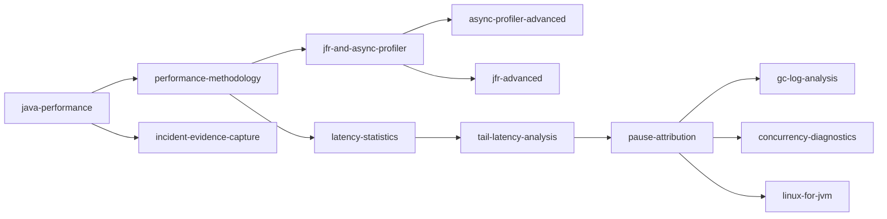
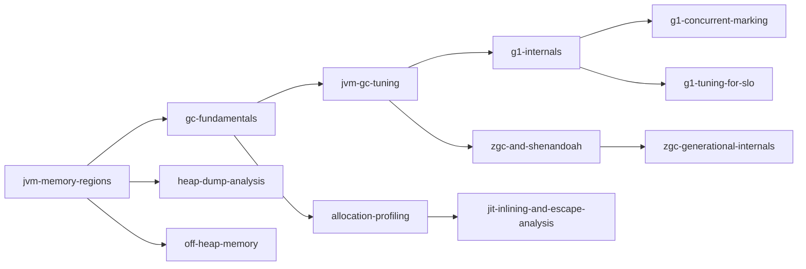
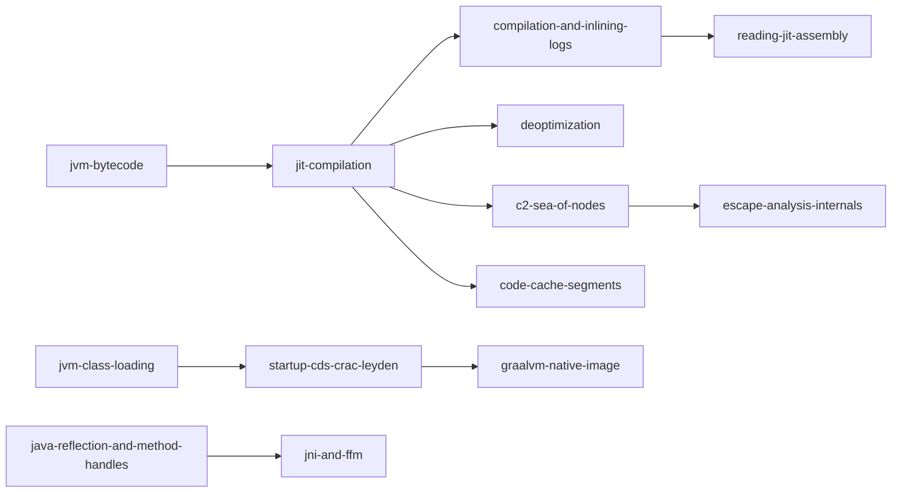
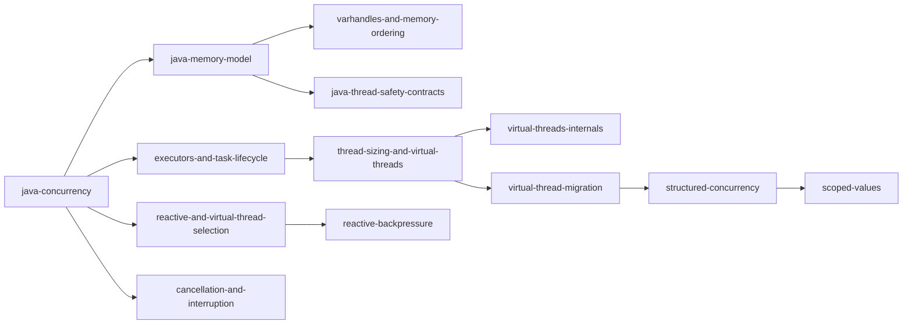
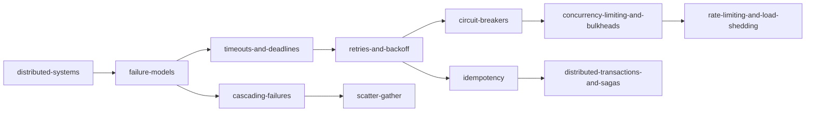
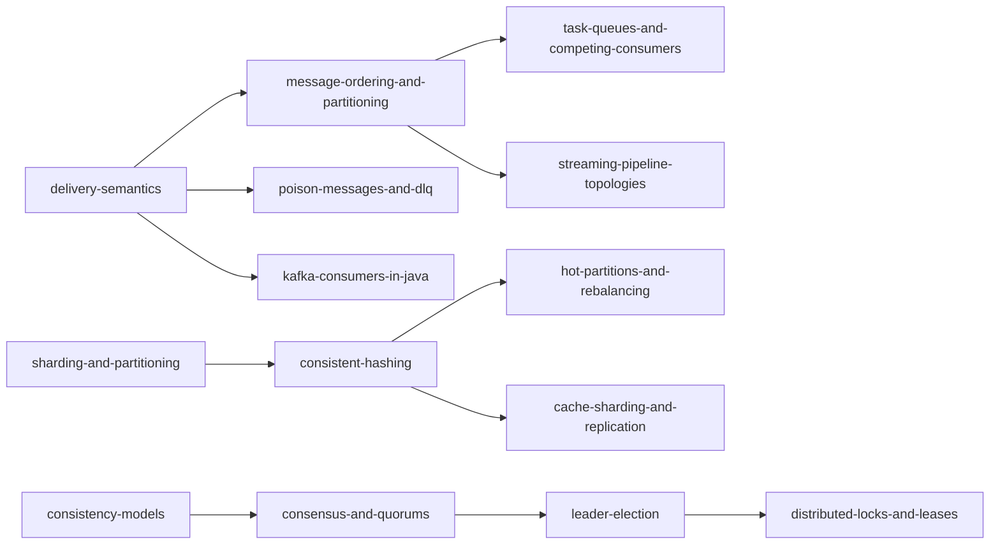
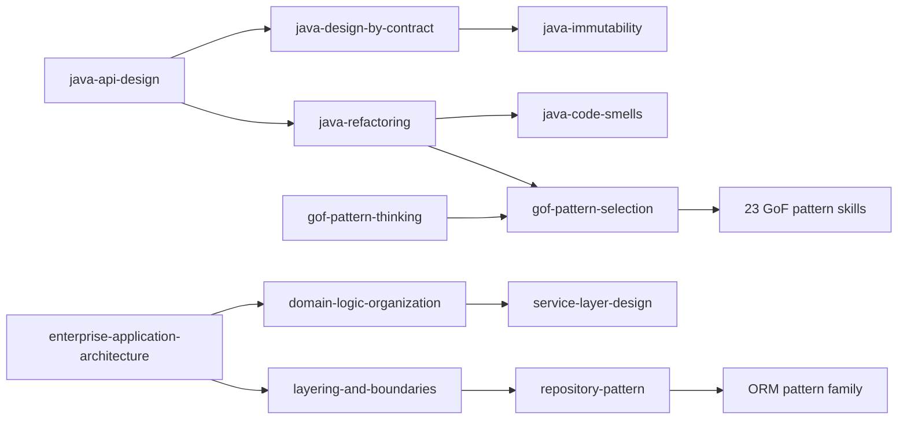
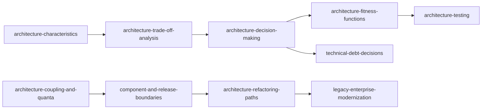
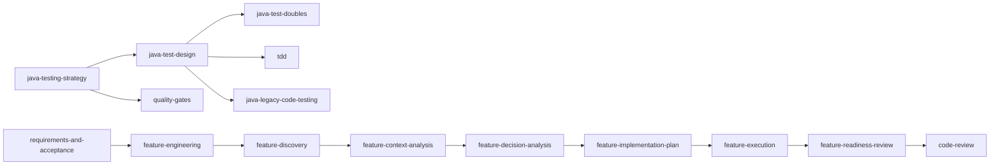
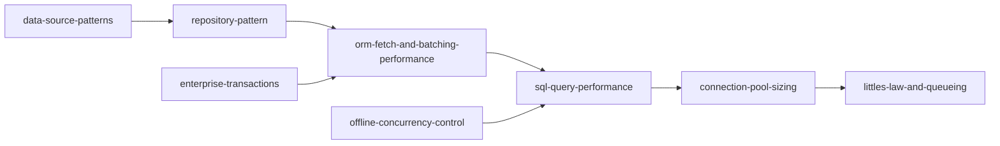

# Cross-skill knowledge graph

This document records the principal learning/diagnostic paths and the ownership edges that prevent
the 13 mutually exclusive categories from duplicating one another. Manifest dependencies remain
the machine-readable graph; this is the human/agent retrieval view.

## Runtime performance investigation

Ownership: C establishes trustworthy evidence. The final mechanism is interpreted by A (memory), B
(execution), D (concurrency), E (platform) or F (distributed systems).

## Memory and garbage collection

Potential conflict: allocation is observed in A, while the compiler transformation that removes it
is B. Cross-reference; do not duplicate escape-analysis internals in allocation diagnosis.

## Compilation and execution

Potential conflict: compiler logs and assembly mechanics are B; experimental methodology and
profiling-tool selection are C.

## Concurrency evolution

Potential conflict: reactive backpressure inside one JVM is D. Backpressure across service or
broker boundaries is F and must state delivery/recovery consequences.

## Distributed request resilience

Common combination: deadline + bounded attempts + idempotency + concurrency limit + load shedding.
Potential conflict: each layer must share one end-to-end budget; independent retry policies
multiply attempts.

## Messaging, streaming and topology

Potential conflict: “exactly once” is decomposed among delivery, processing, state commit and
external side effects; no single broker flag owns the end-to-end claim.

## Java design to enterprise architecture

Ownership: G supplies general Java principles, H names object-level GoF collaborations, and I owns
enterprise transaction/domain/data-source structures.

## Architecture governance and evolution

Potential conflict: I owns the application patterns; J owns recording, enforcing and evolving the
choice. Architecture fitness tests remain J because their purpose is governance, not general test
design.

## Testing and delivery

Ownership: K decides what and how to test. L controls work sequencing, authority, evidence and
delivery gates. Domain-specific concurrency/distributed/performance tests cross-reference K but
retain the semantics of their owning domain.

## Data access cost path

Ownership: I owns the conceptual pattern; M owns statement count, execution plan and pool cost. A
future database-contention skill belongs M only if it remains an application-performance diagnosis
rather than restating transaction patterns.

## High-risk hubs

Changes to these skills deserve extra cross-reference review because many workflows depend on
their definitions: `performance-methodology`, `failure-models`, `littles-law-and-queueing`,
`latency-statistics`, `gof-pattern-thinking`, `java-memory-model`, `jvm-memory-regions`,
`layering-and-boundaries`, `delivery-semantics`, `idempotency`, `timeouts-and-deadlines` and
`skill-engineering`.
